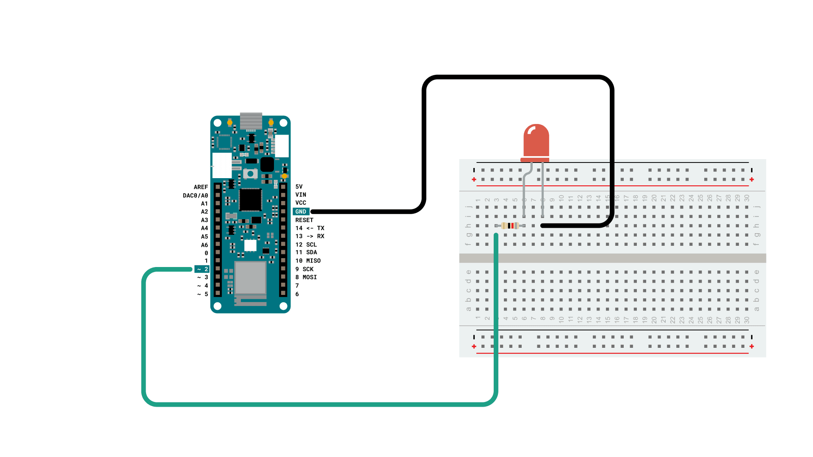
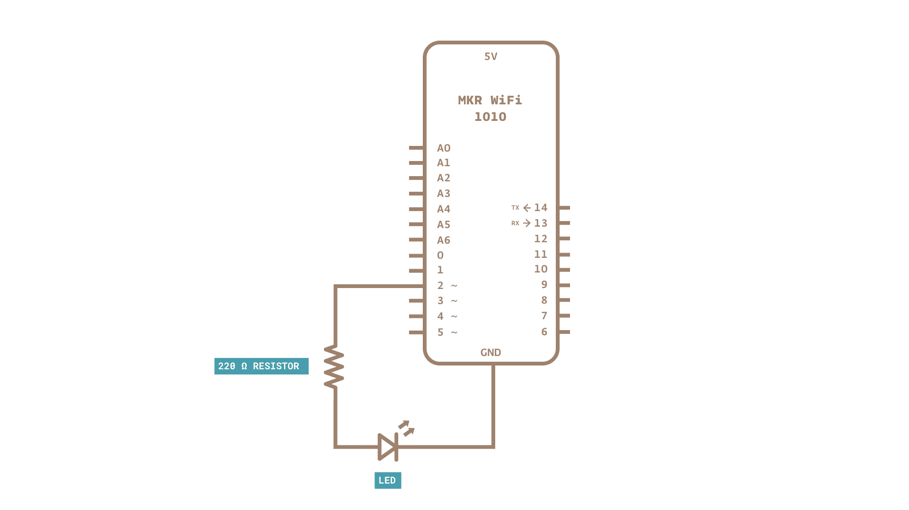
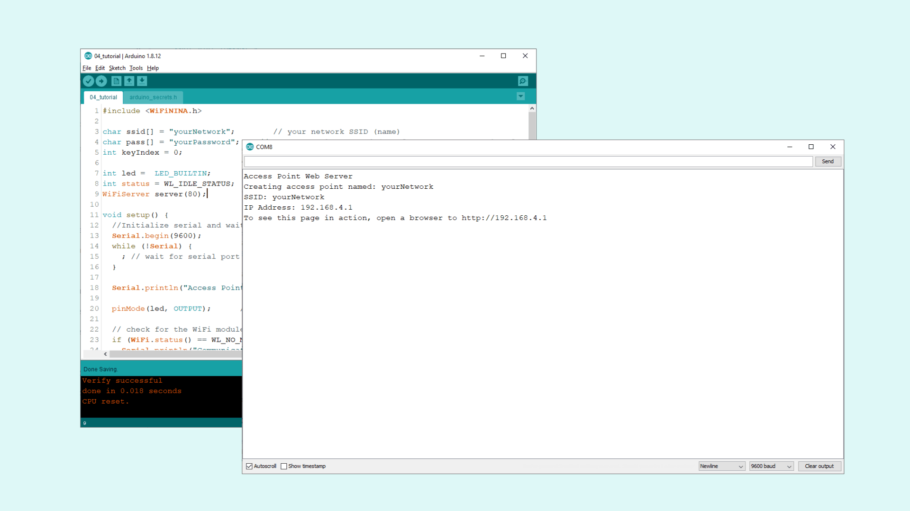
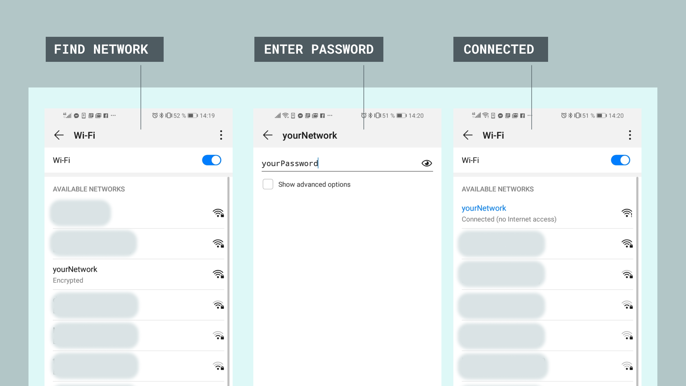
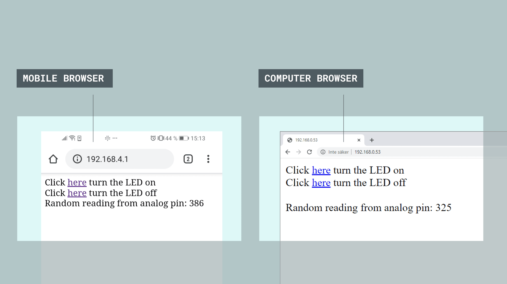

## Introduction

In this tutorial, we will be creating something called an Access Point. An access point is practically a wireless local area network, which in this tutorial will **not be connected to the Internet**. This can be a practical setup for projects that have no access to the internet, but we still want to control and monitor our MKR WiFi 1010 board wirelessly. We will be using functionalities from the **WiFiNINA** library, and we will set up a basic configuration that allows us to control an LED (on or off) and do a reading on one of the analog pins.

If you have never used the **WiFiNINA** library, you can check out [this tutorial](https://www.arduino.cc/en/Guide/MKRWiFi1010/connecting-to-wifi-network) that shows how to install the library and how to create a connection to your Wi-Fi network.


## Hardware & Software Needed

-   Arduino MKR WiFi 1010
-   Micro USB cable
-   Generic LED
-   82 ohm resistor 
-   Breadboard
-   Jumper wires
-   Arduino IDE (offline and online versions available)
-   Arduino SAMD Board Package installed, [follow this link for instructions](https://www.arduino.cc/en/Guide/MKRWiFi1010#installing-drivers-for-the-mkr-wifi-1010)
-   WiFiNINA library (explained later in this tutorial)
 
You can also use the built-in LED on the MKR WiFi 1010.

### Circuit

Follow the wiring diagram below to connect the LED to the MKR WiFi 1010 board.



### Schematic

This is the schematic of our circuit.



___

## Let's Start

This tutorial barely uses any external hardware: we only need an LED that we will control remotely. But the most interesting aspects lie in the library we are going to use: **WiFiNINA**. This library can be used for many different connectivity projects, where we can both connect to WiFi, make GET requests and - as we will explore in this tutorial - create an access point (AP) and hosting a web server that we can connect to.  

We will go through the following steps in order to create a web server on our MKR WiFi 1010:

- First, we need to initialize the **WiFiNINA** library.
- Then, we need to create the credentials of our access point by entering our SSID (name of network) and PASS (password of network).
- Once the program is running, it will create an access point, start hosting a server, and wait for a client to connect.
- On our phone or laptop, we can now find the access point in the list of available Wi-Fi networks. We can connect using the same password we created in the program.
- Once connected to the Wi-Fi, we can connect to the board's specific IP address using our regular browser (e.g. Chrome, Firefox).
- As long as we are connected, the program detects it, and enters a ```while()``` loop.
- In the ```while()``` loop, two links are simply printed in HTML format, which is visible in the browser.
- These links control the LED we connected to the board, simply "ON" or "OFF".
- If we press the "ON" link, the program is configured to add an "H" to the end of the URL, or if we press the "OFF" link, we add an "L" to the end of the URL.
- If the URL ends with "H", it will turn on the LED, and if it ends with "L" it turns it off. H stands for "HIGH" and L stands for "LOW".
- There is also a field displaying the value read from analog pin 1 (A1). Since we have nothing connected, we will read random values.

And that is the configuration we will be using in this tutorial. There are a few other functionalities, such as checking if we have the latest firmware and that we are using the right board, and these potential errors will be printed in the Serial Monitor.

## Code Explanation

> **NOTE:** This section is optional, you can find the complete code further down on this tutorial.

The initialization begins by including the WiFiNINA library, after which we need to enter our credentials to our network. If you want to, you can create a **secret** tab to store your credentials. This can be useful if you want to share your sketch online, and don't want anyone to see your credentials. 

Simply replace `"yourNetwork"` and `"yourPassword"` with a network name and password of your choice.

***Note: both `ssid` and `pass` needs to be a minimum of 8 characters long***

```cpp
#include <WiFiNINA.h>

char ssid[] = "yourNetwork";        // your network SSID (name)
char pass[] = "yourPassword";    // your network password (use for WPA, or use as key for WEP)
int keyIndex = 0;                // your network key Index number (needed only for WEP)

int led =  LED_BUILTIN;
int status = WL_IDLE_STATUS;
WiFiServer server(80);
```

We can then configure the `setup()`. Here we set the Serial Communication to 9600, configure the `pinMode` for our LED, and use the line `while(!Serial);` to only initialize the rest of the program as long as we open the Serial Monitor. We do this since important information is printed in the Serial Monitor, and if we upload it, we may risk missing it.

The command `status = WiFi.beginAP(ssid, pass);` creates an access point with the credentials we entered previously, where we then start hosting a web server by using the command `server.begin();`. The function `printWiFiStatus();` prints out information regarding the connection in the Serial Monitor.

```cpp
void setup() {
  //Initialize serial and wait for port to open:
  Serial.begin(9600);
  while (!Serial) {
    ; // wait for serial port to connect. Needed for native USB port only
  }

  Serial.println("Access Point Web Server");

  pinMode(led, OUTPUT);      // set the LED pin mode

  // check for the WiFi module:
  if (WiFi.status() == WL_NO_MODULE) {
    Serial.println("Communication with WiFi module failed!");
    // don't continue
    while (true);
  }

  String fv = WiFi.firmwareVersion();
  if (fv < WIFI_FIRMWARE_LATEST_VERSION) {
    Serial.println("Please upgrade the firmware");
  }

  // print the network name (SSID);
  Serial.print("Creating access point named: ");
  Serial.println(ssid);

  // Create open network. Change this line if you want to create an WEP network:
  status = WiFi.beginAP(ssid, pass);
  if (status != WL_AP_LISTENING) {
    Serial.println("Creating access point failed");
    // don't continue
    while (true);
  }

  // wait 10 seconds for connection:
  delay(10000);

  // start the web server on port 80
  server.begin();

  // you're connected now, so print out the status
  printWiFiStatus();
}
```

In the `loop()`, the first thing we do is to check if a client has connected (the client is someone connecting through the browser), using the the conditional `if(status == WL_AP_CONNECTED)`. The command `WiFiClient client = server.available();` is used to start listening to incoming clients, and if a client is connected, we print it out in the Serial Monitor. If a client connects, the program enters a while loop, as long as it is connected.

We will then create a HTTP response that will be displayed in the browser. This is written in HTML, and simply contains three items: a link to turn an LED ON, a link to turn the LED off, and one to display the value recorded from A1 (a random value). Clicking the ON link adds "/H" to the end of the URL, and OFF adds "/L" to the URL.

Just before the end of the loop, we create two conditionals, that check whether the URL ends with "/H" or "/L", and simply turn the LED ON or OFF as a result. Then we use the command `client.stop();` outside the while loop, so if the client disconnects, the client stops.

```cpp
void loop() {
  // compare the previous status to the current status
  if(status != WiFi.status()) {
    // it has changed update the variable
    status = WiFi.status();

    if(status == WL_AP_CONNECTED) {
      // a device has connected to the AP
      Serial.println("Device connected to AP");
    } else {
      // a device has disconnected from the AP, and we are back in listening mode
      Serial.println("Device disconnected from AP");
    }
  }

  WiFiClient client = server.available();   // listen for incoming clients

  if (client) {                             // if you get a client,
    Serial.println("new client");           // print a message out the serial port
    String currentLine = "";                // make a String to hold incoming data from the client
    while (client.connected()) {            // loop while the client's connected
      if (client.available()) {             // if there's bytes to read from the client,
        char c = client.read();             // read a byte, then
        Serial.write(c);                    // print it out the serial monitor
        if (c == '\n') {                    // if the byte is a newline character

          // if the current line is blank, you got two newline characters in a row.
          // that's the end of the client HTTP request, so send a response:
          if (currentLine.length() == 0) {
            // HTTP headers always start with a response code (e.g. HTTP/1.1 200 OK)
            // and a content-type so the client knows what's coming, then a blank line:
            client.println("HTTP/1.1 200 OK");
            client.println("Content-type:text/html");
            client.println();

            // the content of the HTTP response follows the header:
            client.print("Click <a href=\"/H\">here</a> turn the LED on<br>");
            client.print("Click <a href=\"/L\">here</a> turn the LED off<br>");

            int randomReading = analogRead(A1);
            client.print("Random reading from analog pin: ");
            client.print(randomReading);

            // The HTTP response ends with another blank line:
            client.println();
            // break out of the while loop:
            break;
          }
          else {      // if you got a newline, then clear currentLine:
            currentLine = "";
          }
        }
        else if (c != '\r') {    // if you got anything else but a carriage return character,
          currentLine += c;      // add it to the end of the currentLine
        }

        // Check to see if the client request was "GET /H" or "GET /L":
        if (currentLine.endsWith("GET /H")) {
          digitalWrite(led, HIGH);               // GET /H turns the LED on
        }
        if (currentLine.endsWith("GET /L")) {
          digitalWrite(led, LOW);                // GET /L turns the LED off
        }
      }
    }
    // close the connection:
    client.stop();
    Serial.println("client disconnected");
  }
}

```

The final piece of code in this program is the `printWiFiStatus()` function. This one is only designed to print relevant information about the connection in the Serial Monitor. The information printed is the name of our access point and the IP address of the board.


```cpp
void printWiFiStatus() {
  // print the SSID of the network you're attached to:
  Serial.print("SSID: ");
  Serial.println(WiFi.SSID());

  // print your WiFi shield's IP address:
  IPAddress ip = WiFi.localIP();
  Serial.print("IP Address: ");
  Serial.println(ip);

  // print where to go in a browser:
  Serial.print("To see this page in action, open a browser to http://");
  Serial.println(ip);

}
```

## Complete Code

If you choose to skip the code building section, the complete code can be found below:

<iframe src="https://create.arduino.cc/editor/ArduinoEdu/6ce16483-0ff0-443c-977d-510f53fcb243/preview?embed" style="height:510px;width:100%;margin:10px 0" frameborder="0"></iframe>


## Upload Sketch and Testing the Program

Once we are finished with the coding, we can upload the sketch to the board. Once it is successful, open the Serial Monitor and it should look like the following image.



This means that we successfully created an access point. To connect to it, we can either use a laptop or a smartphone that can connect to Wi-Fi. We will need to disconnect from our current Wi-Fi network, so it is easier to use a phone to connect. Go to your phone's settings, and open the list of Wi-Fi networks. The name of the network we created earlier should show up now, there we need to enter the password we created to connect to it.



Once we are connected to the Wi-Fi, we can enter the URL (IP address of the board) in the browser. This is the one printed in the Serial Monitor. Now, we should see an almost empty page with two links at the top left that say **"Click here to turn the LED on"** and **"Click here to turn the LED off"**, and a text saying: **"Random reading from analog pin: xxx"**. Depending on if you are using a computer or a phone, they will look like the image below.



When interacting with the links, you should see the LED, connected to pin 2, turn on and off depending on what you click, and now we have successfully created a way of interacting with our MKR WiFi 1010 board remotely. Whenever we click on these links, the Serial Monitor will print information regarding the requests, as the image below shows.


### Troubleshoot

If the code is not working, there are some common issues we might need to troubleshoot:
- We have not updated the latest firmware for the board.
- We have not installed the Board Package required for the board.
- We have not installed the WiFiNINA library.
- We have not entered the SSID and PASS: remember, it is case sensitive.
- We have not selected the right port to upload: depending on what computer we use, sometimes the board is duplicated. By simply restarting the editor, this issue can be solved.

## Conclusion

In this tutorial, we learned how to create an access point, and how to host a web server that we can connect to. We learned how to control an LED remotely, as well as how to display the value of an analog pin in the browser. This method can be very useful when creating a wireless system of sensors and actuators. If you have more than one Wi-Fi compatible board, we can also connect these to the same access point.