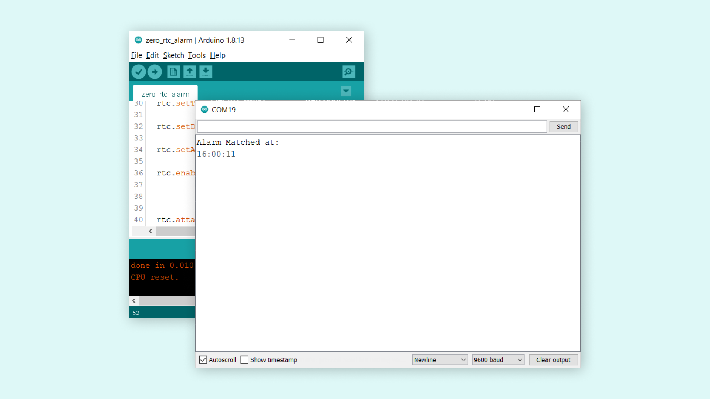

## Simple RTC Alarm

In this tutorial, we will use the RTC library methods in order to trigger an action when an alarm is matching the set time. Particularly, in this example, the RTC time will be set at 16:00:00 and an alarm at 16:00:10. When the time match is reached, using the match type `MATCH_HHMMSS`, the attached interrupt function will print on the serial monitor **Alarm Match!**.

- Arduino IDE ([online](https://create.arduino.cc/) or [offline](https://www.arduino.cc/en/main/software)).
- Arduino MKR Zero ([link to store](https://store.arduino.cc/arduino-mkr-zero-i2s-bus-sd-for-sound-music-digital-audio-data)).

### Circuit

This tutorial requires only a MKR Zero board.


## Programming the Board

We will now get to the programming part of this tutorial.

**1.** First, let's make sure we have the drivers installed. If we are using the Web Editor, we do not need to install anything. If we are using an offline editor, we need to install it manually. This can be done by navigating to **Tools > Board > Board Manager...**. Here we need to look for the **Arduino SAMD boards (32-bits Arm® Cortex®-M0+)** and install it. 

**2.** Now, we need to install the libraries needed. If we are using the Web Editor, there is no need to install anything. If we are using an offline editor, simply go to **Tools > Manage libraries..**, and search for **RTCZero** and install it.

**3.** Here are some of the core functions of this sketch:

- `RTCZero rtc` - create an RTC object.
- `while(!Serial)` - prevents programming from running until we open the Serial Monitor.
- `rtc.begin()` - initializes the library.
- `rtc.setProperty();` - sets a starting time. "Property" is replaced by a time format, e.g. minute, year.
- `rtc.getProperty()` - retrieves the actual time. "Property" is replaced by a time format, e.g. minute, year.
- `rtc.setAlarmTime(hour, minute, second)` - sets an alarm at specific time.
- `rtc.enableAlarm(rtc.MATCH_HHMMSS)` - enables the alarm if time is matched.
- `void print2digits(int number)` - custom function that adds a "0" before a digit. E.g. **0:0:0** becomes **00:00:00**, for better readability.

The sketch can be found in the snippet below. Upload the sketch to your MKR Zero board.

```arduino
#include <RTCZero.h>

/* Create an rtc object */

RTCZero rtc;

/* Change these values to set the current initial time */

const byte seconds = 0;

const byte minutes = 0;

const byte hours = 16;

/* Change these values to set the current initial date */

const byte day = 25;

const byte month = 9;

const byte year = 15;

void setup()
{

  Serial.begin(9600);

  while(!Serial);
  rtc.begin(); // initialize RTC 24H format

  rtc.setTime(hours, minutes, seconds);

  rtc.setDate(day, month, year);

  rtc.setAlarmTime(16, 0, 10);

  rtc.enableAlarm(rtc.MATCH_HHMMSS);

  rtc.attachInterrupt(alarmMatch);
}

void loop()
{

}

void alarmMatch()
{
  
  Serial.println("Alarm Matched at: ");
  print2digits(rtc.getHours()); //retrieve hours
  Serial.print(":");
  print2digits(rtc.getMinutes()); //retrieve minutes
  Serial.print(":");
  print2digits(rtc.getSeconds()); //retrieve seconds
  
}

void print2digits(int number) {
  if (number < 10) {
    Serial.print("0"); // print a 0 before if the number is < than 10
  }
  Serial.print(number);
}
```


## Testing It Out

After we have successfully uploaded the code to the board, open the Serial Monitor. After 10 seconds, it should print the following:

```
Alarm matched at:
16:00:11
```

Now, as you can see, the time printed is `16:00:11` and not `16:00:10`. This is because it takes some time to retrieve the data from the module, process it in the `print2digits()` function and then print it. 



And that is basically how we create an alarm function, using only our MKR Zero board!

### Troubleshoot

If the code is not working, there are some common issues we can troubleshoot:

- Check that the `RTCZero` library is installed.
- Make sure there are no missing curly brackets {}.
- We have not selected the right port and board.

## Conclusion

This tutorial covers some basics on RTC and how to print the time and date continuously on an OLED display. But this technology is heavily used in modern designs, and knowing just the basics of it can be very beneficial. 
