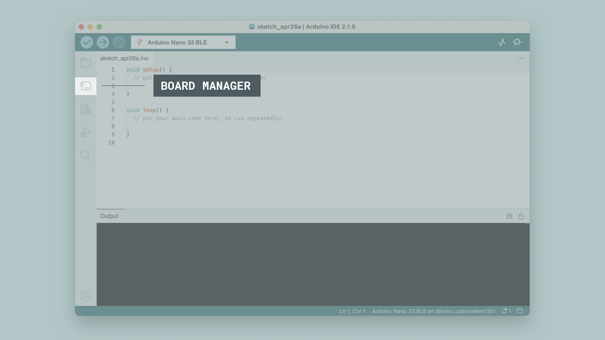
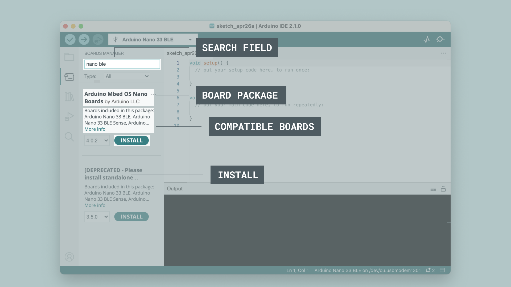
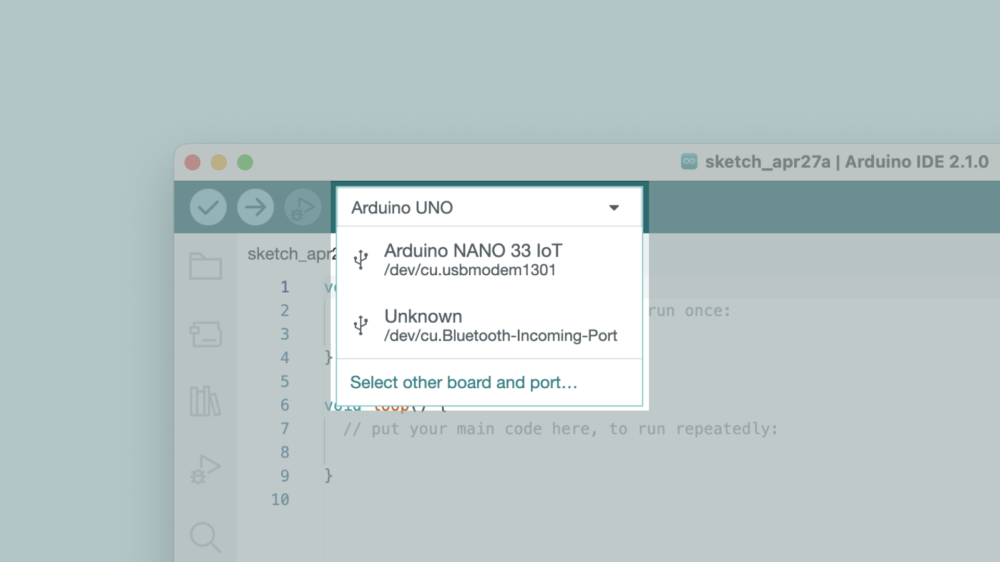
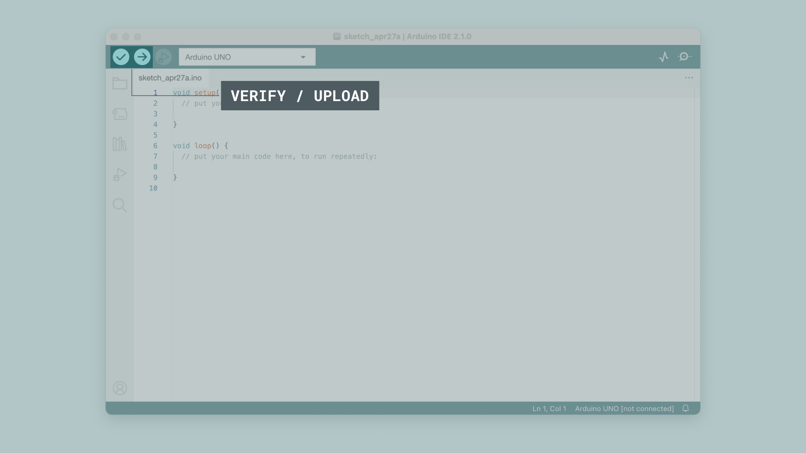
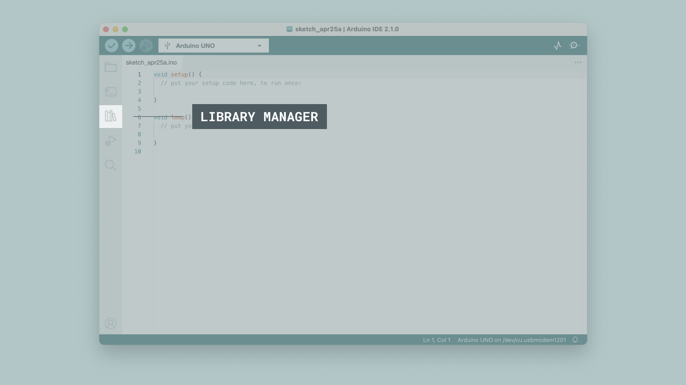
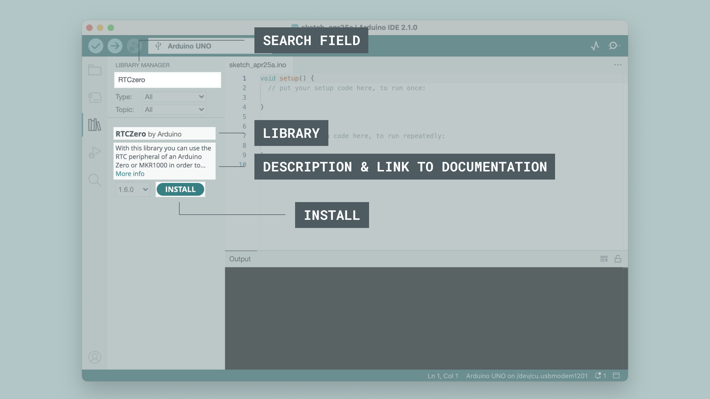
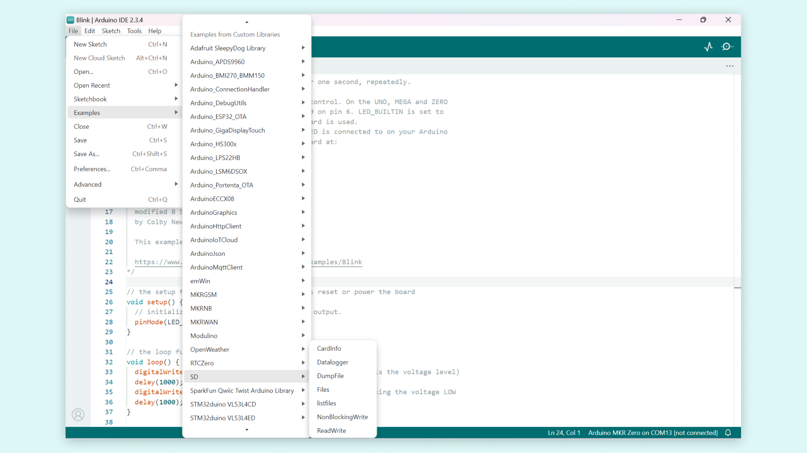
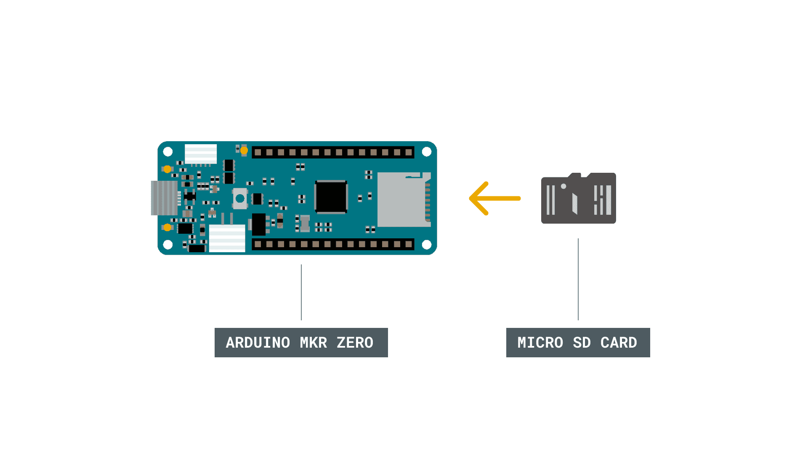

This user manual provides a comprehensive overview of the MKR Zero board, highlighting its hardware and software elements. With it, you will learn how to set up, configure, and use all the main features of a MKR Zero board.

## Hardware and Software Requirements

### Hardware Requirements

- [Arduino MKR Zero](https://store.arduino.cc/products/arduino-mkr-zero-i2s-bus-sd-for-sound-music-digital-audio-data)
- [USB-B® cable](https://store.arduino.cc/products/usb-cable-type-a-male-to-micro-type-b-male)

### Software Requirements

- [Arduino IDE 2.0+](https://www.arduino.cc/en/software) or [Arduino Web Editor](https://create.arduino.cc/editor)
- [SD library](https://docs.arduino.cc/libraries/sd/)
- [Arduino SAMD boards core](https://github.com/arduino/ArduinoCore-samd) (required to work with the MKR Zero board)

## MKR Zero Overview

The MKR ZERO brings you the power of a Zero in the smaller format established by the MKR form factor. The MKR ZERO board acts as a great educational tool for learning about 32-bit application development. It has an on-board SD connector with dedicated SPI interfaces (SPI1) that allows you to play with MUSIC files with no extra hardware!  The board is powered by Atmel’s SAMD21 MCU, which features a 32-bit ARM® Cortex® M0+ core.

The board contains everything needed to support the microcontroller; simply connect it to a computer with a micro-USB cable or power it by a LiPo battery. The battery voltage can also be monitored since a connection between the battery and the analog converter of the board exists.

### Pinout

The full pinout is available and downloadable as PDF from the link below:

- [MKR Zero pinout](https://docs.arduino.cc/resources/pinouts/ABX00012-full-pinout.pdf)

### Tech Specs

The tech specs are available from the link below:

- [MKR Zero tech specs](https://docs.arduino.cc/hardware/mkr-zero/#tech-specs)

### Schematics

The complete schematics are available and downloadable as PDF from the link below:

- [MKR Zero schematics](https://docs.arduino.cc/resources/schematics/ABX00012-schematics.pdf)

## First Use

### Installing the SAMD Core

After we have downloaded, installed and opened the Arduino IDE, let's continue to installing the `SAMD boards (32-bits ARM Coretx-M0+)` core. When we open the editor, we will see an empty sketch. Here we need to navigate to the **Board Manager** on the left side of the IDE.



This will open up a new tab, with all available cores. Type in "samd" in the search field, and install the `Arduino SAMD Boards (32-bits ARM Cortex-M0+)` core.



This process may take some time, and you may need to accept the installation window that comes up (depending on your operative system). When it is finished, it should say "INSTALLED" under the title.

Now go to **Tools > Board > Arduino SAMD Boards (32-bits ARM Cortex-M0+) > MKR Zero**. Here you can see all the SAMD boards listed, where you can select the MKR board you are using. You have now successfully installed the core.

### Selecting the Port

Now, let's make sure that our board is found by our computer, by selecting the port. Connect the board to your computer using a USB-B® cable and open the Arduino IDE. Then by pressing the white bar, as seen in the image below, the board and port can be selected.



### Blink Example

Let's control the MKR Zero board to reproduce the classic `blink` example used in the Arduino ecosystem. We will use this example to verify the MKR Zero board's connection to the Arduino IDE.

Connect the board to your computer using a USB-B® cable and open the Arduino IDE.

Copy and paste the example sketch below into a new sketch in the Arduino IDE: 

```arduino
// the setup function runs once when you press reset or power the board
void setup() {
  // initialize digital pin LED_BUILTIN as an output.
  pinMode(LED_BUILTIN, OUTPUT);
}

// the loop function runs over and over again forever
void loop() {
  digitalWrite(LED_BUILTIN, HIGH);  // turn the LED on (HIGH is the voltage level)
  delay(1000);                      // wait for a second
  digitalWrite(LED_BUILTIN, LOW);   // turn the LED off by making the voltage LOW
  delay(1000);                      // wait for a second
}
```

To upload the sketch to the board, click the **Verify** button to compile the sketch and check for errors, then click the **Upload** button to program the device with the sketch.



You should see the onboard orange LED of your MKR Zero board turn on for one second, then off for one second, repeatedly.

### Board Libraries

The [`SD` library](https://www.arduino.cc/reference/en/libraries/sd/) enables reading and writing on SD cards. Once an SD memory card is connected to the SPI interface of the Arduino board you can create files and read/write on them. You can also move through directories on the SD card.

To install the `SD` library, navigate to the `Manage libraries` tab on the left side of the IDE.



In the Library Manager tab, search for `SD` and install the latest version of the library.



### SD Library Examples

In the `SD` library there are a few examples that makes use of the libraries functions. Access the examples by navigating to **File > Examples > SD**.



To use this library put a micro SD card into the MKR Zero boards SD card slot.



The examples can be used to test the SD card connection. Here are the examples in the library:

- **CardInfo** - This sketch gets info about your SD card. Very useful for testing a card when you're not sure whether its working or not. Prints info about the SD card in the serial monitor. Change the `chipSelect` variable in the sketch so that it matches the required settings for the MKR Zero, as seen in the comments of the sketch.

- **Datalogger** - Logs data from three analog sensors to an SD card. The sketch will create a `datalog.txt` file on the SD card where the information will be stored. Change the `chipSelect` variable in the sketch so that it matches the required settings for the MKR Zero, as seen in the comments of the sketch.

- **DumpFile** - Reads a file from the SD card and sends it over the serial port. Change the `chipSelect` variable in the sketch so that it matches the required settings for the MKR Zero, as seen in the comments of the sketch.

- **Files** - Creates and destroys an SD card file. Change the `chipSelect` variable in the sketch so that it matches the required settings for the MKR Zero, as seen in the comments of the sketch.

- **listfiles** - Prints out the files in a directory on a SD card. Change the `chipSelect` variable in the sketch so that it matches the required settings for the MKR Zero, as seen in the comments of the sketch.

- **NonBlockingWrite** - This example demonstrates how to perform non-blocking writes to a file on a SD card. The file will contain the current millis() value every 10ms. If the SD card is busy, the data will be dataBuffered in order to not block the sketch. Change the `chipSelect` variable in the sketch so that it matches the required settings for the MKR Zero, as seen in the comments of the sketch.

- **ReadWrite** - This example shows how to read and write data to and from an SD card file. Change the `chipSelect` variable in the sketch so that it matches the required settings for the MKR Zero, as seen in the comments of the sketch.

For more information about the API of the SD library, [go here](https://docs.arduino.cc/libraries/sd/). For more in-depth tutorials for the MKR Zero, [go here](https://docs.arduino.cc/hardware/mkr-zero/#tutorials).

## Support

If you encounter any issues or have questions while working with your MKR Zero board, we provide various support resources to help you find answers and solutions.

### Help Center

Explore our Help Center, which offers a comprehensive collection of articles and guides for MKR family boards. The Help Center is designed to provide in-depth technical assistance and help you make the most of your device.

- [MKR family help center page](https://support.arduino.cc/hc/en-us/sections/360004641919-MKR-Family)

### Forum

Join our community forum to connect with other MKR family board users, share your experiences, and ask questions. The Forum is an excellent place to learn from others, discuss issues, and discover new ideas and projects related to the MKR Zero.

- [MKR category in the Arduino Forum](https://forum.arduino.cc/c/official-hardware/mkr-boards/79)

### Contact Us

Please get in touch with our support team if you need personalized assistance or have questions not covered by the help and support resources described before. We're happy to help you with any issues or inquiries about the MKR family boards.

- [Contact us page](https://www.arduino.cc/en/contact-us/)