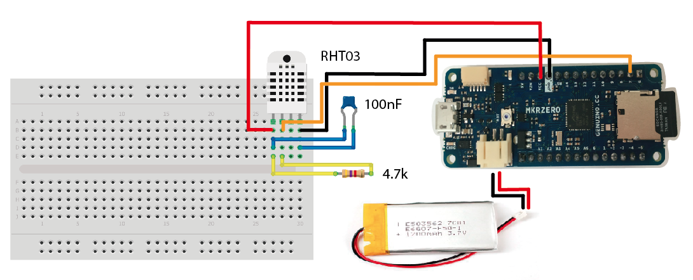
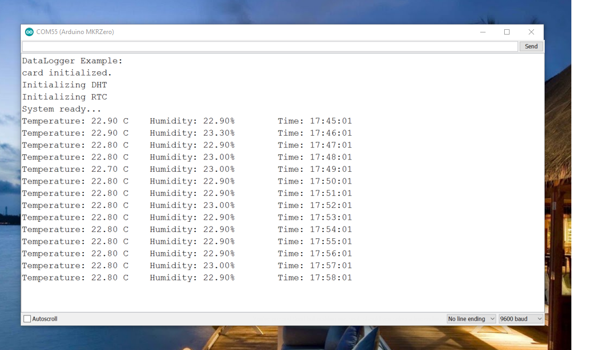

## Components and Supplies

- [Arduino MKR Zero](/hardware/mkr-zero)
- [Jumper wires (generic)](https://www.newark.com/88W2571?COM=ref_hackster)
- [Capacitor 100 nF](https://www.newark.com/58M4550?COM=ref_hackster)
- [Resistor 4.75k ohm](https://www.newark.com/multicomp/mcmf0w4ff4751a50/metal-film-resistor-4-75kohm-250mw/dp/58K3862?COM=ref_hackster)
- [microSD card](https://store.arduino.cc/index.php?main_page=product_info&products_code=X000009)
- Medium breadboard
- [DHT22 Temperature and Humidity sensor](http://celare.cl/am2302-dht22-digital-temperature-humidity-sensor-module-for-arduino-am-2302/)

## Apps and Online Services

- [Arduino IDE](https://www.arduino.cc/en/main/software)
- [Arduino Cloud Editor](https://create.arduino.cc/editor)

## About This Project

### Introduction

With this project, you will be able to create in a few minutes a temperature and humidity data logger. You can use the built-in SD card reader of the MKR Zero to store the data. Plug a battery, add a protective case and you will have a neat weather data logger that you can use in remote locations where no connection is available. Imagination is the limit!

## Hardware

In order to build the weather data logger we will use an Arduino MKR Zero board. The small form factor and built-in SD card reader makes it a perfect choice for this project.

Second we will need a DHT22 temperature and humidity sensor. This sensor is easily available and very versatile. It can be powered from 3.3V to 6V. We will connect the power pin of the DHT22 to the VCC (3.3V) pin in our MKRZero. We will also need a 4k7ohm pull up resistor for the data line and a 100nF capacitor to clean the noise in the power line. For more info on DHT22, see[ Adafruit's DHT tutoria](https://learn.adafruit.com/dht/connecting-to-a-dhtxx-sensor)l. 

We will use a small breadboard with 3 jumper wires to connect everything together, a SD card to store the information and a 3.7V LiPo battery to make our data logger portable.

.jpg)

### Protecting Your Components

It is important to keep your electronics dry, so if you are planning to put your weather data logger in a harsh environment, don't forget to use a protective case to avoid damaging the electronics!

## Schematics

* Plug the MKRZero to the breadboard.
* Plug the DHT22 to the breadboard.
* Connect the Power pin of the DHT22 to the VCC pin in the MKRZero.
* Connect the Data pin of the DHT22 to digital pin 7 in the MKRZero.
* Connect the ground pin of the DHT22 to GND pin in the MKRZero.
* Connect the 100nF capacitor between the Power and GND pin.
* Connect the 4k7 pull up resistor between the Power and the Data pin.
* Plug in the SD card in the MKR Zero board.

## Code

<iframe src='https://create.arduino.cc/editor/Arduino_Genuino/9a077c75-51b7-42b0-9a73-5e5b5562a429/preview?embed&snippet' style='height:510px;width:100%;margin:10px 0' frameborder='0'></iframe>

### Arduino IDE

Ok, now you should have all the electronics placed together. It's time to upload the sketch to the MKR Zero board. For this project you will need the libraries for the DHT22 sensor. You can find the libraries in this [GitHub repository](https://github.com/adafruit/DHT-sensor-library). Download them and place them in "libraries" within your sketchbook folder.

Now you need to download the sketch for the weather data logger and place it in the sketchbook folder. You can find the sketch down in the tutorial.

Open your Arduino IDE and use the Boards Manager to install the MKR Zero board. Once installation is finished you should be able to select the MKR Zero board from the menu `Tools -> Board`. Now connect the MKRZero to your computer using the `microUSB`cable. In the IDE, go to **File->Sketchbook->MKRZERO_WeatherDataLogger** and open the sketch. Compile and upload to the board. 

Voila! Your system is ready for battle. You can see the values also from the serial monitor.

.jpg)
