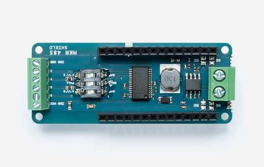

The [MKR 485 shield](https://store.arduino.cc/arduino-mkr-485-shield) allows a MKR board to connect to other 485 devices.

This board may be used with the [Arduino RS485](https://www.arduino.cc/reference/en/libraries/arduinors485/) and the [Arduino Modbus](https://www.arduino.cc/reference/en/libraries/arduinomodbus/) libraries, available from the Library Manager.

## Usage Notes

The Arduino MKR 485 Shield allows the Arduino MKR family of boards to communicate with industrial automation systems or to extend the serial wired communication over much longer range. This shield supports half and full duplex with or without biasing and termination, master slave configuration.

Most of these configurations are physical and the 3 ways dip switch allows you to set up the connection properly.

| Switch No. | ON                   | OFF            |
| ---------- | -------------------- | -------------- |
| 1          | Termination on A-B\* | NO termination |
| 2          | FULL Duplex\*        | HALF Duplex    |
| 3          | Termination on Y-Z\* | NO termination |

(\* Factory configuration)

## Use Cases

With the MKR 485 Shield you can interface with devices supporting the 485 standard. In the tutorial in the link below, you can learn how to interface with an **energy meter** using the Modbus protocol, and send the data to the Arduino Cloud.

- [Modbus Energy Meter and Arduino Cloud](https://docs.arduino.cc/arduino-cloud/application-notes/modbus-energy-meter/)

### PIN Usage

This shield is compatible with the MKR family of Arduino boards.

| Pin number | Usage | Notes    |
| ---------- | ----- | -------- |
| A4         | RE    |          |
| A5         | DE    |          |
| 13         | RX    | Reserved |
| 14         | TX    | Reserved |

