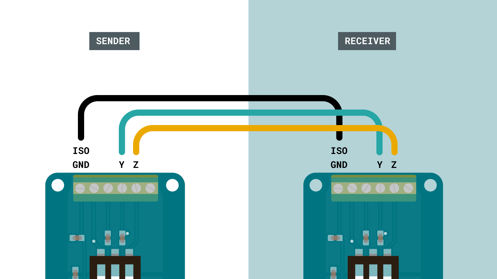

## Introduction 

In this tutorial, we will take a look at how we can send data between two boards, using the RS485 standard. This will be achieved by using two [MKR 485 Shields](https://store.arduino.cc/arduino-mkr-485-shield), mounted on top of two [MKR family boards](https://store.arduino.cc/arduino-genuino/arduino-genuino-mkr-family). RS485 is commonly used in industrial applications, and is used to request, send and receive data from various devices using a protocol such as Modbus.


## Goals

The goals of this project are:

- Learn some basic functionality of the Arduino RS485 library. 
- Send a simple message between two boards, using RS485.

## Hardware & Software Needed

- Arduino IDE ([online](https://create.arduino.cc/) or [offline](https://www.arduino.cc/en/main/software))
- [Arduino RS485](https://www.arduino.cc/en/Reference/ArduinoRS485) library installed
- 2x MKR 485 Shield ([link to store](https://store.arduino.cc/arduino-mkr-485-shield))
- 2x Arduino MKR family board ([link to store](https://store.arduino.cc/arduino-genuino/arduino-genuino-mkr-family))
- Flathead screwdriver
- Jumper wires

## The RS485 Standard

RS485 is used as a physical layer for many industrial automation protocols, such as the **Modbus** protocol. It was created for the purpose of transferring data at high speeds in noisy electrical environments, typically industrial facilities. It is also commonly known as TIA-485 and EIA-485, whose names derive from the **Telecommunications Industry Association** and **Electronic Industries Alliance**. These organizations also collaborate on publishing the standard. 

RS485 is able to provide speeds of up to 10 Mbps for short distances (15 meters, 50 feet), but distances can be extended if the speed is reduced to around 100 Kbps (1200 meters, 4000 feet). A common setup is to have one controller* device, with several peripheral* devices.

>**Note:** Controller/peripheral is formerly known as **master/slave**. Arduino no longer supports the use of this terminology. 

The controller device can be configured to request information from the peripheral devices. For example, let's imagine we have several sensors as part of an industrial system. It could for example be:

- Temperature sensor A: reads the temperature inside a machine.
- Temperature sensor B: reads external temperature of e.g. pipes. 
- Water tank level: reads amount of water left in e.g. a cooling system.

In this case, keeping the machine's internal temperature level (Temperature sensor A) is essential for keeping production going. In case temperatures are too high, the machine might overheat and stop the production. The machine operates in very cold conditions, so we need to monitor the pipes of the machine to always stay above a minimum temperature (Temperature sensor B), so they don't freeze. The cooling system for the machine is essential, and uses water from a tank to cool it down. If the water runs out, it means the engine could overheat, and cause a stop in production. All of these sensors can be referred to as **peripheral devices.**

To keep track on all of these, we need to have a **controller device**. This device can request information from all above sensors, which can then be used in a visual interface for machine operators, or used to automate the process, by sending a signal to an actuator, such as a heating or cooling system.

The advantage of RS485 is that it can operate in noisy electrical environments, where several similar systems may interfere with each other. It is known to be very robust one, and very popular to use in industrial environments.

You can read more about the RS485 standard in the links below:

- <a href="https://www.electronics-notes.com/articles/connectivity/serial-data-communications/rs485-introduction-basics.php" target="_blank">RS485 - an introduction</a>
- <a href="https://www.bb-elec.com/Learning-Center/All-White-Papers/Serial/Basics-of-the-RS-485-Standard.aspx" target="_blank">Basics of the RS-485 standard</a>
- <a href="https://www.virtual-serial-port.org/articles/modbus-vs-rs485/" target="_blank">Modbus vs RS485</a>


### Circuit

For this tutorial, we will first need to mount the shields on top of the boards.


We then need to follow the wire diagrams below. The wire from ISO GND is connected to the GND pin on the shield (not the ISO GND). Note that the connectors require a flathead screwdriver to connect.



We will then need to make some configurations to the switches mounted on top of the MKR 485 Shield. There are three in total, and individually only have two modes: ON or OFF.


For the sender, we need to change the switches to:
- 1 - OFF
- 2 - ON
- 3 - ON

For the receiver, we need to change the switches to:
- 1 - ON
- 2 - ON
- 3 - OFF

The numbering is very small, but can be found on the switches.

## Programming the Board

We will now get to the programming part of this tutorial. We will need to program two Arduino boards, one sender and one receiver device. 

**1.** First, let's make sure we have the drivers installed for the board we are using. If we are using the Web Editor, we do not need to install anything. If we are using an offline editor, we need to install it manually. This can be done by navigating to **Tools > Board > Board Manager...**. Here we need to look for the **Arduino SAMD boards (32-bits Arm® Cortex®-M0+)** and install it. 

**2.** Now, we need to install the library needed. If we are using the Web Editor, there is no need to install anything. If we are using an offline editor, simply go to **Tools > Manage libraries..**, and search for **ArduinoRS485** and install it.


**3.** We can now take a look at some core functions we are going to use:

- `RS485.begin(9600)` - starts serial communication at a baud rate of 9600.
- `RS485.beginTransmission()` - creates a new transmission package.
- `RS485.print("Hello")` - print something to the package.
- `RS485.endTransmission()` - sends the transmission.
- `RS485.receive()` - enables reception of data.
- `RS485.available()` - checks for available data.


### Sender Sketch

The sketch for the **sender device** can be found in the snippet below. You can upload the sketch to one of the MKR boards. The sketch can also be found in the **Arduino RS485 library**. Inside the editor, follow **File > Examples > ArduinoRS485 > RS485Sender**.

>**Note:** Make sure that you remember which board you upload to. As we are uploading two different sketches in total, we need to make sure we don't upload the sketches to the same board.

```cpp
#include <ArduinoRS485.h>

int counter = 0;

void setup() {
  RS485.begin(9600);
}

void loop() {
  RS485.beginTransmission();
  RS485.print("hello ");
  RS485.println(counter);
  RS485.endTransmission();

  counter++;

  delay(1000);
}
```

### Receiver Sketch

After we have uploaded the sender sketch, we can continue on to upload the **receiver sketch**. This sketch simply checks for incoming data, and if anything comes in, it prints it in the Serial Monitor.

The sketch for the **receiver device** can be found in the snippet below. You can upload the sketch to one of the MKR boards. The sketch can also be found in the **Arduino RS485 library**. Inside the editor, follow **File > Examples > ArduinoRS485 > RS485Receiver**.

```cpp
#include <ArduinoRS485.h>

void setup() {
  Serial.begin(9600);
  while (!Serial);

  RS485.begin(9600);

  // enable reception, can be disabled with: RS485.noReceive();
  RS485.receive();
}

void loop() {
  if (RS485.available()) {
    Serial.write(RS485.read());
  }
}
```

## Testing It Out

Now that we have uploaded the sketches to our sender and receiver boards, we can test the setup by opening the Serial Monitor for the **receiver device.** This is done by navigating to **Tools > Port**, and selecting the device you uploaded the receiver sketch to. In this case, the receiver device is **COM29**.


Once we open the Serial Monitor, and everything is working properly, we should see the incoming data. The data is very basic, it only consists of the text `hello` followed by an increasing number. 


This means it the message has successfully been transferred from the sender, to the receiver device.

### Troubleshoot

If the code is not working, there are some common issues we can troubleshoot:

- If we see strange characters in the Serial Monitor, it could be a faulty connection: check the circuit to make sure everything is connected properly!
- The switches on the MKR 485 shields are not in the correct position: check the circuit at the beginning of this tutorial.
- If the code fails to compile, make sure that we have the **Arduino RS485** library installed.

## Conclusion

In this tutorial, we have created a communication line between two Arduino boards, using two MKR 485 shields and the RS485 standard. We setup one of the boards to be the sender; the other a receiver. Then we successfully sent a message between the two boards.

While nowadays there are several ways of transmitting data between devices, using the RS485 standard is a great way for robust, industrial projects, where electrical noise and greater distances might be obstacles.

Feel free to explore the [ArduinoRS485](https://www.arduino.cc/en/Reference/ArduinoRS485) library further, and try out some of the many cool functions.
