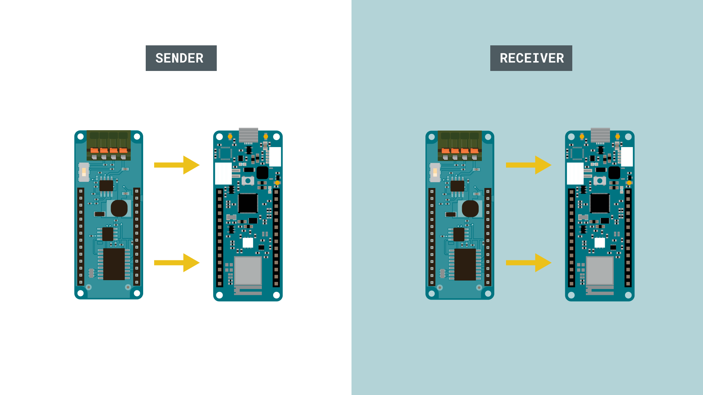
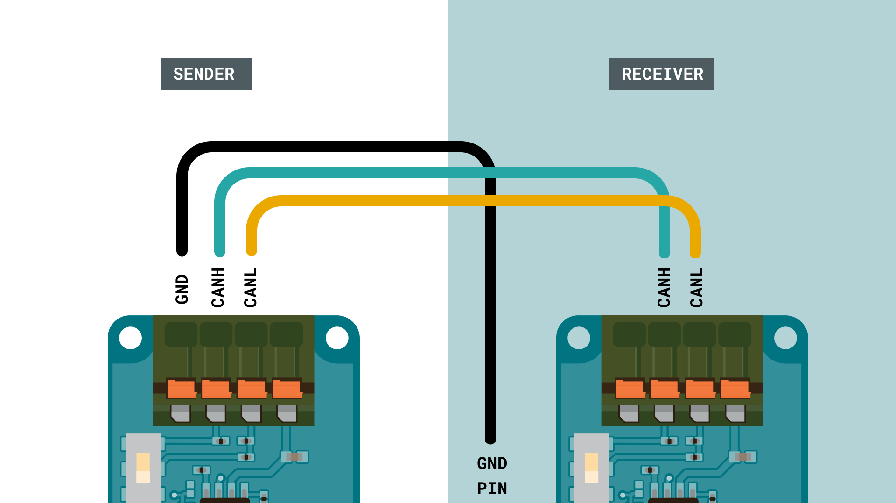
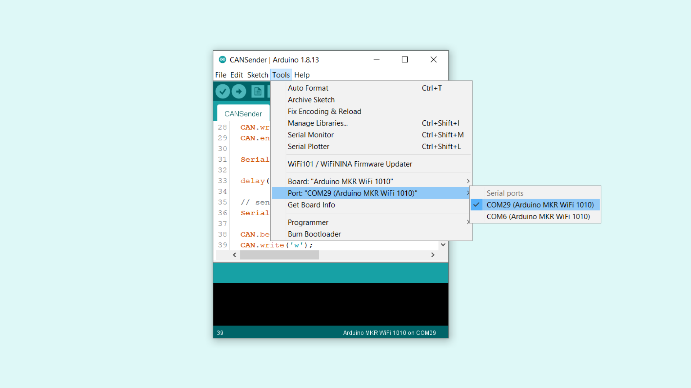
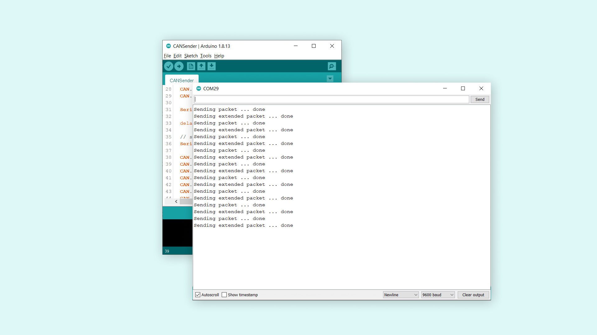
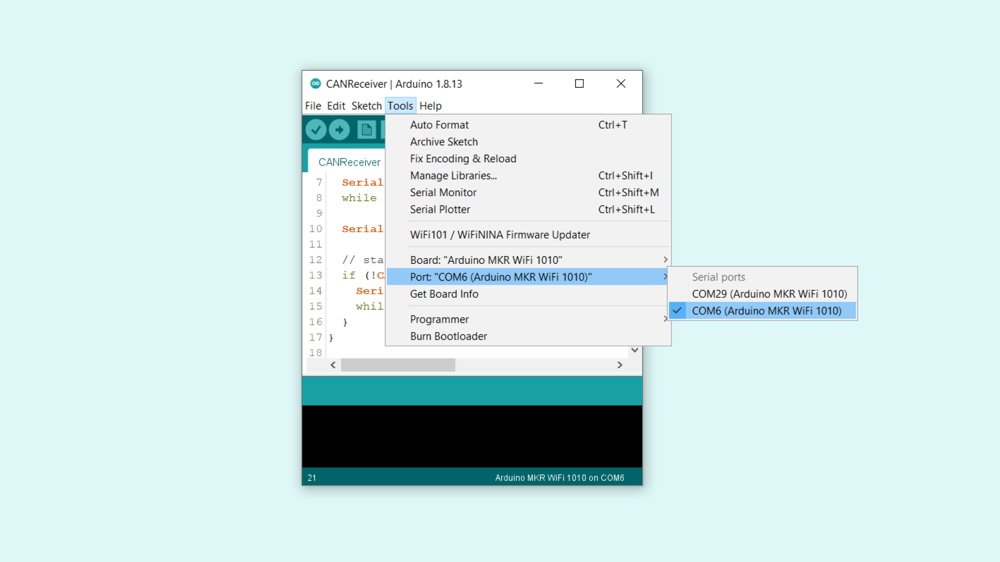
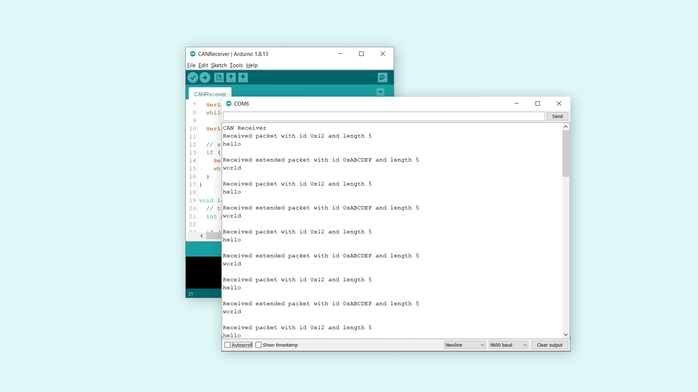
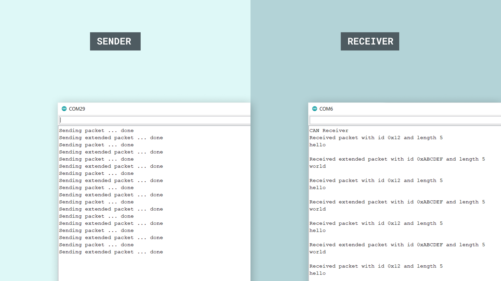

## Introduction

In this tutorial, we are going to create a communication line between two Arduino boards, using two MKR CAN Shields.

CAN, which is short for **Controller Area Network**, is a bus designed for devices to communicate with each other without involving a host computer, such as a server. 

The MKR CAN Shield is a robust communication shield that can be used together with any [MKR family board](https://store.arduino.cc/arduino-genuino/arduino-genuino-mkr-family).

## Goals

The goals of this project are:

- Understand the basic operation of the CAN bus.
- Explore which contexts they are used in.
- Create a simple device-to-device communication, using two MKR CAN Shields on top of two MKR family boards.

## Hardware & Software Needed

- Arduino IDE ([online](https://create.arduino.cc/) or [offline](https://www.arduino.cc/en/main/software)).
- [CAN](https://github.com/sandeepmistry/arduino-CAN) library installed.
- 2x MKR Can Shields ([link to store](https://store.arduino.cc/arduino-mkr-can-shield))
- 2x Arduino MKR family board ([link to store](https://store.arduino.cc/arduino-genuino/arduino-genuino-mkr-family))
- Jumper wires.
- Flathead screw driver.

## The CAN Bus

The CAN bus began its journey back in 1983, and the protocol was first released in 1986 by Bosch. A year later, Intel released the first CAN controller chip, and in 1991, Mercedes was the first automotive vehicle to feature a CAN based system. By 1993, CAN had been adopted as an international standard.

Simply put, the protocol enables the communication between different components of typically a vehicle. These components could for example be engine control unit, fuel measurement, audio system, windshield wipers to name a few.

Let's imagine a simple example: a standard gasoline car. Let's say the car has two temperature sensors (in many cases, there are more). One is for engine control, and one is for outdoor temperature. After driving for a while, the engine gets warmer and warmer. As it gets warmer, chances are it might overheat, so let's explore how the system acts on this information:

- The temperature sensor's value is over the threshold. This means it needs to be regulated. The sensor sends a signal to an engine fan / cooling system, telling it to turn ON.
- Additionally, it also continuously updates the Engine Temperature Gauge on the dashboard of the car.

These changes happen without the driver even noticing, and this is thanks to the CAN bus protocol: devices are able to solve tasks themselves.

Now, let's imagine the cooling system does not work for some reason. The temperature in the engine continues to increase, and the driver may not detect it. But if it reaches a certain danger threshold, it will trigger the **"Engine Temperature"** warning symbol on the dashboard. The driver is now notified that temperature is dangerously high, and should probably seek out a mechanic, or at least let the car cool down before continuing. 

This is just one of many operations happening simultaneously inside a car. Other important operations could for example be brake control system or fuel pumps.

### How Does the Communication Work?

The CAN bus uses just two wires: CAN high and CAN low. An ECU (electrical control unit), broadcasts data across the entire system, where other ECU on the system receives it. The ECU can decide whether the data is relevant or not, and either accept or ignore the data. Messages sent between ECU's have IDs depending on their priority, which means that more urgents messages gets bus access before others. 

There is of course a lot more to read about the CAN bus protocol, and you can follow the links below to understand it a bit better:

- <a href="https://www.csselectronics.com/screen/page/simple-intro-to-can-bus/language/en" target="_blank">Simple intro to CAN bus</a>. 
- <a href="https://www.engineersgarage.com/featured-contributions/can-protocol-understanding-the-controller-area-network-protocol/" target="_blank">Understanding the controller area network protocol</a>. 

### Circuit

For this tutorial, we will first need to mount the shields on top of the boards.



We then need to follow the wire diagrams below. The wire from ISO GND is connected to the GND pin on the shield (not the ISO GND). Note that the connectors require a flathead screwdriver to connect.



## Programming the Board

We will now get to the programming part of this tutorial. 

**1.** First, let's make sure we have the drivers installed for the board we are using. If we are using the Cloud Editor, we do not need to install anything. If we are using an offline editor, we need to install it manually. This can be done by navigating to **Tools > Board > Board Manager...**. Here we need to look for the **Arduino SAMD boards (32-bits Arm® Cortex®-M0+)** and install it. 

**2.** Now, we need to install the library needed. Head over to the [Arduino-CAN repository](https://github.com/sandeepmistry/arduino-CAN) and download the library by clicking on **Code > Download ZIP**. Head back to the editor, and navigate to **Sketch > Include Library > Add .ZIP Library**. Select the .ZIP file you downloaded (named arduino-CAN-master) and add it. 

**3.** We can now take a look at some core functions we are going to use: 

- `CAN.begin(500E3)` - initializes the library with a speed of 500 Kbps.
- `CAN.beginPacket(0x12)` - begins a packet with specific ID (ID is 11 bits).
- `CAN.beginExtendedPacket(0xabcdef)` - begins an extended packet with specific ID (ID is 29 bits).
- `CAN.write('o')` - writes a byte to the packet. 
- `CAN.endPacket()` - end packet and send it.
- `CAN.parsePacket()` - parses the packet.
- `CAN.packetId()` - ID from incoming packet.
- `CAN.available()` - checks for available data.
- `CAN.read()` - reads data from the packet.
- `CAN.packetExtended()` - checks if there's an extended packet and returns a true/false value.

### Programming the Sender

We will start by programming the sender. The code can be found in the snippet below, or in the **CAN** library under **File > Examples > CAN > CANSender**.

>**Note:** Make sure that you remember which board you upload to. As we are uploading two different sketches in total, we need to make sure we don't upload the sketches to the same board.


```cpp
#include <CAN.h>

void setup() {
  Serial.begin(9600);
  while (!Serial);

  Serial.println("CAN Sender");

  // start the CAN bus at 500 kbps
  if (!CAN.begin(500E3)) {
    Serial.println("Starting CAN failed!");
    while (1);
  }
}

void loop() {
  // send packet: id is 11 bits, packet can contain up to 8 bytes of data
  Serial.print("Sending packet ... ");

  CAN.beginPacket(0x12);
  CAN.write('h');
  CAN.write('e');
  CAN.write('l');
  CAN.write('l');
  CAN.write('o');
  CAN.endPacket();

  Serial.println("done");

  delay(1000);

  // send extended packet: id is 29 bits, packet can contain up to 8 bytes of data
  Serial.print("Sending extended packet ... ");

  CAN.beginExtendedPacket(0xabcdef);
  CAN.write('w');
  CAN.write('o');
  CAN.write('r');
  CAN.write('l');
  CAN.write('d');
  CAN.endPacket();

  Serial.println("done");

  delay(1000);
}
```

### Receiver Code

We will now program the receiver. The code can be found in the snippet below, or in the **CAN** library under **File > Examples > CAN > CANReceiver**.

Upload the program to the board, and remember to change the upload port, so we don't accidentally upload the sketch to the wrong board.

```cpp
#include <CAN.h>

void setup() {
  Serial.begin(9600);
  while (!Serial);

  Serial.println("CAN Receiver");

  // start the CAN bus at 500 kbps
  if (!CAN.begin(500E3)) {
    Serial.println("Starting CAN failed!");
    while (1);
  }
}

void loop() {
  // try to parse packet
  int packetSize = CAN.parsePacket();

  if (packetSize) {
    // received a packet
    Serial.print("Received ");

    if (CAN.packetExtended()) {
      Serial.print("extended ");
    }

    if (CAN.packetRtr()) {
      // Remote transmission request, packet contains no data
      Serial.print("RTR ");
    }

    Serial.print("packet with id 0x");
    Serial.print(CAN.packetId(), HEX);

    if (CAN.packetRtr()) {
      Serial.print(" and requested length ");
      Serial.println(CAN.packetDlc());
    } else {
      Serial.print(" and length ");
      Serial.println(packetSize);

      // only print packet data for non-RTR packets
      while (CAN.available()) {
        Serial.print((char)CAN.read());
      }
      Serial.println();
    }

    Serial.println();
  }
}
```


## Testing It Out

Great job! We have now programmed a **sender** and a **receiver** device, that will now be able to communicate with each other thanks to the MKR CAN Shields. 

The next step is to open the Serial Monitor for each device, to initiate the program. 

### Testing Sender

Let's begin with the sender. This is done by navigating to **Tools > Port**, and selecting the device you uploaded the sender sketch to. In this case, the sender device is **COM29**.



Once we open the Serial Monitor, and everything is working properly, we should see the following text being printed in the Serial Monitor:

```
Sending packet ... done
Sending extended packet ... done
```



This means it the message has successfully been transferred from the sender, to the receiver device.

### Testing Receiver

Now let's switch to the **receiver device**. This is done by changing the port to the other available. In this case, it is **COM6**. 



After selecting the right port, we can open the Serial Monitor. If everything is working correctly, then we should see the following messages in the Serial Monitor:

```
Received packet with id 0x12 and length 5
hello

Received extended packet with id 0xABCDEF and length 5
world 
```



This means the transmission has been successful. The regular packet contains `hello`, where the extended packet contains `world`. Additional information is also printed before the message, such as the ID and the length of the message. 

If you were to have both Serial Monitors open at the same time, the data transmission would look like this:



### Troubleshoot

If the code is not working, there are some common issues we can troubleshoot:

- If we see strange characters in the Serial Monitor, it could be a faulty connection: check the circuit to make sure everything is connected properly!
- If the code fails to compile, make sure that we have the **CAN** library installed.
- We have accidentally uploaded the same code twice: remember that we need to manually change the port before uploading a sketch.

## Conclusion

In this tutorial, we have explored how the MKR CAN Shield work, and how we can use the CAN bus protocol to transfer data easily between two devices. This robust communication protocol continues to be used in the automotive industry, and can be combined with other types of communication as well, for example Wi-Fi.

You can also explore the [CAN](https://github.com/sandeepmistry/arduino-CAN) library further, and try out some of the many cool functions.

Special thanks to [Sandeep Mistry](https://github.com/sandeepmistry) for his work on the [CAN](https://github.com/sandeepmistry/arduino-CAN) library.

