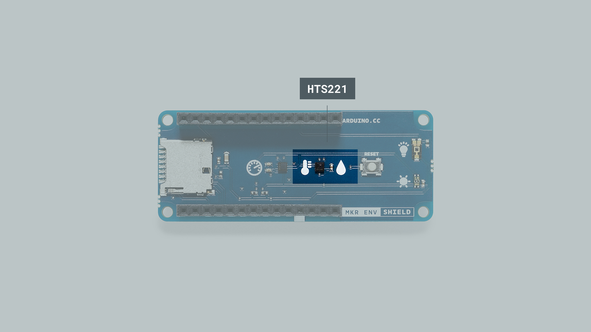
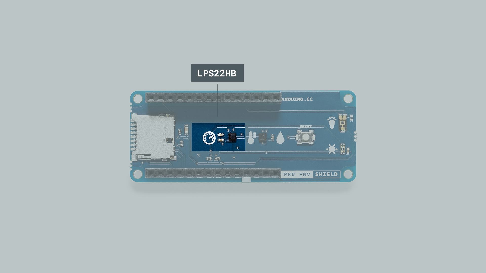
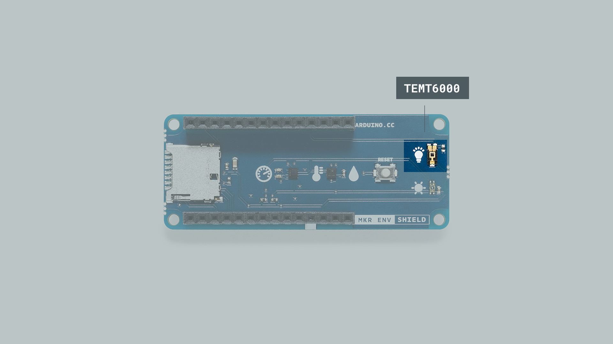
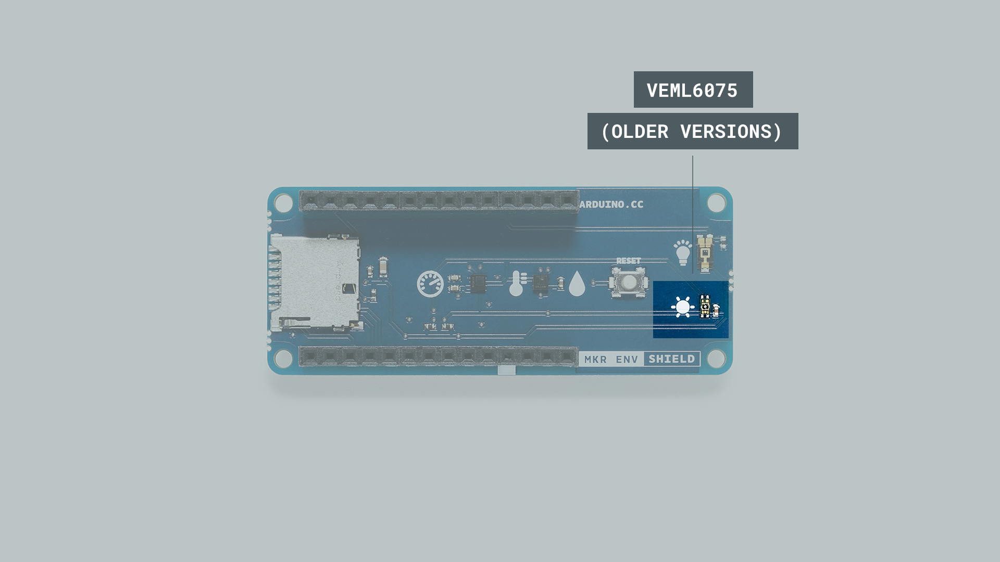
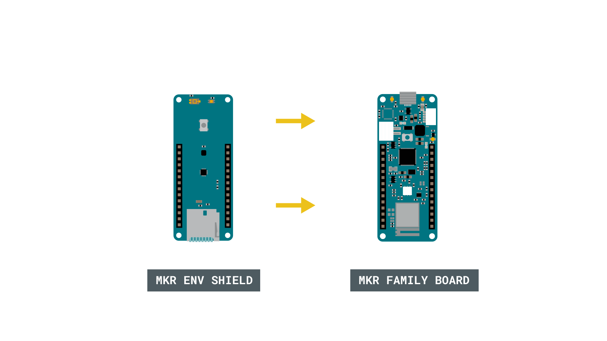

## Introduction

In this tutorial, we will go through the requirements of getting started with the [MKR ENV Shield](https://store.arduino.cc/arduino-mkr-env-shield), a shield designed to capture environmental data from your surroundings. The shield can only be used with a MKR family board, where it can be easily mounted on top.

The MKR ENV Shield is a great option for weather projects, where we can read temperature, humidity, light intensity & atmospheric pressure. Additionally, it also comes equipped with an SD card holder, that can be used to store the data captured from the sensors.

>**Note:** The older MKR ENV Shield version (v1) comes with a UV sensor that can capture UVA & UVB wavelengths. The newer versions (v2 and up) **does not** include this sensor. This can be seen in the silk on the shield, where newer versions does not have a **sun symbol** marked on top.


## Goals

The goals of this project are:

- Learn how to use the **Arduino_MKRENV** library.
- Capture data from all the sensors on the shield.
- Print out the data in the Serial Monitor.

## Hardware & Software Needed

- Arduino IDE ([online](https://create.arduino.cc/) or [offline](https://www.arduino.cc/en/main/software)).
- [Arduino_MKRENV](https://www.arduino.cc/en/Reference/ArduinoMKRENV) library installed.
- MKR ENV Shield ([link to store](https://store.arduino.cc/arduino-mkr-env-shield))
- Arduino MKR family board ([link to store](https://store.arduino.cc/arduino-genuino/arduino-genuino-mkr-family))

## The Different Sensors on the Shield

Before we test out the MKR ENV Shield, let's take a look at the different sensors that come with it. In total, there are three sensors: the LPS22HB (atmospheric pressure), HTS221 (temperature & humidity) and TEMT6000 (light intensity). 

### HTS221 Temperature & Humidity Sensor



This sensor’s range and accuracy make it suitable for many interesting experimental settings. There are two different functions that we can call upon: `readTemperature()` and `readHumidity()`. The return values are in **Celsius** and relative humidity, but we can also use the command `readTemperature(FAHRENHEIT)` if we want to get our values in **Fahrenheit**. 

- The temperature range goes between -40 and +120 (°C) and the accuracy is ± 0.5 °C in the range of 15 to +40 °C. 
- The humidity range goes between ± 3.5% rH (relative humidity), at 20 (°C) to +80% rH. The rH sensitivity is 0.004% rH. 

You can find more information about this sensor by reading it's <a href="https://www.st.com/resource/en/datasheet/hts221.pdf" target="_blank">datasheet</a>.

### LPS22HB Atmospheric Pressure Sensor



The atmospheric pressure can be read using the command `readPressure()`, which can take either no parameters or one of the following three, which will determine the units in which pressure will be expressed:

* **PSI** – the sensor returns data in pounds per square inch.
* **MILLIBAR** – the sensor returns data in millibars. Millibars are exactly the same as **hectopascal**, a unit that is more commonly used by meteorologists for weather reports. 
* **KILOPASCAL** – the sensor returns data in kilopascals – this is the default option.

Take a look at the table below. Here, we can see that hectopascal and millibars are exactly the same, and that PSI is entirely different, as it follows the imperial unit system.

| Kilopascal (kPa) | Hectopascal (hPa) | Millibar | PSI      |
| ---------------- | ----------------- | -------- | -------- |
| 1                | 10                | 10       | 0.145038 |
| 10               | 100               | 100      | 1.45038  |
| 25               | 250               | 250      | 3.62594  |

The barometric pressure sensor functions as a digital output barometer; it processes the data collected from the movement of a suspended silicon membrane. The change of pressure on the membrane affects a Wheatstone bridge, where piezo resistances are measured with an analog-to-digital converter and processed digitally.

The sensor’s range and accuracy make it suitable for a wide range of scientific experiments. The pressure range measures between 260 and 1260 hPa, with an accuracy of ±0.1 hPa, in the temperature range from 0 °C to +65 °C. However, the sensor can operate with a more constrained pressure range between the extended temperature range from -40 °C to +85 °C.

You can find more information about this sensor by reading it's <a href="https://www.st.com/resource/en/datasheet/dm00140895.pdf" target="_blank">datasheet</a>.

### TEMT6000 Light Sensor



The TEMT6000 sensor is a phototransistor, a component that will allow electrons to flow differently based on the amount of light shining on it. It has been calculated to be adapted to the human eye sensitivity. In other words, this sensor is telling you how intense light is for your eyes. 

The sensor’s range and accuracy makes is suitable for a lot of scientific experiments. The sensor’s opening angle is ±60 °, and while it peaks up at 570 nm, it is detecting light in the range from 440 nm to 800 nm, in the temperature range from -40 °C to +100 °C.

Using the command `readIlluminance()` will by default return a value measured in `LUX`. This unit represents one lumen per square meter. Unlike a measurement of Watts per square meter, which weights the power of signals in different frequencies of the spectrum differently, the lumens are calculated by looking at the mathematical response of the human eye to different wavelengths. In that way, LUX comes to be a measurement of how intense the light is for the human eye.  

You can find more information about this sensor by reading it's <a href="https://www.vishay.com/docs/81579/temt6000.pdf" target="_blank">datasheet</a>.

### VEML6075 (Older Versions Only)



The older versions of the MKR ENV Shields also has a UV sensor that can detect UVA and UVB wavelengths. The sensors can be read through the `readUVA()` and `readUVB()` commands. We can also use  `readUVIndex()` to calculate the UV index.

The UV sensor’s range and accuracy makes is suitable for a lot of scientific experiments. The temperature range of operation goes from -40 °C to +85 °C.

You can find more information about this sensor by reading it's <a href="https://content.arduino.cc/assets/Iot-Prime/VEML6075.pdf" target="_blank">datasheet</a>.

### Circuit

The circuit in this tutorial is very simple. Just attach the MKR ENV Shield on top of a MKR family board (shown below is the MKR WiFi 1010 board).




## Programming the Board

We will now get to the programming part of this tutorial.

**1.** First, let's make sure we have the drivers installed for the board we are using. If we are using the Web Editor, we do not need to install anything. If we are using an offline editor, we need to install it manually. This can be done by navigating to **Tools > Board > Board Manager...**. Here we need to look for the **Arduino SAMD boards (32-bits Arm® Cortex®-M0+)** and install it. 

**2.** Now, we need to install the libraries needed. If we are using the Web Editor, there is no need to install anything. If we are using an offline editor, simply go to **Tools > Manage libraries..**, and search for **Arduino_MKRENV** and install it.

**3.** We can now take a look at some of the core functions of this sketch:

- `ENV.begin()` - initializes the library.
- `ENV.readTemperature()` - returns temperature. 
- `ENV.readHumidity()` - returns relative humidity. 
- `ENV.readPressure()` - returns atmospheric pressure.
- `ENV.readIlluminance()` - returns LUX.
- `ENV.readUVA()` - returns UVA (only for older versions).
- `ENV.readUVB()` - returns UVB (only for older versions).
- `ENV.readUVIndex()` - calculates UV index (only for older versions).

The sketch can be found in the snippet below, or in the **Arduino_MKRENV** library, in **File > Examples > Arduino_MKRENV > ReadSensors**. Then, upload the code to the board. 

>**Note:** If you are using imperial units, e.g. Fahrenheit, there is a sketch called **ReadSensorsImperial** that is better suited.

```cpp
#include <Arduino_MKRENV.h>

void setup() {
  Serial.begin(9600);
  while (!Serial);

  if (!ENV.begin()) {
    Serial.println("Failed to initialize MKR ENV shield!");
    while (1);
  }
}

void loop() {
  // read all the sensor values
  float temperature = ENV.readTemperature();
  float humidity    = ENV.readHumidity();
  float pressure    = ENV.readPressure();
  float illuminance = ENV.readIlluminance();
  float uva         = ENV.readUVA();
  float uvb         = ENV.readUVB();
  float uvIndex     = ENV.readUVIndex();     

  // print each of the sensor values
  Serial.print("Temperature = ");
  Serial.print(temperature);
  Serial.println(" °C");

  Serial.print("Humidity    = ");
  Serial.print(humidity);
  Serial.println(" %");

  Serial.print("Pressure    = ");
  Serial.print(pressure);
  Serial.println(" kPa");

  Serial.print("Illuminance = ");
  Serial.print(illuminance);
  Serial.println(" lx");

  Serial.print("UVA         = ");
  Serial.println(uva);

  Serial.print("UVB         = ");
  Serial.println(uvb);

  Serial.print("UV Index    = ");
  Serial.println(uvIndex);

  // print an empty line
  Serial.println();

  // wait 1 second to print again
  delay(1000);
}
```

>**Note:** If you are using a newer version of the MKR ENV shield, you will not be able to use the `readUVA()`, `readUVB()` and `readUVindex()` commands. 

## Testing It Out

The code that we have now uploaded is very simple. First, we do a reading of all the sensors, then we simply print them in the Serial Monitor, with an interval of one second.

We can test that it is working, by opening the Serial Monitor. If everything is working properly, we should now see the values being printed in the Serial Monitor.


### Troubleshoot

If the code is not working, there are some common issues we can troubleshoot:

- We have not mounted the MKR ENV Shield on top of the board.
- We have not installed the **Arduino_MKRENV** library.

## Conclusion

In this tutorial, we have learned how to access the different sensors on the MKR ENV Shield, and print them in the Serial Monitor. Now with some basic knowledge on how the shield works, you can start creating your own projects, such as mini weather station, or an indoor temperature control device. 

Feel free to explore the [Arduino_MKRENV](https://www.arduino.cc/en/Reference/ArduinoMKRENV) library further, and try out some of the many cool functions.

