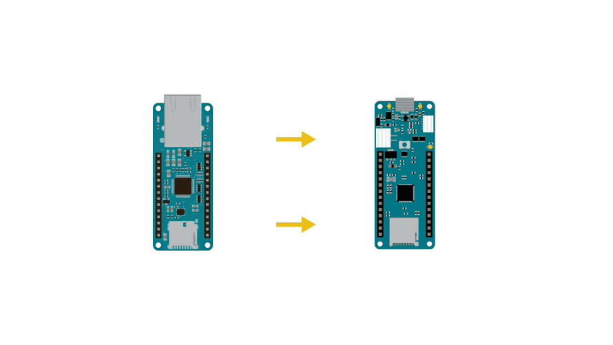
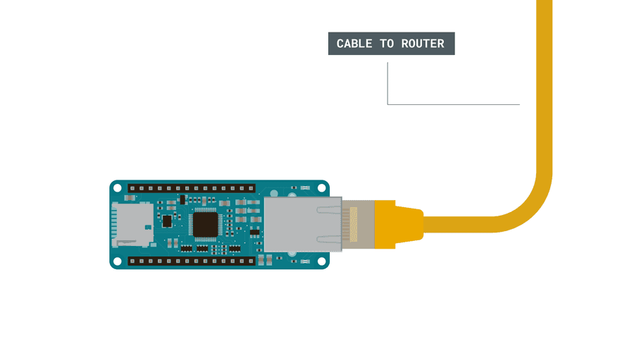
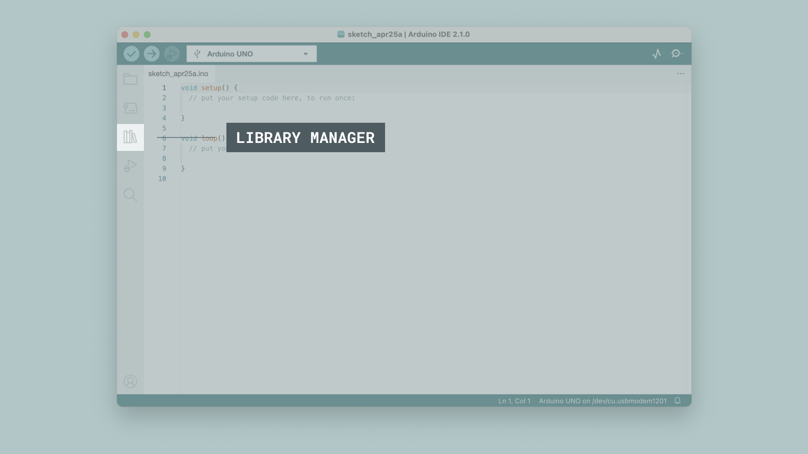
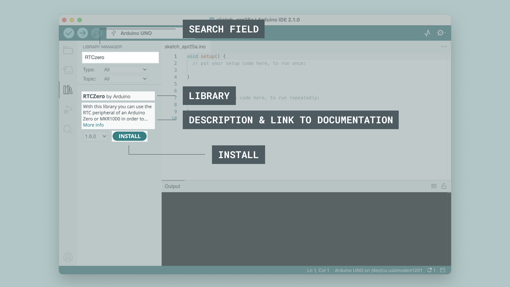
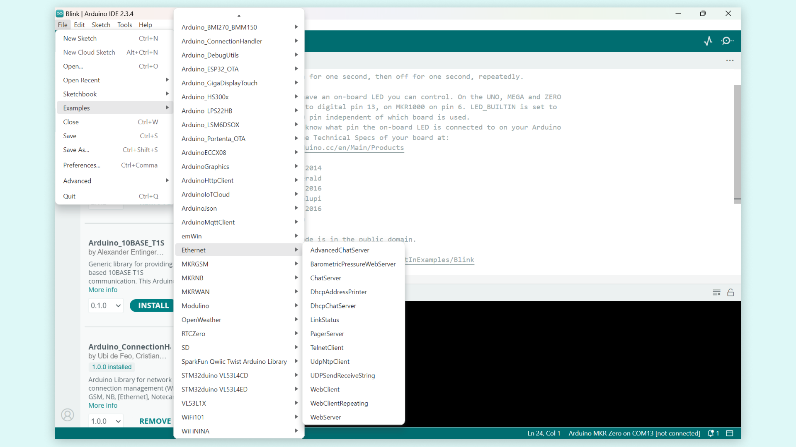
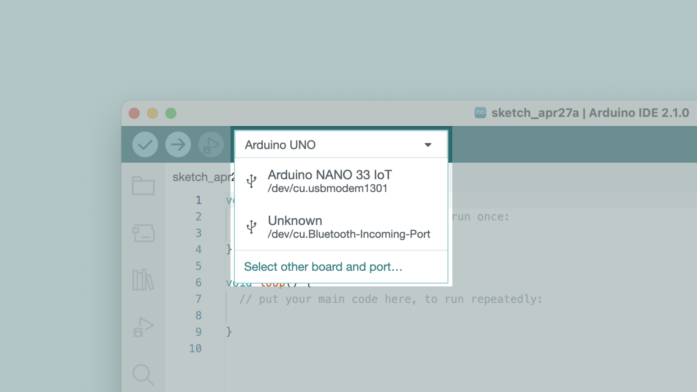
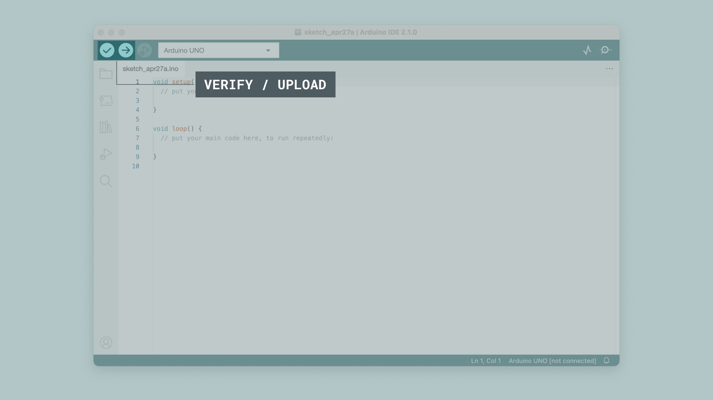
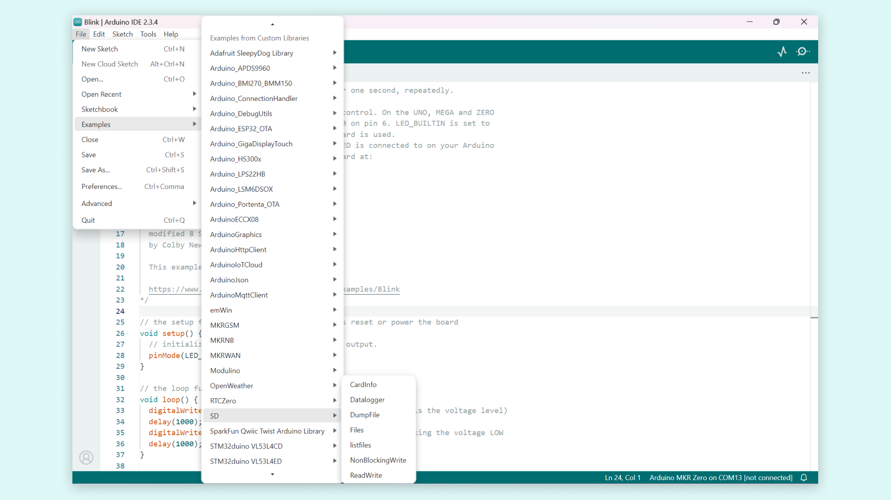

This user manual provides a comprehensive overview of the MKR ETH Shield, highlighting its hardware and software elements. With it, you will learn how to set up, configure, and use all the main features of a MKR ETH Shield.

## Hardware and Software Requirements

### Hardware Requirements

- [Arduino MKR ETH Shield](https://store.arduino.cc/products/arduino-mkr-eth-shield)
- [Arduino MKR board](https://store.arduino.cc/collections/boards-modules?filter.p.m.hardware_func.form_factor=MKR)
- [USB-B® cable](https://store.arduino.cc/products/usb-cable-type-a-male-to-micro-type-b-male)

### Software Requirements

- [Arduino IDE 2.0+](https://www.arduino.cc/en/software) or [Arduino Web Editor](https://create.arduino.cc/editor)
- [SD library](https://docs.arduino.cc/libraries/sd/)
- [Ethernet Library](https://docs.arduino.cc/libraries/ethernet/)

## MKR ETH Shield Overview

The MKR ETH shield allows to have a wired Ethernet connection between your MKR board and your network or the Internet. This is particularly useful for devices located where either electromagnetic noise is a problem or there are special safety requirements.

The MKR ETH Shield features the W5500 Ethernet controller, that provides Internet to embedded systems, and a Micro SD Card holder for storing larger files.

### Pinout

The pinout is available on the page below:

- [MKR ETH Shield pinout](https://docs.arduino.cc/hardware/mkr-eth-shield/#features)

### Tech Specs

The tech specs are available from the link below:

- [MKR ETH Shield tech specs](https://docs.arduino.cc/hardware/mkr-eth-shield/#tech-specs)

### Schematics

The complete schematics are available and downloadable as PDF from the link below:

- [MKR ETH Shield schematics](https://docs.arduino.cc/resources/schematics/ASX00006-schematics.pdf)

## First Use

### Connecting the Shield

To begin using the shield, first mount the MKR ETH Shield on top of an Arduino MKR board.



Then connect an Ethernet cable to the connector on the shield:



### Board Libraries

The [`SD` library](https://www.arduino.cc/reference/en/libraries/sd/) enables reading and writing on SD cards. Once an SD memory card is connected to the SPI interface of the Arduino board you can create files and read/write on them. You can also move through directories on the SD card.

The [`Ethernet` library](https://docs.arduino.cc/libraries/ethernet/) enables network connection (local and Internet). With this library you can use the Arduino Ethernet shield to connect to Internet. The library provides both client and server functionalities. The library permits you to connect to a local network also with DHCP and to resolve DNS.

### Installing Libraries

To install the `SD` and `Ethernet` library, navigate to the `Manage libraries` tab on the left side of the IDE.



In the Library Manager tab, search for `SD` and install the latest version of the library. And then do the same for the `Ethernet` library.



### Ethernet Example

In the `Ethernet` library there are examples that makes use of the libraries functions. Access the examples by navigating to **File > Examples > Ethernet**.



To use this library first connect an Ethernet cable into the slot on the shield.


Now let's have a look at an example sketch that uses the `Ethernet` library. First you will have to have installed the core for the MKR board that the Ethernet shield is mounted on. If you are having issues with this, please find the board on our [docs site](https://docs.arduino.cc/hardware/) and follow the set up instructions.

Here is an example sketch on how to set up a web server, feel free to copy this code into the IDE sketch:

```arduino
#include <SPI.h>
#include <Ethernet.h>

// Enter a MAC address and IP address for your controller below.
// The IP address will be dependent on your local network:
byte mac[] = {
  0xDE, 0xAD, 0xBE, 0xEF, 0xFE, 0xED
};
IPAddress ip(192, 168, 0, 78);

// Initialize the Ethernet server library
// with the IP address and port you want to use
// (port 80 is default for HTTP):
EthernetServer server(80);

void setup() {

Ethernet.init(5); //MKR ETH Shield

  // Open serial communications and wait for port to open:
  Serial.begin(9600);
  while (!Serial) {
    ; // wait for serial port to connect. Needed for native USB port only
  }
  Serial.println("Ethernet WebServer Example");

  // start the Ethernet connection and the server:
  Ethernet.begin(mac, ip);

  // Check for Ethernet hardware present
  if (Ethernet.hardwareStatus() == EthernetNoHardware) {
    Serial.println("Ethernet shield was not found.  Sorry, can't run without hardware. :(");
    while (true) {
      delay(1); // do nothing, no point running without Ethernet hardware
    }
  }
  if (Ethernet.linkStatus() == LinkOFF) {
    Serial.println("Ethernet cable is not connected.");
  }

  // start the server
  server.begin();
  Serial.print("server is at ");
  Serial.println(Ethernet.localIP());
}


void loop() {
  // listen for incoming clients
  EthernetClient client = server.available();
  if (client) {
    Serial.println("new client");
    // an http request ends with a blank line
    boolean currentLineIsBlank = true;
    while (client.connected()) {
      if (client.available()) {
        char c = client.read();
        Serial.write(c);
        // if you've gotten to the end of the line (received a newline
        // character) and the line is blank, the http request has ended,
        // so you can send a reply
        if (c == '\n' && currentLineIsBlank) {
          // send a standard http response header
          client.println("HTTP/1.1 200 OK");
          client.println("Content-Type: text/html");
          client.println("Connection: close");  // the connection will be closed after completion of the response
          client.println("Refresh: 5");  // refresh the page automatically every 5 sec
          client.println();
          client.println("<!DOCTYPE HTML>");
          client.println("<html>");
          // output the value of each analog input pin
          for (int analogChannel = 0; analogChannel < 6; analogChannel++) {
            int sensorReading = analogRead(analogChannel);
            client.print("analog input ");
            client.print(analogChannel);
            client.print(" is ");
            client.print(sensorReading);
            client.println("<br />");
          }
          client.println("</html>");
          break;
        }
        if (c == '\n') {
          // you're starting a new line
          currentLineIsBlank = true;
        } else if (c != '\r') {
          // you've gotten a character on the current line
          currentLineIsBlank = false;
        }
      }
    }
    // give the web browser time to receive the data
    delay(1);
    // close the connection:
    client.stop();
    Serial.println("client disconnected");
  }
}
```

Now let's take a look at some of the core functions that are uses in the sketch:

- `IPAddress ip(192, 168, 0, 78)` - IP address for your controller.
- `EthernetServer server(80)` - set the port (default is 80).
- `Ethernet.begin(mac, ip)`- start the Ethernet connection.
- `Ethernet.linkStatus()` - checks whether a cable is connected or not.
- `client.available()` - check if a client is available.
- `connected()` - checks if a client is connected.
- `read()` - reads the data from the client.
- `client.println()` - prints to the client.

### Uploading the Sketch

Now, let's make sure that our board is found by our computer, by selecting the port. Connect the board to your computer using a USB-B® cable. Then by pressing the white bar, as seen in the image below, the board and port can be selected.



To upload the sketch to the board, click the **Verify** button to compile the sketch and check for errors, then click the **Upload** button to program the device with the sketch.



Now that we uploaded our code to the board, we can test and see if it is working! After it has successfully uploaded, let's open the Serial Monitor. We should now see the following printed:

```
Ethernet WebServer Example
server is at 192.168.0.78
```

### SD Library Examples

In the `SD` library there are a few examples that makes use of the libraries functions. Access the examples by navigating to **File > Examples > SD**.



To use this library put a micro SD card into the MKR ETH shields SD card slot.

The examples can be used to test the SD card connection. Here are the examples in the library:

- **CardInfo** - This sketch gets info about your SD card. Very useful for testing a card when you're not sure whether its working or not. Prints info about the SD card in the serial monitor. Change the `chipSelect` variable in the sketch so that it matches the required settings for the MKR board you are using, as seen in the comments of the sketch.

- **Datalogger** - Logs data from three analog sensors to an SD card. The sketch will create a `datalog.txt` file on the SD card where the information will be stored. Change the `chipSelect` variable in the sketch so that it matches the required settings for the MKR board you are using, as seen in the comments of the sketch.

- **DumpFile** - Reads a file from the SD card and sends it over the serial port. Change the `chipSelect` variable in the sketch so that it matches the required settings for the MKR board you are using, as seen in the comments of the sketch.

- **Files** - Creates and destroys an SD card file. Change the `chipSelect` variable in the sketch so that it matches the required settings for the MKR board you are using, as seen in the comments of the sketch.

- **listfiles** - Prints out the files in a directory on a SD card. Change the `chipSelect` variable in the sketch so that it matches the required settings for the MKR board you are using, as seen in the comments of the sketch.

- **NonBlockingWrite** - This example demonstrates how to perform non-blocking writes to a file on a SD card. The file will contain the current millis() value every 10ms. If the SD card is busy, the data will be dataBuffered in order to not block the sketch. Change the `chipSelect` variable in the sketch so that it matches the required settings for the MKR board you are using, as seen in the comments of the sketch.

- **ReadWrite** - This example shows how to read and write data to and from an SD card file. Change the `chipSelect` variable in the sketch so that it matches the required settings for the MKR board you are using, as seen in the comments of the sketch.

For more information about the API of the SD library, [go here](https://docs.arduino.cc/libraries/sd/).

## Support

If you encounter any issues or have questions while working with your MKR ETH Shield board, we provide various support resources to help you find answers and solutions.

### Help Center

Explore our Help Center, which offers a comprehensive collection of articles and guides for MKR family boards and shields. The Help Center is designed to provide in-depth technical assistance and help you make the most of your device.

- [MKR family help center page](https://support.arduino.cc/hc/en-us/sections/360004641919-MKR-Family)

### Forum

Join our community forum to connect with other MKR family board users, share your experiences, and ask questions. The Forum is an excellent place to learn from others, discuss issues, and discover new ideas and projects related to the MKR ETH Shield.

- [MKR category in the Arduino Forum](https://forum.arduino.cc/c/official-hardware/mkr-boards/79)

### Contact Us

Please get in touch with our support team if you need personalized assistance or have questions not covered by the help and support resources described before. We're happy to help you with any issues or inquiries about the MKR family boards.

- [Contact us page](https://www.arduino.cc/en/contact-us/)