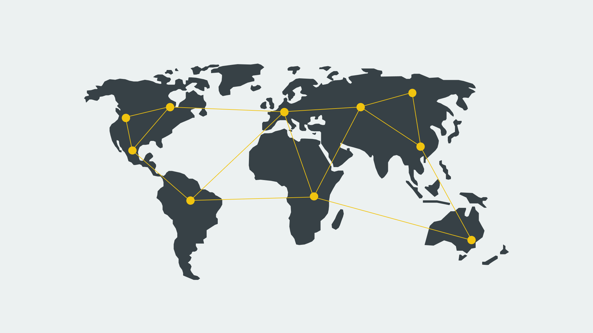
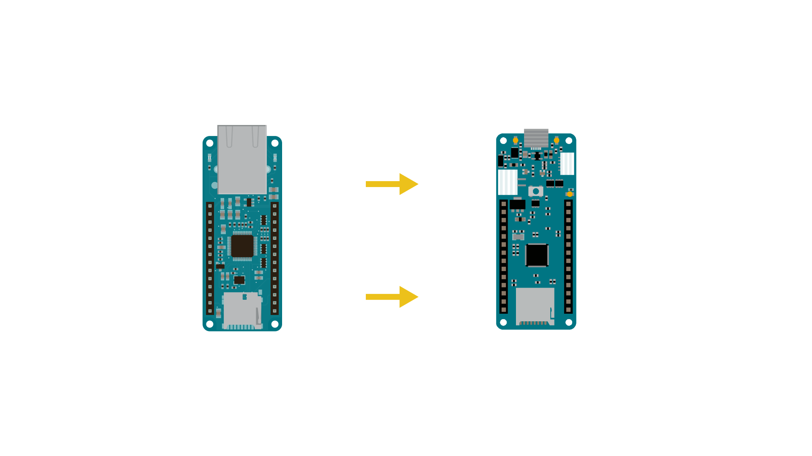
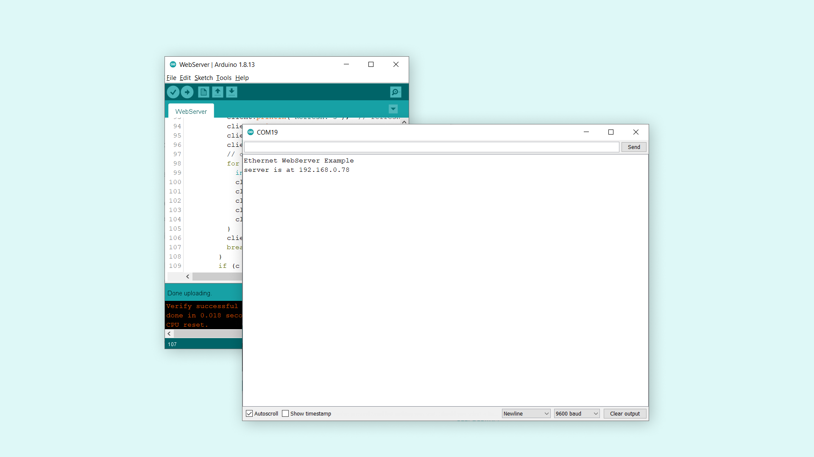
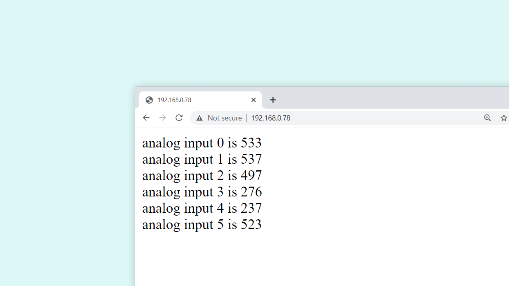
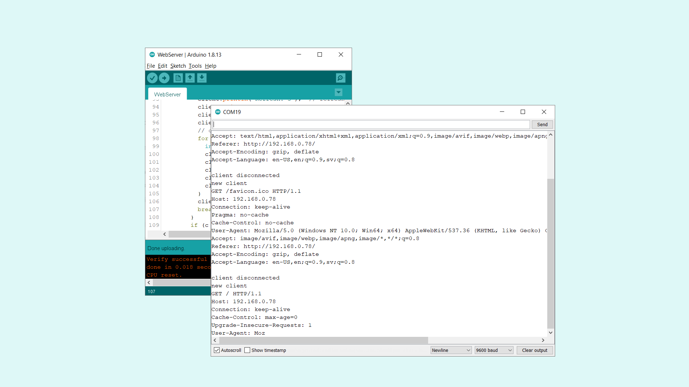

## Introduction

In this tutorial, we will test the functionality of the [MKR ETH Shield](https://store.arduino.cc/arduino-mkr-eth-shield), by creating a web server. The MKR ETH Shield is designed to be mounted on top of any MKR family board, where it can provide a solid connection to the Internet, through its ethernet connector. 

We will test it out, by first reading the value of 5 analog sensors on the board, and print them to a web server. Any client connecting on the same network will then be able to view the values in a browser. 

## Goals

The goals of this project are:

- Understand what Ethernet is.
- Learn how Ethernet compares to Wi-Fi.
- Build a simple web server example.
- Access the board from another device (through the browser).

## Hardware & Software Needed

- Arduino IDE ([online](https://create.arduino.cc/) or [offline](https://www.arduino.cc/en/main/software)).
- [Ethernet](https://www.arduino.cc/en/Reference/Ethernet) library installed.
- MKR ETH Shield ([link to store](https://store.arduino.cc/arduino-mkr-eth-shield))
- Arduino MKR family board ([link to store](https://store.arduino.cc/arduino-genuino/arduino-genuino-mkr-family))
- Ethernet cable.

## Ethernet

Ethernet is best described as a collection of computer networking technologies used in different type of networks, such as LAN (Local Area Network) and WAN (Wide Area Network). As one of the main carriers of the Internet Protocol, it is considered to be one of the main technologies that makes up the Internet. 

So Ethernet is an incredibly useful technology to understand and work with, seeing as without it, the Internet would not be the same. Often when we refer to the Internet, or IoT, we typically think wireless, such as Wi-Fi and mobile networks. The truth is, we are still, and very likely will, depend entirely on cables that stretch around the world. 



While our smartphones, laptops and smart objects do not physically connect to the Internet, it is very common that our router does. Wi-Fi operates on a very local scale, such as your home and office, and mobile networks covers as much as the radio tower can reach. But behind it all, cables are connected everywhere, and Ethernet is often the key technology here.

### Ethernet vs Wi-Fi 

So you might wonder, in what scenario would I prefer to choose Ethernet as a means of getting online? Why not use Wi-Fi? Let's take a look!

If we are building a project that requires Internet, but is built for an inside environment, Wi-Fi is a great option. We do not have to worry about cables, we can power it with batteries and the connection will be stable as long as it is in range of a gateway. 

But let's say we are building something that requires a very stable Internet connection, in a rough environment (e.g. outside, garage, industrial environment), the Wi-Fi option may become limited. If this is the case, an Ethernet connection might be much more suited.

Another example is a larger industrial facility that may have several sensors, machines and other electronic equipment. This may disturb the Wi-Fi signals from the device to a gateway, but if we are using a cable: no problem at all. It is always guaranteed a higher speed through an Ethernet cable than Wi-Fi, as there are little to no disturbance, as it ignores surrounding elements.

Let's take a look at some pros and cons of using Ethernet vs Wi-Fi:

**Ethernet pros**

- High speed connection.
- Robust connectors.
- Suitable for noisy environments.

**Ethernet cons**

- Needs physical connection.
- Less flexible

**Wi-Fi pros**

- Needs no physical connection.
- More flexible (e.g. battery powered).

**Wi-Fi cons**

- Lower speed.
- Can be problematic in noisy environments.

But enough arguing whether Ethernet or Wi-Fi is the best option: they are both simply great ways of connecting to our beloved Internet, and can be combined to make really good applications.

### Circuit

The circuit in this tutorial is easy to follow. First mount the MKR ETH Shield on top of an Arduino MKR board.



Then, connect an Ethernet cable to the connector on the shield.  


## Programming the Board

We will now get to the programming part of this tutorial. 

**1.** First, let's make sure we have the drivers installed for the board we are using. If we are using the Web Editor, we do not need to install anything. If we are using an offline editor, we need to install it manually. This can be done by navigating to **Tools > Board > Board Manager...**. Here we need to look for the **Arduino SAMD boards (32-bits Arm® Cortex®-M0+)** and install it. 

**2.** There is no need to install any additional library, the **Ethernet** library is already installed on both the Offline and Online IDEs. Instead, let's take a look at some of the core functions we will use in the sketch:

- `IPAddress ip(192, 168, 0, 78)` - IP address for your controller.
- `EthernetServer server(80)` - set the port (default is 80).
- `Ethernet.begin(mac, ip)`- start the Ethernet connection.
- `Ethernet.linkStatus()` - checks whether a cable is connected or not.
- `client.available()` - check if a client is available.
- `connected()` - checks if a client is connected.
- `read()` - reads the data from the client.
- `client.println()` - prints to the client.

The sketch can be found in the snippet below. Upload the sketch to the board.

```cpp
#include <SPI.h>
#include <Ethernet.h>

// Enter a MAC address and IP address for your controller below.
// The IP address will be dependent on your local network:
byte mac[] = {
  0xDE, 0xAD, 0xBE, 0xEF, 0xFE, 0xED
};
IPAddress ip(192, 168, 0, 78);

// Initialize the Ethernet server library
// with the IP address and port you want to use
// (port 80 is default for HTTP):
EthernetServer server(80);

void setup() {

Ethernet.init(5); //MKR ETH Shield

  // Open serial communications and wait for port to open:
  Serial.begin(9600);
  while (!Serial) {
    ; // wait for serial port to connect. Needed for native USB port only
  }
  Serial.println("Ethernet WebServer Example");

  // start the Ethernet connection and the server:
  Ethernet.begin(mac, ip);

  // Check for Ethernet hardware present
  if (Ethernet.hardwareStatus() == EthernetNoHardware) {
    Serial.println("Ethernet shield was not found.  Sorry, can't run without hardware. :(");
    while (true) {
      delay(1); // do nothing, no point running without Ethernet hardware
    }
  }
  if (Ethernet.linkStatus() == LinkOFF) {
    Serial.println("Ethernet cable is not connected.");
  }

  // start the server
  server.begin();
  Serial.print("server is at ");
  Serial.println(Ethernet.localIP());
}


void loop() {
  // listen for incoming clients
  EthernetClient client = server.available();
  if (client) {
    Serial.println("new client");
    // an http request ends with a blank line
    boolean currentLineIsBlank = true;
    while (client.connected()) {
      if (client.available()) {
        char c = client.read();
        Serial.write(c);
        // if you've gotten to the end of the line (received a newline
        // character) and the line is blank, the http request has ended,
        // so you can send a reply
        if (c == '\n' && currentLineIsBlank) {
          // send a standard http response header
          client.println("HTTP/1.1 200 OK");
          client.println("Content-Type: text/html");
          client.println("Connection: close");  // the connection will be closed after completion of the response
          client.println("Refresh: 5");  // refresh the page automatically every 5 sec
          client.println();
          client.println("<!DOCTYPE HTML>");
          client.println("<html>");
          // output the value of each analog input pin
          for (int analogChannel = 0; analogChannel < 6; analogChannel++) {
            int sensorReading = analogRead(analogChannel);
            client.print("analog input ");
            client.print(analogChannel);
            client.print(" is ");
            client.print(sensorReading);
            client.println("<br />");
          }
          client.println("</html>");
          break;
        }
        if (c == '\n') {
          // you're starting a new line
          currentLineIsBlank = true;
        } else if (c != '\r') {
          // you've gotten a character on the current line
          currentLineIsBlank = false;
        }
      }
    }
    // give the web browser time to receive the data
    delay(1);
    // close the connection:
    client.stop();
    Serial.println("client disconnected");
  }
}
```

## Testing It Out

Now that we uploaded our code to the board, we can test and see if it is working! After it has successfully uploaded, let's open the Serial Monitor. We should now see the following printed:

```
Ethernet WebServer Example
server is at 192.168.0.78
```



Let's copy the IP address and go to the browser of your choice (needs to be connected to the same network). If everything is working, we should see the following:



The content is simply the recent reading of pin A0-A5 on the board, which is then printed to the client. Congratulations, you have now managed to access data from your MKR board from a different device. The page is set to refresh every 5 seconds, so the values update along with it.  

If we go back to the Serial Monitor, we can see information on what is going on when a client is connecting to the server. 



### Troubleshoot

If the code is not working, there are some common issues we can troubleshoot:

- Check that the Ethernet cable is not broken. 
- Make sure that your MKR ETH Shield is mounted on a compatible MKR board. 
- If you have any compilation issues, try updating the IDE and the Ethernet library.
- If you fail to access it from the browser, make sure the device you connect from is on the same network.

## Conclusion

In this tutorial, we have used the MKR ETH Shield to create a local web server that can be accessed from a device on the same network. This is a very basic example, but you can build on it to create really cool projects. 

In this tutorial, we used the MKR Zero board, which has no module to connect to the Internet, where the MKR ETH Shield provides the connection. 

Feel free to explore the [Ethernet](https://www.arduino.cc/en/Reference/Ethernet) library further, and try out some of the many cool functions.
