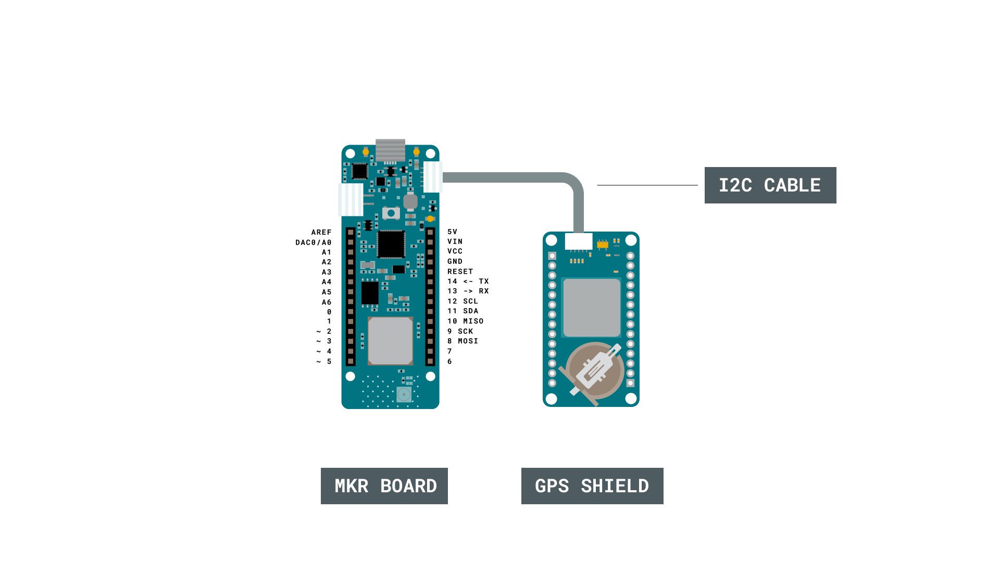
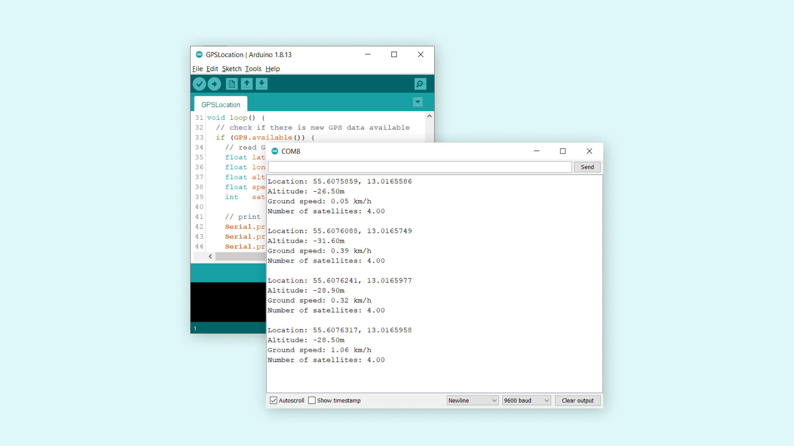

## Introduction 

The ability to pinpoint your exact location can be very useful for different types of projects. With the MKR GPS Shield, we can reach high accuracy with minimal power consumption.

In this tutorial, we will use a very basic example from the **Arduino_MKRGPS** library, which records different geolocation data directly from the GPS shield, and prints them in the Serial Monitor.

## Goals

The goals of this project are:

- Set up the MKR GPS Shield.
- Record longitude, latitude, speed and altitude.
- Print the data in the Serial Monitor.

## Hardware & Software Needed

- Arduino IDE ([online](https://create.arduino.cc/) or [offline](https://www.arduino.cc/en/main/software)).
- [Arduino_MKRGPS](https://www.arduino.cc/en/Reference/ArduinoMKRGPS) library installed.
- MKR GPS Shield ([link to store](https://store.arduino.cc/arduino-mkr-gps-shield)).
- Arduino MKR family board ([link to store](https://store.arduino.cc/arduino-genuino/arduino-genuino-mkr-family)).

## Global Positioning System (GPS)

The GPS is an incredible technology that is used to pinpoint an exact geographical location. Even more interesting, it uses a series of satellites orbiting the Earth to do so. Basically, a satellite in orbit continuously sends signals towards the Earth, which are picked up by GPS receivers, that exist in e.g. smartphones. As the satellite has a positioning system, it knows where it is, relative to the Earth. But this signal can only pinpoint where you are in a certain part of the world, e.g. in the Atlantic Ocean or Asia. For more accuracy, data from other satellites are also used, where for every satellite the accuracy increases.

It is quite spectacular, that something 20.000 kilometers above the Earth can pinpoint your exact location. What is even more interesting, is that we can create our own projects using this technology. The MKR GPS shield can get extremely accurate readings on where we are in the world. This can be used to first locate where we are in the world, but we can also use it to record for example speed.

There is, of course, much more behind the GPS technology. If we want to read more, why not start at [NASA's own article](https://www.nasa.gov/directorates/heo/scan/communications/policy/what_is_gps) on how GPS technology works. 

### Circuit

The circuit in this tutorial is pretty simple, and the simplest assembly is to connect an I2C cable from a MKR board directly to the MKR GPS Shield. This cable comes with every GPS shield, and has an ESLOV connector at each  



***If you are using a third party cable to connect the MKR board and MKR GPS Shield via I2C, make sure the cable is wired identically to the cable that comes with the shield.***

## Programming the Board

We will now get to the programming part of this tutorial. 

**1.** First, let's make sure we have the drivers installed for the board we are using. If we are using the Web Editor, we do not need to install anything. If we are using an offline editor, we need to install it manually. This can be done by navigating to **Tools > Board > Board Manager...**. Here we need to look for the **Arduino SAMD boards (32-bits Arm® Cortex®-M0+)** and install it. 

**2.** Now, we need to install the library needed. If we are using the Web Editor, there is no need to install anything. If we are using an offline editor, simply go to **Tools > Manage libraries..**, and search for **Arduino_MKRGPS** and install it.

**3.** Here are some of the core functions of this sketch:

- `GPS.begin` - initializes the GPS library.
- `GPS.available()` - checks for available GPS data from the module.
- `GPS.latitude()` - records latitude.
- `GPS.longitude()` - records longitude.
- `GPS.altitude()` - records altitude.
- `GPS.speed()` - records speed in km/h. 

The sketch can be found in the snippet below. Upload the sketch to the board.

```cpp
#include <Arduino_MKRGPS.h>

void setup() {
  // initialize serial communications and wait for port to open:
  Serial.begin(9600);
  while (!Serial) {
    ; // wait for serial port to connect. Needed for native USB port only
  }

  // If you are using the MKR GPS as shield, change the next line to pass
  // the GPS_MODE_SHIELD parameter to the GPS.begin(...)
  if (!GPS.begin()) {
    Serial.println("Failed to initialize GPS!");
    while (1);
  }
}

void loop() {
  // check if there is new GPS data available
  if (GPS.available()) {
    // read GPS values
    float latitude   = GPS.latitude();
    float longitude  = GPS.longitude();
    float altitude   = GPS.altitude();
    float speed      = GPS.speed();
    int   satellites = GPS.satellites();

    // print GPS values
    Serial.print("Location: ");
    Serial.print(latitude, 7);
    Serial.print(", ");
    Serial.println(longitude, 7);

    Serial.print("Altitude: ");
    Serial.print(altitude);
    Serial.println("m");

    Serial.print("Ground speed: ");
    Serial.print(speed);
    Serial.println(" km/h");

    Serial.print("Number of satellites: ");
    Serial.println(satellites);

    Serial.println();
  }
}
```

## Testing It Out

After we have uploaded the code to the board, we need to open the Serial Monitor to start the program. It is a good idea to have our setup close to a window. Once the data is available, it will start printing the values in the Serial Monitor.  



>**Note:** This process may take some time. If no data is available after 5 minutes or so, try moving your device closer to a window. 

Once we start getting the values, we can double check that they are alright. For example, `longitude` and `latitude` should be very accurate, and be able to pinpoint almost your exact location. You can enter the coordinates in [Google Maps](https://www.google.com/maps) for example, to see if the values match.

### Troubleshoot

If the code is not working, there are some common issues we can troubleshoot:

- We have not installed the **MKRGPS** library.
- We have selected the wrong port and board to upload to.
- We have not installed the right Board Package for the board we are using.
- We need to move the MKR GPS Shield closer to a window.

## Conclusion

In this tutorial, we learned how to retrieve accurate location data from the **MKR GPS Shield**. We managed to retrieve a lot of useful data and print it in the Serial Monitor. With it, we can ideate some pretty cool ideas, such as speedometer, tracking device or maybe a geolocation game. GPS is a great technology that can retrieve data from anywhere in the world as long it has clear sight, which makes it very useful for remote projects.

Feel free to explore the [Arduino_MKRGPS](https://www.arduino.cc/en/Reference/ArduinoMKRGPS) library further, and try out some of the many cool functions.

