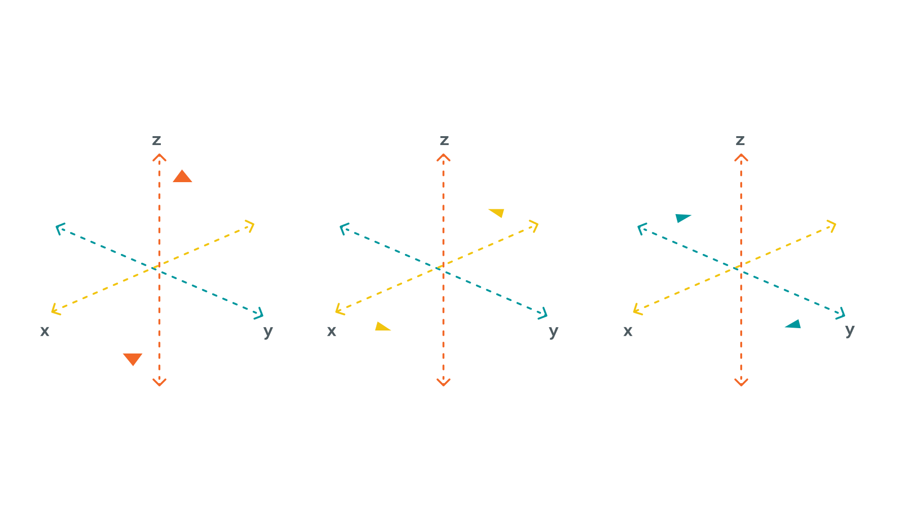
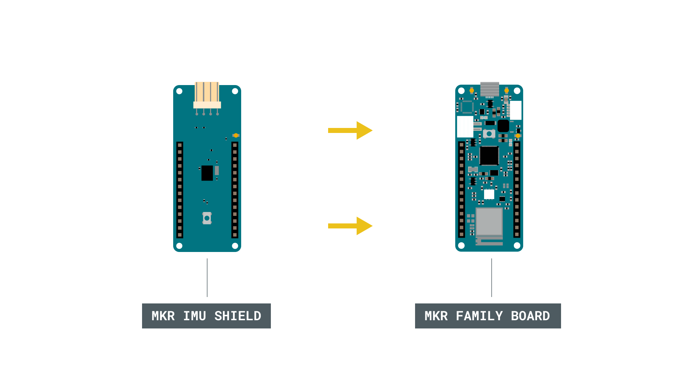
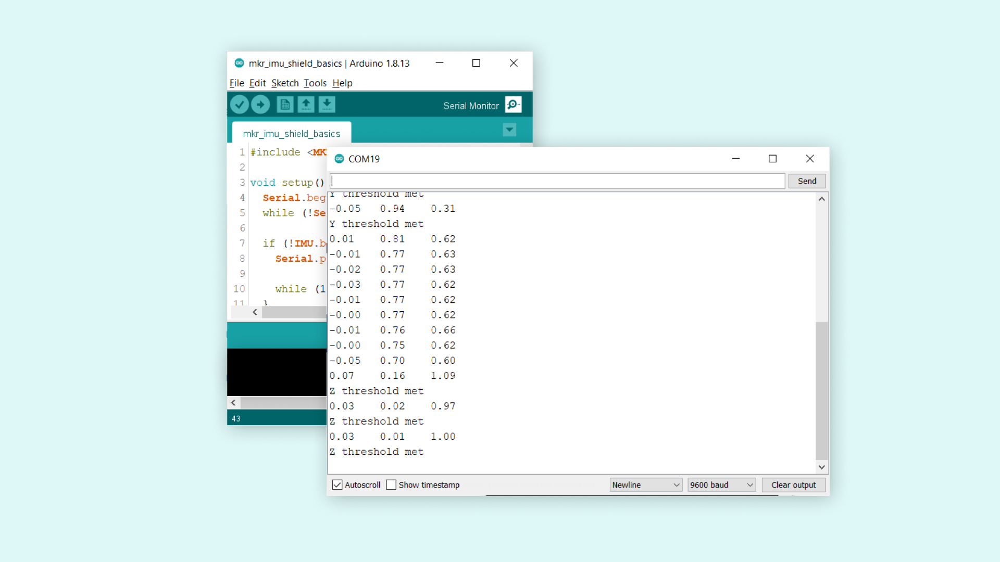

## Introduction 

The IMU shield is a great addition to any of your MKR family boards. It comes equipped with the [BNO055](https://www.bosch-sensortec.com/products/smart-sensors/bno055.html) absolute orientation sensor, developed by Bosch.

We will create a simple sketch using the accelerometer, where we will first do a reading on the sensor, and then find a specific threshold that will activate something when reached. 

## Goals

The goals of this project are:

- Record data from the accelerometer.
- Print out the data in the Serial Monitor.
- Create a trigger when a certain axis reaches a specific range.

## Hardware & Software Needed

- Arduino IDE ([online](https://create.arduino.cc/) or [offline](https://www.arduino.cc/en/main/software)).
- [MKRIMU](https://www.arduino.cc/reference/en/libraries/mkrimu/) library installed.
- MKR IMU Shield ([link to store](https://store.arduino.cc/arduino-mkr-imu-shield)).
- Arduino MKR family board ([link to store](https://store.arduino.cc/arduino-genuino/arduino-genuino-mkr-family)).

## Accelerometer

An accelerometer is an electromechanical device used to measure acceleration forces. Such forces may be static, like the continuous force of gravity or, as is the case with many mobile devices, dynamic to sense movement or vibrations.

It is an excellent sensor for projects involving wearables, or projects that feature something that is in the air. In fact, every airborne machine such as airplanes, drones or helicopters have a similar sensors to calculate their orientation.




The accelerometer uses the **x**, **y** and **z** coordinates. For example, they can be used to detect acceleration (if we quickly shake the component back and forth, there will be change in the values) but are also commonly used for measuring vibration, such as earthquakes.

### Circuit

The circuit in this tutorial is very easy. Simply mount the MKR IMU Shield on top of an Arduino MKR board. 



## Programming the Board

We will now get to the programming part of this tutorial. 

**1.** First, let's make sure we have the drivers installed for the board we are using. If we are using the Web Editor, we do not need to install anything. If we are using an offline editor, we need to install it manually. This can be done by navigating to **Tools > Board > Board Manager...**. Here we need to look for the **Arduino SAMD boards (32-bits ARM Cortex M0+)** and install it. 

**2.** Now, we need to install the libraries needed. If we are using the Web Editor, there is no need to install anything. If we are using an offline editor, simply go to **Tools > Manage libraries..**, and search for **MKRIMU** and install it.

**3.** Here are some of the core functions of this sketch:

- `IMU.begin()` - initializes the library.
- `IMU.accelerationSampleRate()` - reads the sampling rate in Hz.
- `IMU.accelerationAvailable()` - checks if there's data available from the IMU.
- `IMU.readAcceleration(x, y, z)` - reads the accelerometer, and returns the value of the **x, **y and **z** axis.

The sketch can be found in the snippet below. Upload the sketch to the board.

```arduino
#include <MKRIMU.h>

void setup() {
  Serial.begin(9600);
  while (!Serial);

  if (!IMU.begin()) {
    Serial.println("Failed to initialize IMU!");

    while (1);
  }

  Serial.print("Accelerometer sample rate = ");
  Serial.print(IMU.accelerationSampleRate());
  Serial.println(" Hz");
  Serial.println();
  Serial.println("Acceleration in G's");
  Serial.println("X\tY\tZ");
}

void loop() {
  float x, y, z;

  if (IMU.accelerationAvailable()) {
    IMU.readAcceleration(x, y, z);

    Serial.print(x);
    Serial.print('\t');
    Serial.print(y);
    Serial.print('\t');
    Serial.println(z);

    if (x > 0.9 || x < -0.9) {
      Serial.println("X threshold met");
      delay(1000);
    }
    if (y > 0.9 || y < -0.9) {
      Serial.println("Y threshold met");
      delay(1000);
    }
    if (z > 0.9 || z < -0.9) {
      Serial.println("Z threshold met");
      delay(1000);
    }
  }
  delay(500);
}
```

## Testing It Out

After we have uploaded the code to the board, open the Serial Monitor to initialize the program. When we open it, the **x, y** and **z** values will be printed every 0.5 seconds (due to the 500 millisecond delay in the code).



The way this program works is that when a threshold is met (either x, y or z), we print something specific in the Serial Monitor. In this example, we simply print a string in the Serial Monitor. 

For example, when the value of `z` is larger than 0.9 **or** smaller than -0.9, the condition is met, and `"Z threshold met"` is printed.

```
0.05	-0.05	 0.98
Z threshold met
```

This certain threshold is met when the board lies flat on a table, where as if it facing up, the `z` value will be around `1.00`, and if upside down, it will be close to `-1.00` (negative). 

You can now test out the board by moving it around, and notice how both the `x` and `y` values change and trigger their own conditionals. 

### Troubleshoot

If the code is not working, there are some common issues we can troubleshoot:

- We have not installed the Board Package for the board we are using (a MKR family board is required).
- We have not installed the [MKRIMU](https://www.arduino.cc/reference/en/libraries/mkrimu/) library.
- We have mounted the shield the wrong way around. Check that the pins on the board are aligned with the pins on the shield.

## Conclusion

In this tutorial we have tested out the **accelerometer** on the MKR IMU Shield together with a MKR family board. The shield is a great start for any project involving the use of IMUs, and hopefully this tutorial helped you get started with your own IMU project. 

Feel free to explore the [MKRIMU](https://www.arduino.cc/reference/en/libraries/mkrimu/) library further, and try out some of the many cool functions.
