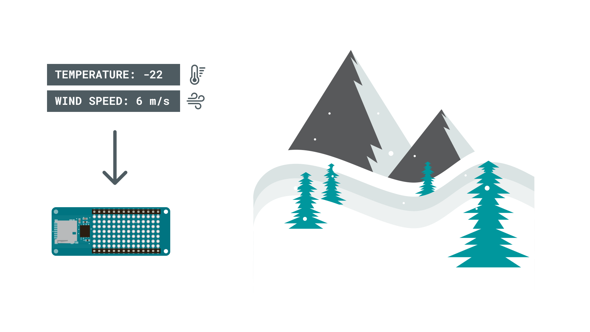
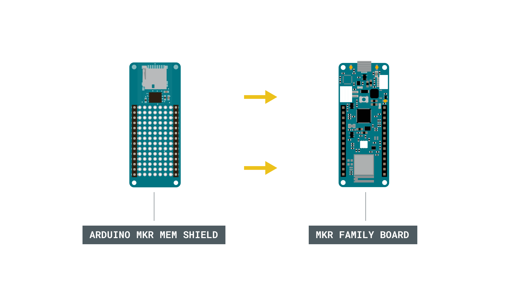
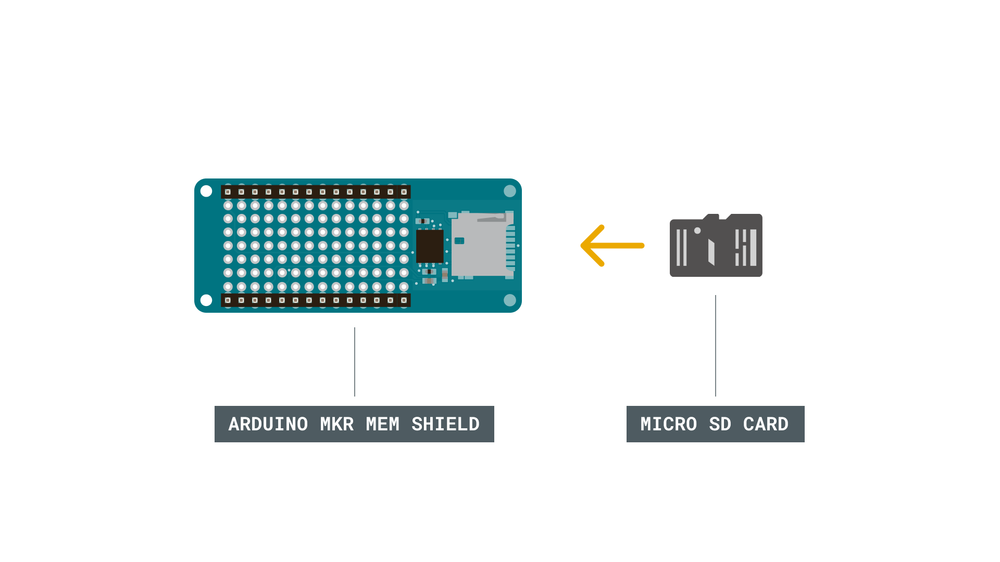
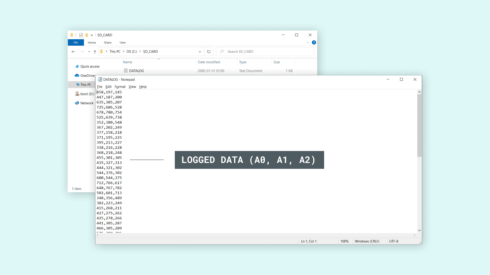

## Introduction 

In this tutorial, we will find out how we can log data on an SD card. The [MKR MEM Shield](https://store.arduino.cc/arduino-mkr-mem-shield) is a MKR form factor shield, that has a slot for a micro SD card. A great addon for any MKR board (except for [Arduino MKR Zero](https://store.arduino.cc/arduino-mkr-zero-i2s-bus-sd-for-sound-music-digital-audio-data) which already has a micro SD card slot), that can be used to log data offline, or to store larger amounts of data.

We will in this tutorial only focus on logging offline data, by uploading a sketch that reads three of the analog pins on a MKR family board.

## Goals

The goals of this project are:

- Read data from the analog pins on a MKR family board.
- Store the data on the SD card.
- View the data using a text editor on a computer.

## Hardware & Software Needed

- Arduino IDE ([online](https://create.arduino.cc/) or [offline](https://www.arduino.cc/en/main/software)).
- [SD](https://www.arduino.cc/en/Reference/SD) library.
- Arduino MKR family board ([link to store](https://store.arduino.cc/arduino-genuino/arduino-genuino-mkr-family)).
- Arduino MKR MEM Shield ([link to store](https://store.arduino.cc/arduino-mkr-mem-shield)).
- A formatted micro SD card (with adapter).

## Secure Digital (SD) Card

You have most likely used, nevertheless heard, of the SD card. It is short for Secure Digital, and is a great option for storing large quantities of data. The SD card is tiny and weighs practically nothing, yet, some of them are capable of storing up to a **terabyte of data.** In comparison, it is quite standard for a laptop to have between 128 - 256 gigabytes of storage space. 

However, to log data from e.g. sensors, it would take quite some time to reach that limit. 

### Useful Scenarios

But let's take a look at when and where we might want to use an SD card. There are typically two main scenarios when they are quite useful for an Arduino project:

- Storing larger files, e.g. sound files or icons (useful for projects using a display).
- Logging data offline.

Let's imagine we have an Arduino board and a couple of environmental sensors, and we want to do a weather project. We do not have any way of transmitting real time data, but we would like to track the weather for the next month, to later be analysed. We do not have the possibility to connect the board to a computer, since it needs to be outdoor.

The solution: an SD card. A really simple way of logging data over a longer period of time, without any connection to Internet or a computer is to simply store it locally. Let's say we do a reading every 10 seconds of the temperature and wind speed, we can then also store that reading on the SD card.



When we have finished recording, we simply remove the SD card and plug it into a computer. The data has now nicely been logged, and these values can easily be converted into a graph. We can then for example see the pattern of temperature going up and down and the wind increasing.
 


### Circuit

The circuit for this tutorial is very easy. First, let's mount the MKR MEM Shield on top of a MKR family board of your choice.



Now, we need to insert a micro SD card into the slot on the shield. 




## Programming the Board

We will now get to the programming part of this tutorial. We will here create a program that will make readings on A0, A1 and A2, create a file on the SD card, and log the readings in that file. 

**1.** First, let's make sure we have the drivers installed. If we are using the Web Editor, we do not need to install anything. If we are using an offline editor, we need to install it manually. This can be done by navigating to **Tools > Board > Board Manager...**. Here we need to look for the **Arduino SAMD boards (32-bits ARM Cortex M0+)** and install it. 

**2.** We can now take a look at some of the core functions of this sketch:

- `while (!Serial)` 
- `SD.begin(chipSelect)` - initializes the SD card with selected pin.
- `File dataFile = SD.open("datalog.txt", FILE_WRITE)` - creates the `dataFile` object to access the library functionalities, and opens/create a file named `datalog.txt` on the SD card, and set it to write mode. 
- `dataFile.print()` - prints something to the `datalog.txt` file. 
- `dataFile.close()` - closes the file.

The sketch can be found in the snippet below. The sketch can also be accessed from the IDE, by navigating to **File > Examples > SD > Datalogger**. Upload the code to the board.

```cpp
#include <SPI.h>
#include <SD.h>

const int chipSelect = SDCARD_SS_PIN;

void setup() {
  // Open serial communications and wait for port to open:
  Serial.begin(9600);
  while (!Serial) {
    ; // wait for serial port to connect. Needed for native USB port only
  }


  Serial.print("Initializing SD card...");

  // see if the card is present and can be initialized:
  if (!SD.begin(chipSelect)) {
    Serial.println("Card failed, or not present");
    // don't do anything more:
    while (1);
  }
  Serial.println("card initialized.");
}

void loop() {
  // make a string for assembling the data to log:
  String dataString = "";

  // read three sensors and append to the string:
  for (int analogPin = 0; analogPin < 3; analogPin++) {
    int sensor = analogRead(analogPin);
    dataString += String(sensor);
    if (analogPin < 2) {
      dataString += ",";
    }
  }

  // open the file. note that only one file can be open at a time,
  // so you have to close this one before opening another.
  File dataFile = SD.open("datalog.txt", FILE_WRITE);

  // if the file is available, write to it:
  if (dataFile) {
    dataFile.println(dataString);
    dataFile.close();
    // print to the serial port too:
    Serial.println(dataString);
  }
  // if the file isn't open, pop up an error:
  else {
    Serial.println("error opening datalog.txt");
  }
  delay(1000);
}
```

## Testing It Out

After uploading the code to the board, we need to open the Serial Monitor to initialize the program. This is due to the `while(!Serial)` command introduced in the setup, which prevents the program from running. 

When we open the Serial Monitor, we will see data from the three analog pins being printed, each separated by a comma. This is also how it should look inside the `.txt` file that we are printing the values to as well.


Now if we are seeing these values, and no error messages, we can assume the data logging on the SD card has gone well. To check this, let's follow a few simple steps:

**1.** Cut the power to the MKR family board.  
**2.** Remove the micro SD card from the shield.  
**3.** Insert the micro SD card to an adapter that fits your computer.  
**4.** Insert the card into a computer, and open up the `datalog.txt` file.  

This file should now show the same values that we saw in the Serial Monitor.



And that's how we can log data, using a MKR family board, a MKR MEM Shield, the SD library and a micro SD card. 

>**Bonus:** If you want to log data in a file that can be opened with **excel**, change the `.txt` to `.csv`. These files can then be opened with excel, where you can do more interesting thing with the data, such as creating graphs. 


### Troubleshoot

If the code is not working, there are some common issues we can troubleshoot:

- Check that the SD card is working.
- Check that you have installed the Board Package for the MKR family boards (instructions are above the code).
- Make sure you open the Serial Monitor.

## Conclusion

In this tutorial, we have tested out one of the main functionalities of the MKR MEM Shield: storing data on an SD Card.

As a very basic example, we read the values of three analog pins, stored them in a `.txt` file and later viewed the data on our computer. 

The analog pins are of course not generating any useful data, as we have not connected anything to them, but you can now go looking for some interesting sensors that could provide some more useful data.

Feel free to explore the [SD](https://www.arduino.cc/en/reference/SD) library further, and try out some of the many cool functions in this library. 

