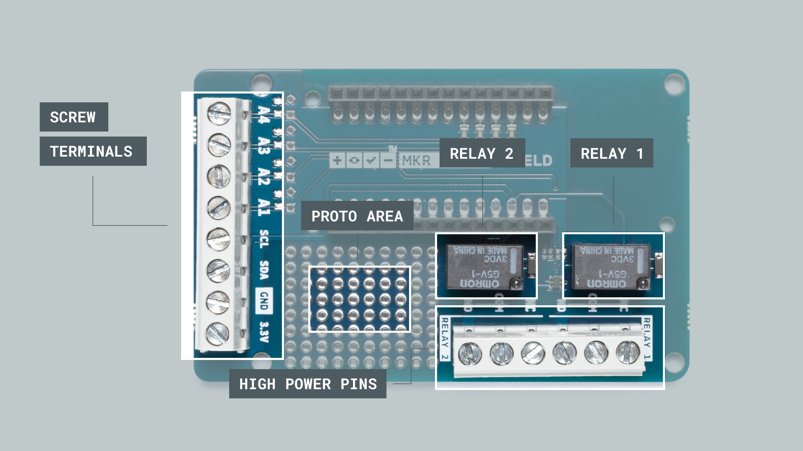

## Introduction 

In this tutorial, we will test out the relays onboard the [MKR Relay Shield](https://store.arduino.cc/arduino-mkr-relay-proto-shield). This shield is a great addon for any MKR Family board, as it has two 24V relays and additional space for soldering on components, hence the name "proto", as in prototype. 

The sketch for this tutorial is really simple. It will activate one of the relays with a corresponding LED while de-activating the other, and then continue to do so every second, much like the standard blink example but with relays! 

>**Note:** The LEDs in this tutorial are optional. They do not serve any other function than signalling the state of each relay on the shield.

## Goals

The goals of this project are:

- Understand how relays work, and what they can be used for.
- Activating both relays on the shield.
- Turn ON or OFF an LED to indicate the state of a relay (optional).

## Hardware & Software Needed

- Arduino IDE ([online](https://create.arduino.cc/) or [offline](https://www.arduino.cc/en/main/software)).
- MKR Relay Shield ([link to store](https://store.arduino.cc/arduino-mkr-relay-proto-shield)).
- Arduino MKR family board ([link to store](https://store.arduino.cc/arduino-genuino/arduino-genuino-mkr-family)).
- 2x generic LEDs (optional).
- Jumper wires (optional).
- Breadboard (optional).

## Relays

Relays allow low-power microcontrollers, to handle circuits that use much higher power than what the board can handle directly. They are typically used in industrial applications to control high power circuits, but they are also used in cars, homes and other electronic applications.

Relays are composed by an electromagnet that moves a tiny metallic plank, which is called **COM** terminal, between two different positions. That is, the **NC** terminal and **NO** terminal. We can decide in which position the COM terminal is connected to through activating/deactivating the electromagnet and by connecting a low power signal in the electromagnet control terminals.

<video width="100%" loop autoplay>
<source src="assets/relays.mp4" type="video/mp4" />
</video>

Writing a program to control the relays is simple: it works very similar to turning an LED ON or OFF. Take a look at the snippet below to understand how it is used:

```
digitalWrite(relay, HIGH);

digitalWrite(relay, LOW);
```

And that's basically how we control the relays. Depending on the configuration, the logic will be inverted. For example, if we are using an NC (normally closed) configuration, we need to write a **LOW** signal to activate the relay. If we are using an NO (normally open) configuration, we need to write a **HIGH** signal to activate the relay.

### The MKR Relay Shield


Inside the MKR Relay Shield, the low power circuit is already made. The only thing we need to connect is a power supply (max 24V), and a high power component (max 24V). These are connected to the **high power pins**. In the image below, you can get a better understanding on the different features of the MKR Relay Shield:



### Circuit

Let's begin by mounting our MKR family board on top of the MKR Relay Shield.


**Optional:** We can then assemble the circuit for the LEDs, using a breadboard, resistors and jumper wires.


## Programming the Board

We will now get to the programming part of this tutorial. 

**1.** First, let's make sure we have the drivers installed for the board we are using. If we are using the Web Editor, we do not need to install anything. If we are using an offline editor, we need to install it manually. This can be done by navigating to **Tools > Board > Board Manager...**. Here we need to look for the **Arduino SAMD boards (32-bits Arm® Cortex®-M0+)** and install it. 

**2.** Now, let's take a look at how we will activate our relays. We are actually not using a library, as the operation is very basic.

- `int relay_1 = 1;` - assigns `relay_1` to pin 1. It is important that we assign it to pin 1, as the relay is internally wired to this pin.
- `int relay_2 = 2;` - assigns `relay_2` to pin 2. Same here, the relay is wired to pin 2, so we can't use a pin of our choosing. 
- `pinMode(relay_1, OUTPUT)` - configures relay 1 to be an `OUTPUT`.
- `pinMode(relay_2, OUTPUT)` - configures relay 2 to be an `OUTPUT`.
- `digitalWrite(relay_1, state)` - write either a high or low state to relay 1.
- `digitalWrite(relay_1, state)` - write either a high or low state to relay 2.

The full code for the sketch can be found in the snippet below. Upload the sketch to the board.

```cpp
int relay_1 = 1;
int relay_2 = 2;

int LED_1 = 3;
int LED_2 = 4;

void setup() {

pinMode(relay_1, OUTPUT);
pinMode(relay_2, OUTPUT);
pinMode(LED_1, OUTPUT);
pinMode(LED_2, OUTPUT);

}

void loop() {

digitalWrite(relay_1, HIGH);
digitalWrite(LED_1, HIGH);
digitalWrite(relay_2, LOW);
digitalWrite(LED_2, LOW);

delay(1000);

digitalWrite(relay_1, LOW);
digitalWrite(LED_1, LOW);
digitalWrite(relay_2, HIGH);
digitalWrite(LED_2, HIGH);

delay(1000);

}
```

## Testing It Out

After we have uploaded the code, the program will start running immediately. If everything is working correctly, we will hear a "tick-tack" noise, and see the two LED's go ON and OFF. This is the noise coming from the relays switching ON and OFF. We have now achieved a simple ON / OFF sequence every one second.

Now in this example, we have simply activated the relays, but we still haven't connected anything to them. While we are not going to go in-depth on how to connect high power components, we can take a look at how a circuit looks like for turning ON or OFF a 24V lamp.

Let's begin with the high power pins on the MKR Relay Shield. There are **six in total** for both relays, where there are three different type of connections: NO, COM and NC. 


In this scenario, we are going to use the **NC** configuration, which means that writing a **LOW** signal to the relay will connect the NC pin to COM, which provides power to the connected component. The circuit could look something like this:


In this circuit, we are using a 24V power supply and a 24V light bulb. Now, if we were to write a program for this we would activate through using:

```
digitalWrite(relay_1, LOW)
```

and to de-activate it:

```
digitalWrite(relay_1, HIGH)
```

>**Note:** Use extreme caution when creating higher power circuits. Make sure that both the power supply and the component does not exceed 24V. For example, connecting it straight to a wall socket without a power converter would supply 220-240V, which is **10 times as high.**

### Troubleshoot

If the code is not working, there are some common issues we can troubleshoot:

- We have not connected the LEDs properly (this is an optional requirement).
- If the code fails to compile, make sure there's no missing curly brackets `{}` or semicolons `;` anywhere in the code.
- We have not connected the MKR board correctly on top of the MKR Relay Shield (the pins should match each other).

## Conclusion

In this tutorial, we have gone through the basics of how a relay works, including how the internal mechanism works and  how to create a circuit with high power components. Lastly, we learned how to create a program that activates or de-activates them.

Relays are incredible popular electronic components that are practically used everywhere: cars, planes, heating systems, industrial machines and many many more. 


