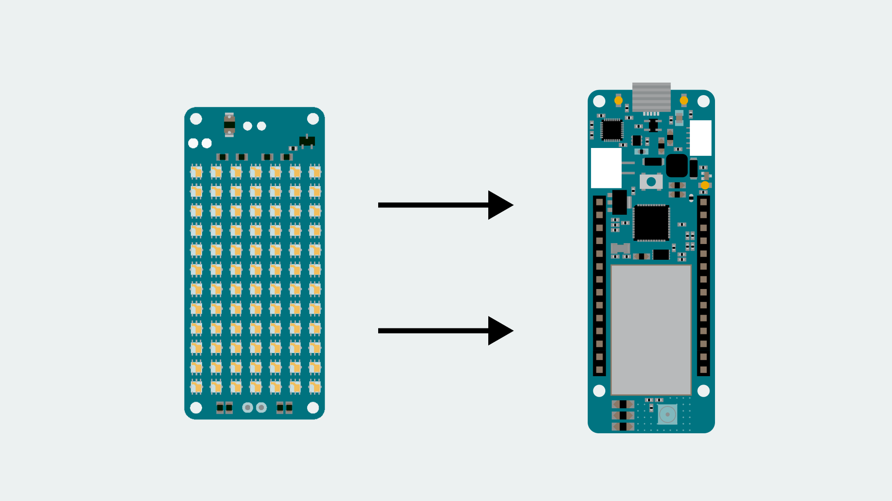
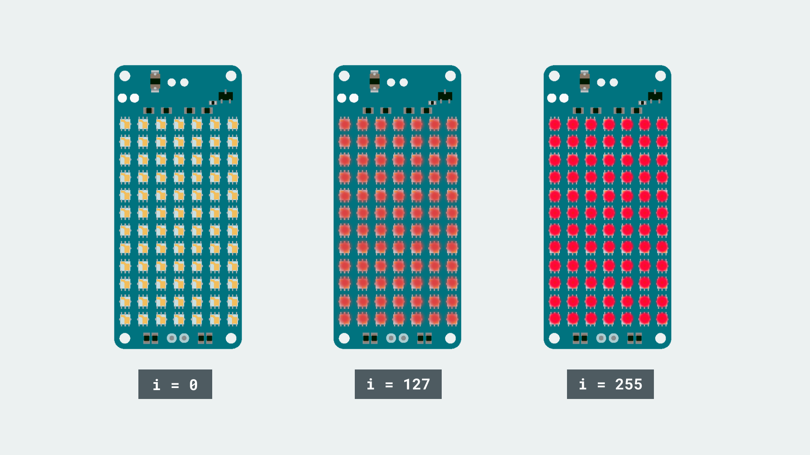

## Introduction

In this tutorial, we are going to fade all of the pixels on the MKR RGB Shield, in and out. This method can also be used for smooth transitions between colors, which gives a better visual effect!

For this, we will create 2x `for` loops, one to fade in and one to fade out.

## Goals

The goal of this project are:

- Fade the matrix on the MKR RGB Shield in and out, using a `for` loop.

## Hardware & Software Needed

- Arduino IDE ([online](https://create.arduino.cc/) or [offline](https://www.arduino.cc/en/main/software)).
- [Arduino_MKRRGB](https://www.arduino.cc/en/Reference/ArduinoMKRRGB) library installed.
- [ArduinoGraphics](https://www.arduino.cc/en/Reference/ArduinoGraphics) library installed.
- MKR RGB Shield ([link to store](https://store.arduino.cc/arduino-mkr-rgb-shield)).
- Arduino MKR family board ([link to store](https://store.arduino.cc/arduino-genuino/arduino-genuino-mkr-family)).

## For Loops

`For` loops are a great method to use when we want something to run for an X amount of times. It is widely used for fading lamps, gradually increase or decrease the speed of motors, or for any other counting mechanisms. Its operation is pretty basic and in this case, only uses one variable, so let's take a look at how it works in action!

```cpp
for (int i = 0; i <= 255; i++){
    // do something 255 times
    delay(10); //quick pause between the loops
}
```

As seen in the snippet above, the variable `i` is the only variable altered. It is first initialized, and set to `0`. We then set the value to always be smaller or equal (`<=`) to 255. Finally, we use an increment, `i++`, to increase it.

This means, that as long as the number is smaller or equal to 255, it will continue to increase. Now, we can add code within the curly brackets, and feed the `i` variable into it. As the variable increases, we can for example use it to light up an LED gradually, or speed up a motor.

```cpp
for (int i = 0; i <= 255; i++){
    analogWrite(i, LED);
    delay(10);
}
```

Now, as we set the delay to 10 milliseconds, it will take  2550~ milliseconds (2.5~ seconds) to gradually light up the LED.

### Circuit

The circuit in this tutorial is very easy. Simply mount the MKR RGB Shield on top of an Arduino MKR board.



## Programming the Board

We will now get to the programming part of this tutorial.

**1.** First, let's make sure we have the drivers installed for the board we are using. If we are using the Web Editor, we do not need to install anything. If we are using an offline editor, we need to install it manually. This can be done by navigating to **Tools > Board > Board Manager...**. Here we need to look for the **Arduino SAMD boards (32-bits Arm® Cortex®-M0+)** and install it.

**2.** Now, we need to install the libraries needed. If we are using the Web Editor, there is no need to install anything. If we are using an offline editor, simply go to **Tools > Manage libraries..**, and search for **Arduino_MKRRGB** and **ArduinoGraphics** and install them.

**3.** Here are some of the core functions of this sketch:

- `MATRIX` - this class is used for all **Arduino_MKRRGB** functions.
- `MATRIX.begin()` - initializes the library
- `MATRIX.beginDraw()` - begins a drawing session.
- `MATRIX.endDraw()` - ends a drawing session.
- `MATRIX.fill(r,g,b)` - sets the color of the fill.
- `MATRIX.rect(startX, startY, width, height)` creates a rectangle.
- `MATRIX.height()` - sets the maximum height of the matrix.
- `MATRIX.width()` - sets the maximum width of the matrix.

The sketch can be found in the snippet below. Upload the sketch to the board.

```cpp
#include <ArduinoGraphics.h>
#include <Arduino_MKRRGB.h>

void setup() {
  // initialize the display
  MATRIX.begin();
  // set the brightness, supported values are 0 - 255
  MATRIX.brightness(10);
}

void loop() {

  for (int i = 0; i <= 255; i++) {
    MATRIX.beginDraw();
    MATRIX.fill(i, 0, 0);
    MATRIX.rect(0, 0, MATRIX.width(), MATRIX.height());
    MATRIX.endDraw();
    delay(10);
  }

  for (int i = 255; i >= 0; i--) {
    MATRIX.beginDraw();
    MATRIX.fill(i, 0, 0);
    MATRIX.rect(0, 0, MATRIX.width(), MATRIX.height());
    MATRIX.endDraw();
    delay(10);
  }

}
```

## Testing It Out

If everything is successful, after uploading the code, the MKR RGB Shield should now slowly fade in a red color. When the color is at its brightest (255), the program exits the `for` loop, and enters another one, which is designed to decrease the value of `i`, by using `i--` instead of `i++`.



When the second `for` loop comes to an end (when it reaches 0), it goes back to the initial `for` loop, and increases it again. As a result, the program will be fading in and out running, as long as its running.

### Troubleshoot

If the code is not working, there are some common issues we can troubleshoot:

- You have not mounted the MKR RGB Shield on top of an Arduino MKR board.
- You have not installed the **Arduino_MKRRGB** and **ArduinoGraphics** library.

## Conclusion

In this tutorial, we have used a popular fading method together with the MKR RGB Shield and the help of `for` loops. There are several other cool ways of using the `for` loop in this scenario, such as fading from one color to the other.

Feel free to explore the [Arduino_MKRRGB](https://www.arduino.cc/en/Reference/ArduinoMKRRGB) and [ArduinoGraphics](https://www.arduino.cc/en/Reference/ArduinoGraphics) libraries further, and try out some of the many cool functions.
