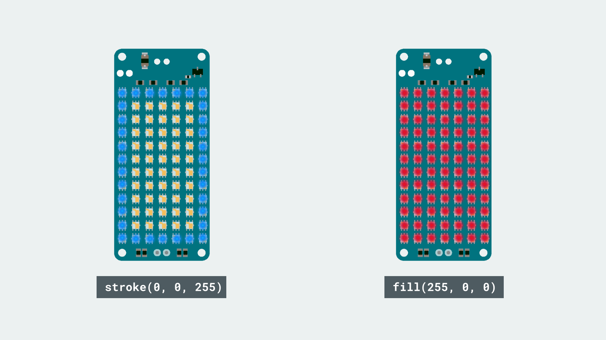

## Introduction 

In this tutorial, we will test out some pretty basic features, using the MKR RGB Shield, the [Arduino_MKRRGB](https://www.arduino.cc/en/Reference/ArduinoMKRRGB) and [ArduinoGraphics](https://www.arduino.cc/en/Reference/ArduinoGraphics) library. 

The features we will focus on are `fill()`, `stroke()` and `rect()`, which are used to create and fill the matrix, or create an outline on the matrix. This tutorial is a great starting point if you have not used the MKR RGB Shield before. 

>**Note:** The MKR RGB shield is designed to be used with the MKR family board. This includes the MKR Zero, MKR WiFi 1010, MKR FOX 1200, MKR WAN 1300/1310, MKR GSM 1400, MKR NB 1500 and MKR Vidor 4000. 

## Goals

The goals of this project are:

- Install the required software for the MKR RGB Shield.
- Learn how to use the **Arduino_MKRRGB** and **ArduinoGraphics** library.
- Create and color a stroke outline.
- Create and color a filled rectangle.

## Hardware & Software Needed

- Arduino IDE ([online](https://create.arduino.cc/) or [offline](https://www.arduino.cc/en/main/software)).
- [Arduino_MKRRGB](https://www.arduino.cc/en/Reference/ArduinoMKRRGB) library installed.
- [ArduinoGraphics](https://www.arduino.cc/en/Reference/ArduinoGraphics) library installed.
- MKR RGB Shield ([link to store](https://store.arduino.cc/arduino-mkr-rgb-shield)).
- Arduino MKR family board ([link to store](https://store.arduino.cc/arduino-genuino/arduino-genuino-mkr-family)).

## Get to Know the Libraries

There are several fun and clever ways of making the most out of your MKR RGB Shield. In this tutorial, we will take a look on how to use the `fill()`, `stroke()` and `rect()` functions. But first, let's begin by looking at some vital functions that are needed for the sketch to function.

### Including the Libraries

Every time we want to use the MKR RGB Shield, we will need to include the **Arduino_MKRRGB** and **ArduinoGraphics** libraries. This is simply done by including them at the top of a sketch, as such:

```cpp
#include <ArduinoGraphics.h>
#include <Arduino_MKRRGB.h>
```

### Initialization

Initializing the library is done by using the command `MATRIX.begin()`. After that, we need to set the brightness of the matrix. In this case, we will use `10` (max is 255).

```cpp
  MATRIX.begin();
  MATRIX.brightness(10);
```

### Begin and End Draw

Every time we want to draw something new on the MKR RGB Shield, we use the functions `beginDraw()` and `endDraw()`. Any changes we want to make to the matrix is used between these, where `endDraw()` updates the matrix.

```cpp
  MATRIX.beginDraw();
  //paint a pretty picture
  MATRIX.endDraw();
```

### Fill and Rectangle

The `fill()` and `rect()` functions are undoubtedly some of the most useful functions in the **Arduino_MKRRGB** library. With them we simply choose a color in RGB format, and where we want the rectangle to appear. Where it appears is determined by the data we feed in to the function. Let's take a look at the snippet below:

```cpp
  MATRIX.fill(r, g, b); //color
  MATRIX.rect(startX, startY, width, height); //coordinates
```

Looking at the two first parameters, `startX` and `startY`, they simply set the starting position for where the rectangle should start. The other two, `width` and `height` represents how many pixels we should use. Now, let's put some real values inside the functions:

```cpp
  MATRIX.fill(255, 0, 0); //red color
  MATRIX.rect(0, 0, 5, 2); //5x2 rectangle starting at 0,0
```

With the code above, a red rectangle with the dimensions of 5x2 pixels will appear on the matrix.

### Stroke

The `stroke()` function is used to set the color for the stroke of a rectangle. For example, if we want a red square and a blue outline, we can simply set the color of `stroke()` to blue.

```cpp
  MATRIX.fill(255, 0, 0); //red color
  MATRIX.stroke(0, 0, 255);
  MATRIX.rect(1, 1, 5, 2); //5x2 rectangle starting at 0,0
```

We can also use the stroke, without the fill, so we only get the outline of a rectangle. 

### Circuit


## Programming the Board

We will now get to the programming part of this tutorial. 

**1.** First, let's make sure we have the drivers installed for the board we are using. If we are using the Web Editor, we do not need to install anything. If we are using an offline editor, we need to install it manually. This can be done by navigating to **Tools > Board > Board Manager...**. Here we need to look for the **Arduino SAMD boards (32-bits Arm® Cortex®-M0+)** and install it. 

**2.** Now, we need to install the libraries needed. If we are using the Web Editor, there is no need to install anything. If we are using an offline editor, simply go to **Tools > Manage libraries..**, and search for **Arduino_MKRRGB** and **ArduinoGraphics** and install them.

**3.** These are some of the core functions of this sketch:

- `MATRIX` - this class is used for all **Arduino_MKRRGB** functions.
- `MATRIX.begin()` - initializes the library
- `MATRIX.beginDraw()` - begins a drawing session.
- `MATRIX.endDraw()` - ends a drawing session.
- `MATRIX.noStroke()` - no stroke used.
- `MATRIX.noFill()` - no fill used.
- `MATRIX.stroke(r,g,b)` - sets the color of the stroke.
- `MATRIX.fill(r,g,b)` - sets the color of the fill.
- `MATRIX.rect(startX, startY, width, height)` creates a rectangle.
- `MATRIX.height()` - sets the maximum height of the matrix. 
- `MATRIX.width()` - sets the maximum width of the matrix.
- `MATRIX.clear()` - clears the entire matrix.

The full code for sketch can be found in the snippet below. Upload the sketch to the board.

```cpp
#include <ArduinoGraphics.h> // Arduino_MKRRGB depends on ArduinoGraphics
#include <Arduino_MKRRGB.h>

void setup() {
  // initialize the display
  MATRIX.begin();
  // set the brightness, supported values are 0 - 255
  MATRIX.brightness(10);
}

void loop() {

  // outline a blue rectangle
  MATRIX.beginDraw();
  MATRIX.clear();
  MATRIX.noFill();
  MATRIX.stroke(0, 0, 255);
  MATRIX.rect(0, 0, MATRIX.width(), MATRIX.height());
  MATRIX.endDraw();

  delay(1000);

  // fill a green rectangle
  MATRIX.beginDraw();  
  MATRIX.clear();
  MATRIX.noStroke();
  MATRIX.fill(255, 0, 0);
  MATRIX.rect(0, 0, MATRIX.width(), MATRIX.height());
  MATRIX.endDraw();

  delay(1000);
}
```

## Testing It Out

After we have uploaded the code to the board, it will immediately start blinking between a **filled red rectangle** and a **blue stroke only rectangle**. 



In the code, we used the functions `MATRIX.width()` and `MATRIX.height()`, which first gets the dimensions of the matrix, and then sets the rectangle to have the maximum dimensions (which is 12x7 pixels).

### Troubleshoot

If the code is not working, there are some common issues we can troubleshoot:

- You have not mounted the MKR RGB Shield on top of an Arduino MKR board.
- You have not installed the **Arduino_MKRRGB** and **ArduinoGraphics** library. 

## Conclusion

In this tutorial, we have gone through some basic functions that are needed to get started with the MKR RGB Shield. We learned how to create rectangles and change their fill and stroke, as well as how to change their color. 

Feel free to explore the [Arduino_MKRRGB](https://www.arduino.cc/en/Reference/ArduinoMKRRGB) and [ArduinoGraphics](https://www.arduino.cc/en/Reference/ArduinoGraphics) libraries further, and try out some of the many cool functions.


