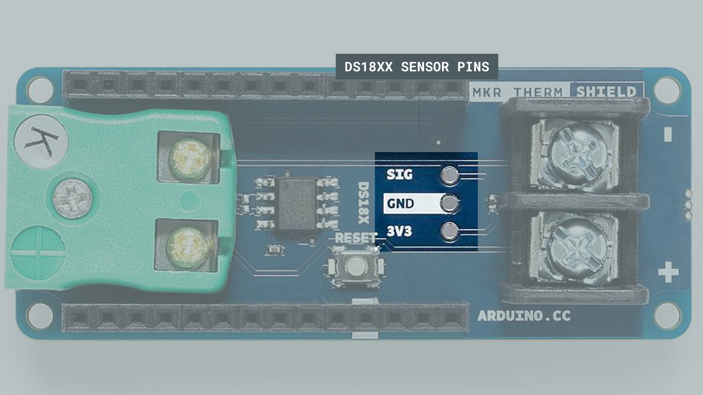
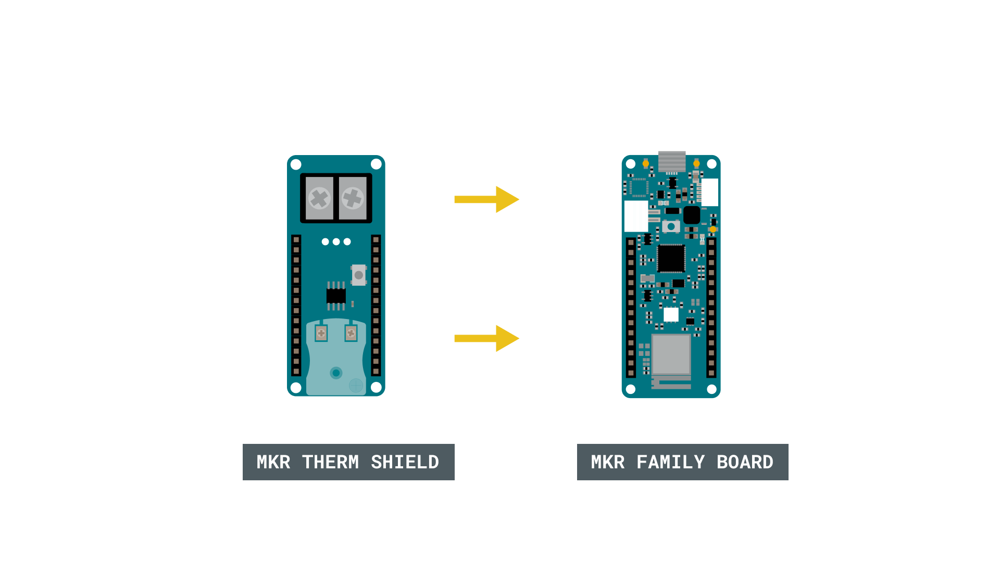
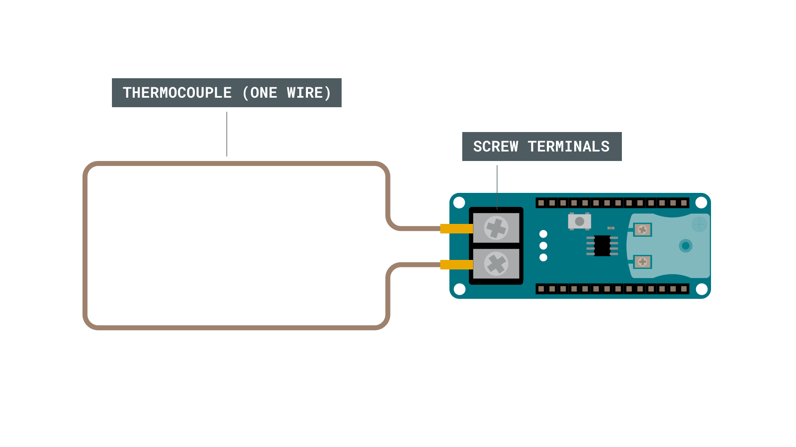
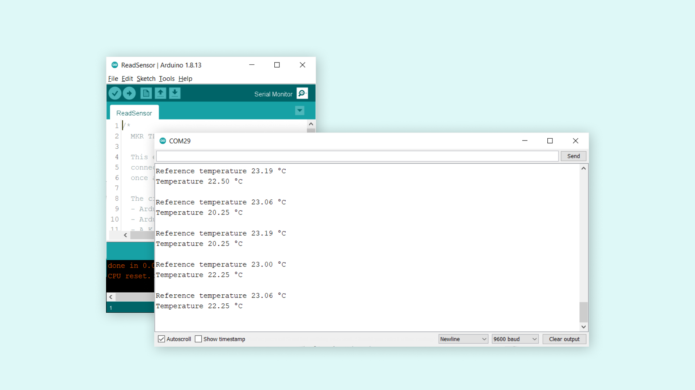

## Introduction 

The MKR Therm shield is a great addon for any MKR family board. Particularly designed to measure extreme temperatures accurately, it features the **MAX31855** chip, and has support for K-type connectors and screw terminals for other connections. 

In this tutorial, we will simply do a test with a **one-wire thermocouple**, in order to measure the temperature through the MKR THERM shield.


>**Note:** While the shield itself is not designed to withstand any extreme temperatures, external sensors can be connected that we can accurately read between -200°C to +700°C. 

## Goals

The goals of this project are:

- Understand how to use the MKR Therm shield.
- Record temperature using a thermocouple.

## Hardware & Software Needed

- Arduino IDE ([online](https://create.arduino.cc/) or [offline](https://www.arduino.cc/en/main/software)).
- [Arduino_MKRTHERM](https://www.arduino.cc/en/Reference/ArduinoMKRTHERM) library installed.
- MKR Therm shield ([link to store](https://store.arduino.cc/arduino-mkr-therm-shield))
- Arduino MKR family board ([link to store](https://store.arduino.cc/arduino-genuino/arduino-genuino-mkr-family))
- One wire thermocouple.

## Thermocouple

Thermocouples are based on the thermoelectric properties of a junction between two different metals and are capable of measuring extreme ranges. A typical application of thermocouples is in boilers, soldering stations and coolers. Also good quality 3D printers rely on thermocouples to measure the extruder temperature.

The K thermocouple has usually two wires, made of Alumel and Chromel that need to be connected with special care: no solder, just mechanical connection, therefore we support on the shield both the standard K type connector and a screw terminal.

This particular sensor has the junction between the two metals that is the part that should be put where the temperature reading has to be made. If the junction for some reason breaks, it can't be repaired. The tip of the thermocouple is where this junction is made, but there is also a second place where one metal is in contact with a different one: the connection with the K type plug or the screw terminal. Also in this junction between the two metals - one of the actual thermocouple alloy and one of the screw - the thermoelectric effect is present and some current is generated. That current is strictly related, as it should be, to the temperature of that junction.

The MAX chip we use on the shield takes all this in account and it returns the measured temperature at the tip (the junction) already compensated. For your reference, you can also read the temperature at the connector, value that is considered a reference.

As an addition, we have the standard connection available for the DS18xx digital temperature: 3V3, GND and SIG with the proper pull-up resistor already in place between 3V3 and SIG. You can solder directly the sensor or use a male female 3 pin pinstrip.



### Circuit

Begin by mounting the MKR THERM Shield on top of a MKR family board. 



Then, we need to connect the thermocoupler to the shield.



## Programming the Board

We will now get to the programming part of this tutorial. 

**1.** First, let's make sure we have the drivers installed for the board we are using. If we are using the Web Editor, we do not need to install anything. If we are using an offline editor, we need to install it manually. This can be done by navigating to **Tools > Board > Board Manager...**. Here we need to look for the **Arduino SAMD boards (32-bits Arm® Cortex®-M0+)** and install it. 

**2.** Now, we need to install the libraries needed. If we are using the Web Editor, there is no need to install anything. If we are using an offline editor, simply go to **Tools > Manage libraries..**, and search for **Arduino_MKRTHERM** and install it.

**3.** We can now take a look at some of the core functions of this sketch:

- `THERM.begin()` - initializes the library.
- `THERM.readReferenceTemperature()` - reads the reference temperature.
- `THERM.readTemperature()` - reads the temperature of the thermocouple connected.

The sketch can be found in the snippet below. Upload the sketch to the board.

```cpp
#include <Arduino_MKRTHERM.h>

void setup() {

  Serial.begin(9600);

  while (!Serial);

  if (!THERM.begin()) {
    Serial.println("Failed to initialize MKR THERM shield!");
    while (1);
  }
}

void loop() {

  Serial.print("Reference temperature ");
  Serial.print(THERM.readReferenceTemperature());
  Serial.println(" °C");

  Serial.print("Temperature ");
  Serial.print(THERM.readTemperature());
  Serial.println(" °C");

  Serial.println();

  delay(1000);
}
```

## Testing It Out

After we have successfully uploaded the code to the board, let's open the Serial Monitor. In here, we should now see the reference temperature being printed, followed by the temperature recorded from the thermocouple.



And that's basically it. While the shield is very easy to use, it can be very accurate in its readings, and can record quite extreme temperatures. 

### Troubleshoot

If the code is not working, there are some common issues we can troubleshoot:

- We have not installed the **Arduino_MKRTHERM** library.
- We have mounted the shield on the board incorrectly.
- We have connected the thermocouple incorrectly.

## Conclusion

In this tutorial, we explored the core feature of the MKR THERM shield, which is **reading temperature.** While there are a lot of cheaper options to use for reading temperature, e.g. in a living room, basement or office, the MKR THERM shield is capable of measuring extreme temperatures. This makes it an excellent choice for industrial uses. 

Feel free to explore the [Arduino_MKRTHERM](https://www.arduino.cc/en/Reference/ArduinoMKRTHERM) library further, and try out some of the many cool functions.

