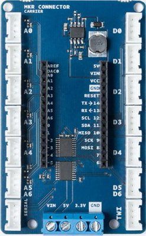
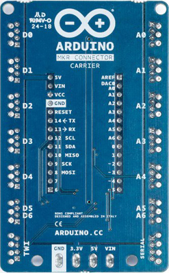

The [MKR Connector Carrier](https://store.arduino.cc/arduino-mkr-connector-carrier) allows any MKR board to use the range of modules and devices that use the [Grove Connector](http://wiki.seeedstudio.com/Grove_System/), developer by Seeed Studio and now a de facto standard for solderless connection of analog and digital modules.

***Please note that a limited number of boards have a wrong labeling on the solder side. Please refer to the current image for the correct labelling. The component side labels are correct on all the boards. Please refer to them for your connections***

## Power Supply

All the I/Os are supplied at 5V and the carrier provides the proper 5V to 3.3V level shifting. The board has a buck converter that can be supplied with an external voltage from 7V to 16V connected to the VIN of the screw terminal block. The buck converter supplies the MKR board that provides the 5V and the 3.3V output that can also be found on the screw terminal blocks.

## Modules and Cables

The Grove modules have a standard four pins connector and usually the cable that comes with them has four standard colors:

- pin 1 - Yellow (for example, SCL on I2C Grove Connectors)

- pin 2 - White (for example, SDA on I2C Grove Connectors)

- pin 3 - Red - VCC on all Grove Connectors

- pin 4 - Black - GND on all Grove Connectors

## A0-A6 Analog Input

An Grove Analog connector consists of the standard four lines coming into the Grove plug. The two signal lines are generically called A0 and A1. Most modules only use A0. Often base units will have the first connector called A0 and the second called A1 and they will be wired A0/A1 and then A1/A2, etc.

| Pin  | Function | Notes                   |
| ---- | -------- | ----------------------- |
| pin1 | An       | Primary analog input    |
| pin2 | An+1     | Secondary analog input  |
| pin3 | VCC      | Power to module 5V/3.3V |
| pin4 | GND      | Ground                  |

Input only (analog or digital) with a maximum allowed voltage of 5V. The 5V to supplied the sensor is provided by the board.

The last connector labeled A5 A6 is a connector that wires two analog inputs into a single connector according to the grove connector specifications. If a single input has to be used the wired one is A5.

## D0-D6 Digital Input Output

A digital Grove connector consists of the standard four lines coming into the Grove plug. The two signal lines are generically called D0 and D1. Most modules only use D0, but some do (like the LED Bar Grove display) use both. Often base units will have the first connector called D0 and the second called D1 and they will be wired D0/D1 and then D1/D2, etc.

| Pin  | Function | Notes                   |
| ---- | -------- | ----------------------- |
| pin1 | Dn       | Primary digital I/O     |
| pin2 | Dn+1     | Secondary digital I/O   |
| pin3 | VCC      | Power to module 5V/3.3V |
| pin4 | GND      | Ground                  |

I/O digital with a maximum allowed voltage of 5V. The 5V to supplied the sensor is provided by the board.

The last connector labeled D5 D6 is a connector that wires two digital I/O into a single connector according to the grove connector specifications. If a single I/O has to be used the wired one is D5.

## Serial

The Serial connector on the board is wired to the MKR board according to the grove connector specifications. The Grove UART module is a specialized version of a Grove Digital Module. It uses both Pin 1 and Pin 2 for the serial input and transmit. The Grove UART plug is labeled from the base unit point of view. In other words, Pin 1 is the RX line (which the base unit uses to receive data, so it is an input) where Pin 2 is the TX line (which the base unit uses to transmit data to the Grove module).

| Pin  | Function | Notes                   |
| ---- | -------- | ----------------------- |
| pin1 | RX       | Serial receive          |
| pin2 | TX       | Serial transmit         |
| pin3 | VCC      | Power to module 5V/3.3V |
| pin4 | GND      | Ground                  |

## TWI - I2C

The TWI connector on the board is wired to the MKR board according to the grove connector specifications. There are many types of I2C Grove sensors available. Most are 5V/3.3V devices, but there are a few that are only 3.3V or 5.0V. You need to check the specifications.

The Grove I2C connector has the standard layout. Pin 1 is the SCL signal and Pin 2 is the SDA signal. Power and Ground are the same as the other connectors. This is another special version of the Grove Digital Connector. In fact, often the I2C bus on a controller (like the ESP8266, Raspberry Pi and the Arduino) just uses Digital I/O pins to implement the I2C bus. The pins on the Raspberry Pi and Arduino are special with hardware support for the I2C bus.

| Pin  | Function | Notes                   |
| ---- | -------- | ----------------------- |
| pin1 | SCL      | I2C Clock               |
| pin2 | SDA      | I2C Data                |
| pin3 | VCC      | Power to module 5V/3.3V |
| pin4 | GND      | Ground                  |

