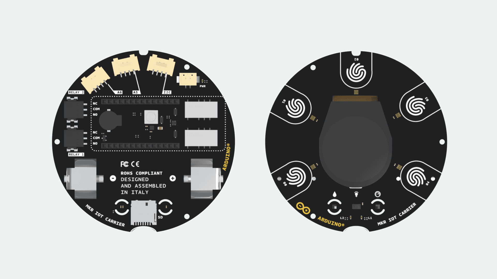

The Arduino® MKR IoT Carrier is equipped with different sensors, actuators and with a display to leave you free to focus on prototyping and programming your next IoT projects. The carrier does not come equipped with a microcontroller, meaning it only works in combination with an Arduino board. The MKR IoT Carrier comes equipped with 5 RGB LEDs, 5 capacitive touch buttons, a colored display, IMU and a variety of quality sensors. It also features a battery holder for a 18650 Li-Ion battery, SD card holder and Grove connectors.

## Compatible Boards

The MKR family of boards share a common pinout, meaning that they can all be easily connected to the MKR IoT Carrier. Here is a list of the MKR boards:

- [MKR 1000 WiFi](https://docs.arduino.cc/hardware/mkr-1000-wifi)
- [MKR FOX 1200](https://docs.arduino.cc/hardware/mkr-fox-1200)
- [MKR GSM 1400](https://docs.arduino.cc/hardware/mkr-gsm-1400)
- [MKR NB 1500](https://docs.arduino.cc/hardware/mkr-nb-1500)
- [MKR Vidor 4000](https://docs.arduino.cc/hardware/mkr-vidor-4000)
- [MKR WAN 1300](https://docs.arduino.cc/hardware/mkr-wan-1300)
- [MKR WAN 1310](https://docs.arduino.cc/hardware/mkr-wan-1310)
- [MKR WiFi 1010](https://docs.arduino.cc/hardware/mkr-wifi-1010)
- [MKR Zero](https://docs.arduino.cc/hardware/mkr-zero)

The MKR family boards offer different features that can be useful for your projects. You can [browse through the boards](https://store.arduino.cc/collections/mkr-family) and pick the one that is most compatible for your project.

### Assembly

The chosen Arduino MKR board needs to be mounted on top of the MKR IoT Carrier and connected to a computer. The board can be connected as shown in the image below, matching the pin numbers on the board to the ones on the carrier.

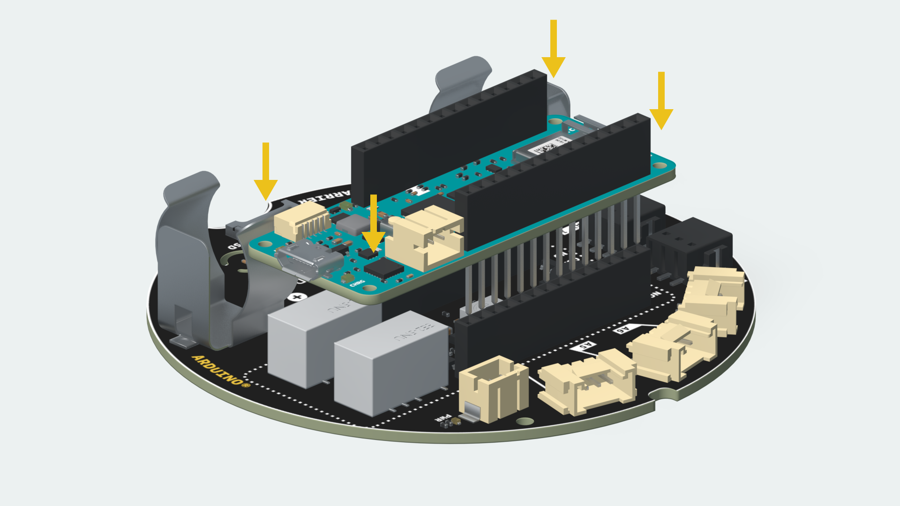

## Datasheet

The full datasheet is available as a downloadable PDF from the link below:

- [Download the Arduino MKR IoT Carrier datasheet](https://content.arduino.cc/assets/MKR%20IoT%20Carrier%20-%20Datasheet.pdf?_gl=1*13zil78*_ga*MTgzMTI1MTI1Mi4xNjE3ODc1MzM2*_ga_NEXN8H46L5*MTYzMDQwMTY0OS4xMzAuMS4xNjMwNDA2MTcwLjA.)

## Arduino Cloud

The MKR IoT Carrier can be controlled through the [Arduino Cloud](https://create.arduino.cc/iot/things), a Cloud service that allows us to create IoT applications in just minutes, if combined with an Arduino Cloud compatible board. Here's a list of the Arduino MKR family boards that are compatible with the Arduino Cloud:

- [MKR 1000 WiFi](https://docs.arduino.cc/hardware/mkr-1000-wifi)
- [MKR GSM 1400](https://docs.arduino.cc/hardware/mkr-gsm-1400)
- [MKR NB 1500](https://docs.arduino.cc/hardware/mkr-nb-1500)
- [MKR WAN 1300](https://docs.arduino.cc/hardware/mkr-wan-1300)
- [MKR WAN 1310](https://docs.arduino.cc/hardware/mkr-wan-1310)
- [MKR WiFi 1010](https://docs.arduino.cc/hardware/mkr-wifi-1010)

***Note: The MKR GSM 1400 and MKR NB 1500 require a SIM card to connect to the Cloud, as they communicate over the mobile networks. The MKR WAN 1300 and 1310 board requires a Arduino PRO Gateway LoRa® to connect to the Cloud.***

If you need help to get started, you can go through the [Arduino Cloud tutorial](https://docs.arduino.cc/cloud/iot-cloud/tutorials/iot-cloud-getting-started).

## Pinout

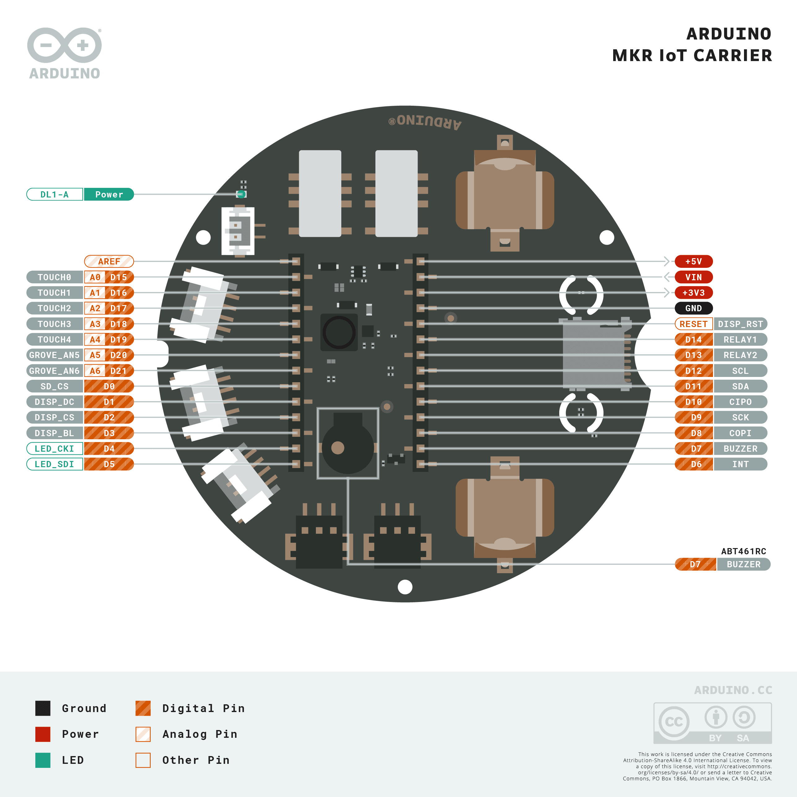

To see the full pinout, you can download the PDF from the link below.

- [The MKR IoT Carrier full pinout (PDF)](https://content.arduino.cc/assets/Pinout-MKRIOTCARRIER_latest.pdf)

## Grove Connectors

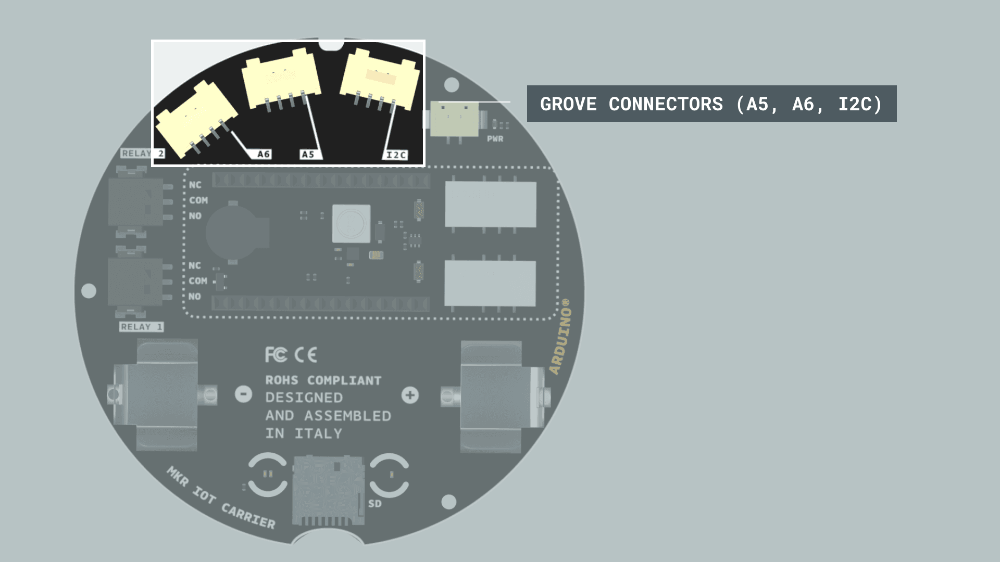

The MKR IoT Carrier comes with **three grove connectors** (2 analog and 1 I2C) that enables us to easily connect external sensors. The type of the connector is labeled clearly on the back of the carrier.

## Carrier Library

To program the MKR IoT Carrier, the **[Arduino_MKRIoTCarrier](https://www.arduino.cc/reference/en/libraries/arduino_mkriotcarrier/)** library needs to be included. This library allows us to control and read all the components of the MKR IoT Carrier. Setting up the MKRIoTCarrier library requires an addition of few code lines in the **initialization** and **setup**. Practically speaking, the code used in the initialization and setup is rarely changed, and it is required in every sketch.

### Initialization

In the initialization (the very top) of every sketch, the **MKRIoTCarrier** library needs to be included, which includes the individual libraries of the components mounted onto the carrier.

Next, an object of type `MKRIoTCarrier` needs to be created. We'll call it `carrier` for simplicity.

```arduino
#include <Arduino_MKRIoTCarrier.h>
MKRIoTCarrier carrier;
```

### Setup

Inside the `setup()` of every sketch that created, 2 lines of code needs to added.

First, we need to tell the library whether the carrier is being used inside the **plastic enclosure** included in the Oplà IoT Kit or not. The library uses this information in order to calibrate the sensitivity of the capacitive buttons.

If you use the plastic enclosure, add this line:

```
carrier.withCase();
```

Otherwise, add this line:

```
carrier.noCase();
```

After that, the `carrier.begin();` command is needed. Final example is:

```arduino
void setup() {
  carrier.noCase();
  carrier.begin();
}
```

## Humidity & Temperature Sensor

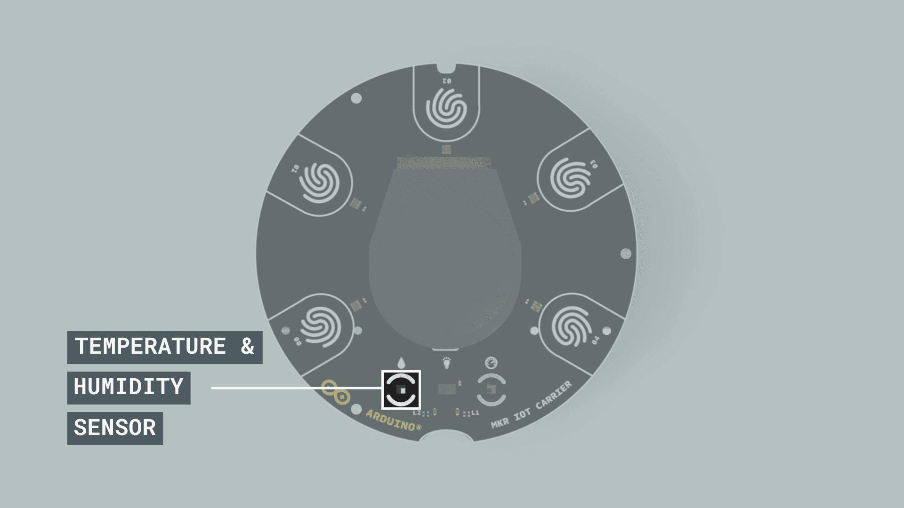

The **HTS221 Humidity Sensor** is mounted on the top side of the carrier under the display, marked with a drop icon. The sensor uses capacitive sensing with a **humidity sensing range** of **0-100%** and **accuracy** of **± 3.5% rH (20 to +80% rH)**, and a **temperature sensing range** of **-40 to 120° C**, with an **accuracy** of **± 0.5 °C,15 to +40 °C**. The sensor uses a low power consumption (2μA at 1 Hz sampling rate) and connects to the mounted Arduino MKR board through a I2C interface.

### Code

The values from the **temperature** and **humidity** sensors can be retrieved and stored in **float** variables as shown below.

```arduino
float temperature = carrier.Env.readTemperature();
float humidity = carrier.Env.readHumidity();
```

Temperature is returned in degrees Celsius, while relative humidity is returned in percentage.

The underlying library used to read the sensor is **[Arduino_HTS221](https://www.arduino.cc/reference/en/libraries/arduino_hts221/)**.

## Pressure Sensor

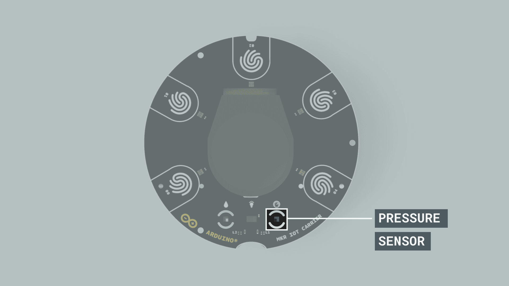

The **LPS22HBTR Pressure Sensor** is mounted on the top side of the carrier under the display, marked with a meter icon. The sensor measures **absolute pressure range** of **260 to 1260 hPa (0.25 to 1.24 atm)** and connects to the mounted Arduino MKR board through a I2C interface.

### Code

The value from the **pressure** sensor, expressed in kiloPascal (kPa) can be retrieved and stored in a **float** variable as shown below.

```arduino
float pressure = carrier.Pressure.readPressure();
```

The underlying library used to read the sensor is **[Arduino_LPS22HB](https://www.arduino.cc/reference/en/libraries/arduino_lps22hb/)**.

## IMU Accelerometer & Gyroscope Sensors

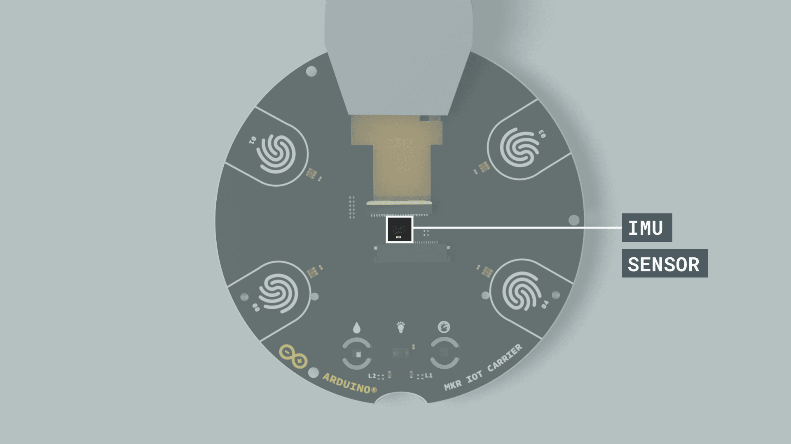

The carrier includes a **LSM6DS3** sensor from STM which is an IMU (Inertial Measurement Unit) featuring a 3D digital accelerometer and a 3D digital gyroscope.

### Code

The 3-axis values from the **accelerometer** and **gyroscope** sensors can be retrieved and stored in **float** variables as shown below:

```arduino
float x, y, z;

void loop(){
  if (carrier.IMUmodule.accelerationAvailable())
    {
      carrier.IMUmodule.readAcceleration(x, y, z);
      Serial.println(x);
    }
}

```

The following methods can be used to detect movement:

```arduino
carrier.IMUmodule.accelerationAvailable();
```

Returns 0 if no new acceleration data sample is available, 1 if new acceleration data sample is available.

```arduino
carrier.IMUmodule.readAcceleration(x, y, z);
```

Reads acceleration data from the sensor on the three axis and assigns it to the provided variables.

The underlying library used to read the sensor is **[Arduino_LSM6DS3](https://www.arduino.cc/reference/en/libraries/arduino_lsm6ds3/)**.

## RGB and Gesture Sensor

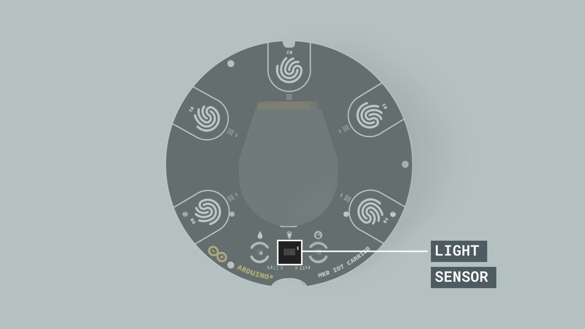

The MKR IoT Carrier contains a Broadcom **APDS-9960 RGB and Gesture sensors**, situated under the display and marked with a bulb icon. The sensor is useful for **ambient light** and **RGB** color sensing, **proximity** sensing, and **gesture** detection.

### Code

The color values from the **RGB** sensor can be retrieved and stored in **int** variables as shown below.

The `carrier.Light.readColor(r, g, b);` method can be used to detect colors.

The if statement `if (r >= 135 && g >= 135 && b >= 135)` in the code below checks if the color detected ranges from light gray to white, but the numbers assigned to red (r), green (g) and blue (b) can be customized to any desired color.

```arduino
  int r, g, b;

  void loop(){

    if (carrier.Light.colorAvailable()){
     carrier.Light.readColor(r, g, b); //read rgb color values

      // check if color/light is bright enough
      if (r >= 135 && g >= 135 && b >= 135){
        Serial.print("White color detected");
      }
    }
  }

```

The following methods can be used to detect gesture:

```arduino
carrier.Light.gestureAvailable();
```

Checks the availability of the **gesture** sensor.

```arduino
carrier.Light.readGesture();
```

Confirms which gesture is being detected, and **returns** UP, DOWN, RIGHT or LEFT.

The code example below shows the gesture value in a fixed width integer `uint8_t` variable, and the if statement checks `if (gesture == UP)`. To detect movements in other directions, UP can be replaced with DOWN, RIGHT or LEFT.

```arduino

  void loop(){

    if (carrier.Light.gestureAvailable())
    {
      uint8_t gesture = carrier.Light.readGesture(); // a variable to store the type of gesture read by the light sensor
      Serial.print("Gesture: ");

      // when gesture is UP
      if (gesture == UP)
      {
        Serial.println("UP");
      }
  }

```

The underlying library used to read the sensor is **[Arduino_APDS9960](https://www.arduino.cc/reference/en/libraries/arduino_apds9960/)**.

## Relays

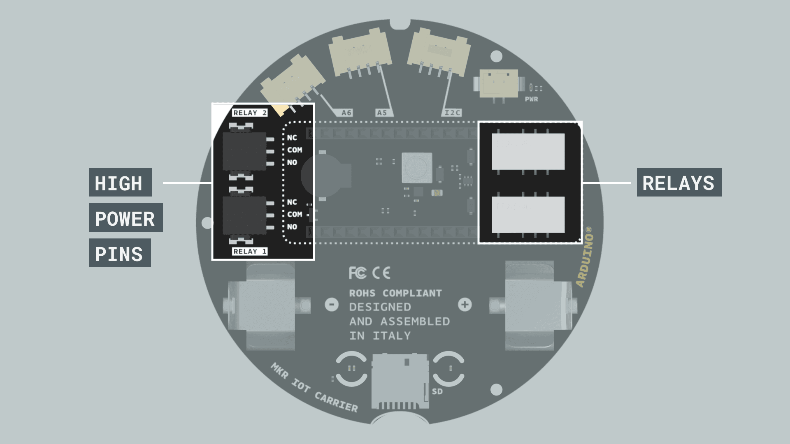

The MKR IoT Carrier is equipped with two 5V Coil voltage **KEMET EE2-5NU-L relays**, located on the back side of the carrier. The relays are non-latching with a **COM** (common), **NO** (Normally open) and **NC** (normally closed) contacts, and can take up a max of **2A** Current and **24 V** of input each.

The connections between a high power circuit and the relays will be done through these connectors.

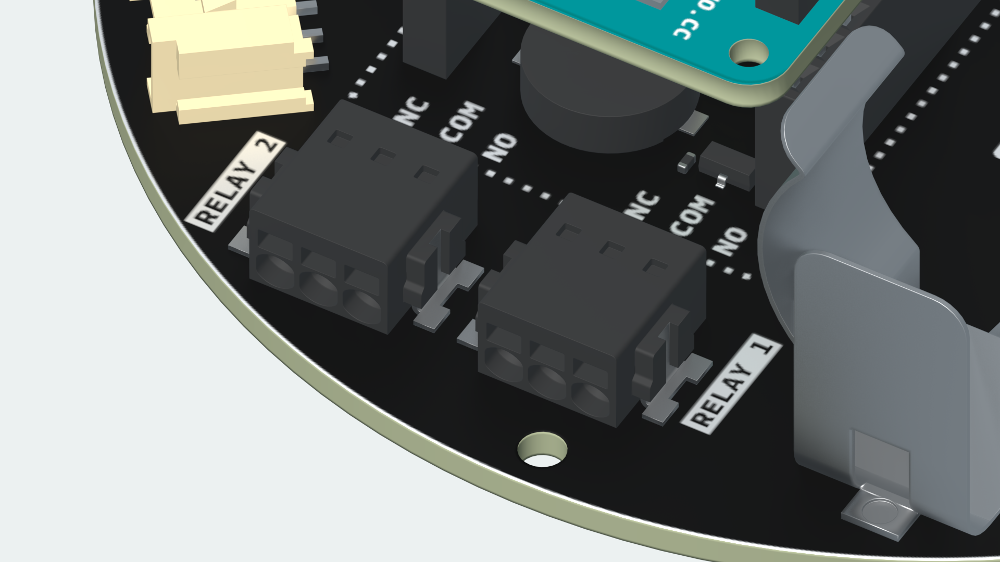

Once the cables are introduced inside the connectors, they will automatically be locked inside. To unlock a cable and remove it from the connector, a tool is needed to be inserted through the top square hole (it can be a flat screwdriver, a hard piece of plastic, etc.).

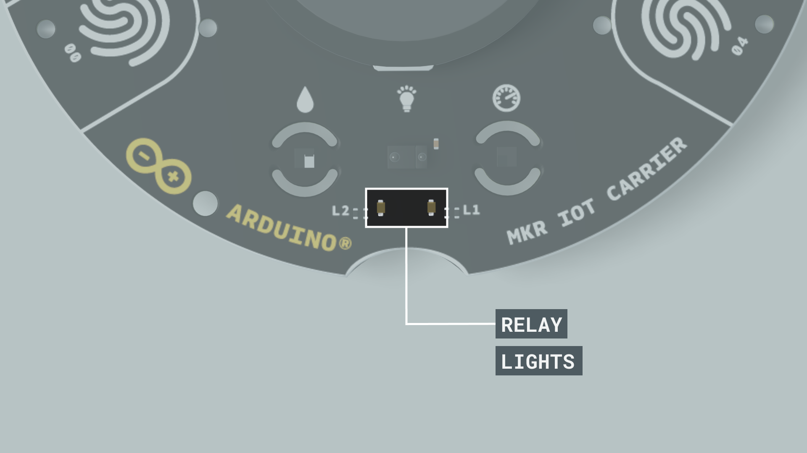

The **L1 and L2 LEDs** on the carrier are visual indicators of the state of the relays. If the LED is ON, it means that the **COM** and the **NO** terminal of the relay are **connected**, and if the LED is OFF it means that **COM** and **NC** are **connected**.

### Code

The `carrier.RelayX.open();` and `carrier.RelayX.close();` methods can be used to control the relays, and `carrier.RelayX.getStatus();` to read the status of the relays.

Swap to the Normally Open (NO) circuit of relay 1 (turns it on):

```arduino
carrier.Relay1.open();
```

Swap to the Normally Closed (NC) circuit of relay 2 (turns it off), default mode on power off:

```arduino
carrier.Relay2.close();
```


Bool, returns the status LOW means NC and HIGH means NO:

```arduino
carrier.Relay2.getStatus();
```

## Peripherals

### Display

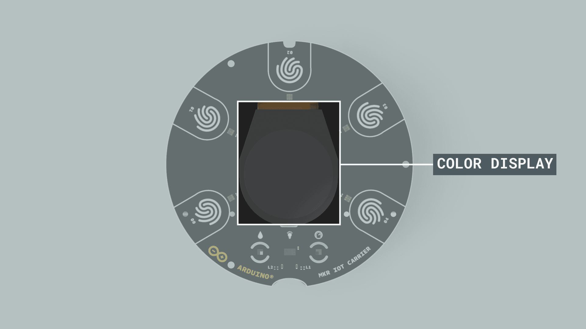

The screen on the MKR IoT Carrier is a **rounded 1.3” TFT display**, with a 240 x 240 resolution and a diameter of 36 x 40 mm.

#### Code

The display is controlled through the `carrier.display` object which is an instance of the **Adafruit_ST7789** class, based on the more general **Adafruit_GFX** interface. Most tutorials mentioning **Adafruit_GFX** should be usable on your MKR IoT Carrier.

To get started, check the [Adafruit_GFX documentation](https://learn.adafruit.com/adafruit-gfx-graphics-library) and see the examples included in the Arduino_MKTIoTCarrier library.


](https://www.arduino.cc/reference/en/libraries/adafruit-st7735-and-st7789-library/), which is included in the carrier's library, meaning that it does not need to be added it separately.

We'll list here some of the most useful methods to configure the MKR IoT Carrier's display, including basic configurations, background and text colors, font size, position of the cursor and a loading animation.

```arduino
carrier.display.fillScreen(color);
```

This method sets the color of the background of the display using hex codes. Example values are:

* `0xFFFF` for white
* `0x0000` for black
* `0xF800` for red
* `0x07E0` for green
* `0x001F` for blue
* `0x07FF` for cyan
* `0xF81F` for magenta
* `0xFFE0` for yellow
* `0xFC00` for orange

```arduino
carrier.display.setRotation(0);
```

This method sets the angle of the screen. 0 is the starting position with no rotation.The screen can only be rotated 90, 180 or 270 degrees by replacing the 0 with 1, 2 or 3.

```arduino
carrier.display.drawBitmap(x, y, bitmap_visual, w, h, color);
```

This method displays a bitmap visual on the carrier's screen. The values x & y values are the top left coordinates where the visual is drawn, w & h are the width and height of the visual. The data for the bitmap_visual graphic can be stored as a byte array and used as the `bitmap_visual`.

```arduino
carrier.display.setTextColor(color);
```

This method sets the color of the text using hex codes.

```arduino
carrier.display.setTextSize(number);
```

This method sets the text size. 2 is an average text size since it is visible, but not too small, 3 is a bit larger.

```arduino
carrier.display.setCursor(x, y);
```

This method is very important, as it indicates where on the printing starts on the display. It is indicated by pixels, so, if **0, 0** are used for example, it will start printing in the top left corner.

```arduino
carrier.display.print("text");
```

This method will print the text inside the string at the current cursor position.

#### More Resources

In order to develop a graphical user interface with the MKR IoT Carrier, the **[Arduino_OplaUI](https://www.arduino.cc/reference/en/libraries/arduino_oplaui/)** library can be used. This library uses the color LEDs, the buzzer and the touch buttons to build an interactive user interface featuring multiple pages. It also includes a few predefined gauges to display values. See the library examples to get started.

### Buttons

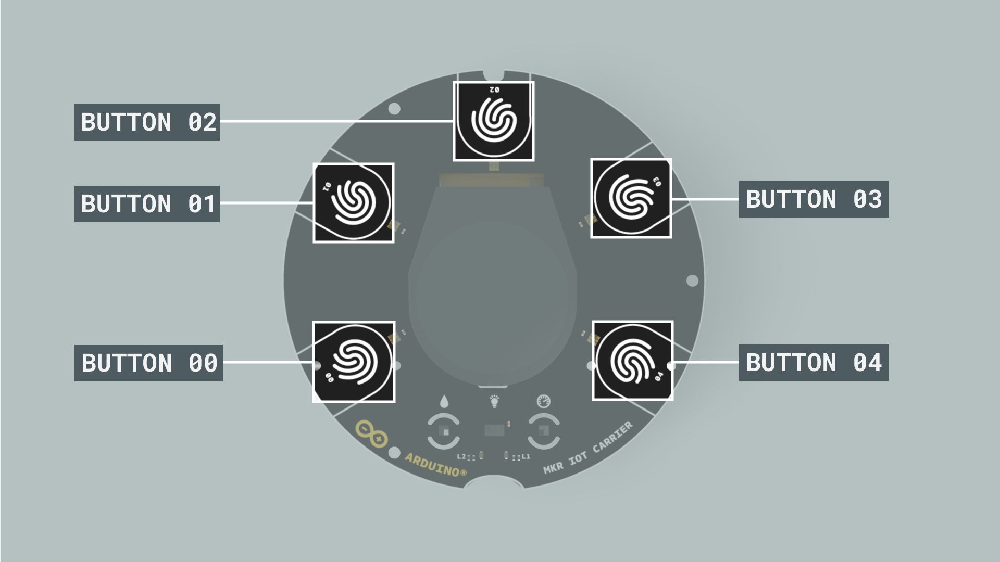

The carrier has five **capacitive touch buttons** on its top side, numbered from 0 to 4. The buttons are sensitive to direct touch and can also detect wireless touch.

#### Code

```arduino
carrier.Buttons.update();
```

Reads the state of the pads and save them to be used in the different types of touch events.

```arduino
carrier.Buttons.getTouch(TOUCH0);
```

Get if the pad is getting touched, true until it gets released.

```arduino
carrier.Buttons.onTouchDown(TOUCH0);
```

Get when have been a touch down.

```arduino
carrier.Buttons.onTouchUp(TOUCH0);
```

Get when the button has been released.

```arduino
carrier.Buttons.onTouchChange(TOUCH0);
```

Get both, touched and released.

Replace `TOUCH0` with `TOUCH1`, `TOUCH2`, `TOUCH3`, `TOUCH4` in the examples above to access the other buttons. The code example below shows how the status of a button can be checked.

```arduino

  void loop(){
    // updates buttons status
    carrier.Buttons.update();

    // Checks if button 00 is touched
    if (carrier.Buttons.onTouchDown(TOUCH0))
    {
      Serial.print("Button 0 pressed down");
    }
  }

```

### LEDs


The MKR IoT Carrier comes with 5 **digital RGB LEDs** placed on the top side of the carrier in front of the buttons.

#### Code

The LEDs are controlled with the Adafruit’s DotStar library, which is included in the `MKRIoTCarrier` library.

The `carrier.leds.show();` method is necessary for updating the new state of the LEDs and needs to be called after any change of the state of the LEDs (turning on & off or change of color).

Here are some of the useful methods used to control the LEDs on the MKR IoT Carrier:

```arduino
carrier.leds.setPixelColor(index, red, green, blue);
```

Sets the color of the index’s LED.

```arduino
carrier.leds.setBrightness(255);
```

Set the overall brightness, from 0 (no brightness) to 255 (maximum brightness).

```arduino
carrier.leds.clear();
```

Clear the buffer of the LEDs.

```arduino
carrier.leds.fill(color, firstLedToCount, count);
```

Fill X amount of the LEDs with the same color.

```arduino
uint32_t myColor = carrier.leds.Color(red, green, blue)
```

Saves a custom color.

The code example below shows how to light up all 5 LEDs with our customized color.

```arduino

#include <Arduino_MKRIoTCarrier.h>
MKRIoTCarrier carrier;

uint32_t myCustomColor = carrier.leds.Color(255,100,50);

void setup() {
   carrier.noCase();
   carrier.begin();
   carrier.leds.fill(myCustomColor, 0, 5);
   carrier.leds.show();
}

```

### Buzzer

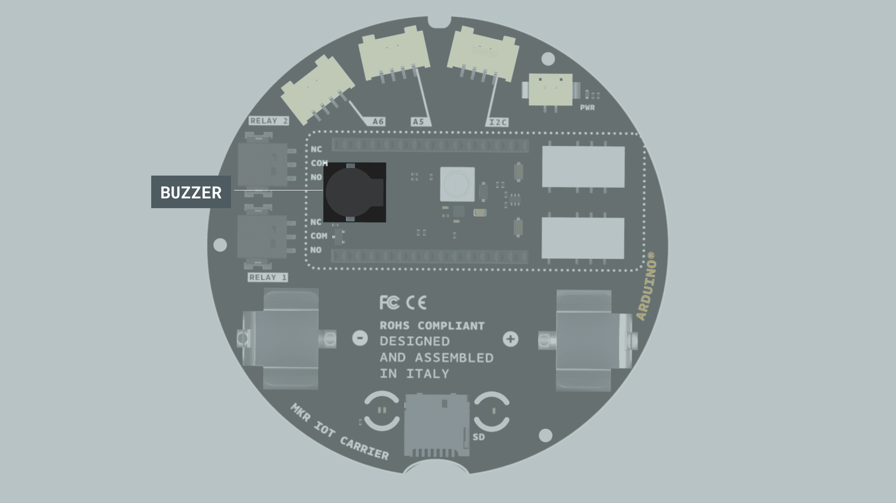

The MKR IoT Carrier is equipped with a **sound buzzer** on the bottom side of the carrier, under the MKR board.

#### Code

The buzzer can be controlled with the following methods:

```arduino
carrier.Buzzer.sound(freq);
```

Equivalent to tone(), it will make the tone with the selected frequency.

```arduino
carrier.Buzzer.noSound();
```

Equivalent to noTone(), it will stop the tone signal.

```arduino
carrier.Buzzer.beep();
carrier.Buzzer.beep(800, 20);
```

This method is a handy shortcut generating a beep. The two arguments are optional and can be set to customize the frequency and the duration (in milliseconds);

## Memory

The MKR IoT Carrier contains a **SD card slot** that accepts a Micro SD.

### Code

The memory can be used with the SD library commands that is already included in the `MKRIoTCarrier` library.

The SD class initialized in the main `carrier.begin()` so you don't need to do it yourself. The code below demonstrates how to save data on a file on a SD card.

```arduino
#include <Arduino_MKRIoTCarrier.h>
MKRIoTCarrier carrier;

File myFile;

void setup() {
   carrier.noCase();
   carrier.begin();  //SD card initialized here

   myFile = SD.open("test.txt", FILE_WRITE);
}
```

In order to learn more, check any of the many tutorials about using the `SD` library on Arduino.

## Power

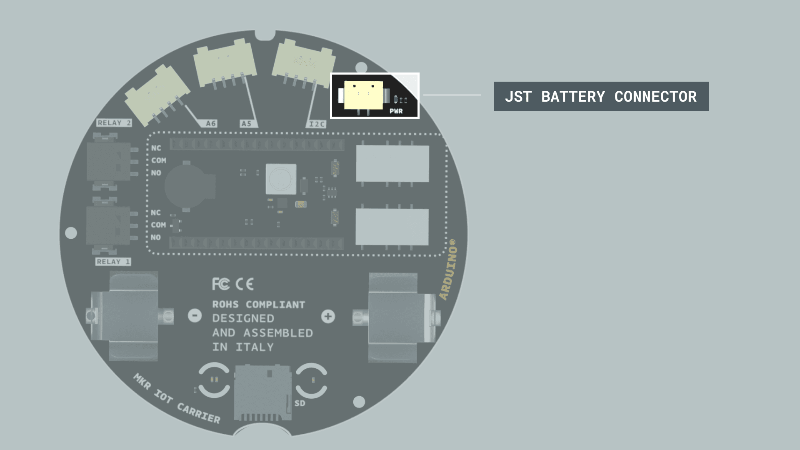

The MKR IoT Carrier can be either powered through a USB cable connected to the mounted MKR board, or through a battery. The battery used should be a LI-ION 18650 3.7v battery, which can be mounted to the carrier via the battery holder on the bottom side. 

In order to use the USB power to charge the battery, a little cable with JST connectors on both ends is needed between the MKR IoT Carrier and the MKR board. The bBattery can then be recharged via a USB connection through the MKR Board (runs up to 48h with a 3.7v 2500mAh).

<video width="100%" controls="true">
<source src="assets/mkrIoTCarrier-battery-assembly.mp4" type="video/mp4"/>
</video>