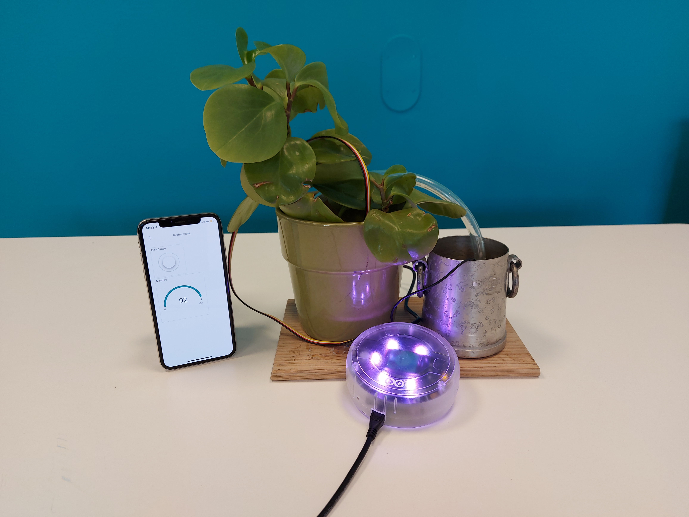

## Components and Supplies

- [MKR IoT Plant kit]() 

OR

- [MKR WiFi 1010](https://store.arduino.cc/products/arduino-mkr-wifi-1010)
- [MKR IoT Carrier](https://store.arduino.cc/products/arduino-mkr-iot-carrier)
- Open ended USB Cable
- 5V Submersible pump
- 1 meter watering hose
- USB adapter with at least 2 USB ports
- Enclosure, similar to the one found in the [Oplà IoT Kit](https://store-usa.arduino.cc/products/arduino-opla-iot-kit)
- Micro-USB cable
- Grove moisture sensor
- 50cm Grove cable

## Apps and Online Services

- [Arduino IoT Cloud](https://docs.arduino.cc/cloud/iot-cloud)

## About This Project

### Introduction

Decorating your home with plants is an easy way to bring some life into your day-to-day. The only problem is - those plants need water to survive, and if you forget to pay attention to them for a while you may need to start over. So instead of staying ever vigilant, why don't you spend an afternoon creating a setup that will let you both monitor the amount of moisture in your plants soil, and water your plants from afar using the Arduino IoT Cloud?



## How It Works

The MKR IoT Carrier has built in relay modules that can let you control circuits that are powered separately. In this tutorial we will be using one of the relay modules on the carrier to control a pump that can provide one of your plants with water from the Arduino IoT Cloud thanks to the functionality of the [Arduino MKR WiFi 1010](). 

We will also connect a soil moisture sensor, and together with the sensors onboard the MKR IoT Carrier, we will create a sophisticated smart garden setup, capable of:

- Automatic or remotely triggered watering of your plant **(with a pump)**.
- Check the moisture of your plant **(with a moisture sensor)**.
- Check the temperature/humidity **(using the onboard HTS221 sensor)**.
- Check the ambient light **(using the onboard APDS-9960 sensor)**.

## Hardware & Circuit Assembly

You will connect your Arduino board to the MKR IoT Carrier, the moisture sensor to one of the Grove inputs on the carrier, and the pump to one of the Relays that is on the carrier. The GND wires on the pump and the open USB ended USB cable should be connected directly, while the positive ends of those components should be going into the relay module. 

Start by placing the Arduino MKR WiFi 1010 on the MKR IoT Carrier. Then connect the soil moisture sensor to the Grove connector labelled "A6". 

The pump is powered separately from the Arduino board, and will be toggled on and off using the relay module that is on the MKR IoT Carrier. You will want to take the positive ends, which are most often red cables, of the submersible pump, and the open ended USB cable, and feed one of them into the relay port that is labelled "COM", and the other into the relay port labelled "NC". The negative ends, which are most often black, need to be connected to each other. 


### Circuit

Below is the complete circuit for this setup.

### Schematic

Below is the complete schematic for this setup.

## IoT Cloud Setup

***If you are new to the Arduino IoT Cloud, please refer to the [Getting Started Guide]() or visit the [full documentation]() to learn more about the service.*** 

Begin by navigating to the [Arduino IoT Cloud](). You will need to have a registered account with Arduino to use it. Follow the steps below to set up the Arduino IoT Cloud. 

**1.** Create a new Thing, and select/configure the MKR WiFi 1010 board. Note that the board needs to be connected to your computer during this setup.

**2.** Create variables according to the table below:

| Name        | Data Type | Function                    | Permission   |
| ----------- | --------- | --------------------------- | ------------ |
| pump        | boolean   | Activate / de-activate pump | Read & Write |
| moisture    | int       | Read moisture               | Read Only    |
| temperature | float     | Read temperature            | Read Only    |
| humidity    | float     | Read humidity               | Read Only    |
| light       | int       | Read ambient light          | Read Only    |

**3.** Select Network. Enter your credentials to your Wi-Fi network.

**4.** Go to the sketch tab, and use the following code:

```arduino

```

## Setup


## Code 

### See Also