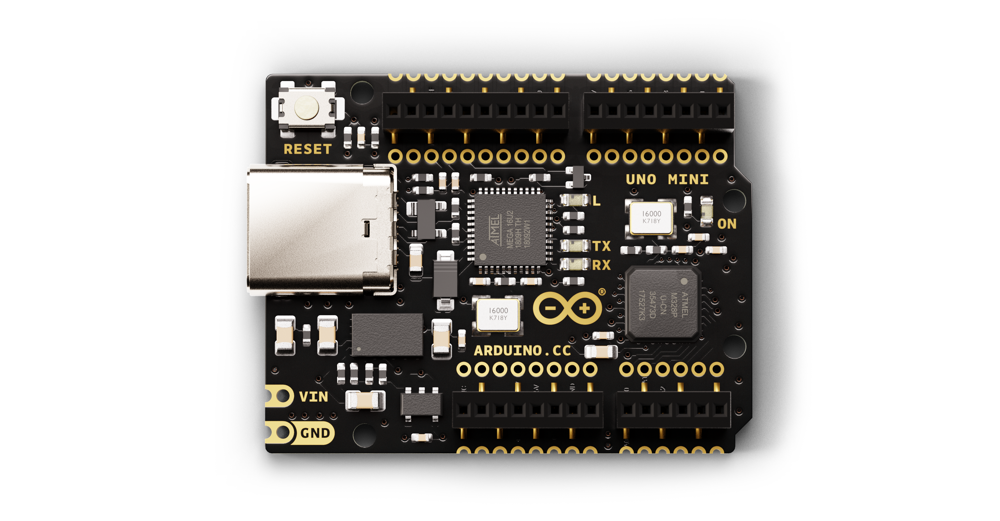
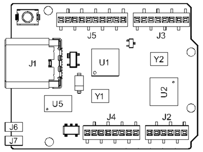
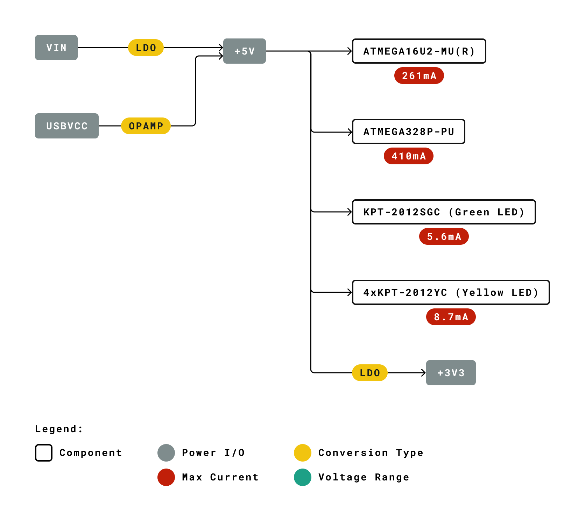
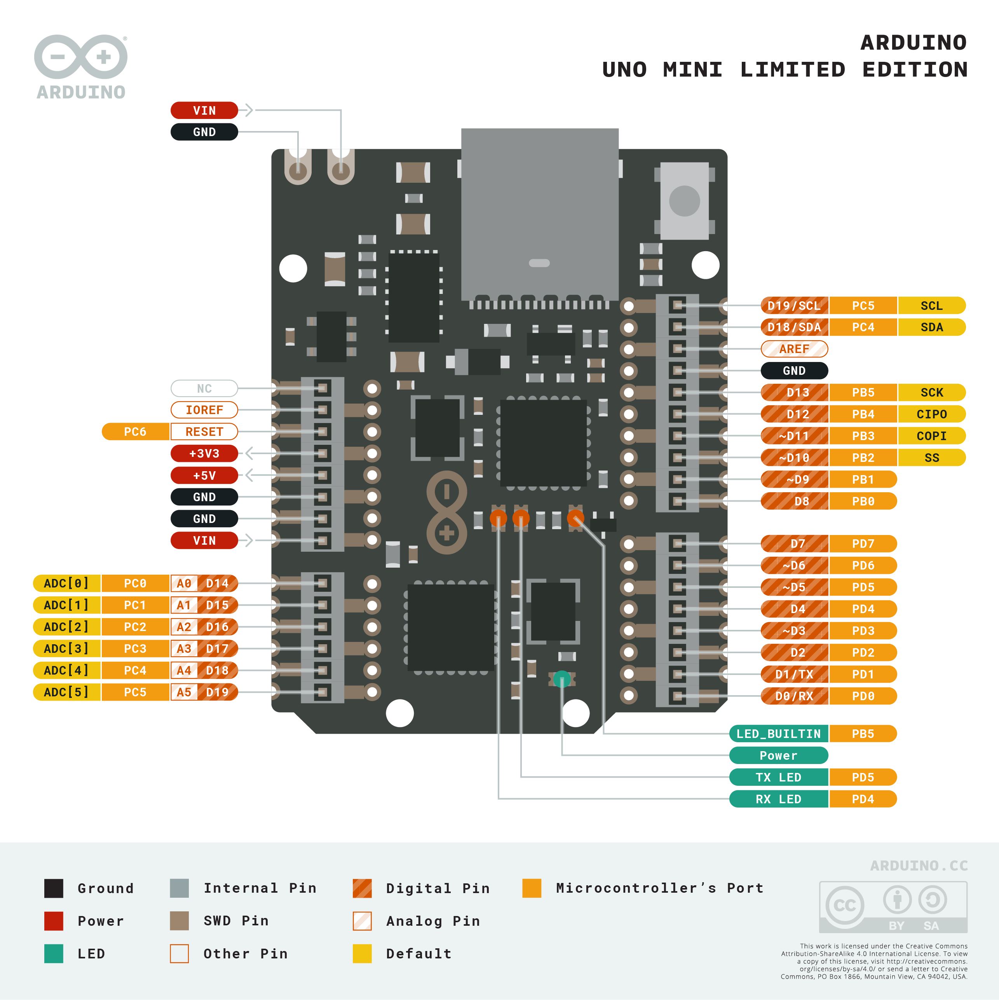
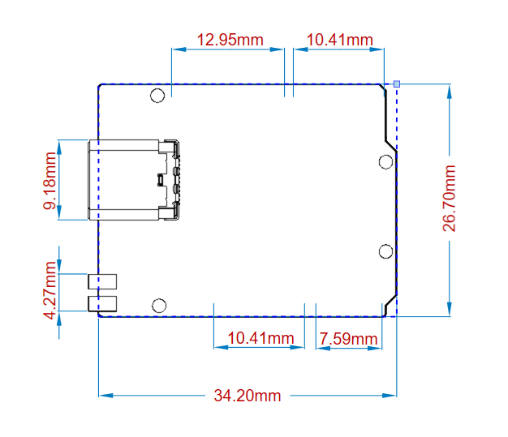

# Description 
We are celebrating the anniversary of our flagship board, Arduino UNO, by producing a just as effective and versatile miniature: The Arduino UNO Mini. This board is, just as its big brother, equipped with the ATMega328P and the ATMega 16U2 Processor, but is updated with USB-C® connector. 

# Target Areas:
Hobby-making, future-shaping, engineering, designing, problem-solving

# Features
<table style="height: 22%;" id="feature-table">
   <tbody>
      <tr>
         <th style="width: 20%;">Component</th>
         <th colspan="2">Details</th>
      </tr>
      <tr>
         <td rowspan="4" style="vertical-align: top;">
<strong>ATMega328P </strong>
</td>
         <td>Processor</td>
         <td>
AVR CPU at up to 16 MHz
</td>
      </tr>
      <tr>
      <td style="vertical-align: top; width: 20%;">
Memory
</td>
         <td>
            
32KB Flash

            
2KB SRAM

            
1KB EEPROM

         </td>
      </tr>
      <tr>
         <td style="vertical-align: top;">
Security
</td>
         <td>
            
Power On Reset (POR)
 
            
Brown out Detection (BOD)

         </td>
      </tr>
      <tr>
      <td style="vertical-align: top;">
Peripherals
</td>
         <td>
            
2x 8-bit Timer/Counter with a dedicated period register and compare channels

            
1x 16-bit Timer/Counter with a dedicated period register, input capture and compare channels

            
1x USART with fractional baud rate generator and start-of-frame detection

            

            
1x controller/peripheral Serial Peripheral Interface (SPI)

            
1x Dual mode controller/peripheral I2C

            
1x Analog Comparator (AC) with a scalable reference input

            
Watchdog Timer with separate on-chip oscillator

            
Six PWM channels

            
Interrupt and wake-up on pin change

         </td>
      </tr>
      <tr>
         <td rowspan="3" style="vertical-align: top;">
<strong>ATMega16U2</strong>
</td>
         <td>
Processor
</td>
         <td>8-bit AVR® RISC-based microcontroller</td>
      </tr>
      <tr>
         <td>
Memory
</td>
         <td>16 KB ISP Flash \ 512B EEPROM 512 SRAM debugWIRE interface for on-chip debugging</td>
      </tr>
      <tr>
         <td>
Power
</td>
         <td>2.7-5.5 volts</td>
      </tr>
   </tbody>
</table>

# CONTENTS
## The Board
### Application Examples
The UNO Mini is a smaller version of the Arduino UNO - to celebrate a successful decade. The UNO Mini Limited Edition is a collector's item for Arduino lovers. 

**A tribute board:** The UNO Mini Limited Edition is a special variant of the Arduino UNO. Despite the small size, it is equipped with both the ATmega328P and the ATMega16U2, as well as the 14 digital input/output pins, 6 analog inputs, USB connection, ICSP header and reset button. This board includes everything you will need for a great first experience with Arduino. 

**Industry-standard development board:** The Arduino UNO Mini board can be used in a range of different companies and industries, as the brain for various PLC’s.

**Education purposes:** This is a perfect board to use for various education purposes and scientific projects. The board's high standard and top quality performance makes it a great resource to capture real time from sensors and to trigger complex laboratory equipment to mention a few examples.  

### Related Products
* Starter Kit
* Tinkerkit Braccio Robot

## Ratings

### Recommended Operating Conditions

| Symbol | Description                                      | Min            | Max            |
| ------ | ------------------------------------------------ | -------------- | -------------- |
|        | Conservative thermal limits for the whole board: | -40 °C (-40°F) | 85 °C ( 185°F) |

**NOTE:** In extreme temperatures, EEPROM, voltage regulator, and the crystal oscillator, might not work as expected due to the extreme temperature conditions 

### Power Consumption

| Symbol  | Description                              | Min  | Typ  | Max  | Unit |
| ------- | ---------------------------------------- | ---- | ---- | ---- | ---- |
| VINMax  | Maximum input voltage from VIN pad       | 6    | -    | 20   | V    |
| VUSBMax | Maximum input voltage from USB connector |      | -    | 5.5  | V    |
| PMax    | Maximum Power Consumption                |55 mAh| -    | 500 mA|      |

 

## Functional Overview

### Board Topology 

| Ref.  | Description                    | Ref.  | Description                           |
| ----- | ------------------------------ | ----- | ------------------------------------- |
| J1    | USB C® Connector               | J7    | Ground                                |
| J2    | 6x Connector pin (female)      | U1    | ATMEGA16U2 Module                     |
| J3    | 8x Connector pin (female)      | U2    | ATMEGA328P Module                     |
| J4    | 8x Connector pin (female)      | U5    | MPM3610AGQV-PIC StpDwn-CONV.21V 1.2A  |
| J5    | 10x Connector pin (female)     | Y1    | Crystal oscillator                    | 
| J6    | Input voltage                  | Y2    | Crystal oscillator                    |

### Processor
The Main Processor is a ATmega328P running at up tp 20 MHz. Most of its pins are connected to the external headers, however some are reserved for internal communication with the USB Bridge coprocessor.

 

### Power Tree

 

## Board Operation

### Getting Started - IDE 
If you want to program your Arduino UNO Mini while offline you need to install the Arduino Desktop IDE [1] To connect the Arduino UNO Mini to your computer, you’ll need a Micro-C USB cable. This also provides power to the board, as indicated by the LED.

### Getting Started - Arduino Web Editor 
All Arduino boards, including this one, work out-of-the-box on the Arduino Web Editor [2], by just installing a simple plugin.

The Arduino Web Editor is hosted online, therefore it will always be up-to-date with the latest features and support for all boards. Follow **[3]** to start coding on the browser and upload your sketches onto your board.

### Getting Started - Arduino Cloud 
All Arduino IoT enabled products are supported on Arduino Cloud which allows you to Log, graph and analyze sensor data, trigger events, and automate your home or business.

### Sample Sketches 
Sample sketches for the Arduino UNO Mini can be found either in the “Examples” menu in the Arduino IDE or in the “Documentation” section of the Arduino Pro website [4]

### Online Resources
Now that you have gone through the basics of what you can do with the board you can explore the endless possibilities it provides by checking exciting projects on ProjectHub **[5]**, the Arduino Library Reference **[6]** and the online store **[7]** where you will be able to complement your board with sensors, actuators and more

 

## Connector Pinouts

 

## Mechanical Information

## Certifications

### Declaration of Conformity CE DoC (EU)

We declare under our sole responsibility that the products above are in conformity with the essential requirements of the following EU Directives and therefore qualify for free movement within markets comprising the European Union (EU) and European Economic Area (EEA). 

| Directives                                              |                                                   |
| ------------------------------------------------------- | ------------------------------------------------- |
| Conforms to:                                            | EN50581:2012                                      |
| **Directive 2014/35/EU. (LVD)**                         |                                                   |
| Conforms to:                                            | EN 60950-1:2006/A11:2009/A1:2010/A12:2011/AC:2011 |
| **Directive 2004/40/EC & 2008/46/EC & 2013/35/EU, EMF** |                                                   |
| Conforms to:                                            | EN 62311:2008                                     |

 

### Declaration of Conformity to EU RoHS & REACH 211 01/19/2021

Arduino boards are in compliance with RoHS 2 Directive 2011/65/EU of the European Parliament and RoHS 3 Directive 2015/863/EU of the Council of 4 June 2015 on the restriction of the use of certain hazardous substances in electrical and electronic equipment. 

| Substance                              |    Maximum limit (ppm)  |
| -------------------------------------- | ----------------------- |
| Lead (Pb)                              | 1000                    |
| Cadmium (Cd)                           | 100                     |
| Mercury (Hg)                           | 1000                    |
| Hexavalent Chromium (Cr6+)             | 1000                    |
| Poly Brominated Biphenyls (PBB)        | 1000                    |
| Poly Brominated Diphenyl ethers (PBDE) | 1000                    |
| Bis(2-Ethylhexyl} phthalate (DEHP)     | 1000                    |
| Benzyl butyl phthalate (BBP)           | 1000                    |
| Dibutyl phthalate (DBP)                | 1000                    |
| Diisobutyl phthalate (DIBP)            | 1000                    |

Exemptions : No exemptions are claimed. 

Arduino Boards are fully compliant with the related requirements of European Union Regulation (EC) 1907 /2006 concerning the Registration, Evaluation, Authorization and Restriction of Chemicals (REACH). We declare none of the SVHCs (https://echa.europa.eu/web/guest/candidate-list-table), the Candidate List of Substances of Very High Concern for authorization currently released by ECHA, is present in all products (and also package) in quantities totaling in a concentration equal or above 0.1%. To the best of our knowledge, we also declare that our products do not contain any of the substances listed on the "Authorization List" (Annex XIV of the REACH regulations) and Substances of Very High Concern (SVHC) in any significant amounts as specified by the Annex XVII of Candidate list published by ECHA (European Chemical Agency) 1907 /2006/EC.

### Conflict Minerals Declaration 

As a global supplier of electronic and electrical components, Arduino is aware of our obligations with regards to laws and regulations regarding Conflict Minerals, specifically the Dodd-Frank Wall Street Reform and Consumer Protection Act, Section 1502. Arduino does not directly source or process conflict minerals such as Tin, Tantalum, Tungsten, or Gold. Conflict minerals are contained in our products in the form of solder, or as a component in metal alloys. As part of our reasonable due diligence Arduino has contacted component suppliers within our supply chain to verify their continued compliance with the regulations. Based on the information received thus far we declare that our products contain Conflict Minerals sourced from conflict-free areas. 

 

## FCC Caution

Any Changes or modifications not expressly approved by the party responsible for compliance could void the user’s authority to operate the equipment.

This device complies with part 15 of the FCC Rules. Operation is subject to the following two conditions: 

(1) This device may not cause harmful interference

 (2) this device must accept any interference received, including interference that may cause undesired operation.

**FCC RF Radiation Exposure Statement:**

1. This Transmitter must not be co-located or operating in conjunction with any other antenna or transmitter.

2. This equipment complies with RF radiation exposure limits set forth for an uncontrolled environment.

3. This equipment should be installed and operated with minimum distance 20cm between the radiator & your body.

English: 
User manuals for licence-exempt radio apparatus shall contain the following or equivalent notice in a conspicuous location in the user manual or alternatively on the device or both. This device complies with Industry Canada licence-exempt RSS standard(s). Operation is subject to the following two conditions:

(1) this device may not cause interference

 (2) this device must accept any interference, including interference that may cause undesired operation of the device.

French: 
Le présent appareil est conforme aux CNR d’Industrie Canada applicables aux appareils radio exempts de licence. L’exploitation est autorisée aux deux conditions suivantes :

(1) l’ appareil nedoit pas produire de brouillage

(2) l’utilisateur de l’appareil doit accepter tout brouillage radioélectrique subi, même si le brouillage est susceptible d’en compromettre le fonctionnement.

**IC SAR Warning:**

English 
This equipment should be installed and operated with minimum distance 20 cm between the radiator and your body.  

French: 
Lors de l’ installation et de l’ exploitation de ce dispositif, la distance entre le radiateur et le corps est d ’au moins 20 cm.

**Important:** The operating temperature of the EUT can’t exceed 85℃ and shouldn’t be lower than -40℃.

Hereby, Arduino S.r.l. declares that this product is in compliance with essential requirements and other relevant provisions of Directive 2014/53/EU. This product is allowed to be used in all EU member states. 

 

## Company Information

| Company name    | Arduino S.r.l                           |
| --------------- | --------------------------------------- |
| Company Address | Via Andrea Appiani 25 20900 MONZA Italy |

## Reference Documentation

| Reference                 | Link                                                         |
| ------------------------- | ------------------------------------------------------------ |
| Arduino IDE (Desktop)     | https://www.arduino.cc/en/Main/Software                      |
| Arduino IDE (Cloud)       | https://create.arduino.cc/editor                             |
| Cloud IDE Getting Started | https://create.arduino.cc/projecthub/Arduino_Genuino/getting-started-with-arduino-web-editor-4b3e4a |
| Arduino Docs              | https://docs.arduino.cc/                                     |
| Project Hub               | https://create.arduino.cc/projecthub                         |
| Library Reference         | https://www.arduino.cc/reference/en/                         |
| Online Store              | https://store.arduino.cc/                                    |

## Revision History

| Date       | Revision | Changes           |
| ---------- | -------- | ----------------- |
| 24/11/2021 | 1        | Datasheet release |
