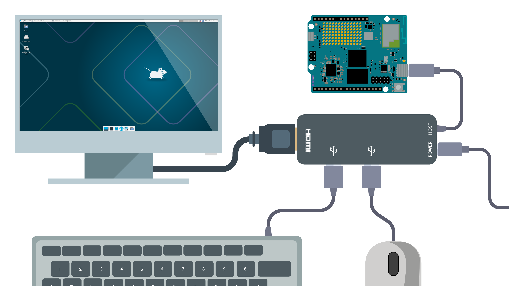
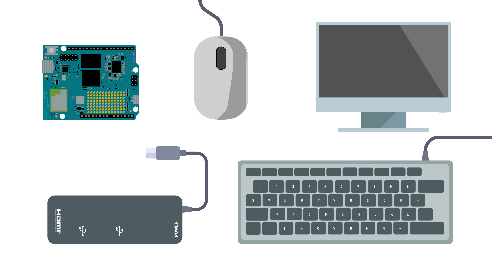
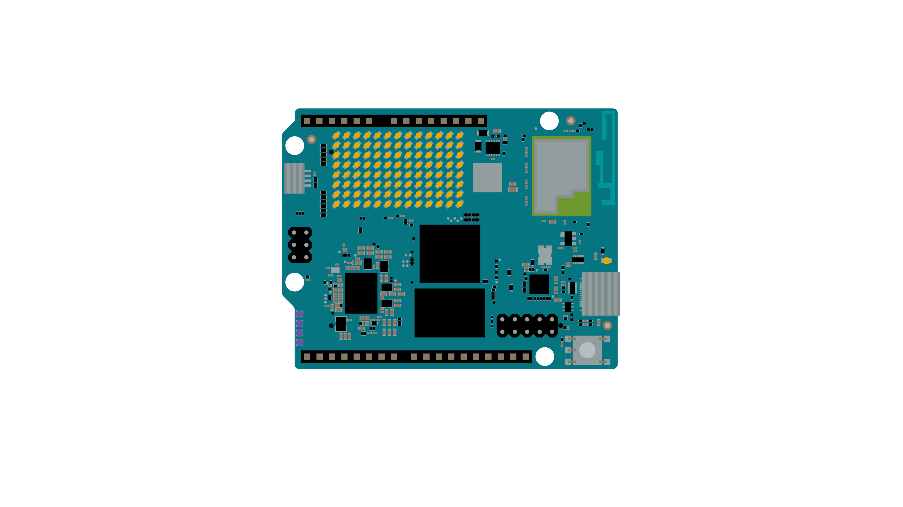
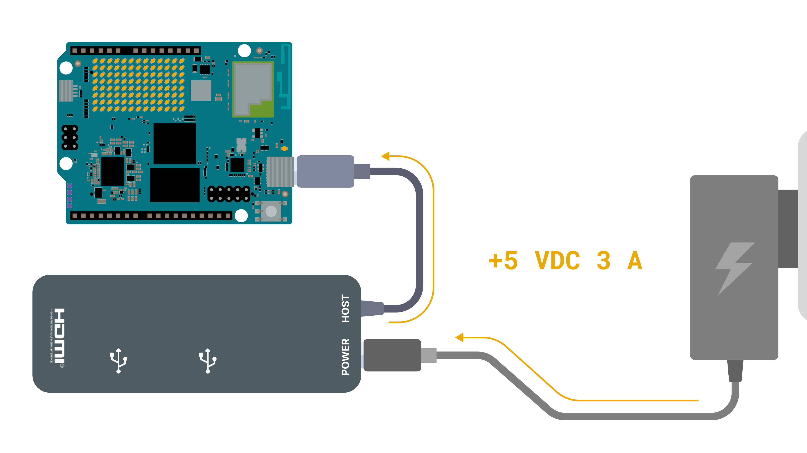
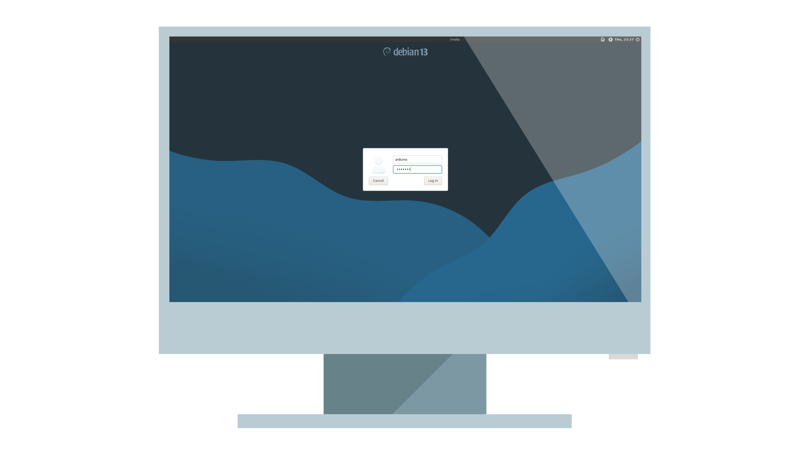
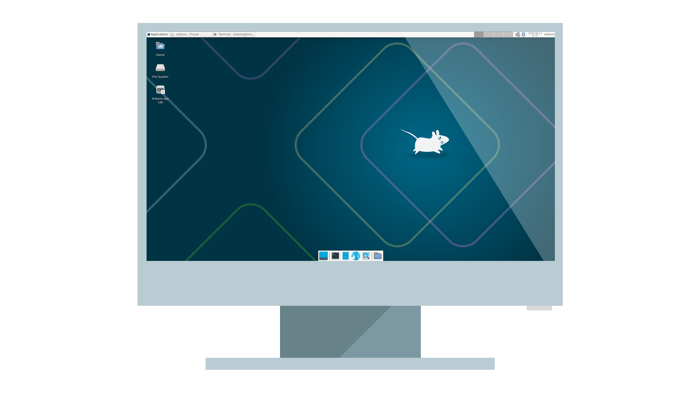
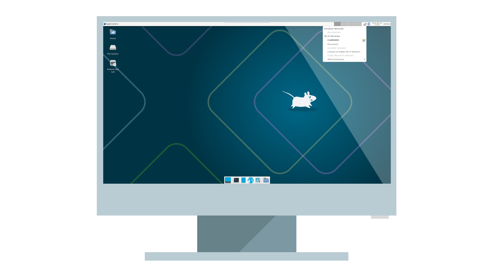
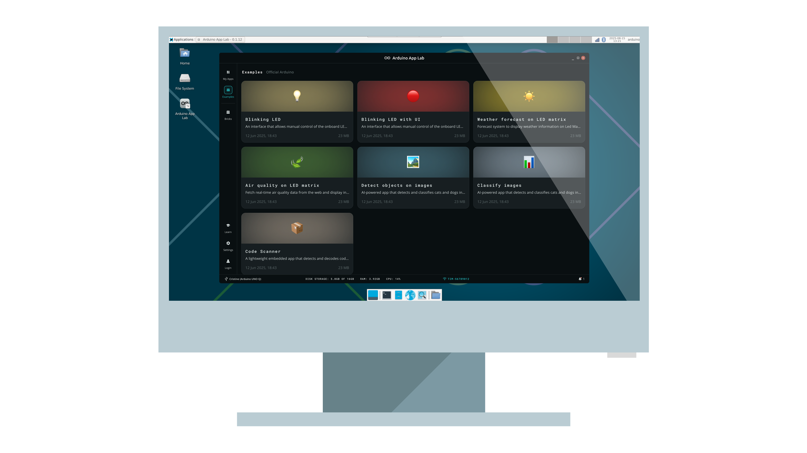
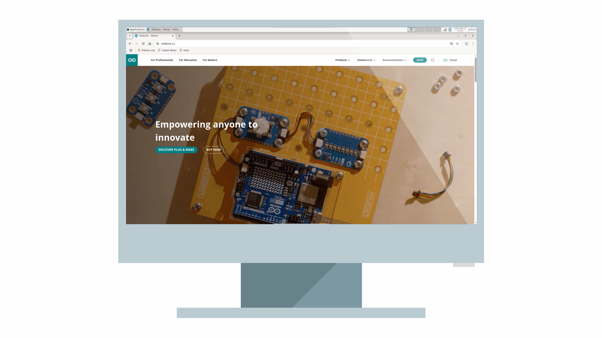
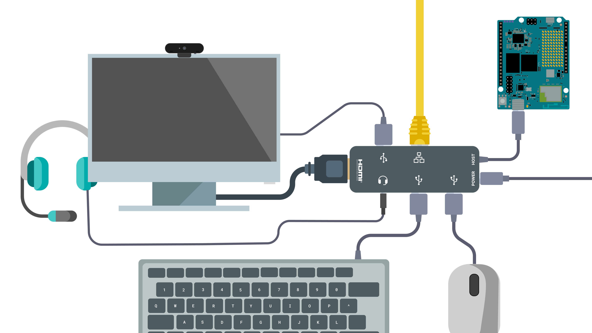

## Overview

The Arduino UNO Q is a powerful, versatile development board designed for hobbyists, developers, and makers. Thanks to its hybrid architecture, we can leverage it as a fully functional Linux based **Single-board computer**.



In this tutorial, you’ll learn how to set up your UNO Q as a personal computer, ready for everyday tasks like web browsing, office work and media playback, alongside working with product specific features like using **Arduino App Lab** for developing amazing projects.

## Goals

- Understand the required hardware and software for using the UNO Q as an SBC.
- Assemble your UNO Q into a functional desktop setup.
- Successfully complete the first boot and initial configuration.
- Explore the standalone Arduino App Lab mode.

## Required Hardware and Software

To set up the UNO Q as a single-board computer, you’ll need the following hardware and software components.



### Hardware Requirements

- [Arduino UNO Q](https://store.arduino.cc/products/uno-q)
- Mouse
- Keyboard
- HDMI Display
- USB-C® Hub<sup>1</sup>
- Power Supply (to power the USB-C hub)

***<sup>1</sup>Apple's USB-C Hub has been tested and does not work properly with the UNO Q. Any other USB-C Hub with an external power supply should work fine with the board.***

### Software Requirements

The UNO Q comes ready to use out of the box. You do not need to flash or install any image or program to the board for the test shown in this tutorial.

***The UNO Q comes with a built-in desktop operating system based on the Debian distribution.***

## UNO Q Features for SBC Use

The UNO Q offers the essential performance and connectivity needed for everyday computing and embedded applications.

- **CPU**: Qualcomm Dragonwing™ QRB2210 | Quad-core Arm® Cortex®-A53 @ 2.0 GHz
- **GPU**: Adreno 702 GPU @ 845 MHz | 3D graphics accelerator
- **RAM**: 2 GB LPDDR4 (Preview)
- **Storage**: 16 GB eMMC
- **Connectivity**: Wi-Fi® 5 Dual-band 2.4/5 GHz and Bluetooth® LE 5
- **Display**: 4K resolution through USB-C

## Computer Assembly

To assemble your UNO Q single-board computer, follow the steps below:



1. Connect the USB-C hub to the USB-C port on the Arduino UNO Q.
2. Plug the USB keyboard and mouse into the hub’s USB-A ports.
3. Connect the monitor to the hub’s HDMI port.
4. Attach the external power supply to the hub, but do not power it on yet.

***The UNO Q does not provide power to the USB-C hub, you must power the hub externally and it will also power the board.***

### Powering Options

To power your single-board computer, use an external power supply to power the USB-C hub as follows:



***The power supply should provide at least +5 VDC at 3 A to reliably power the hub, the connected devices, and the UNO Q.***

Once powered, the single-board computer will turn on and boot automatically.

## Login and First Use

When the UNO Q finishes booting, the Debian login screen will appear. Use the following default credentials to sign in:

- **Username**: arduino
- **Password**: arduino



***On your first login, you will be prompted to change the default password to a more secure, personalized one.***

Finally, you are ready to use the UNO Q as a single-board computer. 



### Connect to the Internet

To connect your computer to the internet, simply go to the upper right corner and click on the network icon. Then, search for available Wi-Fi® networks and select one.



Or run the following command in the terminal:

```bash
sudo nmcli d wifi connect <SSID> password <YOUR_PASSWORD>
```

## Further Usage

With your single-board computer now configured and ready, you can tap into the full Linux experience and take advantage of our new Arduino App Lab to work with the UNO Q.

### Arduino App Lab

Develop hybrid Arduino projects effortlessly with the built-in Arduino App Lab. Follow our [step-by-step tutorial]() to unlock the full potential of your UNO Q.



### Everyday Use

You can use your single-board computer for web browsing, media playing, coding, file managing and much more.



## Expand Your Single-Board Computer

You can add more functionalities to your UNO Q single-board computer by adding extra peripherals connected to your USB-C hub, for example:

- USB camera
- USB drive
- Wired internet connectivity through Ethernet
- Headset (speaker and/or microphone)



## Conclusion

In this tutorial, you learned how to set up and use the Arduino UNO Q as a fully functional single-board computer, leveraging its quad-core processor, integrated GPU, wireless connectivity, and Debian-based operating system. You also explored how to assemble the hardware into a complete desktop setup, perform the first boot, log in, and connect to the internet.

Thanks to its mixed architecture and built-in Arduino App Lab, the UNO Q offers a seamless blend of general-purpose computing and embedded development, enabling you to browse the web, work on documents, play media, and simultaneously design Arduino projects without additional hardware. This makes it a versatile platform for both productivity and prototyping in a compact form factor.

### Next Steps

- Explore the Arduino App Lab tutorial to learn how to create hybrid applications directly on your UNO Q.
- Try connecting additional peripherals like a USB camera or Ethernet adapter to expand its capabilities.
- Customize your Debian environment by installing your preferred software packages using the built-in package manager.
- Experiment with developing and running both desktop and embedded applications on the same device.