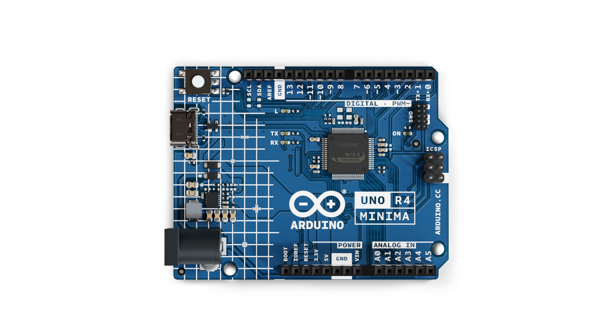
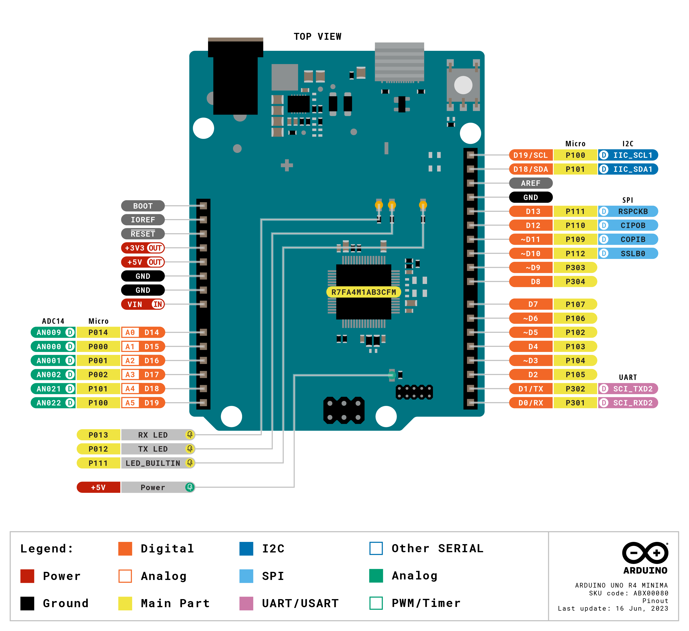

# Description

Arduino® UNO एक R4 Minima is the first UNO board to feature a 32-bit microcontroller. It features a RA4M1 series microcontroller from Renesas (R7FA4M1AB3CFM#AA0), which embeds a 48 MHz Arm® Cortex®-M4 microprocessor. The UNO एक R4 Minima's memory is larger than its predecessors, with 256 kB flash, 32 kB SRAM and 8 kB data memory (EEPROM).

This product was created, manufactured and distributed exclusively for the Indian Market as the **Arduino UNO एक R4 Minima** (SKU: ABX00080_IN), being technically compatible with the international version **Arduino® UNO R4 Minima** (SKU: ABX00080).

# Target areas:

Maker, beginner, education

# Features

- **R7FA4M1AB3CFM#AA0**
  - 48 MHz Arm® Cortex®-M4 microprocessor with a floating point unit (FPU)
  - 5 V operating voltage
  - Real-time Clock (RTC)
  - Memory Protection Unit (MPU)
  - Digital Analog Converter (DAC)
- **Memory**
  - 256 kB Flash Memory
  - 32 kB SRAM
  - 8 kB Data Memory (EEPROM)
- **Pins**
  - 14x digital pins (GPIO), D0-D13
  - 6x analog input pins (ADC), A0-A5
  - 6x PWM pins: D3,D5,D6,D9,D10,D11
- **Peripherals**
  - Capacitive Touch Sensing Unit (CTSU)
  - USB 2.0 Full-Speed Module (USBFS)
  - up to 14-bit ADC
  - up to 12-bit DAC
  - Operational Amplifier (OPAMP)
- **Power**
  - Recommended input voltage (VIN) is 6-24 V
  - 5 V operating voltage
  - Barrel jack connected to VIN pin
  - Power via USB-C® at 5 V
  - Schottky diodes for overvoltage and reverse polarity protection
- **Communication**
  - 1x UART (pin D0, D1)
  - 1x SPI (pin D10-D13, ICSP header)
  - 1x I2C (pin A4, A5, SDA, SCL)
  - 1x CAN (pin D4, D5, external transceiver is required)

# CONTENTS

## The Board

### Application Examples

The UNO एक R4 Minima is the first UNO series 32-bit development board, being previously based on 8-bit AVR microcontrollers. There are thousands of guides, tutorials and books written about the UNO board, where UNO एक R4 Minima continues its legacy.

The board features the standard 14 digital I/O ports, 6 analog channels, dedicated pins for I2C, SPI and UART connections. Compared to its predecessors the board has a much larger memory: 8 times more flash memory (256 kB) and 16 times more SRAM (32 kB).

**Entry level projects:** If this is your first project within coding and electronics, the UNO एक R4 Minima is a good fit. It is easy to get started with and has a lot of online documentation (both official + third party).

**Easy power management:** the UNO एक R4 Minima has a barrel jack connector and supports input voltages from 6-24 V. This connector is widely popular and removes the need for additional circuitry required to step down the voltage.

**Cross compatibility:** the UNO form factor automatically makes it compatible with hundreds of existing third-party shields and other accessories.

### Related Products

- Arduino UNO R3
- Arduino UNO R3 SMD
- Arduino UNO एक R4 WiFi

 

# Rating

## Recommended Operating Conditions

| Symbol          | Description                          | Min | Typ | Max | Unit |
| --------------- | ------------------------------------ | --- | --- | --- | ---- |
| VIN  | Input voltage from VIN pad / DC Jack | 6   | 7.0 | 24  | V    |
| VUSB | Input voltage from USB connector     | 4.8 | 5.0 | 5.5 | V    |
| TOP  | Operating Temperature                | -40 | 25  | 85  | °C   |

 

# Functional Overview

## Block Diagram

## Board Topology

### Front View

| **Ref.** | **Description**                      | **Ref.** | **Description**               |
| -------- | ------------------------------------ | -------- | ----------------------------- |
| U1       | R7FA4M1AB3CFM#AA0 Microcontroller IC | J4       | DC Jack                       |
| U2       | ISL854102FRZ-T Buck Converter        | DL1      | LED TX (serial transmit)      |
| PB1      | RESET Button                         | DL2      | LED RX (serial receive)       |
| JANALOG  | Analog input/output headers          | DL3      | LED Power                     |
| JDIGITAL | Digital input/output headers         | DL4      | LED SCK (serial clock)        |
| J1       | ICSP header (SPI)                    | D2       | PMEG6020AELRX Schottky Diode  |
| J2       | SWD/JTAG Connector                   | D3       | PMEG6020AELRX Schottky Diode  |
| J3       | CX90B-16P USB-C® connector           | D4       | PRTR5V0U2X,215 ESD Protection |

### Back View

## Microcontroller (R7FA4M1AB3CFM#AA0)

The UNO एक R4 Minima is based on the 32-bit RA4M1 series microcontroller, **R7FA4M1AB3CFM#AA0**, from Renesas, which uses a 48 MHz Arm® Cortex®-M4 microprocessor with a floating point unit (FPU).

On the UNO एक R4 Minima, the operating voltage is fixed at 5 V to be fully retro compatible with shields, accessories & circuits originally designed for older UNO revisions.

The R7FA4M1AB3CFM#AA0 features:

- 256 kB flash / 32 kB SRAM / 8 kB data flash (EEPROM)
- Real-time Clock (RTC)
- 4x Direct Memory Access Controller (DMAC)
- up to 14-bit ADC
- up to 12-bit DAC
- OPAMP
- 1x CAN bus

For more technical details on this microcontroller, visit [Renesas - RA4M1 series](https://www.renesas.com/us/en/products/microcontrollers-microprocessors/ra-cortex-m-mcus/ra4m1-32-bit-microcontrollers-48mhz-arm-cortex-m4-and-lcd-controller-and-cap-touch-hmi).

## USB Connector

The UNO एक R4 Minima has one USB-C® port, used to power and program your board as well as send & receive serial communication.

**_Note: You should not power the board with more than 5 V via the USB-C® port._**

## Digital Analog Converter (DAC)

The UNO एक R4 Minima has a DAC with up to 12-bit resolution attached to the A0 analog pin. A DAC is used to convert a digital signal to an analog signal.

## Rated Current

| Min   | Typ   | Max   | Notes                                                                                                                 |
| ----- | ----- | ----- | --------------------------------------------------------------------------------------------------------------------- |
| 29.71 | 33.39 | 36.98 | Average current consumption while powered with USB-C and running the default firmware shipped with the board (blink). |

## Power Options

Power can either be supplied via the VIN pin, the barrel jack, or via USB-C® connector. If power is supplied via VIN, the ISL854102FRZ buck converter steps the voltage down to 5 V.

The VUSB, barrel jack connector and VIN pins are connected to the ISL854102FRZ buck converter, with Schottky diodes in place for reverse polarity & overvoltage protection respectively.

Power via USB supplies about ~4.7 V (due to Schottky drop) to the RA4M1 microcontroller.

### Power Tree

### Pin Voltage

The UNO एक R4 Minima operates on 5 V, as does all pins on this board except for the **3.3V pin**. This pin draws power from the `VCC_USB` pin on the R7FA4M1AB3CFM#AA0, and is not connected to the buck converter.

### Pin Current

The GPIOs on the R7FA4M1AB3CFM#AA0 microcontroller can handle up to **8 mA**. Never connect devices that draw higher current directly to a GPIO.

In case you need to power external devices that require more power, e.g. servo motors, use an external power supply.

 

# Mechanical Information

## Pinout

### Analog

| Pin | Function | Type   | Description                                      |
| --- | -------- | ------ | ------------------------------------------------ |
| 1   | BOOT     | MD     | Mode selection                                   |
| 2   | IOREF    | IOREF  | Reference for digital logic V - connected to 5 V |
| 3   | Reset    | Reset  | Reset                                            |
| 4   | +3V3     | Power  | +3V3 Power Rail                                  |
| 5   | +5V      | Power  | +5V Power Rail                                   |
| 6   | GND      | Power  | Ground                                           |
| 7   | GND      | Power  | Ground                                           |
| 8   | VIN      | Power  | Voltage Input                                    |
| 9   | A0       | Analog | Analog input 0 / DAC                             |
| 10  | A1       | Analog | Analog input 1 / OPAMP+                          |
| 11  | A2       | Analog | Analog input 2 / OPAMP-                          |
| 12  | A3       | Analog | Analog input 3 / OPAMPOut                        |
| 13  | A4       | Analog | Analog input 4 / I²C Serial Datal (SDA)          |
| 14  | A5       | Analog | Analog input 5 / I²C Serial Clock (SCL)          |

### Digital

| Pin | Function  | Type    | Description                                      |
| --- | --------- | ------- | ------------------------------------------------ |
| 1   | SCL       | Digital | I²C Serial Clock (SCL)                           |
| 2   | SDA       | Digital | I²C Serial Datal (SDA)                           |
| 3   | AREF      | Digital | Analog Reference Voltage                         |
| 4   | GND       | Power   | Ground                                           |
| 5   | D13/SCK   | Digital | GPIO 13 / SPI Clock                              |
| 6   | D12/CIPO  | Digital | GPIO 12 / SPI Controller In Peripheral Out       |
| 7   | D11/COPI  | Digital | GPIO 11 (PWM) / SPI Controller Out Peripheral In |
| 8   | D10/CS    | Digital | GPIO 10 (PWM) / SPI Chip Select                  |
| 9   | D9        | Digital | GPIO 9 (PWM~)                                    |
| 10  | D8        | Digital | GPIO 8                                           |
| 11  | D7        | Digital | GPIO 7                                           |
| 12  | D6        | Digital | GPIO 6 (PWM~)                                    |
| 13  | D5/CANRX0 | Digital | GPIO 5 (PWM~) / CAN Transmitter (TX)             |
| 14  | D4/CANTX0 | Digital | GPIO 4 / CAN Receiver (RX)                       |
| 15  | D3        | Digital | GPIO 3 (PWM~) / Interrupt Pin                    |
| 16  | D2        | Digital | GPIO 2 / Interrupt Pin                           |
| 17  | D1/TX0    | Digital | GPIO 1 / Serial 0 Transmitter (TX)               |
| 18  | D0/TX0    | Digital | GPIO 0 / Serial 0 Receiver (RX)                  |

### ICSP

| Pin | Function | Type     | Description                  |
| --- | -------- | -------- | ---------------------------- |
| 1   | CIPO     | Internal | Controller In Peripheral Out |
| 2   | +5V      | Internal | Power Supply of 5 V          |
| 3   | SCK      | Internal | Serial Clock                 |
| 4   | COPI     | Internal | Controller Out Peripheral In |
| 5   | RESET    | Internal | Reset                        |
| 6   | GND      | Internal | Ground                       |

### SWD/JTAG

| Pin | Function | Type     | Description         |
| --- | -------- | -------- | ------------------- |
| 1   | +5V      | Internal | Power Supply of 5 V |
| 2   | SWDIO    | Internal | Data I/O pin        |
| 3   | GND      | Internal | Ground              |
| 4   | SWCLK    | Internal | Clock Pin           |
| 5   | GND      | Internal | Ground              |
| 6   | NC       | Internal | Not connected       |
| 7   | RX       | Internal | Serial Receiver     |
| 8   | TX       | Internal | Serial Transmitter  |
| 9   | GND      | Internal | Ground              |
| 10  | NC       | Internal | Not connected       |

## Mounting Holes And Board Outline

## Board Operation

### Getting Started - IDE

If you want to program your UNO एक R4 Minima while offline you need to install the Arduino® Desktop IDE **[1]**. To connect the UNO एक R4 Minima to your computer, you will need a Type-C® USB cable, which can also provide power to the board, as indicated by the LED (DL1).

### Getting Started - Arduino Cloud Editor

All Arduino boards, including this one, work out-of-the-box on the Arduino Cloud Editor **[2]**, by just installing a simple plugin.

The Arduino Cloud Editor is hosted online, therefore it will always be up-to-date with the latest features and support for all boards. Follow **[3]** to start coding on the browser and upload sketches onto your board.

### Getting Started - Arduino Cloud

All Arduino IoT enabled products are supported on Arduino Cloud which allows you to log, graph and analyze sensor data, trigger events, and automate your home or business.

### Online Resources

Now that you have gone through the basics of what you can do with the board you can explore the endless possibilities it provides by checking exciting projects on Arduino Project Hub **[4]**, the Arduino Library Reference **[5]**, and the online store **[6]**; where you will be able to complement your board with sensors, actuators and more.

### Board Recovery

All Arduino boards have a built-in bootloader which allows flashing the board via USB. In case a sketch locks up the processor and the board is not reachable anymore via USB, it is possible to enter bootloader mode by double-tapping the reset button right after the power-up.

# Company Information

| Company name    | Arduino S.r.l.                                  |
| --------------- | -------------------------------------------- |
| Company Address | Via Andrea Appiani, 25 - 20900 MONZA（Italy) |

# Reference Documentation

| Ref                                    | Link                                                                     |
| -------------------------------------- | ------------------------------------------------------------------------ |
| Arduino IDE (Desktop)                  | https://www.arduino.cc/en/Main/Software                                  |
| Arduino Cloud Editor                   | https://create.arduino.cc/editor                                         |
| Arduino Cloud Editor - Getting Started | https://docs.arduino.cc/arduino-cloud/guides/editor/                     |
| Arduino Project Hub                    | https://create.arduino.cc/projecthub?by=part&part_id=11332&sort=trending |
| Library Reference                      | https://github.com/arduino-libraries/                                    |
| Arduino Store                          | https://store.arduino.cc/                                                |

# Change Log

| **Date**   | **Revision** | **Changes**                                  |
| ---------- | ------------ | -------------------------------------------- |
| 23/01/2025 | 1            | First Release based on Uno Minima revision 4 |
