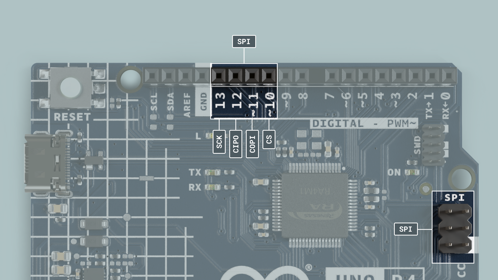

The Arduino® UNO R4 Minima is a development board with the classic UNO form factor, based on the [RA4M1](/resources/datasheets/RA4M1.pdf) microcontroller from [Renesas](/resources/datasheets/ra4m1-datasheet.pdf). It features 32 kB of RAM memory, a clock speed of 48 MHz, USB-C® port as well as a built-in RTC, DAC and CAN bus.

This is the first UNO board that uses a 32-bit architecture, being previously based on an 8-bit AVR architecture.

In this article you will find a technical reference to your board, with links to useful resources to get you started with this board.

## Datasheet

The full datasheet is available as a downloadable PDF from the link below:

- [Download the UNO R4 Minima datasheet](/resources/datasheets/ABX00080-datasheet.pdf)

## Power Supply

To power the UNO R4 Minima you may either use a USB-C® cable, or the VIN pin.

If you’re using the USB-C® connector you must power it with 5 V.

The board can be powered via the VIN pin, supporting a range between 6-24V.

## Installation

The UNO R4 Minima can be programmed either via the Arduino IDE, Arduino Web Editor or Arduino CLI.

### Arduino IDE

To install the board in the Arduino IDE, search for "Renesas" in the board manager, and install the core/package.

Read more in the [Getting Started with the UNO R4 Minima](/tutorials/uno-r4-minima/minima-getting-started) guide.

### Arduino Web Editor

The Web Editor is an online IDE that includes all official boards, no need for installing the core/package. You will need the Create Plugin installed on your computer to use the Web Editor.

Read more in the [Getting Started with the Web Editor](https://docs.arduino.cc/arduino-cloud/getting-started/getting-started-web-editor) guide.

## Core

The UNO R4 Minima is based on the [Arduino Core for Renesas devices](https://github.com/arduino/ArduinoCore-renesas).

## Renesas RA4M1

The UNO R4 Minima features the powerful and very robust renesas microcontroller also found on the UNO R4. Renesas microcontrollers are known for their high performance and robustness, including their built in peripheral set. 

These peripherals include analog-to-digital converters, timers, pulse width modulation (PWM) units, communication interfaces (such as UART, SPI, and I2C) and more.


### Memory

The board features 
- 32 kB of SRAM 
- 256 kB flash 
- 8 KB data (EEPROM).

## SWD Connector


On the R4 Minima there is a a debugging option available using the SWD connector pins, giving advanced debug functionalities for more advanced users.

## Pins

The **UNO R4 Minima** gives you access to many different pins and many of them have special features that will be accounted for in the upcoming sections of this article. Keep reading to learn what you can do with them. 

If you just need a quick overview of the pins functionality, this is a full table of all the IO pins on the **UNO R4 Minima** 

| Pin | Function  | Notes                         |
| --- | --------- | ----------------------------- |
| 0   | RX        | Serial communication          |
| 1   | TX        | Serial communication          |
| 2   | GPIO      | Digital IO pin                |
| 3   | PWM       | Digital IO pin, PWM           |
| 4   | GPIO      | Digital IO pin                |
| 5   | PWM       | Digital IO pin, PWM           |
| 6   | PWM       | Digital IO pin, PWM           |
| 7   | GPIO      | Digital IO pin                |
| 8   | GPIO      | Digital IO pin                |
| 9   | PWM       | Digital IO pin, PWM           |
| 10  | PWM       | Digital IO pin, PWM           |
| 11  | PWM       | Digital IO pin, PWM           |
| 12  | GPIO      | Digital IO pin                |
| 13  | GPIO      | Digital IO pin                |
| 14  | SDA       | Serial Data (I2C)             |
| 15  | SCL       | Serial Clock (I2C)            |
| 16  | DAC       | Analog In, DAC                |
| 17  | OPAMP+    | Analog In, OPAMP+             |
| 18  | OPAMP-    | Analog In, OPAMP-             |
| 19  | OPAMP OUT | Analog In, OPAMP OUT          |
| 20  | GPIO      | Analog in, Digital IO pin     |
| 21  | GPIO      | Analog in, Digital IO pin     |
| A0  | DAC       | Analog In, DAC                |
| A1  | Analog in | Analog In                     |
| A2  | Analog in | Analog In                     |
| A3  | Analog in | Analog In                     |
| A4  | Analog in | Analog In, Serial Data (I2C)  |
| A5  | Analog in | Analog In, Serial Clock (I2C) |

### Analog Pins

The **UNO R4 Minima** has 6 analog input pins (A0-A5) that can be read by using the `analogRead()` function.

```arduino
value = analogRead(pin, value);
```

The reference voltage of these pins is 5 V. 

### PWM

PWM (Pulse Width Modulation) capability allows a digital pin to emulate analog output by flickering on and off very fast letting you, among other things, dim LEDs connected to digital pins. 

The **UNO R4 Minima** has 6 PWM capable pins which are marked with ~ on the headers. The PWM capable pins are:

- D3~
- D5~
- D6~
- D9~
- D10~
- D11~

You may use them as analog output pins with the function: 

```arduino
analogWrite(pin, value);
```
The **RA4M1** has an internal OPAMP that is exposed on the **UNO R4 Minima** as follows:

| Pin | OPAMP     |
| --- | --------- |
| A1  | OPAMP +   |
| A2  | OPAMP -   |
| A3  | OPAMP OUT |

### Digital Pins

The **UNO R4 Minima** features a total of digital 14 pins. Though some of them serve another purpose and shouldn't be used for GPIO if you have other pins available.


| Pin | Function | Notes                |
| --- | -------- | -------------------- |
| 0   | RX       | Serial communication |
| 1   | TX       | Serial communication |
| 2   | GPIO     | Digital IO pin       |
| 3   | PWM      | Digital IO pin, PWM  |
| 4   | GPIO     | Digital IO pin       |
| 5   | PWM      | Digital IO pin, PWM  |
| 6   | PWM      | Digital IO pin, PWM  |
| 7   | GPIO     | Digital IO pin       |
| 8   | GPIO     | Digital IO pin       |
| 9   | PWM      | Digital IO pin, PWM  |
| 10  | PWM      | Digital IO pin, PWM  |
| 11  | PWM      | Digital IO pin, PWM  |
| 12  | GPIO     | Digital IO pin       |
| 13  | GPIO     | Digital IO pin       |
| 14  | SDA      | Serial communication |
| 15  | SCL      | Serial communication |

The reference voltage of all digital pins is 5 V.

## DAC

The **UNO R4 Minima** has a DAC with up to 12-bit resolution, that can act as genuine analog output pin which means it's even more capable than PWM pins.

```arduino
analogWrite(pin, value);
```


This DAC pin has a default write resolution of 8-bits. This means that values that are written to the pin should be between 0-255.

However you may change this write resolution if you need to, to up to 12-bits, and in this case the values you write to the pin should be between 0-4096.

```arduino
analogWriteResolution(12);
```

## RTC

A real-time clock (RTC) is used to measure the time, and is useful in any time-tracking applications.

Below is a minimal example that shows how to obtain the date and time from the RTC:

```arduino
#include "RTC.h"

void setup() {
  Serial.begin(9600);

  RTC.begin();
  RTCTime mytime(30, Month::JUNE, 2023, 13, 37, 00, DayOfWeek::WEDNESDAY, SaveLight::SAVING_TIME_ACTIVE);

  RTC.setTime(mytime);
}

void loop() {
  RTCTime currenttime;

 // Get current time from RTC
  RTC.getTime(currenttime);
  
  // Print out date (DD/MM//YYYY)
  Serial.print(currenttime.getDayOfMonth());
  Serial.print("/");
  Serial.print(Month2int(currenttime.getMonth()));
  Serial.print("/");
  Serial.print(currenttime.getYear());
  Serial.print(" - ");

  // Print time (HH/MM/SS)
  Serial.print(currenttime.getHour());
  Serial.print(":");
  Serial.print(currenttime.getMinutes());
  Serial.print(":");
  Serial.println(currenttime.getSeconds());

  delay(1000);
}

```

## EEPROM

EEPROM, also referred to as 'data' memory, is type of memory that can retain data even after the board has been powered off.

```arduino
EEPROM.write(address, val);
EEPROM.read(address)
```

It has a limited amount of write cycles, meaning that it is best suited for read-only applications. Make sure to never use `write()` inside `void loop()` because you may use all write cycles for the chip.

Read more in the [Guide to EEPROM](/learn/programming/eeprom-guide).

## SPI



The **UNO R4 Minima** features a Serial Peripheral Interface (SPI) bus. The bus (connector), ‘SPI’ uses the following pins:

- (COPI) - D11
- (CIPO) - D12
- (SCK) - D13
- (CS) - D10

The following example shows how to use SPI:


```arduino
#include <SPI.h>

const int CS = 10;


void setup() {
  pinMode(CS, OUTPUT);

  SPI.begin();

  digitalWrite(CS, LOW);

  SPI.transfer(0x00);
  
  digitalWrite(CS, HIGH);
}

void loop() {
}
```

## I2C

I2C lets you connect multiple I2C compatible devices in series using only two pins. The controller will send out information through the I2C bus to a 7-bit address, meaning that the technical limit of I2C devices on a single line is 128. Practically, you're never gonna reach 128 devices before other limitations kick in.

The **UNO R4 Minima** has one I2C bus which is marked with SCL and SDA. They are shared with A4 (SDA) and A5 (SCL) which owners of previous UNO's are familiar with. The pullups are not mounted on the PCB but there are footprints to do so if needed.

The pins used for I2C on the **UNO R4 Minima** are the following:
- SDA - D14 or A4
- SCL - D15 or A5


To connect I2C devices you will need to include the [Wire](https://www.arduino.cc/reference/en/language/functions/communication/wire/) library at the top of your sketch.

```arduino
#include <Wire.h>
```

Inside `void setup()` you need to initialize the library, and initialize the I2C port you want to use.

```arduino
Wire.begin() //SDA & SDL
```

And to write something to a device connected via I2C, we can use the following commands:

```arduino
Wire.beginTransmission(1); //begin transmit to device 1
Wire.write(byte(0x00)); //send instruction byte 
Wire.write(val); //send a value
Wire.endTransmission(); //stop transmit
```
## USB Serial & UART

The **UNO R4 Minima** board features 2 separate hardware serial ports. 

- One port is exposed via USB-C®, and 
- One is exposed via RX/TX pins.

The pins used for UART on the **UNO R4 Minima** are the following:

| Pin | Function      |
| --- | ------------- |
| D0  | RX (Receive)  |
| D1  | TX (Transmit) |

### Native USB

Sending serial data to your computer is done using the standard `Serial` object. I

```arduino
Serial.begin(9600);
Serial.print("hello world");
```

To send and receive data through UART, we will first need to set the baud rate inside `void setup()`.

### UART

The pins used for UART on the **UNO R4 Minima** are the following:

| Pin | Function |
| --- | -------- |
| D0  | RX0      |
| D1  | TX0      |

To send and receive data through UART, we will first need to set the baud rate inside `void setup()`. Note that when using the UART (RX/TX pins), we use the `Serial1` object.

```arduino
Serial1.begin(9600);
```

To read incoming data, we can use a while loop() to read each individual character and add it to a string.

```arduino
  while(Serial1.available()){
    delay(2);
    char c = Serial1.read();
    incoming += c;
  }
```

And to write something, we can use the following command:

```arduino
Serial1.write("Hello world!");
```

## USB HID

This board can act as an HID (keyboard/mouse) and send keystrokes or coordinates to your computer via native USB.

```arduino
keyboard.press('W');
mouse.move(x,y);
```

This support is enabled by the [keyboard](https://www.arduino.cc/reference/en/language/functions/usb/keyboard/) and [mouse](https://www.arduino.cc/reference/en/language/functions/usb/mouse/) libraries that are pre-bundled into the core and require no installation.

## CAN Module

The UNO R4 Minima's RA4M1 has a built-in CAN module that complies with the CAN 2.0A/CAN 2.0B standard. 

The pins CANRX and CANTX can be connected to a CAN transceiver, such as a MCP2551 or TJA1050 ICs.

| Pin | Function |
| --- | -------- |
| D4  | CANTX    |
| D5  | CANRX    |

The built-in **Arduino_CAN** library is used to communicate with other CAN devices. 

```arduino
//set CAN bit rate and init library at
//choose from BR_125k,BR_250k,BR_500k,BR_1000k 
CAN.begin(CanBitRate::BR_250k); 
```

Construct a CAN message and send it:

```arduino
uint8_t const msg_data[] = {0xCA,0xFE,0,0,0,0,0,0};
memcpy((void *)(msg_data + 4), &msg_cnt, sizeof(msg_cnt));
CanMsg msg(CAN_ID, sizeof(msg_data), msg_data);
CAN.write(msg);
```

Read an incoming CAN message.
```arduino
CanMsg const msg = CAN.read(); //read
```

***Please note that without a CAN transceiver it is not possible to communicate with other CAN devices.*** 

## Flashing Bootloader

In case you need to flash the bootloader follow these steps:

Install the [Renesas](future-link.com) core. 

Navigate to: "C:\Users\YourWindowsUserName\AppData\Local\Arduino15\packages\arduino\hardware\
renesas\0.5.0\bootloaders\SANTIAGO"

Identify the **dfu.exe***

Install the Renesas flash programmer ([download page](https://www.renesas.com/us/en/software-tool/renesas-flash-programmer-programming-gui))

To flash the bootloader:
  - Select dfu.exe.
  - Connect your board.
  - Short the BOOT and GND pin found on the UNO R4 Minima.
  - Go to the Connect Settings tab.
  - Select COM port in the Tool > select the port shown in the IDE.
  - Press start. 