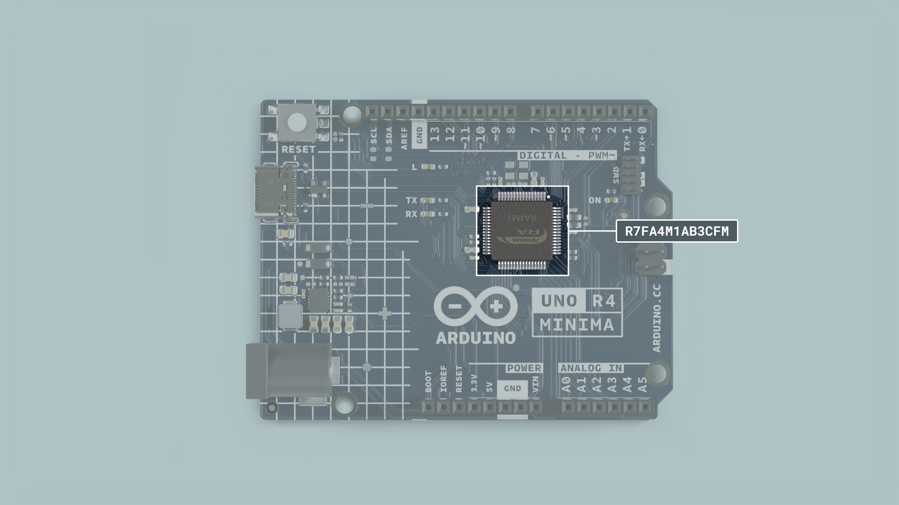
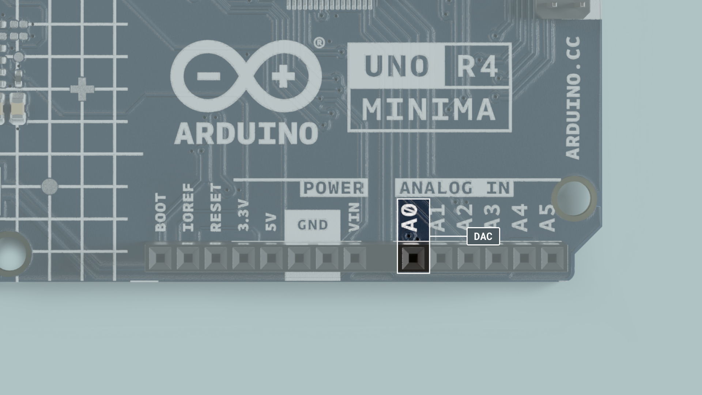

The Arduino® UNO R4 Minima is a development board with the classic UNO form factor, based on the [RA4M1]() microcontroller from [Renesas](/resources/datasheets/ra4m1-datasheet.pdf) microcontroller from [Renesas](https://www.renesas.com/). It now comes with 32 KB of RAM memory, a clock speed of 48 MHz and a USB-C® port.

This is the first UNO board that uses a 32-bit architecture, being previously based on the 8-bit AVR architecture.

This article is a technical reference to your board, introducing the various components on the board, as well as resources to getting started.

## Datasheet

The full datasheet is available as a downloadable PDF from the link below:

- [Download the UNO R4 Minima datasheet](/resources/datasheets/ABX00080-datasheet.pdf)

## Power Supply

To power the UNO R4 Minima you may either use a USB-C® cable, or the VIN pin.

If you’re using the USB-C® connector you must power it with 5V.

The board can be powered via the VIN pin, supporting a range between 6-24V.

## Installation

***For detailed instructions on how to install the UNO R4 Minima core, please refer to the [Getting Started with the UNO R4 Minima]() guide.***

The **UNO R4 Minima** can be programmed through:

- the **IDE 1**, 
- the **IDE 2**, 
- and the **Web-Editor**. 

## Core

The UNO R4 Minima is based on the [Arduino Core for Renesas devices](https://github.com/arduino/ArduinoCore-renesas).

### Bootloader

In case you need to flash the bootloader follow these steps:

Install the [Renesas](future-link.com) core. 

Navigate to: "C:\Users\YourWindowsUserName\AppData\Local\Arduino15\packages\arduino\hardware\
renesas\0.5.0\bootloaders\SANTIAGO"

Identify the **dfu.exe***

Install the Renesas flash programmer ([download page](https://www.renesas.com/us/en/software-tool/renesas-flash-programmer-programming-gui))

To flash the bootloader:
  - Select dfu.exe.
  - Connet your board.
  - Short the BOOT and GND pin found on the UNO R4 Minima
  - Go to the Connect Settings tab.
  - Select COM port in the Tool > select the port shown in the IDE.
  - Press start. 

## Renesas RA4M1

The UNO R4 Minima features the powerful and very robust renesas microcontroller also found on the UNO R4. Renesas microcontrollers are known for their high performance and robustness, including their built in peripheral set. 

These peripherals include analog-to-digital converters, timers, pulse width modulation (PWM) units, communication interfaces (such as UART, SPI, and I2C) and more.



## Memory

### RAM

The **UNO R4 Minima** comes equipped with 32 KB of RAM memory.

### Flash

The flash memory comes in 256 KB code and 8 KB data.

## SWD Connector


On the R4 Minima there is a a debugging option available using the SWD connector pins, giving advanced debug functionalities for more advanced users.

## SPI


The **UNO R4 Minima** features a Serial Peripheral Interface (SPI) bus. The bus (connector), ‘SPI’ uses the following pins:


- (COPI) - D11
- (CIPO) - D12
- (SCK) - D13
- (CS) - D10

The following example shows how to use SPI:


```arduino
#include <SPI.h>

const int CS = 10;


void setup() {
  pinMode(CS, OUTPUT);

  SPI.begin();

  digitalWrite(CS, LOW);

  SPI.transfer(0x00);
  
  digitalWrite(CS, HIGH);
}

void loop() {
}
```

## I2C

I2C lets you connect multiple I2C compatible devices in series using only two pins. The controller will send out information through the I2C bus to a 7 bit address, meaning that the technical limit of I2C devices on a single line is 128. Practically, you're never gonna reach 128 devices before other limitations kick in.

The **UNO R4 Minima** has one I2C bus which is marked with SCL and SDA. They are shared with A4 (SDA) and A5 (SCL) which owners of previous UNO's are familiar with. The pullups are not mounted on the PCB but there are footprints to do so if needed.

The pins used for I2C on the **UNO R4 Minima** are the following:
- SDA - D14
- SCL - D15


To connect I2C devices you will need to include the [Wire](https://www.arduino.cc/reference/en/language/functions/communication/wire/) library at the top of your sketch.

```arduino
#include <Wire.h>
```

Inside `void setup()` you need to initialize the library, and initialize the I2C port you want to use.

```arduino
Wire.begin() //SDA & SDL
Wire1.begin(); //SDA1 & SDL1
Wire2.begin(); //SDA2 & SDL2
```

And to write something to a device connected via I2C, we can use the following commands:

```arduino
Wire.beginTransmission(1); //begin transmit to device 1
Wire.write(byte(0x00)); //send instruction byte 
Wire.write(val); //send a value
Wire.endTransmission(); //stop transmit
```

## Serial Ports


The **UNO R4 Minima** supports, like every other Arduino board, serial communication with UART (Universal Asynchronous, Receiver-Transmitter). However, the **Uno R4 Minima** board features 2 separate serial ports. 

This not only means that you may print different values to different ports and monitor them separately, which is useful enough in and of itself, but that you may also communicate with **2 different serial enabled devices** simultaneously.

The pins used for UART on the **UNO R4 Minima** are the following:

- RX0 - D0
- TX0 - D1

Each Serial port works in the same way as the one you're used to, but you use different functions to target them:

```arduino
Serial.begin(9600);
Serial1.begin(9600);
```

To send and receive data through UART, we will first need to set the baud rate inside `void setup()`.

```arduino
Serial1.begin(9600);
```

To read incoming data, we can use a while loop() to read each individual character and add it to a string.

```arduino
  while(Serial1.available()){
    delay(2);
    char c = Serial1.read();
    incoming += c;
  }
```

And to write something, we can use the following command:

```arduino
Serial1.write("Hello world!");
```

## Pins

The **UNO R4 Minima** gives you access to many different pins and many of them have special features that will be accounted for in the upcoming sections of this article. Keep reading to learn what you can do with them. 

If you just need a quick overview of the pins functionality, this is a full table of all the IO pins on the **UNO R4 Minima** 

| Pin | Function  | Notes                      |
| --- | --------- | --------------------       |
| 0   | RX        | Serial communication       |
| 1   | TX        | Serial communication       |
| 2   | GPIO      | Digital IO pin             |
| 3   | PWM       | Digital IO pin, PWM        |
| 4   | GPIO      | Digital IO pin             |
| 5   | PWM       | Digital IO pin, PWM        |
| 6   | PWM       | Digital IO pin, PWM        |
| 7   | GPIO      | Digital IO pin             |
| 8   | GPIO      | Digital IO pin             |
| 9   | PWM       | Digital IO pin, PWM        |
| 10  | PWM       | Digital IO pin, PWM        |
| 11  | PWM       | Digital IO pin, PWM        |
| 12  | GPIO      | Digital IO pin             |
| 13  | GPIO      | Digital IO pin             |
| 14  | SDA       | Serial communication       |
| 15  | SCL       | Serial communication       |
| 16  | DAC       | Analog In, DAC             |
| 17  | OPAMP+    | Analog In, OPAMP+          |
| 18  | OPAMP-    | Analog In, OPAMP-          |
| 19  | OPAMP OUT | Analog In, OPAMP OUT       |
| 20  | GPIO      | Analog in, Digital IO pin  |
| 21  | GPIO      | Analog in, Digital IO pin  |
| A0  | DAC       | Analog In, DAC             |
| A1  | Analog in | Analog In                  |
| A2  | Analog in | Analog In                  |
| A3  | Analog in | Analog In                  |
| A4  | Analog in | Analog In                  |
| A5  | Analog in | Analog In                  |

### Analog Pins

The **UNO R4 Minima** has 6 analog input pins (A0-A5) that can be read by using the `analogRead()` function.

```arduino
value = analogRead(pin, value);
```

The reference voltage of these pins is 3.3V. 


### PWM

PWM (Pulse Width Modulation) capability allows a digital pin to emulate analog output by flickering on and off very fast letting you, among other things, dim LEDs connected to digital pins. 

The **UNO R4 Minima** has 6 PWM capable pins which are marked with ~ on the headers. The PWM capable pins are:

- D3~
- D5~
- D6~
- D9~
- D10~
- D11~

You may use them as analog output pins with the function: 

```arduino
analogWrite(pin, value);
```
The **RA4M1** has an internal OPAMP that is exposed on the **UNO R4 Minima** as follows:

| Pin | OPAMP             |
| --- | ------------------|
| A1  | OPAMP +           |
| A2  | OPAMP -           |
| A3  | OPAMP OUT         |

### Digital Pins

The **UNO R4 Minima** features a total of digital 14 pins. Though some of them serve another purpose and shouldn't be used for GPIO if you have other pins available.


| Pin | Function  | Notes                      |
| --- | --------- | --------------------       |
| 0   | RX        | Serial communication       |
| 1   | TX        | Serial communication       |
| 2   | GPIO      | Digital IO pin             |
| 3   | PWM       | Digital IO pin, PWM        |
| 4   | GPIO      | Digital IO pin             |
| 5   | PWM       | Digital IO pin, PWM        |
| 6   | PWM       | Digital IO pin, PWM        |
| 7   | GPIO      | Digital IO pin             |
| 8   | GPIO      | Digital IO pin             |
| 9   | PWM       | Digital IO pin, PWM        |
| 10  | PWM       | Digital IO pin, PWM        |
| 11  | PWM       | Digital IO pin, PWM        |
| 12  | GPIO      | Digital IO pin             |
| 13  | GPIO      | Digital IO pin             |
| 14  | SDA       | Serial communication       |
| 15  | SCL       | Serial communication       |

The reference voltage of all digital pins is 5V.

### DAC Pin

The **UNO R4 Minima** also has a DAC pin (A0) that can act as genuine analog output pin which means it's even more capable than PWM pins.

```arduino
analogWrite(pin, value);
```



This DAC pin has a default write resolution of 8-bits. This means that values that are written to the pin should be between 0-255.

However you may change this write resolution if you need to, to up to 12-bits, and in this case the values you write to the pin should be between 0-4096.

```arduino
analogWriteResolution(12);
```