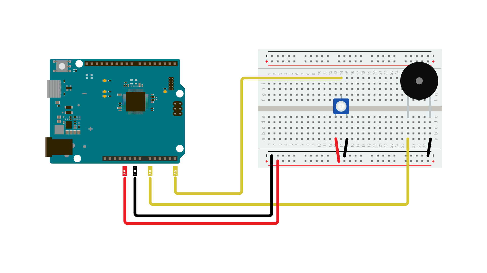

The Arduino UNO R4 Minima has a built in **DAC** (Digital-to-analog Converter) which is used to transform a digital signal to an analog one. This feature can be used to build a plethora of fun audio projects, but also work as professional lab equipment as a cheap function generator, for example.

## Goals

In this article, you will learn:
- About the DAC feature onboard the UNO R4 Minima,
- differences between PWM and DAC techniques,
- how to generate a waveform (sine),
- how to output this waveform on a piezo speaker.

## Hardware & Software Needed
  To follow along with this article, you will need the following hardware: 
  
  - [Arduino UNO R4 Minima](https://store.arduino.cc/uno-r4-minima)
  - Piezo buzzer 
  - Potentiometer
  - Jumper wires

## Circuit
The circuit required for this tutorial can be found in the diagram below:



## Analog Output vs PWM
For many use cases when analog output is required, using PWM (Pulse Width Modulation) instead of genuine analog output will yield essentially the same results. A digital output pin can only either be fully on (HIGH) or fully off (LOW), but by turning on and off very quickly with precise timings, the average voltage can be controlled and emulate an analog output. This method is called [PWM](/learn/microcontrollers/analog-output). 

For example when dimming an LED, you can freely use a PWM enabled digital pin as an analog output pin and the LED would dim just the same as if you'd be using a DAC output. 

However this will not always be the case, and for many uses you will need to use a genuine analog output to get your desired results. One such case is in audio purposes, where a PWM output simply will not give the same quality of sound as a genuine analog output, and requires some fiddling to work in the first place.

## Code
The code for this tutorial is split in two parts, one main sketch and a header file containing a pre-generated sawtooth-waveform.

With this sketch, we have pre-generated a sine waveform. You could also dynamically generate it either at the beginning of your sketch or during, but doing so would be less efficient without gaining any performance. So going this route is the best practice. 

The waveform is being stored as samples in an array, and with every loop of the sketch we'll update the DACs output value to the next value in the array.  

Open a new sketch and paste the following code into your window.

```arduino
#include "analogWave.h"

analogWave wave(DAC);

int freq = 10;  // in hertz, change accordingly

void setup() {
  Serial.begin(115200);
  pinMode(A5, INPUT);
  wave.sine(freq);
}

void loop() {
  freq = map(analogRead(A5), 0, 1024, 0, 10000);
  Serial.println("Frequency is now " + String(freq) + " hz");
  wave.freq(freq);
  delay(1000);
}
```

## Testing It Out
Once you have uploaded the code to the board, it should start generating a sine wave oscillation on the DAC, that depending on the frequency could be used to produce sound on a piezo buzzer or speaker. If you have an oscilloscope at hand, connecting its probe to the DAC output might be an interesting exercise so see what the wave looks like. 

Now try twisting the potentiometer, and listen to how the sound changes.

Now that you know your setup is working, you can experiment further with different examples and see how you can use the DAC of the UNO R4 to generate sounds and even melodies.

***Note: In this setup, we're just using a piezo buzzer, you may notice that the sounds it's making are pretty faint. If you want to fix this you'll need a 4 or 8 Ohm speaker, and an amplifier. You can find many breakout amplifier modules that are easy to use online.***

### Frere Jacques

This one for example plays the melody of Frere Jacques:
```arduino
  /*
  DAC Melody player

  Generates a series of tones from MIDI note values
  using the Uno R4 DAC and the AnalogWave Library.
   The melody is "Frere Jacques"

circuit:
     * audio amp (LM386 used for testing) input+ attached to A0
     * audio amp input- attached to ground
     * 4-8-ohm speaker attached to amp output+
     * Potentiometer connected to pin A5

  created 13 Feb 2017
  modified 3 Jul 2023
  by Tom Igoe
*/
#include "analogWave.h"
analogWave wave(DAC);

#define NOTE_A4 69         // MIDI note value for middle A
#define FREQ_A4 440        // frequency for middle A

// the tonic, or first note of the key signature for the song:
int tonic = 65;
// the melody sequence. Note values are relative to the tonic:
int melody[] = {1, 3, 5, 1,
                1, 3, 5, 1,
                5, 6, 8, 5, 6, 8,
                8, 10, 8, 6, 5, 1,
                8, 10, 8, 6, 5, 1,
                1, -4, 1,
                1, -4, 1
               };
// the rhythm sequence. Values are 1/note, e.g. 4 = 1/4 note:
int rhythm[] = {4, 4, 4, 4,
                4, 4, 4, 4,
                4, 4, 2,
                4, 4, 2,
                8, 8, 8, 8, 4, 4,
                8, 8, 8, 8, 4, 4,
                4, 4, 2,
                4, 4, 2
               };
// which note of the melody to play:
int noteCounter = 0;

int bpm = 120;  // beats per minute
// duration of a beat in ms
float beatDuration = 60.0 / bpm * 1000;

void setup() {
// start the sine wave generator:
  wave.sine(10);
}

void loop() {
  // current note is an element of the array:
  int currentNote = melody[noteCounter] + tonic;
  // play a note from the melody:
  // convert MIDI note number to frequency:
  float frequency =  FREQ_A4 * pow(2, ((currentNote - NOTE_A4) / 12.0));

  // all the notes in this are sixteenth notes,
  // which is 1/4 of a beat, so:
  float noteDuration = beatDuration * (4.0 / rhythm[noteCounter]);
  // turn the note on:
  wave.freq(frequency);
 // tone(speakerPin, frequency, noteDuration * 0.85);
  // keep it on for the appropriate duration:
  delay(noteDuration * 0.85);
  wave.stop();
  delay(noteDuration * 0.15);
  // turn the note off:
 // noTone(speakerPin);
  // increment the note number for next time through the loop:
  noteCounter++;
  // keep the note in the range from 0 - 32 using modulo:
  noteCounter = noteCounter % 32;

}
```

### MIDI Piano Notes
This sketch will break down the potentiometer input to steps, that are translated to the 88 MIDI notes that represent the keys on a piano.

```arduino
/*
  Plays a tone in response to a potentiometer
  formula from https://newt.phys.unsw.edu.au/jw/notes.html
  and https://en.wikipedia.org/wiki/MIDI_tuning_standard:

  the MIDI protocol divides the notes of an equal-tempered scale into 
  128 possible note values. Middle A is MIDI note value 69. There is
  a formula for converting MIDI note numbers (0-127) to pitches. This sketch
  reduces that to the notes 21 - 108, which are the 88 keys found on a piano:

     frequency =  440 * ((noteNumber - 69) / 12.0)^2

  You can see this applied in the code below. 

  circuit:
     * audio amp (LM386 used for testing) input+ attached to A0
     * audio amp input- attached to ground
     * 4-8-ohm speaker attached to amp output+
     * Potentiometer connected to pin A5

   created 18 Dec 2018
   modified 3 Jul 2023
   by Tom Igoe
*/

// include the AnalogWave library:
#include "analogWave.h"
analogWave wave(DAC);

// middle A is the reference frequency for an
// equal-tempered scale. Set its frequency and note value:
#define NOTE_A4 69         // MIDI note value for middle A
#define FREQ_A4 440        // frequency for middle A

const int speakerPin = A0;  // the pin number for the speaker
void setup() {
  Serial.begin(9600);
  wave.sine(10);
}
void loop() {
  // convert sensor reading to 21 - 108 range
  // which is the range of MIDI notes on an 88-key keyboard
  // (from A0 to C8):
  int sensorReading = analogRead(A5);
  int noteValue = map(sensorReading, 0, 1023, 21, 108);
  // then convert to frequency:
  float frequency =  FREQ_A4 * pow(2, ((noteValue - NOTE_A4) / 12.0));
  int freq = int(frequency);
  // turn the speaker on:
  wave.freq(freq);
  Serial.print("note value: "+ String(noteValue) + " freq: ");
  Serial.println(freq);
  delay(500);
}
```

## Conclusion
By following this tutorials you've experimented with the DAC on the Arduino UNO R4 boards and used it to first generate a sine wave, then to explore the possibilities of analog output by testing out various examples.
