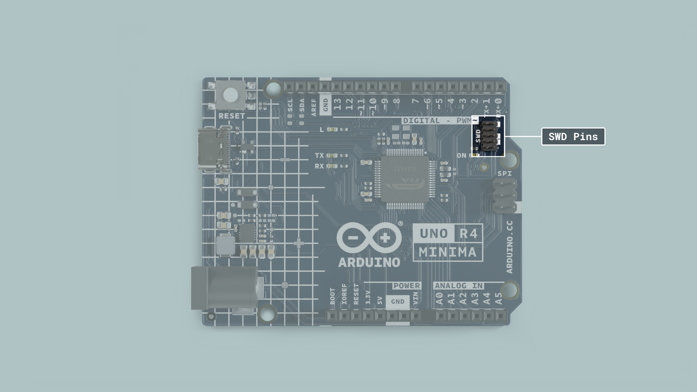

Debugging is the process of identifying and fixing errors in your code. It’s a vital skill for anyone writing code especially when dealing with microcontrollers such as the one found on Arduinos. There are different types of debugging that are covered [here](/learn/02.microcontrollers/04.debugging/debugging.md).

But generally speaking, debugging is used to inspect the code at different points in time, check the value of variables, and read specific memory addresses to make sure information is being passed on as intended. This is especially helpful when creating complex projects but even as a beginner, it can be helpful to know the basics of debugging, consequently saving you time and energy when trying to find the little annoying error causing your code to go bananas.

This article covers how to debug the UNO R4 Minima using the SWD pins and a J-link debugger.

In addition to the necessary hardware we also need some software allowing us to set breakpoints in our code. A breakpoint is an intentional stopping or pausing place at a specific point in the code, allowing you to read values at that exact point. In this case, we will be using Ozone which is a software developed by Segger. It’s a graphical debugger for embedded applications and we can use it to set breakpoints, read out memory addresses, and read the value of any variable at a specific point in time.

## Goals

The goals of this tutorial are:

- learn about the basics of debugging.
- learn how to connect the UNO R4 Minima breakout to the Segger J-link debugger.
- learn how to use the Ozone debugger software to debug an Arduino sketch.

## Hardware & Software Needed

- [Arduino IDE](https://www.arduino.cc/en/main/software)
- [Arduino R4 Minima](https://store.arduino.cc/uno-r4-minima)
- [Arduino Renesas Core](https://github.com/arduino/ArduinoCore-renesas)
- [Segger J-link](https://www.segger.com/products/debug-probes/j-link/)
- [Ozone](https://www.segger.com/products/development-tools/ozone-j-link-debugger/)

## Debugging

Debugging your Arduino project allows you to dive deep into your code and troubleshoot as well as analyze the code execution. J-link is a popular debugging tool that provides a direct connection between your computer and the Arduino board. By connecting them you can gain full access to the microcontroller's internal registers, memory, and variables. This is especially helpful when working on more complex projects where understanding the code execution flow is crucial. With J-link and Ozone, you can step through the code line by line, allowing you to analyze why your code might break at a specific point.

## Connnection

Connecting the J-link to your UNO R4 Minima is super easy because there are special pins for debugging labeled as **SWD** pins.

Your J-link should come with a cable included and if you look closer you will see that one side is marked with red, indicating the orientation of the cable. The red side of the cable should be on the same side as the VCC pin on the SWD pad. To know the exact orientation of your cable be sure to check the respective documentation or datasheet but you can start with the orientation as shown below and if it doesn't work you can try placing it differently until you get a working connection. Once we start using the debugger software in the following steps you will know if the cable is placed correctly.

## Software 

### Setting up with the Arduino IDE

First, if you haven't done it yet, install the [Arduino IDE](https://www.arduino.cc/en/software) and connect your UNO R4 Minima. When uploading a sketch to your Arduino board with the Arduino IDE, it will build an `.ELF` file of the sketch. We will need this file to debug in Ozone in the next steps. To easily find the file path of the .ELF file, we can enable the show verbose output option in the Arduino IDE. To do this, open up the preferences under **File > Preferences** in the Arduino IDE.

When you have the preferences window open, look for the **Show verbose output during: compilation** option and make sure that the checkbox is ticked.

Now we are ready to upload the script that we want to debug. If you don't have a sketch to test, you can use any example sketch found in the IDE.

When we upload the sketch with the Arduino IDE, we need to know where the `.ELF` file will be saved. Build your project in the Arduino IDE and highlight the output directory; it should look for example like `C:\Users\profile\AppData\Local\Temp\arduino_build_815037`. Note down the path for easier access in the next step.

### Using the Setup with Segger Ozone

Download and install [Segger's Ozone debugger](https://www.segger.com/downloads/J-link/#Ozone). If you are on Windows, make sure to also download the [J-Link Software and Documentation Pack for Windows.](https://www.segger.com/products/debug-probes/j-link/tools/j-link-gdb-server/about-j-link-gdb-server/) 

 When starting Ozone, make sure to enter the correct CPU into the settings box. The UNO R4 Minima uses the **R7FA4M1AB**. 

Continue to the next step. Here you need to change the **Target Interface** to **SWD**. Then select your J-link device in the list of emulators and head to the next page.

Now you get to the window that asks you to select the program to be debugged, this is where you load the project's `.ELF` file with the temporary output path that we noted before. Navigate to the correct directory, and select the `.ELF` file.

In the 'optional settings' dialog, set both options 'Initial PC' and 'Initial Stack Pointer' to 'Do not set' as it would skip the Arduino bootloader, otherwise this may prevent the sketch from running correctly.

When the setup is finished, Ozone will open the file containing the main function. You will note that this is not the .ino sketch you wrote since this is an abstraction layer generated by the IDE. To open our .ino sketch we need to go to **Find > Find source file** in the top toolbar.

In the little window that appears, type ".ino". You should now be able to see the file, select the file and open it in Ozone.

Now you are ready to start debugging. Simply go to **Debug > Download & Reset Program** to start debugging your sketch: you can add breakpoints , inspect variables, halt the execution and more.

For more information about the features present in the Ozone debugger, please go [here.](https://www.segger.com/products/development-tools/ozone-j-link-debugger/technology/application-debugging/)

## Conclusion

In this tutorial, you learned how to connect your UNO R4 Minima board to a J-link device using the SWD pins and use it with the Ozone debugger. We also went through how to create a file with Arduino IDE that can be debugged in Ozone. And eventually how to use the Ozone debugger to debug an Arduino sketch.