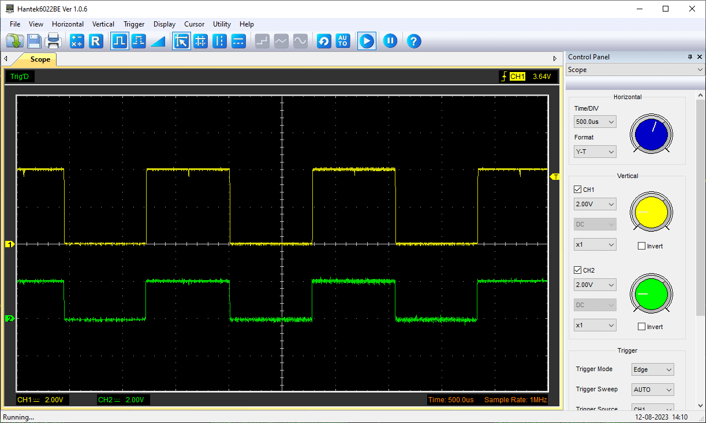

In this tutorial, you will learn how to use the built-in operational amplifier (OPAMP) featured on the [Arduino UNO R4 Minima](https://store.arduino.cc/products/uno-r4-minima). Operational amplifiers are very versatile and can be used to e.g. mirror an electrical signal or amplify it. 

## Goals

In this article, you will learn:
- about the OPAMP feature onboard the UNO R4 Minima,
- about the basics of the OPAMP library, 
- how to mirror a voltage signal,
- how to amplify a voltage signal.

## Hardware & Software Needed
  To follow along with this article, you will need the following hardware: 
  
  - [Arduino UNO R4 Minima](https://store.arduino.cc/uno-r4-minima)
  - resistors 
  - Jumper wires
  
  
##  Operational Amplifier (OPAMP)

An OPAMP is a versatile and widely used electronic component that belongs to the class of analog integrated circuits. Its primary function is to amplify voltage signals but they are very versatile and can be used to:

- mirror an input voltage to its output,
- amplify a small analog voltage to its output pin, output voltage range from 0 to ~4.7 V,
- compare two input voltages and give a binary "higher" or "lower" output,
- integrate and differentiate signals.

## Voltage Follower

The most simple way of testing the OPAMP is to create a voltage follower, by connecting `A2` to `A3`. Then, any voltage applied to `A1` should be mirrored on `A3`. For example, if you connect `A1` to `GND`, the OPAMP output should be `GND`. Connect `A1` to `3.3 V`, the output should be `3.3 V`.

## Circuit


## Voltage Amplifier

A voltage amplifier, as the name suggests, amplifies the voltage. A simple 2x amplifier can be built using e.g. two `10k` resistors. Connect one resistor between "minus" and GND. Then use the second resistor to connect the output and "minus" together. Any signal input at "plus" will now appear with double the amplitude at the output pin. Of course, the input signal and the Arduino board should share the same `GND`. 

***The amplified output signal should not go above ~4.7 V, otherwise clipping will appear and you can damage the board***

Below is a capture of an oscilloscope in which an approx. 2 V square wave (green, channel 2) is amplified to a 4 V square wave (yellow, channel 1) with the circuit shown below. The input signal was generated by a function generation (and shared GND was connected).



## Circuit


## Code

To start up the opamp, simply include the library and call `OPAMP.begin(speed)`. As the optional `speed` argument to this function, can choose either `OPAMP_SPEED_LOWSPEED`` as the low-speed (=lower power) mode or `OPAMP_SPEED_HIGHSPEED` as the high-speed, high-power mode.

```arduino
#include <OPAMP.h>

void setup () {
  OPAMP.begin(OPAMP_SPEED_HIGHSPEED);
}

void loop() {}

```