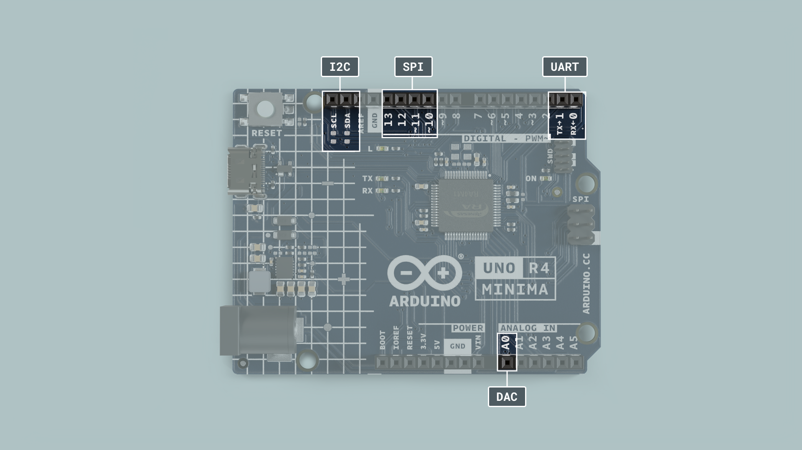

The Arduino UNO family and its form factor have become a type of standard in the maker scene and remain one of the world's most popular form factors.

Over the years, a wide range of accessories such as shields and sensors have been made, and in this guide, you will find information that will help you create your own customized hardware for the UNO family.

 ***This guide focuses mainly on making accessories for the UNO R4 Minima & WiFi boards. In case you want to design a shield for another UNO make sure to check the respective data sheet and documentation.***

## Documentation

Each UNO Family board has a dedicated documentation page, see the list below:

- [UNO R3](/hardware/uno-rev3)
- [UNO R3 SMD](/hardware/uno-rev3-smd)
- [UNO WiFi Rev2](/hardware/uno-wifi-rev2)
- [UNO R4 Minima](/hardware/uno-r4-minima)
- [UNO R4 WiFi](/hardware/uno-r4-wifi)

Inside the documentation page, you will find design files such as full pinout, CAD, and Fritzing files. You will also find tutorials and compatible libraries with the respective boards on the page.

## Technical Overview

### Dimensions

The following dimensions apply to all UNO boards.

| Format    | Measurement |
| --------- | ----------- |
| Width     | 53.34 mm    |
| Length    | 68.58 mm    |
| Thickness | 1.6 mm      |
| Pitch     | 2.54 mm     |

***Pitch is the space between the pins (e.g. between A1, A2). This specification is important when choosing header pins.***

### Pinout

Below you can find the pinout for the Arduino UNO R4 Minima. All UNO boards largely share the placement of many pins, to make it easy for accessories to be designed for different UNO boards but if you create accessories for an older UNO be sure to check its respective pinout.

For more information about each pin be sure to check out the advanced section in the pinout which you can see [here](assets/ABX00080-full-pinout.pdf).

For other UNO boards check the respective [documentation page](#documentation).

### Feature Comparisons

Below is a comparison between the different UNO Family boards.

| Board        | UNO R3         | UNO R3 SMD     | UNO WiFi Rev2  | UNO R4 Minima      | UNO R4 WiFi          |
| ------------ | -------------- | -------------- | -------------- | ------------------ | -------------------- |
| Processor    | **ATmega328P** | **ATmega328P** | **ATmega4809** | **Renesas RA4M1**  | **Renesas RA4M1**    |
| Connectivity | x              | x              | Wi-Fi®         | x                  | Wi-Fi®, Bluetooth®   |
| Clock Speed  | 16 Mhz         | 16 Mhz         | 16 Mhz         | 48 Mhz             | 48 Mhz               |
| Flash Memory | 32 KB          | 32 KB          | 48 KB          | 256 KB             | 256 KB               |
| SRAM         | 2 KB           | 2 KB           | 6 KB           | 32 KB              | 32 KB                |
| I/O Voltage  | 5 V            | 5 V            | 5 V            | 5 V                | 5 V                  |

## Power Considerations

### Voltage

Both the UNO R4 Minima and UNO R4 WiFi operate at 5 V. This means connecting 3.3 V peripherals directly may lead to potential issues. Most 3.3 V peripherals expect a 3.3 V logic level for proper operation. One common method is to use level shifters or voltage dividers to convert the 5 V signals to 3.3 V. 

This only holds true for the signal pin of a sensor and if the goal is to simply connect a 3.3 V power line the UNO R4 boards still provide a 3.3 V pin that can safely be used with sensors needing that lower power input.

### VIN Min/Max

The min/max voltage supply varies between boards. This is important to consider when choosing the battery source, that you do not exceed the limits to damage the board. 

| UNO R3         | UNO R3 SMD     | UNO WiFi Rev2  | UNO R4 Minima      | UNO R4 WiFi          |
| -------------- | -------------- | -------------- | ------------------ | -------------------- |
| 7-12 V         | 7-12 V         | 6-20 V         | 6-24 V             |6-24 V                |

### Serial Buses

The UNO R4 boards have serial buses attached to the following pins:

| Protocol | Pins                                       |
| -------- | ------------------------------------------ |
| UART     | RX, TX                                     |
| SPI      | COPI (11), CIPO (12), SCK (13), CS(10)     |
| I2C      | D14 (SDA), D15 (SCL) or A4 (SDA), A5 (SCL) |  

The location of these pins is located in the pinout for each board. These are found in the **Resources Section** [product page](#documentation) of each board.

## Building Your Shield

In this section, you will find some useful instructions when it comes to soldering your own shield. Below is a list of required materials:

- An Arduino UNO board

- [Soldering equipment](https://store.arduino.cc/products/uno-soldering-bundle).

- A Prototyping board. We highly recommend using the [Arduino Proto Shield Rev3 (UNO Size)](https://store.arduino.cc/products/proto-shield-rev3-uno-size) because it will make your life much easier. If you want you can of course use a general prototyping shield but it requires you to do some additional soldering.

- Components that are placed on the shield.

**Step 1 Assemble Proto Shield**

Once you have gathered all your materials it's time to start the assembly. The first step is to assemble the Proto Shield and make sure it fits nicely on top of the UNO. If you are new to soldering check out our soldering tutorial [here](https://docs.arduino.cc/learn/electronics/soldering-basics).

**Step 2 Prototype Circuit**

Now it's time to put your components onto your shield. But before you get all excited and start soldering everything onto your shield we highly recommend prototyping and testing your circuit on a breadboard, making sure everything works as expected. 

You don't want to spend a bunch of time soldering everything neatly into place just to realize afterward that you are missing a resistor or something else and then spend even more time desoldering everything again.

**Step 3 Solder Components**

After you have verified and made sure everything works as you want it's finally time to solder all components into place. Once done you simply plug in your UNO R4 Minima / UNO R4 WiFi, upload your code, and if everything was done correctly, congratulations you now have built your very own customizable Arduino UNO R4 shield. 

If it doesn't work as expected make sure that everything is soldered properly and nothing is loose. If you have a multimeter laying around use it to check the connections.

**Step 4 Document your work**

Be sure to document your work both for your own sake as well as for others. Sharing project ideas is an excellent way of learning more about electronics. [Project Hub](https://projecthub.arduino.cc/) is a great place to document your work and share it with others. See you there!