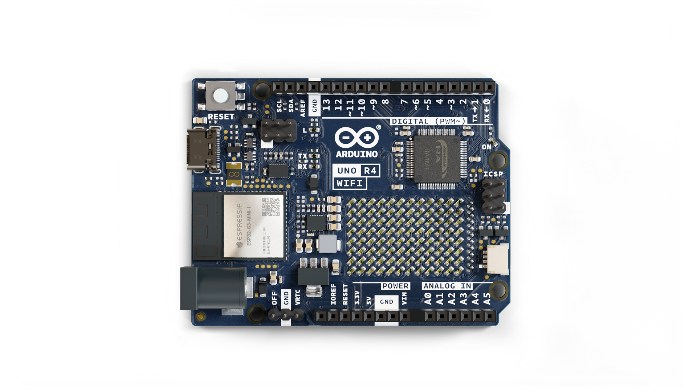
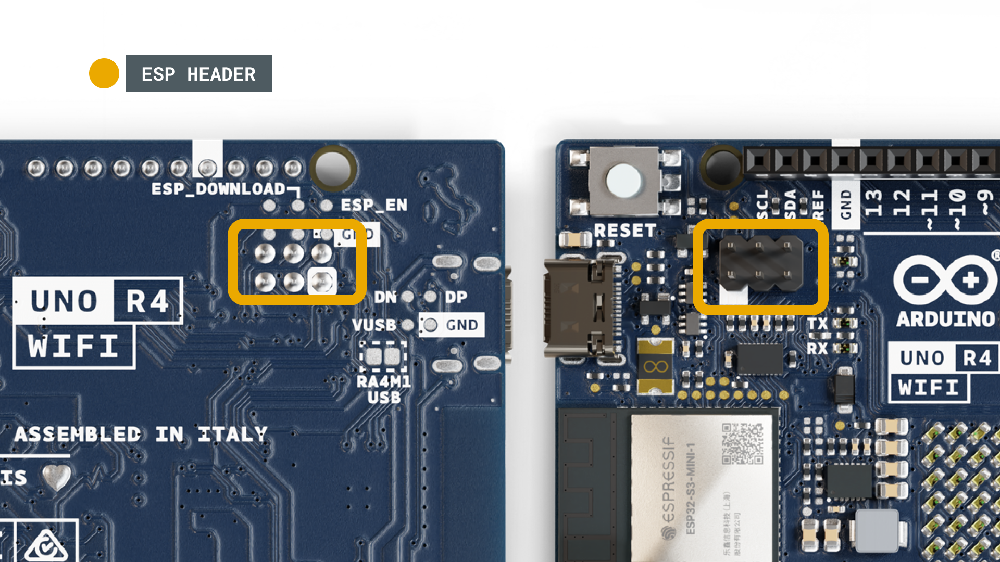

# Description 

The Arduino® UNO R4 WiFi is the first UNO board to feature a 32-bit microcontroller and an ESP32-S3 Wi-Fi® module (ESP32-S3-MINI-1-N8). It features a RA4M1 series microcontroller from Renesas (R7FA4M1AB3CFM#AA0), based on a 48 MHz Arm® Cortex®-M4 microprocessor. The UNO R4 WiFi's memory is larger than its predecessors, with 256 kB flash, 32 kB SRAM and 8 kB of EEPROM.

The RA4M1's operating voltage is fixed at 5 V, whereas the ESP32-S3 module is 3.3 V. Communication between these two MCUs is performed via a logic-level translator (TXB0108DQSR).

# Target areas:
Maker, beginner, education

# Features

The **R7FA4M1AB3CFM#AA0**, often referred to as RA4M1 in this datasheet, is the main MCU on the UNO R4 WiFi, connected to all pin headers on the board as well as all communication buses.

* **Overview**
  * 48 MHz Arm® Cortex®-M4 microprocessor with a floating point unit (FPU)
  * 5 V operating voltage
  * Real-time Clock (RTC)
  * Memory Protection Unit (MPU)
  * Digital-to-analog Converter (DAC)
* **Memory**
  * 256 kB Flash Memory
  * 32 kB SRAM
  * 8 kB Data Memory (EEPROM)
* **Peripherals**
  * Capacitive Touch Sensing Unit (CTSU)
  * USB 2.0 Full-Speed Module (USBFS)
  * 14-bit ADC
  * Up to 12-bit DAC
  * Operational Amplifier (OPAMP)
* **Power**
  * Operating voltage for RA4M1 is 5 V
  * Recommended input voltage (VIN) is 6-24 V
  * Barrel jack connected to VIN pin (6-24 V)
  * Power via USB-C® at 5 V
* **Communication**
  * 1x UART (pin D0, D1)
  * 1x SPI (pin D10-D13, ICSP header)
  * 1x I2C (pin A4, A5, SDA, SCL)
  * 1x CAN (pin D4, D5, external transceiver is required)

See the full datasheet for the R7FA4M1AB3CFM#AA0 in the link below:
- [R7FA4M1AB3CFM#AA0 datasheet](/resources/datasheets/ra4m1.pdf)

The **ESP32-S3-MINI-1-N8** is the secondary MCU with a built-in antenna for Wi-Fi® & Bluetooth® connectivity. This module operates on 3.3 V and communicates with the RA4M1 using a logic-level translator (TXB0108DQSR).

* **Overview**
  * Xtensa® dual-core 32-bit LX7 microprocessor
  * 3.3 V operating voltage
  * 40 MHz crystal oscillator
* **Wi-Fi®**
  * Wi-Fi® support with 802.11 b/g/n standard (Wi-Fi® 4)
  * Bit rate at up to 150 Mbps
  * 2.4 GHz band
* **Bluetooth®**
  * Bluetooth® 5

See the full datasheet for the ESP32-S3-MINI-1-N8 in the link below:
- [ESP32-S3-MINI-1-N8 datasheet](/resources/datasheets/esp32-s3-mini.pdf)

# CONTENTS

## The Board

### Application Examples

The UNO R4 WiFi is part of the first UNO series of 32-bit development boards, being previously based on 8-bit AVR microcontrollers. There are thousands of guides, tutorials and books written about the UNO board, where the UNO R4 WiFi continues its legacy.

The board features 14 digital I/O ports, 6 analog channels, dedicated pins for I2C, SPI and UART connections. It has a significantly larger memory: 8 times more flash memory (256 kB) and 16 times more SRAM (32 kB). With a 48 MHz clock speed, it is also 3x faster than its predecessors.

In addition, it features an ESP32-S3 module for Wi-Fi® & Bluetooth® connectivity, as well as a built-in 12x8 LED matrix, making it one of the most visually unique Arduino boards to date. The LED matrix is fully programmable, where you can load anything from still frames to custom animations.

**Entry-level projects:** If this is your first project within coding and electronics, the UNO R4 WiFi is a good fit. It is easy to get started with, and it has a lot of online documentation.

**Easy IoT applications:** build projects without writing any networking code in the Arduino Cloud. Monitor your board, connect it with other boards and services, and develop cool IoT projects.

**LED Matrix:** the 12x8 LED matrix on the board can be used for showing animations, text scrolling, create mini-games and much more, being the perfect feature to give your project more personality.

### Related Products
* UNO R3
* UNO R3 SMD
* UNO R4 Minima

# Rating

## Recommended Operating Conditions

| Symbol          | Description                          | Min | Typ | Max | Unit |
| --------------- | ------------------------------------ | --- | --- | --- | ---- |
| VIN  | Input voltage from VIN pad / DC Jack | 6   | 7.0 | 24  | V    |
| VUSB | Input voltage from USB connector     | 4.8 | 5.0 | 5.5 | V    |
| TOP  | Operating Temperature                | -40 | 25  | 85  | °C   |

**Note:** VDD controls the logic level and is connected to the 5V power rail. VAREF is for the analog logic.

# Functional Overview

## Block Diagram

## Board Topology

### Front View

| **Ref.**    | **Description**                                  |
| ----------- | ------------------------------------------------ |
| U1          | R7FA4M1AB3CFM#AA0 Microcontroller IC             |
| U2          | NLASB3157DFT2G Multiplexer                       |
| U3          | ISL854102FRZ-T Buck Converter                    |
| U4          | TXB0108DQSR logic level translator (5 V - 3.3 V) |
| U5          | SGM2205-3.3XKC3G/TR 3.3 V linear regulator       |
| U6          | NLASB3157DFT2G Multiplexer                       |
| U_LEDMATRIX | 12x8 LED Red Matrix                              |
| M1          | ESP32-S3-MINI-1-N8                               |
| PB1         | RESET Button                                     |
| JANALOG     | Analog input/output headers                      |
| JDIGITAL    | Digital input/output headers                     |
| JOFF        | OFF, VRTC header                                 |
| J1          | CX90B-16P USB-C® connector                       |
| J2          | SM04B-SRSS-TB(LF)(SN) I2C connector              |
| J3          | ICSP header (SPI)                                |
| J5          | DC Jack                                          |
| J6          | ESP header                                       |
| DL1         | LED TX (serial transmit)                         |
| DL2         | LED RX (serial receive)                          |
| DL3         | LED Power (green)                                |
| DL4         | LED SCK (serial clock)                           |
| D1          | PMEG6020AELRX Schottky Diode                     |
| D2          | PMEG6020AELRX Schottky Diode                     |
| D3          | PRTR5V0U2X,215 ESD Protection                    |

## Microcontroller (R7FA4M1AB3CFM#AA0)

The UNO R4 WiFi is based on the 32-bit RA4M1 series microcontroller, **R7FA4M1AB3CFM#AA0**, from Renesas, which uses a 48 MHz Arm® Cortex®-M4 microprocessor with a floating point unit (FPU).

The operating voltage for the RA4M1 is fixed at 5 V as to be hardware compatible with shields, accessories & circuits based on previous Arduino UNO boards. 

The R7FA4M1AB3CFM#AA0 features:
* 256 kB flash / 32 kB SRAM / 8 kB data flash (EEPROM)
* Real-time Clock (RTC)
* 4x Direct Memory Access Controller (DMAC) 
* 14-bit ADC
* Up to 12-bit DAC
* OPAMP
* CAN bus

For more technical details on this microcontroller, visit the Renesas - RA4M1 series official documentation.

## Wi-Fi® / Bluetooth® Module (ESP32-S3-MINI-1-N8)

The Wi-Fi® / Bluetooth® LE module on the UNO R4 WiFi is from the ESP32-S3 SoCs. It features the Xtensa® dual-core 32-bit LX7 MCU, a built-in antenna and support for 2.4 GHz bands.

The ESP32-S3-MINI-1-N8 features:
* Wi-Fi® 4 - 2.4 GHz band
* Bluetooth® 5 LE support
* 3.3 V operating voltage
* 384  kB ROM
* 512  kB SRAM
* Up to 150 Mbps bit rate

This module acts as a secondary MCU on the UNO R4 WiFi, and communicates with the RA4M1 MCU using a logic-level translator. Note that this module operates on 3.3 V as opposed to the RA4M1's 5 V operating voltage. 

### ESP Header

The header located close to the RESET button can be used to access the ESP32-S3 module directly. The pins accessible are:

* `ESP_IO42` - MTMS debugging (Pin 1)  
* `ESP_IO41` - MTDI debugging (Pin 2)
* `ESP_TXD0` - Serial Transmit (UART) (Pin 3)
* `ESP_DOWNLOAD` - boot (Pin 4)
* `ESP_RXD0` - Serial Receive (UART) (Pin 5)
* `GND` - ground (Pin 6)

### USB Bridge

When programming the UNO R4 WiFi, the RA4M1 MCU is programmed via the ESP32-S3 module by default. The **U2** and **U6** switches can switch the USB communication to go directly to the RA4M1 MCU, by writing a high state to the `P408` pin (D40).

Soldering together the **SJ1** pads permanently sets the USB communication directly to the RA4M1, bypassing the ESP32-S3.

## USB Connector

The UNO R4 WiFi has one USB-C® port, used to power and program your board as well as sending & receiving serial communication.

**Note:** The board should not be powered with more than 5 V via the USB-C® port.

## LED Matrix

The UNO R4 WiFi features a 12x8 matrix of red LEDs (**U_LEDMATRIX**), connected using the technique known as charlieplexing.

The following pins on the RA4M1 MCU are used for the matrix:
- P003
- P004
- P011
- P012
- P013
- P015
- P204
- P205
- P206
- P212
- P213

These LEDs can be accessed as an array, using a specific library. See the mapping below:

This matrix can be used for a number of projects and prototyping purposes, and supports animation, simple game designs and scrolling text among other things.

## Digital Analog Converter (DAC)

The UNO R4 WiFi has a DAC with up to 12-bit resolution attached to the A0 analog pin. A DAC is used to convert a digital signal to an analog signal.

The DAC can be used for signal generation for e.g. audio applications, like generating and altering sawtooth waves.

## I2C Connector

The I2C connector SM04B-SRSS-TB(LF)(SN) is connected to a secondary I2C bus on the board. Note that this connector is powered via 3.3 V. 

This connector also shares the following pin connections:

**JANALOG header**
- A4
- A5

**JDIGITAL header**
- SDA
- SCL

**Note:** as A4/A5 is connected to the main I2C bus, these should not be used as ADC inputs whenever the bus is in use. You can however connect I2C devices to each of these pins and connectors simultaneously.

## Power Options

Power can either be supplied via the VIN pin, or via USB-C® connector. If power is supplied via VIN, the ISL854102FRZ buck converter steps the voltage down to 5 V.

Both VUSB and VIN pins are connected to the ISL854102FRZ buck converter, with Schottky diodes in place for reverse polarity & overvoltage protection respectively. 

Power via USB supplies about ~4.7 V (due to Schottky drop) to the RA4M1 MCU.

The linear regulator (SGM2205-3.3XKC3G/TR) converts 5 V from either the buck converter or USB, and provides 3.3 V to a number of components, including the ESP32-S3 module.

### Power Tree

### Pin Voltage

The general operating voltage for UNO R4 WiFi is 5 V, however the ESP32-S3 module's operating voltage is 3.3 V. 

**Note:** It is **very** important that ESP32-S3's pins (3.3 V) do not come in contact with any of the RA4M1's pins (5 V), as this may damage the circuits.

### Pin Current

The GPIOs on the R7FA4M1AB3CFM#AA0 microcontroller can safely handle up to 8 mA of current. Never connect devices that draw higher current directly to a GPIO as this may damage the circuit.

For powering e.g. servo motors, always use an external power supply.

# Mechanical Information

## Pinout

### Analog

| Pin | Function | Type   | Description                                      |
| --- | -------- | ------ | ------------------------------------------------ |
| 1   | BOOT     | NC     | Not Connected                                    |
| 2   | IOREF    | IOREF  | Reference for digital logic V - connected to 5 V |
| 3   | Reset    | Reset  | Reset                                            |
| 4   | +3V3     | Power  | +3V3 Power Rail                                  |
| 5   | +5V      | Power  | +5V Power Rail                                   |
| 6   | GND      | Power  | Ground                                           |
| 7   | GND      | Power  | Ground                                           |
| 8   | VIN      | Power  | Voltage Input                                    |
| 9   | A0       | Analog | Analog input 0 / DAC                             |
| 10  | A1       | Analog | Analog input 1 / OPAMP+                          |
| 11  | A2       | Analog | Analog input 2 / OPAMP-                          |
| 12  | A3       | Analog | Analog input 3 / OPAMPOut                        |
| 13  | A4       | Analog | Analog input 4 / I2C Serial Datal (SDA)          |
| 14  | A5       | Analog | Analog input 5 / I2C Serial Clock (SCL)          |

### Digital

| Pin | Function       | Type    | Description                                            |
| --- | -------------- | ------- | ------------------------------------------------------ |
| 1   | SCL            | Digital | I2C Serial Clock (SCL)                                 |
| 2   | SDA            | Digital | I2C Serial Datal (SDA)                                 |
| 3   | AREF           | Digital | Analog Reference Voltage                               |
| 4   | GND            | Power   | Ground                                                 |
| 5   | D13/SCK/CANRX0 | Digital | GPIO 13 / SPI Clock / CAN Receiver (RX)                |
| 6   | D12/CIPO       | Digital | GPIO 12 / SPI Controller In Peripheral Out             |
| 7   | D11/COPI       | Digital | GPIO 11 (PWM) / SPI Controller Out Peripheral In       |
| 8   | D10/CS/CANTX0  | Digital | GPIO 10 (PWM) / SPI Chip Select / CAN Transmitter (TX) |
| 9   | D9             | Digital | GPIO 9 (PWM~)                                          |
| 10  | D8             | Digital | GPIO 8                                                 |
| 11  | D7             | Digital | GPIO 7                                                 |
| 12  | D6             | Digital | GPIO 6 (PWM~)                                          |
| 13  | D5             | Digital | GPIO 5 (PWM~)                                          |
| 14  | D4             | Digital | GPIO 4                                                 |
| 15  | D3             | Digital | GPIO 3 (PWM~) / Interrupt Pin                          |
| 16  | D2             | Digital | GPIO 2 / Interrupt Pin                                 |
| 17  | D1/TX0         | Digital | GPIO 1 / Serial 0 Transmitter (TX)                     |
| 18  | D0/TX0         | Digital | GPIO 0 / Serial 0 Receiver    (RX)                     |

### OFF

| Pin | Function | Type  | Description                          |
| --- | -------- | ----- | ------------------------------------ |
| 1   | OFF      | Power | For controlling power supply         |
| 2   | GND      | Power | Ground                               |
| 1   | VRTC     | Power | Battery connection to power RTC only |

### ICSP

| Pin | Function | Type     | Description                  |
| --- | -------- | -------- | ---------------------------- |
| 1   | CIPO     | Internal | Controller In Peripheral Out |
| 2   | +5V      | Internal | Power Supply of 5 V          |
| 3   | SCK      | Internal | Serial Clock                 |
| 4   | COPI     | Internal | Controller Out Peripheral In |
| 5   | RESET    | Internal | Reset                        |
| 6   | GND      | Internal | Ground                       |

## Mounting Holes And Board Outline

## Board Operation

### Getting Started - IDE

If you want to program your UNO R4 WiFi while offline you need to install the Arduino® Desktop IDE **[1]**. To connect the UNO R4 WiFi to your computer, you will need a Type-C® USB cable, which can also provide power to the board, as indicated by the LED (DL1).

### Getting Started - Arduino Web Editor

All Arduino boards, including this one, work out-of-the-box on the Arduino® Web Editor **[2]**, by just installing a simple plugin.

The Arduino Web Editor is hosted online, therefore it will always be up-to-date with the latest features and support for all boards. Follow **[3]** to start coding on the browser and upload your sketches onto your board.

### Getting Started - Arduino Cloud

All Arduino IoT enabled products are supported on Arduino Cloud which allows you to log, graph and analyze sensor data, trigger events, and automate your home or business.

### Online Resources

Now that you have gone through the basics of what you can do with the board you can explore the endless possibilities it provides by checking existing projects on Arduino Project Hub **[4]**, the Arduino Library Reference **[5]**, and the online store **[6]**; where you will be able to complement your board with sensors, actuators and more.

### Board Recovery

All Arduino boards have a built-in bootloader which allows flashing the board via USB. In case a sketch locks up the processor and the board is not reachable anymore via USB, it is possible to enter bootloader mode by double-tapping the reset button right after the power-up.

# Certifications

## Declaration of Conformity CE DoC (EU)

We declare under our sole responsibility that the products above are in conformity with the essential requirements of the following EU Directives and therefore qualify for free movement within markets comprising the European Union (EU) and European Economic Area (EEA).

## Declaration of Conformity to EU RoHS & REACH 211 01/19/2021

Arduino boards are in compliance with RoHS 2 Directive 2011/65/EU of the European Parliament and RoHS 3 Directive 2015/863/EU of the Council of 4 June 2015 on the restriction of the use of certain hazardous substances in electrical and electronic equipment.

| **Substance**                          | **Maximum Limit (ppm)** |
| -------------------------------------- | ----------------------- |
| Lead (Pb)                              | 1000                    |
| Cadmium (Cd)                           | 100                     |
| Mercury (Hg)                           | 1000                    |
| Hexavalent Chromium (Cr6+)             | 1000                    |
| Poly Brominated Biphenyls (PBB)        | 1000                    |
| Poly Brominated Diphenyl ethers (PBDE) | 1000                    |
| Bis(2-Ethylhexyl} phthalate (DEHP)     | 1000                    |
| Benzyl butyl phthalate (BBP)           | 1000                    |
| Dibutyl phthalate (DBP)                | 1000                    |
| Diisobutyl phthalate (DIBP)            | 1000                    |

Exemptions : No exemptions are claimed.

Arduino Boards are fully compliant with the related requirements of European Union Regulation (EC) 1907 /2006 concerning the Registration, Evaluation, Authorization and Restriction of Chemicals (REACH). We declare none of the SVHCs (<https://echa.europa.eu/web/guest/candidate-list-table>), the Candidate List of Substances of Very High Concern for authorization currently released by ECHA, is present in all products (and also package) in quantities totaling in a concentration equal or above 0.1%. To the best of our knowledge, we also declare that our products do not contain any of the substances listed on the "Authorization List" (Annex XIV of the REACH regulations) and Substances of Very High Concern (SVHC) in any significant amounts as specified by the Annex XVII of Candidate list published by ECHA (European Chemical Agency) 1907 /2006/EC.

## Conflict Minerals Declaration

As a global supplier of electronic and electrical components, Arduino is aware of our obligations with regards to laws and regulations regarding Conflict Minerals, specifically the Dodd-Frank Wall Street Reform and Consumer Protection Act, Section 1502. Arduino does not directly source or process conflict minerals such as Tin, Tantalum, Tungsten, or Gold. Conflict minerals are contained in our products in the form of solder, or as a component in metal alloys. As part of our reasonable due diligence Arduino has contacted component suppliers within our supply chain to verify their continued compliance with the regulations. Based on the information received thus far we declare that our products contain Conflict Minerals sourced from conflict-free areas.

## FCC Caution

Any Changes or modifications not expressly approved by the party responsible for compliance could void the user’s authority to operate the equipment.

This device complies with part 15 of the FCC Rules. Operation is subject to the following two conditions:

(1) This device may not cause harmful interference

(2) this device must accept any interference received, including interference that may cause undesired operation.

**FCC RF Radiation Exposure Statement:**

1. This Transmitter must not be co-located or operating in conjunction with any other antenna or transmitter.

2. This equipment complies with RF radiation exposure limits set forth for an uncontrolled environment.

3. This equipment should be installed and operated with a minimum distance of 20 cm between the radiator & your body.

**Note:** This equipment has been tested and found to comply with the limits for a Class B digital
device, pursuant to part 15 of the FCC Rules. These limits are designed to provide
reasonable protection against harmful interference in a residential installation. This equipment
generates, uses and can radiate radio frequency energy and, if not installed and used in
accordance with the instructions, may cause harmful interference to radio communications.
However, there is no guarantee that interference will not occur in a particular installation. If
this equipment does cause harmful interference to radio or television reception, which can be
determined by turning the equipment off and on, the user is encouraged to try to correct the
interference by one or more of the following measures:
- Reorient or relocate the receiving antenna.
- Increase the separation between the equipment and receiver.
- Connect the equipment into an outlet on a circuit different from that to which the
receiver is connected.
- Consult the dealer or an experienced radio/TV technician for help.

English:
User manuals for licence-exempt radio apparatus shall contain the following or equivalent notice in a conspicuous location in the user manual or alternatively on the device or both. This device complies with Industry Canada licence-exempt RSS standard(s). Operation is subject to the following two conditions:

(1) this device may not cause interference

(2) this device must accept any interference, including interference that may cause undesired operation of the device.

French:
Le présent appareil est conforme aux CNR d’Industrie Canada applicables aux appareils radio exempts de licence. L’exploitation est autorisée aux deux conditions suivantes :

(1) l’ appareil nedoit pas produire de brouillage

(2) l’utilisateur de l’appareil doit accepter tout brouillage radioélectrique subi, même si le brouillage est susceptible d’en compromettre le fonctionnement.

**IC SAR Warning:**

English
This equipment should be installed and operated with a minimum distance of 20 cm between the radiator and your body.  

French:
Lors de l’ installation et de l’ exploitation de ce dispositif, la distance entre le radiateur et le corps est d ’au moins 20 cm.

**Important:** The operating temperature of the EUT can’t exceed 85 ℃ and shouldn’t be lower than -40 ℃.

Hereby, Arduino S.r.l. declares that this product is in compliance with essential requirements and other relevant provisions of Directive 2014/53/EU. This product is allowed to be used in all EU member states.

## SRRC

This equipment contains a radio transmitter module with model approval code: CMIIT ID: 2022DP6085.

## Company Information

| Company name    | Arduino SRL                                  |
| --------------- | -------------------------------------------- |
| Company Address | Via Andrea Appiani, 25 - 20900 MONZA（Italy) |

## Reference Documentation

| Ref                       | Link                                                                                            |
| ------------------------- | ----------------------------------------------------------------------------------------------- |
| Arduino IDE (Desktop)     | <https://www.arduino.cc/en/Main/Software>                                                       |
| Arduino IDE (Cloud)       | <https://create.arduino.cc/editor>                                                              |
| Cloud IDE Getting Started | <https://docs.arduino.cc/cloud/web-editor/tutorials/getting-started/getting-started-web-editor> |
| Project Hub               | <https://create.arduino.cc/projecthub?by=part&part_id=11332&sort=trending>                      |
| Library Reference         | <https://github.com/arduino-libraries/>                                                         |
| Online Store              | <https://store.arduino.cc/>                                                                     |

## Change Log

| Date       | **Revision** | **Changes**        |
| ---------- | ------------ | ------------------ |
| 19/09/2023 | 4            | Update FCC section |
| 25/07/2023 | 3            | Update Pin Table   |
| 30/06/2023 | 2            | Update Pinout File |
| 08/06/2023 | 1            | First Release      |

# 中文 (ZH)

# 说明

Arduino® UNO R4 WiFi 是首款配备 32 位微控制器和 ESP32-S3 Wi-Fi® 模块 (ESP32-S3-MINI-1-N8) 的 UNO 板。它采用 Renesas 的 RA4M1 系列微控制器 (R7FA4M1AB3CFM#AA0)，基于 48 MHz Arm® Cortex®-M4 微处理器。UNO R4 WiFi 的内存比前代产品大，有 256 kB 闪存、32 kB SRAM 和 8 kB EEPROM。

RA4M1 的工作电压固定为 5 V，而 ESP32-S3 模块为 3.3 V。这两个 MCU 之间的通信通过逻辑电平转换器 (TXB0108DQSR) 执行。

# 目标领域：
创客、初学者、教育

# 特点

**R7FA4M1AB3CFM#AA0** 在本数据表中通常称为 RA4M1，是 UNO R4 WiFi 上的主 MCU，与电路板上的所有引脚头以及所有通信总线相连。

* **概述**
  * 48 MHz Arm® Cortex®-M4 微处理器，带浮点运算单元 (FPU)
  * 5 V 工作电压
  * 实时时钟 (RTC)
  * 内存保护单元（MPU）
  * 数模转换器 (DAC)
* **内存**
  * 256 kB 闪存
  * 32 kB SRAM
  * 8 kB 数据存储器（EEPROM）
* **外设**
  * 电容式触摸感应单元（CTSU）
  * USB 2.0 全速模块 (USBFS)
  * 14 位 ADC
  * 最高 12 位 DAC
  * 运算放大器 (OPAMP)
* **电源**
  * RA4M1 的工作电压为 5 V
  * 建议输入电压 (VIN) 为 6-24 V
  * 桶形插孔连接至 VIN 引脚（6-24 V）
  * 通过 USB-C® 供电，电压为 5 V
* **通信**
  * 1 个 UART（引脚 D0、D1）
  * 1 个 SPI（引脚 D10-D13，ICSP 针座）
  * 1 个 I2C（引脚 A4、A5、SDA、SCL）
  * 1 个 CAN（引脚 D4、D5，需要外部收发器）

请通过以下链接查看 R7FA4M1AB3CFM#AA0 的完整数据表：
- [R7FA4M1AB3CFM#AA0 数据表](/resources/datasheets/ra4m1.pdf)

**ESP32-S3-MINI-1-N8** 是二级 MCU，内置天线，用于 Wi-Fi® 和 Bluetooth® 连接。该模块工作电压为 3.3 V，通过逻辑电平转换器 (TXB0108DQSR) 与 RA4M1 通信。

* **概述**
  * Xtensa® 双核 32 位 LX7 微处理器
  * 3.3 V 工作电压
  * 40 MHz 晶体振荡器
* **Wi-Fi®**
  * 支持 802.11 b/g/n 标准的 Wi-Fi®（Wi-Fi® 4）
  * 比特率高达 150 Mbps
  * 2.4 千兆赫频段
* **蓝牙®**
  * 蓝牙® 5

请在下面的链接中查看 ESP32-S3-MINI-1-N8 的完整数据表：
- [ESP32-S3-MINI-1-N8数据表](/resources/datasheets/esp32-s3-mini.pdf)

# 目录

## 董事会

### 应用示例

UNO R4 WiFi 是首款 UNO 系列 32 位开发板的一部分，之前基于 8 位 AVR 微控制器。有关 UNO 开发板的指南、教程和书籍数以千计，而 UNO R4 WiFi 则延续了这一传统。

该电路板有 14 个数字 I/O 端口、6 个模拟通道、用于 I2C、SPI 和 UART 连接的专用引脚。它的内存大大增加：闪存（256 kB）增加了 8 倍，SRAM（32 kB）增加了 16 倍。它的时钟频率为 48 MHz，比前代产品快 3 倍。

此外，它还配备了用于 Wi-Fi® 和 Bluetooth® 连接的 ESP32-S3 模块，以及内置的 12x8 LED 矩阵，使其成为迄今为止视觉效果最独特的 Arduino 板之一。LED 矩阵完全可编程，您可以加载从静态帧到自定义动画的任何内容。

**入门级项目：** 如果这是您在编码和电子领域的第一个项目，那么 UNO R4 WiFi 将是您的理想选择。它很容易上手，而且有很多在线文档。

**轻松的物联网应用：**无需在 Arduino Cloud 中编写任何网络代码即可构建项目。监控您的电路板，将其与其他电路板和服务连接，开发炫酷的物联网项目。

**LED 矩阵：** 电路板上的 12x8 LED 矩阵可用于显示动画、滚动文本、创建迷你游戏等，是赋予项目更多个性的完美功能。

#### 相关产品
* UNO R3
* UNO R3 SMD
* UNO R4 Minima

# 评分

## 建议的运行条件

| 符号            | 描述                           | 最小值 | 典型值 | 最大值 | 单位 |
| --------------- | ------------------------------ | ------ | ------ | ------ | ---- |
| VIN  | 从 VIN 焊盘/直流插孔输入的电压 | 6      | 7.0    | 24     | V    |                | VIN | 从 VIN 焊盘/直流插孔输入的电压 | 7.0 | 24 | V |
| VUSB | USB 连接器输入电压             | 4.8    | 5.0    | 5.5    | V    | TOP       |
| TOP  | 工作温度                       | -40    | 25     | 85     | °C   | TOP | 操作温度       |

**注：** VDD 控制逻辑电平，连接至 5V 电源轨。VAREF 用于模拟逻辑。

# 功能概览

## 方框图

## 电路板拓扑结构

### 正面视图

| **参考资料** | **说明**                                  |
| ------------ | ----------------------------------------- |
| U1           | R7FA4M1AB3CFM#AA0 微控制器 IC             |
| U2           | NLASB3157DFT2G 多路复用器                 |
| U3           | ISL854102FRZ-T 降压转换器                 |
| U4           | TXB0108DQSR 逻辑电平转换器（5 V - 3.3 V） |
| U5           | SGM2205-3.3XKC3G/TR 3.3 V 线性稳压器      |
| U6           | NLASB3157DFT2G 多路复用器                 |
| U_LEDMATRIX  | 12x8 LED 红色矩阵                         |
| M1           | ESP32-S3-MINI-1-N8                        |
| PB1          | RESET 按钮                                |
| JANALOG      | 模拟输入/输出接口                         |
| JDIGITAL     | 数字输入/输出接口                         |
| JOFF         | OFF, VRTC 标头                            |
| J1           | CX90B-16P USB-C® 接口                     |
| J2           | SM04B-SRSS-TB(LF)(SN) I2C 接口            |
| J3           | ICSP 针座（SPI）                          |
| J5           | 直流电源插孔                              |
| J6           | ESP 标头                                  |
| DL1          | LED TX（串行发送）                        |
| DL2          | LED RX（串行接收）                        |
| DL3          | LED 电源（绿色）                          |
| DL4          | LED SCK （串行时钟）                      |
| D1           | PMEG6020AELRX Schottky 二极管             |
| D2           | PMEG6020AELRX Schottky 二极管             |
| D3           | PRTR5V0U2X,215 ESD 保护                   |

## 微控制器 (R7FA4M1AB3CFM#AA0)

UNO R4 WiFi 基于 Renesas 的 32 位 RA4M1 系列微控制器 **R7FA4M1AB3CFM#AA0**，该微控制器使用带浮点运算单元 (FPU) 的 48 MHz Arm® Cortex®-M4 微处理器。

RA4M1 的工作电压固定为 5 V，以便在硬件上兼容基于以前 Arduino UNO 板的屏蔽、配件和电路。

R7FA4M1AB3CFM#AA0 具有以下功能：
* 256 kB 闪存 / 32 kB SRAM / 8 kB 数据闪存（EEPROM）
* 实时时钟 (RTC)
* 4x 直接内存访问控制器 (DMAC)
* 14 位 ADC
* 最高 12 位 DAC
* 运算放大器
* CAN 总线

有关该微控制器的更多技术细节，请访问 Renesas - RA4M1 系列官方文档。

## Wi-Fi® / 蓝牙® 模块（ESP32-S3-MINI-1-N8）

UNO R4 WiFi 上的 Wi-Fi® / 蓝牙® LE 模块来自 ESP32-S3 SoC。它采用 Xtensa® 双核 32 位 LX7 MCU，内置天线，支持 2.4 GHz 频段。

ESP32-S3-MINI-1-N8 具有以下功能：
* Wi-Fi® 4 - 2.4 GHz 频段
* 蓝牙® 5 LE
* 3.3 V 工作电压
* 384 kB ROM
* 512 kB SRAM
* 比特率高达 150 Mbps

该模块充当 UNO R4 WiFi 上的辅助 MCU，通过逻辑电平转换器与 RA4M1 MCU 通信。请注意，该模块的工作电压为 3.3 V，而 RA4M1 的工作电压为 5 V。

### ESP 标头

靠近 RESET 按钮的针座可用于直接访问 ESP32-S3 模块。可访问的引脚有

* `ESP_IO42` - MTMS 调试（引脚 1）
* `ESP_IO41` - MTDI 调试（引脚 2）
* `ESP_TXD0` - 串行传输（UART）（引脚 3）
* `ESP_DOWNLOAD` - 引导（引脚 4）
* `ESP_RXD0`-串行接收（UART）（引脚 5）
* `GND` - 接地（引脚 6）

### USB 桥

对 UNO R4 WiFi 进行编程时，RA4M1 MCU 默认通过 ESP32-S3 模块进行编程。通过向 "P408 "引脚 (D40) 写入高电平状态，**U2** 和 **U6** 开关可将 USB 通信直接切换到 RA4M1 MCU。

将**SJ1**焊盘焊接在一起可永久性地将 USB 通信直接设置为 RA4M1，绕过 ESP32-S3。

## USB 连接器

UNO R4 WiFi 有一个 USB-C® 端口，用于为电路板供电和编程，以及发送和接收串行通信。

**注意：** 通过 USB-C® 端口为电路板供电的电压不得超过 5 V。

## LED 矩阵

UNO R4 WiFi 采用 12x8 的红色 LED 矩阵 (**U_LEDMATRIX**)，使用称为 charlieplexing 的技术连接。

RA4M1 MCU 上的下列引脚用于矩阵：
- P003
- P004
- P011
- P012
- P013
- P015
- P204
- P205
- P206
- P212
- P213

这些 LED 可以通过特定库以数组形式访问。请参阅下面的映射：

该矩阵可用于多个项目和原型设计，支持动画、简单的游戏设计和滚动文本等。

## 数字模拟转换器 (DAC)

UNO R4 WiFi 的 A0 模拟引脚连接了一个分辨率高达 12 位的 DAC。DAC 用于将数字信号转换为模拟信号。

DAC 可用于音频应用中的信号生成，如生成和改变锯齿波。

## I2C 连接器

I2C 连接器 SM04B-SRSS-TB(LF)(SN) 连接到电路板上的辅助 I2C 总线。请注意，该连接器通过 3.3 V 供电。

该连接器还共享以下针脚连接：

**年鉴页眉**
- A4
- A5

**JDIGITAL 接头**
- SDA
- SCL

**注意：** 由于 A4/A5 连接到主 I2C 总线，因此在使用总线时，不应将这些引脚用作 ADC 输入。不过，您可以同时将 I2C 设备连接到这些引脚和连接器上。

## 电源选项

电源可通过 VIN 引脚或 USB-C® 连接器提供。如果通过 VIN 供电，ISL854102FRZ 降压转换器会将电压降到 5 V。

VUSB 和 VIN 引脚均连接至 ISL854102FRZ 降压转换器，并分别安装了肖特基二极管，用于极性反接和过压保护。

通过 USB 向 RA4M1 MCU 供电约 ~4.7 V（由于肖特基电压降）。

线性稳压器（SGM2205-3.3XKC3G/TR）转换来自降压转换器或 USB 的 5 V 电压，并为包括 ESP32-S3 模块在内的多个组件提供 3.3 V 电压。

#### 电源树

### 引脚电压

UNO R4 WiFi 的一般工作电压为 5 V，但 ESP32-S3 模块的工作电压为 3.3 V。

**注意：** ESP32-S3 的引脚（3.3 V）不得与 RA4M1 的任何引脚（5 V）接触，否则可能损坏电路，这一点非常重要。

### 引脚电流

R7FA4M1AB3CFM#AA0 微控制器上的 GPIO 可安全处理高达 8 mA 的电流。切勿将电流更大的设备直接连接到 GPIO，否则可能会损坏电路。

为伺服电机等供电时，请务必使用外部电源。

# 机械信息

## 引脚

#### 模拟

| 针脚 | 功能  | 类型     | 说明                             |
| ---- | ----- | -------- | -------------------------------- |
| 1    | BOOT  | NC       | 未连接                           |
| 2    | IOREF | IOREF    | 数字逻辑参考电压 V - 连接至 5 V  |
| 3    | Reset | Reset    | 重置                             |
| 4    | +3V3  | 电源     | +3V3 电源轨                      |
| 5    | +5V   | 电源     | +5V 电源轨                       |
| 6    | GND   | 电源     | 地面                             |
| 7    | GND   | 电源     | 地面                             |
| 8    | VIN   | 电源     | 电压输入                         |
| 9    | A0    | 模擬信號 | 模拟输入 0 / DAC                 |
| 10   | A1    | 模擬信號 | 模拟输入 1 / OPAMP+              |
| 11   | A2    | 模擬信號 | 模拟输入 2 / OPAMP-              |
| 12   | A3    | 模擬信號 | 模拟输入 3 / OPAMPOut            |
| 13   | A4    | 模擬信號 | 模拟输入 4 / I2C 串行数据（SDA） |
| 14   | A5    | 模擬信號 | 模拟输入 5 / I2C 串行时钟 (SCL)  |

#### 数字

| 引脚 | 功能           | 类型 | 说明                                          |
| ---- | -------------- | ---- | --------------------------------------------- |
| 1    | SCL            | 数字 | I2C 串行时钟（SCL）                           |
| 2    | SDA            | 数字 | I2C 串行数据（SDA）                           |
| 3    | AREF           | 数字 | 模拟参考电压                                  |
| 4    | GND            | 电源 | 接地                                          |
| 5    | D13/SCK/CANRX0 | 数字 | GPIO 13 / SPI 时钟 / CAN 接收器 (RX)          |
| 6    | D12/CIPO       | 数字 | GPIO 12 / SPI 控制器输入外设输出              |
| 7    | D11/COPI       | 数字 | GPIO 11（PWM）/ SPI 控制器输出外设输入        |
| 8    | D10/CS/CANTX0  | 数字 | GPIO 10（PWM）/ SPI 芯片选择/CAN 发射器（TX） |
| 9    | D9             | 数字 | GPIO 9 (PWM~)                                 |
| 10   | D8             | 数字 | GPIO 8                                        |
| 11   | D7             | 数字 | GPIO 7                                        |
| 12   | D6             | 数字 | GPIO 6 (PWM~)                                 |
| 13   | D5             | 数字 | GPIO 5 (PWM~)                                 |
| 14   | D4             | 数字 | GPIO 4                                        |
| 15   | D3             | 数字 | GPIO 3 (PWM~) / 中断引脚                      |
| 16   | D2             | 数字 | GPIO 2 / 中断引脚                             |
| 17   | D1/TX0         | 数字 | GPIO 1 / 串行 0 发送器（TX）                  |
| 18   | D0/TX0         | 数字 | GPIO 0 / 串行 0 接收器 (RX)                   |

#### 关闭

| 引脚 | 功能 | 类型 | 说明                    |
| ---- | ---- | ---- | ----------------------- |
| 1    | OFF  | 电源 | 用于控制电源            |
| 2    | GND  | 电源 | 接地                    |
| 1    | VRTC | 电源 | 电池连接，仅为 RTC 供电 | 2 | GND | 电源 | 接地 |

### 国际公务员制度委员会

| 引脚 | 功能  | 类型 | 说明                |
| ---- | ----- | ---- | ------------------- |
| 1    | CIPO  | 内部 | 控制器输入 外设输出 |
| 2    | +5V   | 内部 | 5 V 电源            |
| 3    | SCK   | 内部 | 串行时钟            |
| 4    | COPI  | 内部 | 控制器输出外设输入  |
| 5    | RESET | 内部 | 复位                |
| 6    | GND   | 内部 | 接地                |

## 安装孔和电路板轮廓

## 电路板运行

### 入门 - IDE

如果您想在离线状态下对 UNO R4 WiFi 进行编程，则需要安装 Arduino® Desktop IDE **[1]**。要将 UNO R4 WiFi 连接到计算机，您需要使用 Type-C® USB 电缆，该电缆还可为电路板供电，LED 指示灯 (DL1) 即可显示。

### 入门 - Arduino Web Editor

只需安装一个简单的插件，包括本板在内的所有 Arduino 板都能在 Arduino® Web Editor **[2]** 上开箱即用。

Arduino Web Editor 是在线托管的，因此它将始终提供最新功能并支持所有板卡。按照 **[3]** 开始在浏览器上编码，并将草图上传到电路板上。

### 入门 - Arduino Cloud

Arduino Cloud 支持所有支持 Arduino IoT 的产品，让您可以记录、绘制和分析传感器数据，触发事件，实现家庭或企业自动化。

### 在线资源

既然您已经了解了使用电路板的基本知识，那么就可以通过查看 Arduino Project Hub **[4]**、Arduino Library Reference **[5]**和在线商店 **[6]**上的现有项目来探索它所提供的无限可能；在这些地方，您可以用传感器、致动器等对电路板进行补充。

### 板恢复

所有 Arduino 板都有一个内置引导加载器，可以通过 USB 对板进行刷新。如果某个草图锁定了处理器，并且无法再通过 USB 连接电路板，则可以在上电后双击复位按钮进入引导加载器模式。

# 认证

## 符合性声明 CE DoC（欧盟）

我们郑重声明，上述产品符合以下欧盟指令的基本要求，因此有资格在欧盟（EU）和欧洲经济区（EEA）市场内自由流通。

## 欧盟 RoHS 和 REACH 法规符合性声明 211 01/19/2021

Arduino 电路板符合欧洲议会 RoHS 2 指令 2011/65/EU 和 2015 年 6 月 4 日欧盟理事会 RoHS 3 指令 2015/863/EU（关于在电气和电子设备中限制使用某些有害物质。

| 物质                                | 最高限值（ppm) |
| ----------------------------------- | -------------- |
| 铅 (Pb)                             | 1000           |
| 镉 (Cd)                             | 100            |
| 汞 (Hg)                             | 1000           |
| 六价铬 (Cr6+)                       | 1000           |
| 多溴联苯 (PBB)                      | 1000           |
| 多溴联苯醚 (PBDE)                   | 1000           |
| 邻苯二甲酸二（2-乙基己基）酯 (DEHP) | 1000           |
| 邻苯二甲酸丁苄酯 (BBP)              | 1000           |
| 邻苯二甲酸二丁酯 (DBP)              | 1000           |
| 邻苯二甲酸二异丁酯 (DIBP)           | 1000           |

豁免 ：未申请豁免。

Arduino Boards 完全符合欧盟法规 (EC) 1907 /2006 中关于化学品注册、评估、许可和限制 (REACH) 的相关要求。我们声明，在所有产品（以及包装）中，没有任何 SVHCs (<https://echa.europa.eu/web/guest/candidate-list-table>)（欧洲化学品管理局目前发布的《高度关注物质候选授权清单》）的总浓度等于或超过 0.1%。据我们所知，我们还声明，我们的产品不含 "授权清单"（REACH 法规附件 XIV）中列出的任何物质，也不含 ECHA（欧洲化学品管理局）1907 /2006/EC 公布的候选清单附件 XVII 中规定的高关注度物质 (SVHC)。

## 冲突矿产声明

作为电子和电气元件的全球供应商，Arduino知道我们有义务遵守有关冲突矿产的法律法规，特别是《多德-弗兰克华尔街改革和消费者保护法案》第1502条。Arduino不直接采购或加工锡、钽、钨或金等冲突矿产。冲突矿产以焊料的形式存在于我们的产品中，或作为金属合金的组成部分。作为我们合理尽职调查的一部分，Arduino 已经联系了我们供应链中的组件供应商，以核实他们是否继续遵守相关规定。根据迄今为止收到的信息，我们声明我们的产品含有来自非冲突地区的冲突矿物。

## FCC 注意事项

任何未经合规性负责方明确批准的更改或修改都可能导致用户无权操作设备。

本设备符合 FCC 规则第 15 部分的规定。操作须符合以下两个条件：

(1) 本设备不得造成有害干扰

(2) 本设备必须接受任何接收到的干扰，包括可能导致意外运行的干扰。

**FCC射频辐射暴露声明：**

1.本发射机不得与任何其他天线或发射机共置或一起运行。

2.本设备符合为不受控环境规定的射频辐射暴露限值。

3.安装和操作本设备时，散热器与身体之间的距离至少应为 20 厘米。

**注：** 本设备已经过测试，符合 FCC 规则第 15 部分对 B 类数字设备的限制。
根据 FCC 规则第 15 部分，本设备符合 B 类数字设备的限制。这些限制旨在提供
这些限制旨在为住宅安装提供合理保护，防止有害干扰。本设备
本设备会产生、使用和辐射射频能量。
如果不按照说明安装和使用，可能会对无线电通信造成有害干扰。
但是，不能保证在特定安装环境中不会产生干扰。如果
本设备确实对无线电或电视接收造成有害干扰，可通过关闭和打开本设备来确定。
如果本设备确实对无线电或电视接收造成有害干扰，可通过关闭和打开设备来确定，建议用户尝试通过以下一种或多种方法来纠正干扰
建议用户采取以下一项或多项措施来消除干扰：
- 调整接收天线的方向或位置。
- 增加设备与接收器之间的距离。
- 将设备连接到不同于接收器所连接电路的插座上。
将设备连接到与接收器连接的电路不同的插座上。
- 向经销商或有经验的无线电/电视技术人员寻求帮助。

英语 / English:
User manuals for licence-exempt radio apparatus shall contain the following or equivalent notice in a conspicuous location in the user manual or alternatively on the device or both. This device complies with Industry Canada licence-exempt RSS standard(s). Operation is subject to the following two conditions:

(1) this device may not cause interference

(2) this device must accept any interference, including interference that may cause undesired operation of the device.

法语 / French:
Le présent appareil est conforme aux CNR d’Industrie Canada applicables aux appareils radio exempts de licence. L’exploitation est autorisée aux deux conditions suivantes :

(1) l’ appareil nedoit pas produire de brouillage

(2) l’utilisateur de l’appareil doit accepter tout brouillage radioélectrique subi, même si le brouillage est susceptible d’en compromettre le fonctionnement.

**IC SAR 警告：**

英语
This equipment should be installed and operated with a minimum distance of 20 cm between the radiator and your body.  

法语：
Lors de l’ installation et de l’ exploitation de ce dispositif, la distance entre le radiateur et le corps est d ’au moins 20 cm.

**重要：** EUT 的工作温度不能超过 85 ℃，也不应低于 -40 ℃。

Arduino S.r.l.特此声明，本产品符合欧盟指令 2014/53/EU 的基本要求和其他相关规定。本产品可在所有欧盟成员国使用。

## SRRC

该设备包含一个无线电发射机模块，其型号核准代码为cmiit id: 2022dp6085。

## 公司信息

| 公司名称 | Arduino SRL                                   |
| -------- | --------------------------------------------- |
| 公司地址 | Via Andrea Appiani, 25 - 20900 MONZA（意大利) |

## 参考文件

| 参考文献              | 链接                                                                                            |
| --------------------- | ----------------------------------------------------------------------------------------------- |
| Arduino IDE (Desktop) | <https://www.arduino.cc/en/Main/Software>                                                       |                     | Arduino IDE (Cloud) | <https://www.arduino.cc/en/Main/Software> | Arduino IDE (Cloud) |
| Arduino IDE (Cloud)   | <https://create.arduino.cc/editor>                                                              |                     | Arduino IDE 入门    | <https://create.arduino.cc/editor>        | Arduino IDE (Cloud) |
| 云 IDE 入门           | <https://docs.arduino.cc/cloud/web-editor/tutorials/getting-started/getting-started-web-editor> | Arduino IDE (Cloud) |
| 项目集线器            | <https://create.arduino.cc/projecthub?by=part&part_id=11332&sort=trending>                      |                     | 项目集线器          |
| 库参考资料            | <https://github.com/arduino-libraries/>                                                         |                     | 在线商店            |
| 在线商店              | <https://store.arduino.cc/>                                                                     |                     | 云 IDE 入门         |

## 更改日志

| 日期       | ** **修订版** ** | **变更版本**  |
| ---------- | ---------------- | ------------- |
| 19/09/2023 | 4                | 更新 FCC 部分 |
| 25/07/2023 | 3                | 更新引脚表    |
| 30/06/2023 | 2                | 更新引脚文件  |
| 08/06/2023 | 1                | 首次发布      |
