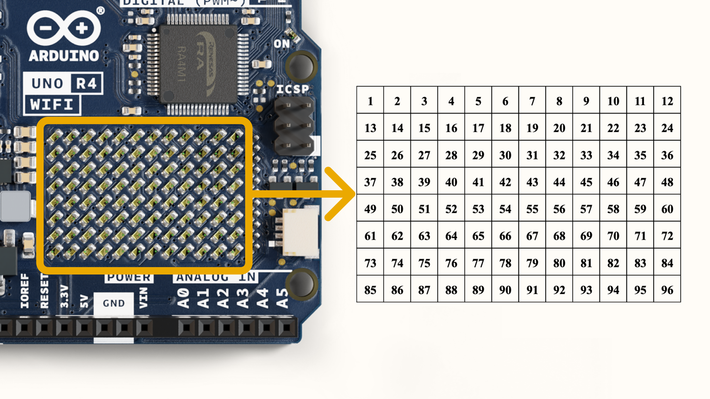

# Description 

The Arduino® UNO R4 WiFi is the first UNO board to feature a 32-bit microcontroller and an ESP32-S3 Wi-Fi module (ESP32-S3-MINI-1-N8). It features a RA4M1 series microcontroller from Renesas (R7FA4M1AB3CFM#AA0), based on a 48MHz Arm® Cortex®-M4 microprocessor. The UNO R4's memory is much larger than its predecessors, with 256KB Flash & 32KB SRAM.

The RA4M1's operating voltage is fixed at 5V, whereas the ESP32-S3 module is 3.3V. Communication between these two MCUs are performed via a logic level translator (TXB0108DQSR).

# Target areas:
Maker, beginner, education

# Features

## R7FA4M1AB3CFM#AA0

The R7FA4M1AB3CFM#AA0 is the main MCU on the UNO R4 WiFi, connected to all pin headers on the board as well as all communication buses. Often referred to as RA4M1 in this datasheet.

* **Overview**
  * 48MHz Arm® Cortex®-M4 microprocessor with a floating point unit (FPU)
  * 5V operating voltage
  * Realtime Clock (RTC)
  * Memory Protection Unit (MPU)
  * Digital Analog Converter (DAC)
* **Memory**
  * 256KB Flash Memory
  * 32KB SRAM
  * 8KB Data Memory (EEPROM)
* **Peripherals**
  * Capacitive Touch Sensing Unit (CTSU)
  * USB 2.0 Full-Speed Module (USBFS)
  * 14-bit ADC
  * up to 12-bit DAC
  * Operational Amplifier (OPAMP)
  * Multiple Clock Sources
    * 1-20 MHz main clock oscillator (MOSC)
    * 32.768 kHz sub-clock oscillator (SOSC)
    * 24-64 MHz high-speed on-chip oscillator (HOCO)
    * 32.768 kHz low-speed on-chip oscillator (LOCO)
  * Segment LCD Controller (SLCDC)
* **Power**
  * Operating voltage for RA4M1 is 5V
  * Recommended input voltage (VIN) is 6-24V
  * Barrel jack connected to VIN pin
  * Power via USB-C® at 5V
* **Communication**
  * 1x UART (pin D0, D1)
  * 1x SPI (pin D10-D13, ICSP header)
  * 1x I²C (pin A4, A5, SDA, SCL)
  * 1x CAN (pin D4, D5, external transceiver is required)

See the full datasheet for the R7FA4M1AB3CFM#AA0 in the link below:
- [R7FA4M1AB3CFM#AA0 datasheet](assets/ra4m1.pdf)

## ESP32-S3-MINI-1-N8

The ESP32-S3-MINI-1-N8 is the secondary MCU with a built-in antenna for Wi-Fi & Bluetooth® connectivity. This module operates on 3.3V and communicates with the RA4M1 using a logic level translator (TXB0108DQSR).

* **Overview**
  * Xtensa® dual-core 32-bit LX7 microprocessor
  * 3.3V operating voltage
  * 40 MHz crystal oscillator
* **Wi-Fi**
  * Wi-Fi support with 802.11 b/g/n standard (Wi-Fi 4).
  * Bit rate at up to 150 Mbps
  * 2.4 GHz frequency range (2.412 - 2.484 GHz)
* **Bluetooth®**
  * Bluetooth 5

See the full datasheet for the ESP32-S3-MINI-1-N8 in the link below:
- [ESP32-S3-MINI-1-N8 datasheet](assets/esp32-s3-mini.pdf)

# CONTENTS

## The Board

### Application Examples

The UNO R4 WiFi is part of the first UNO series of 32-bit development boards, being previously based on 8-bit AVR microcontrollers. There are thousands of guides, tutorials and books written about the UNO board, where UNO R4 WiFi continues it legacy.

The board features the standard 14 digital I/O ports, 6 analog channels, dedicated pins for I²C, SPI and UART connections. It has compared to its predecessors much larger memory: 8 times more flash memory (256KB) and 16 times more SRAM (32KB).

Additionally, it features an ESP32-S3 module for IoT projects, as well as a built-in 12x8 LED matrix, making it the most visually unique Arduino board to date.

**Entry level projects:** If this is your first project within coding and electronics, the UNO R4 WiFi is a good fit. It is easy to get started with, has a lot of online documentation (both official + 3rd party).

**Easy IoT applications:** build projects without writing any networking code in the Arduino IoT Cloud. Monitor your board, connect it with other boards and services, and develop cool IoT projects.

**LED Matrix:** the 12x8 LED matrix on the board can be used for animations, text scrolling or mini-games. It is also a fun feature that can be used to personalise your board!

### Related Products
* UNO R3
* UNO R3 SMD

# Rating

## Recommended Operating Conditions

| Symbol          | Description                      | Min                | Typ | Max                | Unit |
| --------------- | -------------------------------- | ------------------ | --- | ------------------ | ---- |
| VIN  | Input voltage from VIN pad       | 6                  | 7.0 | 24                 | V    |
| VUSB | Input voltage from USB connector | 4.8                | 5.0 | 5.5                | V    |
| VDD  | Input high-level voltage         | 0.7*VDD |     | VDD     | V    |
| VIL  | Input low-level voltage          | 0                  |     | 0.3*VDD | V    |
| TOP  | Operating Temperature            | -40                | 25  | 85                 | °C   |

**Note:** VDD controls the logic level and is connected to the 5V power rail. VAREF is for the analog logic.

 

# Functional Overview

## Block Diagram

## Board Topology

### Front View

| **Ref.**    | **Description**                                |
| ----------- | ---------------------------------------------- |
| U1          | R7FA4M1AB3CFM#AA0 Microcontroller IC           |
| U2          | NLASB3157DFT2G Multiplexer                     |
| U3          | ISL854102FRZ-T Buck Converter                  |
| U4          | TXB0108DQSR logic level translator (5V - 3.3V) |
| U5          | SGM2205-3.3XKC3G/TR 3.3V linear regulator      |
| U6          | NLASB3157DFT2G Multiplexer                     |
| U_LEDMATRIX | Matrix with 96x LEDs                           |
| M1          | ESP32-S3-MINI-1-N8                             |
| PB1         | RESET Button                                   |
| JANALOG     | Analog input/output headers                    |
| JDIGITAL    | Digital input/output headers                   |
| JOFF        | OFF, VRTC header                               |
| J1          | CX90B-16P USB-C® connector                     |
| J2          | SM04B-SRSS-TB(LF)(SN) I2C connector            |
| J3          | ICSP header (SPI)                              |
| J5          | DC Jack                                        |
| J6          | ESP header                                     |
| DL1         | LED TX (serial transmit)                       |
| DL2         | LED RX (serial receive)                        |
| DL3         | LED Power (green)                              |
| DL4         | LED SCK (serial clock)                         |
| D1          | PMEG6020AELRX Schottky Diode                   |
| D2          | PMEG6020AELRX Schottky Diode                   |
| D3          | PRTR5V0U2X,215 ESD Protection                  |

### Back View

## Microcontroller (R7FA4M1AB3CFM#AA0)

The UNO R4 WiFi is based on the 32-bit RA4M1 series microcontroller, **R7FA4M1AB3CFM#AA0**, from Renesas, which uses a 48MHz Arm® Cortex®-M4 microprocessor with a floating point unit (FPU).

This microcontroller can operate on a range between 1.6V - 5.5V, but on the UNO R4 WiFi, it is fixed at 5V as to be fully retro compatible with other UNO accessories. 

The R7FA4M1AB3CFM#AA0 features:
* 256KB flash / 32KB SRAM / 8KB data flash (EEPROM)
* Real Time Clock (RTC)
* 4x Direct Memory Access Controller (DMAC) 
* 14-bit ADC
* up to 12-bit DAC
* 4x OPAMP
* CAN bus

For more technical details on this microcontroller, visit [Renesas - RA4M1 series](https://www.renesas.com/us/en/products/microcontrollers-microprocessors/ra-cortex-m-mcus/ra4m1-32-bit-microcontrollers-48mhz-arm-cortex-m4-and-lcd-controller-and-cap-touch-hmi).

## Radio Module (ESP32-S3-MINI-1-N8)

The Wi-Fi / Bluetooth® LE module on the UNO R4 WiFi is from the ESP32-S3 SoCs. It features the Xtensa® dual-core 32-bit LX7 MCU, a built-in antenna and support for 2.4 GHz bands.

The ESP32-S3-MINI-1-N8 features:
* Wi-Fi / Bluetooth® LE support
* 3.3V operating voltage
* 384 KB ROM
* 512 KB SRAM
* Up to 150 Mbps bit rate

This module acts as a secondary MCU on the UNO R4 WiFi, and communicates with the RA4M1 MCU using a logic level translator. Note that this module operates on 3.3V as opposed to the RA4M1's 5V operating voltage. 

### ESP Header

The header located close to the RESET pushbutton can be used to access the ESP32-S3 module directly. The pins accessible are:

* `ESP_IO41` - MTDI debugging 
* `ESP_IO42` - MTMS debugging 
* `ESP_TXD0` - Serial Transmit (UART)
* `ESP_RXD0` - Serial Receive (UART)
* `ESP_DOWNLOAD` - boot
* `GND` - ground. 

### USB Bridge

When programming the UNO R4 WiFi, the RA4M1 MCU is programmed via the ESP32-S3 module by default. The **U2** and **U6** switches can switch the USB communication to go directly to the RA4M1 MCU, by writing a high state to the `P408` pin (D40).

Soldering together the `SJ1` pads permanently sets the USB communication directly to the RA4M1, bypassing the ESP32-S3. 

## USB Connector

The UNO R4 WiFi has one USB-C® port, used to power and program your board as well as sending & receiving serial communication.

Note that you should not power the board with more than 5V via the USB-C® port.

## LED Matrix

The UNO R4 WiFi features a 12x8=96 LED matrix (U_LEDMATRIX), connected using the charlieplexing technique. The LEDs are red.

The following pins on the RA4M1 MCU is used for the matrix:
- P003
- P004
- P011
- P012
- P013
- P015
- P204
- P205
- P206
- P212
- P213

These LEDs can be accessed as an array, using a specific library. See the mapping below:

This matrix can be used for a number of projects and prototyping purposes, and supports animation, simple game designs and scrolling text among other things.

## Digital Analog Converter (DAC)

The UNO R4 WiFi has one 8-bit & one 12-bit DAC attached to the A0 analog pin. A DAC is used to convert a digital signal to an analog signal. 

The DAC is connected to 

 

## I²C Connector

The I²C connector SM04B-SRSS-TB(LF)(SN) is connected to the main I²C bus on the board. Note that this connector is powered via 3.3V.

This connector also shares the following pin connections:

**JANALOG header**
- A4
- A5

**JDIGITAL header**
- SDA
- SCL

**Please note:** as A4/A5 is connected to the main I²C bus, these should not be used as ADC inputs whenever the bus is in use. You can however connect I²C devices to each of these pins and connector simultaneously.

## Power Options

Power can either be supplied via the VIN pin, or via USB-C® connector. If power is supplied via VIN, the ISL854102FRZ buck converter steps the voltage down to 5V.

Both VUSB and VIN pins are connected to the ISL854102FRZ buck converter, with Schottky diodes in place for reverse polarity & overvoltage protection respectively. 

Power via USB supplies about ~4.7V (due to Schottky drop) to the RA4M1 MCU.

The linear regulator (SGM2205-3.3XKC3G/TR) converts 5V from either the buck converter or USB, and provides 3.3V to a number of components, including the ESP32-S3 module.

### Power Tree

### Pin Voltage

The general operating voltage for UNO R4 WiFi is 5V, however the ESP32-S3 module's operating voltage is 3.3V. 

### Pin Current

The GPIOs on the R7FA4M1AB3CFM#AA0 microcontroller can handle up to 20 mA. Never connect devices that draw higher current directly to a GPIO.

For powering e.g. servo motors, use an external power supply.

# Mechanical Information

## Pinout

### Analog

| Pin | Function | Type   | Description                                     |
| --- | -------- | ------ | ----------------------------------------------- |
| 1   | BOOT     | NC     | Not Connected                                   |
| 2   | IOREF    | IOREF  | Reference for digital logic V - connected to 5V |
| 3   | Reset    | Reset  | Reset                                           |
| 4   | +3V3     | Power  | +3V3 Power Rail                                 |
| 5   | +5V      | Power  | +5V Power Rail                                  |
| 6   | GND      | Power  | Ground                                          |
| 7   | GND      | Power  | Ground                                          |
| 8   | VIN      | Power  | Voltage Input                                   |
| 9   | A0       | Analog | Analog input 0 / DAC                            |
| 10  | A1       | Analog | Analog input 1 / OPAMP+                         |
| 11  | A2       | Analog | Analog input 2 / OPAMP-                         |
| 12  | A3       | Analog | Analog input 3 / OPAMPOut                       |
| 13  | A4       | Analog | Analog input 4 / I²C Serial Datal (SDA)         |
| 14  | A5       | Analog | Analog input 5 / I²C Serial Clock (SCL)         |

### Digital

| Pin | Function  | Type    | Description                                      |
| --- | --------- | ------- | ------------------------------------------------ |
| 1   | SCL       | Digital | I²C Serial Clock (SCL)                           |
| 2   | SDA       | Digital | I²C Serial Datal (SDA)                           |
| 3   | AREF      | Digital | Analog Reference Voltage                         |
| 4   | GND       | Power   | Ground                                           |
| 5   | D13/SCK   | Digital | GPIO 13 / SPI Clock                              |
| 6   | D12/CIPO  | Digital | GPIO 12 / SPI Controller In Peripheral Out       |
| 7   | D11/COPI  | Digital | GPIO 11 (PWM) / SPI Controller Out Peripheral In |
| 8   | D10/CS    | Digital | GPIO 10 (PWM) / SPI Chip Select                  |
| 9   | D9        | Digital | GPIO 9 (PWM~)                                    |
| 10  | D8        | Digital | GPIO 8                                           |
| 11  | D7        | Digital | GPIO 7                                           |
| 12  | D6        | Digital | GPIO 6 (PWM~)                                    |
| 13  | D5/CANRX0 | Digital | GPIO 5 (PWM~) / CAN Transmitter (TX)             |
| 14  | D4/CANTX0 | Digital | GPIO 4 / CAN Receiver (RX)                       |
| 15  | D3        | Digital | GPIO 3 (PWM~)                                    |
| 16  | D2        | Digital | GPIO 2                                           |
| 17  | D1/TX0    | Digital | GPIO 1 / Serial 0 Transmitter (TX)               |
| 18  | D0/TX0    | Digital | GPIO 0 / Serial 0 Receiver    (RX)               |

### OFF

| Pin | Function | Type  | Description                          |
| --- | -------- | ----- | ------------------------------------ |
| 1   | OFF      | Power | For controlling power supply         |
| 2   | GND      | Power | Ground                               |
| 1   | VRTC     | Power | Battery connection to power RTC only |

### ICSP

| Pin | Function | Type     | Description                  |
| --- | -------- | -------- | ---------------------------- |
| 1   | CIPO     | Internal | Controller In Peripheral Out |
| 2   | +5V      | Internal | Power Supply of 5V           |
| 3   | SCK      | Internal | Serial Clock                 |
| 4   | COPI     | Internal | Controller Out Peripheral In |
| 5   | RESET    | Internal | Reset                        |
| 6   | GND      | Internal | Ground                       |

### SWD/JTAG

| Pin | Function | Type     | Description        |
| --- | -------- | -------- | ------------------ |
| 1   | +5V      | Internal | Power Supply of 5V |
| 2   | SWDIO    | Internal | Data I/O pin       |
| 3   | GND      | Internal | Ground             |
| 4   | SWCLK    | Internal | Clock Pin          |
| 5   | GND      | Internal | Ground             |
| 6   | NC       | Internal | Not connected      |
| 7   | RX       | Internal | Serial Receiver    |
| 8   | TX       | Internal | Serial Transmitter |
| 9   | GND      | Internal | Ground             |
| 10  | NC       | Internal | Not connected      |

## Mounting Holes And Board Outline

 

## Board Operation

### Getting Started - IDE

If you want to program your UNO R4 WiFi while offline you need to install the Arduino® Desktop IDE **[1]**. To connect the UNO R4 WiFi to your computer, you will need a Type-C® USB cable, which can also provide power to the board, as indicated by the LED (DL1).

### Getting Started - Arduino Web Editor

All Arduino boards, including this one, work out-of-the-box on the Arduino® Web Editor **[2]**, by just installing a simple plugin.

The Arduino Web Editor is hosted online, therefore it will always be up-to-date with the latest features and support for all boards. Follow **[3]** to start coding on the browser and upload your sketches onto your board.

### Getting Started - Arduino IoT Cloud

All Arduino IoT enabled products are supported on Arduino IoT Cloud which allows you to log, graph and analyze sensor data, trigger events, and automate your home or business.

### Online Resources

Now that you have gone through the basics of what you can do with the board you can explore the endless possibilities it provides by checking exciting projects on ProjectHub **[4]**, the Arduino Library Reference **[5]**, and the online store **[6]**; where you will be able to complement your board with sensors, actuators and more.

### Board Recovery

All Arduino boards have a built-in bootloader which allows flashing the board via USB. In case a sketch locks up the processor and the board is not reachable anymore via USB, it is possible to enter bootloader mode by double-tapping the reset button right after the power-up.

# Certifications

## Declaration of Conformity CE DoC (EU)

We declare under our sole responsibility that the products above are in conformity with the essential requirements of the following EU Directives and therefore qualify for free movement within markets comprising the European Union (EU) and European Economic Area (EEA).

## Declaration of Conformity to EU RoHS & REACH 211 01/19/2021

Arduino boards are in compliance with RoHS 2 Directive 2011/65/EU of the European Parliament and RoHS 3 Directive 2015/863/EU of the Council of 4 June 2015 on the restriction of the use of certain hazardous substances in electrical and electronic equipment.

| **Substance**                          | **Maximum Limit (ppm)** |
| -------------------------------------- | ----------------------- |
| Lead (Pb)                              | 1000                    |
| Cadmium (Cd)                           | 100                     |
| Mercury (Hg)                           | 1000                    |
| Hexavalent Chromium (Cr6+)             | 1000                    |
| Poly Brominated Biphenyls (PBB)        | 1000                    |
| Poly Brominated Diphenyl ethers (PBDE) | 1000                    |
| Bis(2-Ethylhexyl} phthalate (DEHP)     | 1000                    |
| Benzyl butyl phthalate (BBP)           | 1000                    |
| Dibutyl phthalate (DBP)                | 1000                    |
| Diisobutyl phthalate (DIBP)            | 1000                    |

Exemptions : No exemptions are claimed.

Arduino Boards are fully compliant with the related requirements of European Union Regulation (EC) 1907 /2006 concerning the Registration, Evaluation, Authorization and Restriction of Chemicals (REACH). We declare none of the SVHCs (<https://echa.europa.eu/web/guest/candidate-list-table>), the Candidate List of Substances of Very High Concern for authorization currently released by ECHA, is present in all products (and also package) in quantities totaling in a concentration equal or above 0.1%. To the best of our knowledge, we also declare that our products do not contain any of the substances listed on the "Authorization List" (Annex XIV of the REACH regulations) and Substances of Very High Concern (SVHC) in any significant amounts as specified by the Annex XVII of Candidate list published by ECHA (European Chemical Agency) 1907 /2006/EC.

## Conflict Minerals Declaration

As a global supplier of electronic and electrical components, Arduino is aware of our obligations with regards to laws and regulations regarding Conflict Minerals, specifically the Dodd-Frank Wall Street Reform and Consumer Protection Act, Section 1502. Arduino does not directly source or process conflict minerals such as Tin, Tantalum, Tungsten, or Gold. Conflict minerals are contained in our products in the form of solder, or as a component in metal alloys. As part of our reasonable due diligence Arduino has contacted component suppliers within our supply chain to verify their continued compliance with the regulations. Based on the information received thus far we declare that our products contain Conflict Minerals sourced from conflict-free areas.

## FCC Caution

Any Changes or modifications not expressly approved by the party responsible for compliance could void the user’s authority to operate the equipment.

This device complies with part 15 of the FCC Rules. Operation is subject to the following two conditions:

(1) This device may not cause harmful interference

(2) this device must accept any interference received, including interference that may cause undesired operation.

**FCC RF Radiation Exposure Statement:**

1. This Transmitter must not be co-located or operating in conjunction with any other antenna or transmitter.

2. This equipment complies with RF radiation exposure limits set forth for an uncontrolled environment.

3. This equipment should be installed and operated with a minimum distance of 20 cm between the radiator & your body.

English:
User manuals for licence-exempt radio apparatus shall contain the following or equivalent notice in a conspicuous location in the user manual or alternatively on the device or both. This device complies with Industry Canada licence-exempt RSS standard(s). Operation is subject to the following two conditions:

(1) this device may not cause interference

(2) this device must accept any interference, including interference that may cause undesired operation of the device.

French:
Le présent appareil est conforme aux CNR d’Industrie Canada applicables aux appareils radio exempts de licence. L’exploitation est autorisée aux deux conditions suivantes :

(1) l’ appareil nedoit pas produire de brouillage

(2) l’utilisateur de l’appareil doit accepter tout brouillage radioélectrique subi, même si le brouillage est susceptible d’en compromettre le fonctionnement.

**IC SAR Warning:**

English
This equipment should be installed and operated with a minimum distance of 20 cm between the radiator and your body.  

French:
Lors de l’ installation et de l’ exploitation de ce dispositif, la distance entre le radiateur et le corps est d ’au moins 20 cm.

**Important:** The operating temperature of the EUT can’t exceed 85℃ and shouldn’t be lower than -40℃.

Hereby, Arduino S.r.l. declares that this product is in compliance with essential requirements and other relevant provisions of Directive 201453/EU. This product is allowed to be used in all EU member states.

| Frequency bands      | Maximum output power (ERP) |
| -------------------- | -------------------------- |
| 2.4 GHz, 40 channels | TBD                        |

## Company Information

| Company name    | Arduino SRL                                  |
| --------------- | -------------------------------------------- |
| Company Address | Via Andrea Appiani, 25 - 20900 MONZA（Italy) |

## Reference Documentation

| Ref                       | Link                                                                                            |
| ------------------------- | ----------------------------------------------------------------------------------------------- |
| Arduino IDE (Desktop)     | <https://www.arduino.cc/en/Main/Software>                                                       |
| Arduino IDE (Cloud)       | <https://create.arduino.cc/editor>                                                              |
| Cloud IDE Getting Started | <https://docs.arduino.cc/cloud/web-editor/tutorials/getting-started/getting-started-web-editor> |
| Project Hub               | <https://create.arduino.cc/projecthub?by=part&part_id=11332&sort=trending>                      |
| Library Reference         | <https://github.com/arduino-libraries/>                                                         |
| Online Store              | <https://store.arduino.cc/>                                                                     |

## Change Log

| **Date**   | **Changes** |
| ---------- | ----------- |
| 25/04/2023 | Release     |