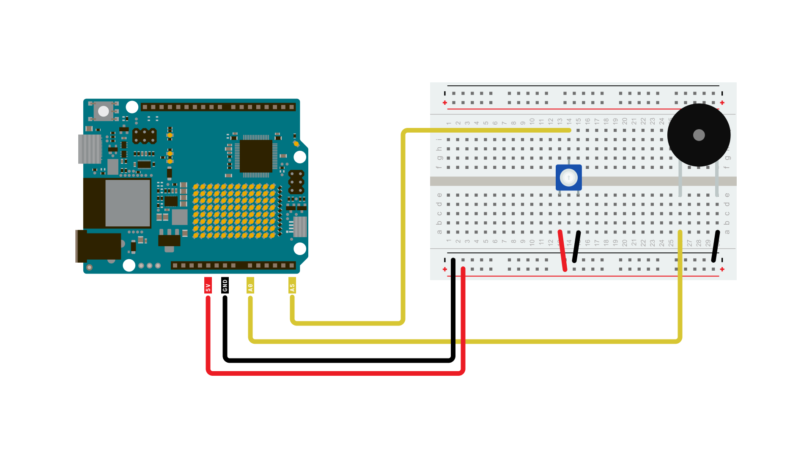

The Arduino UNO R4 WiFi has a built in **DAC** (Digital-to-analog Converter) which is used to transform a digital signal to an analog one. This feature can be used to build a plethora of fun audio projects, but also work as professional lab equipment as a cheap function generator, for example.

## Goals

In this article, you will learn:
- About the DAC feature onboard the UNO R4 WiFi,
- differences between PWM and DAC techniques,
- how to generate a waveform (sawtooth),
- how to output this waveform on a piezo speaker.

## Hardware & Software Needed
  To follow along with this article, you will need the following hardware: 
  
  - [Arduino UNO R4 WiFi](https://store.arduino.cc/products/arduino-uno-r4-wifi)
  - Piezo buzzer 
  - Potentiometer
  - Jumper wires

## Circuit
The circuit required for this tutorial can be found in the diagram below:



## Analog Output vs PWM
For many use cases when analog output is required, using PWM (Pulse Width Modulation) instead of genuine analog output will yield essentially the same results. A digital output pin can only either be fully on (HIGH) or fully off (LOW), but by turning on and off very quickly with precise timings, the average voltage can be controlled and emulate an analog output. This method is called [PWM](/learn/microcontrollers/analog-output). 

For example when dimming an LED, you can freely use a PWM enabled digital pin as an analog output pin and the LED would dim just the same as if you'd be using a DAC output. 

However this will not always be the case, and for many uses you will need to use a genuine analog output to get your desired results. One such case is in audio purposes, where a PWM output simply will not give the same quality of sound as a genuine analog output, and requires some fiddling to work in the first place.

## Code
The code for this tutorial is split in two part, one main sketch and a header file containing a pre-generated sawtooth-waveform.

With this sketch, we have pre-generated a sawtooth waveform. You cpould also dynamically generate it either at the beginning of your sketch or during, but doing so would be less efficient without gaining any performance. So going this route is the best practice. 

The waveform is being stored as samples in an array, and with every loop of the sketch we'll update the DACs output value to the next value in the array.  

Open a new sketch and paste the following code into your window.

```arduino
/*
  Simple Sawtooth Waveform generator with Arduino UNO R4 WiFi

 */

#include "Waveforms.h"

#define oneHzSample 10000 / maxSamplesNum  // sample for the 1Hz signal expressed in microseconds


int i = 0;
int sample;


void setup() {
  analogWriteResolution(12);  // set the analog output resolution to 12 bit (4096 levels)
  analogReadResolution(12);  // set the analog input resolution to 12 bit (4096 levels)
}

void loop() {

  sample = map(analogRead(A5), 0, 4095, 0, 1000);

  analogWrite(DAC, waveformsTable[i]);  // write the selected waveform on DAC0

  i++;
  if (i == maxSamplesNum)  // Reset the counter to repeat the wave
    i = 0;

  delayMicroseconds(sample);  // Hold the sample value for the sample time
}
```
Now you will need to create the header file that will hold the waveform. Click the three dots in the top right of the Arduino IDE window, select **"New Tab"**, and name the new file **"Waveforms.h"**.


Then paste the following code into the empty file.

```arduino
#ifndef _Waveforms_h_
#define _Waveforms_h_

#define maxSamplesNum 120

static int waveformsTable[maxSamplesNum] = {

    0x22, 0x44, 0x66, 0x88, 0xaa, 0xcc, 0xee, 0x110, 0x132, 0x154,
    0x176, 0x198, 0x1ba, 0x1dc, 0x1fe, 0x220, 0x242, 0x264, 0x286, 0x2a8,
    0x2ca, 0x2ec, 0x30e, 0x330, 0x352, 0x374, 0x396, 0x3b8, 0x3da, 0x3fc,
    0x41e, 0x440, 0x462, 0x484, 0x4a6, 0x4c8, 0x4ea, 0x50c, 0x52e, 0x550,
    0x572, 0x594, 0x5b6, 0x5d8, 0x5fa, 0x61c, 0x63e, 0x660, 0x682, 0x6a4,
    0x6c6, 0x6e8, 0x70a, 0x72c, 0x74e, 0x770, 0x792, 0x7b4, 0x7d6, 0x7f8,
    0x81a, 0x83c, 0x85e, 0x880, 0x8a2, 0x8c4, 0x8e6, 0x908, 0x92a, 0x94c,
    0x96e, 0x990, 0x9b2, 0x9d4, 0x9f6, 0xa18, 0xa3a, 0xa5c, 0xa7e, 0xaa0,
    0xac2, 0xae4, 0xb06, 0xb28, 0xb4a, 0xb6c, 0xb8e, 0xbb0, 0xbd2, 0xbf4,
    0xc16, 0xc38, 0xc5a, 0xc7c, 0xc9e, 0xcc0, 0xce2, 0xd04, 0xd26, 0xd48,
    0xd6a, 0xd8c, 0xdae, 0xdd0, 0xdf2, 0xe14, 0xe36, 0xe58, 0xe7a, 0xe9c,
    0xebe, 0xee0, 0xf02, 0xf24, 0xf46, 0xf68, 0xf8a, 0xfac, 0xfce, 0xff0
  

};

#endif
```

## Testing It Out
Once you have uploaded the code to the board, it should start generating a sawtooth wave oscillation on the DAC, that depending on the frequency could be used to produce sound on a piezo buzzer or speaker. If you have an oscilloscope at hand, connecting its probe to the DAC output might be an interesting exercise so see what the wave looks like. 

Now try twisting the potentiometer, and listen to how the sound changes.

## Conclusion
By following this tutorials you've experimented with the DAC on the Arduino UNO R4 boards and used it to generate a sawtooth wave. 
