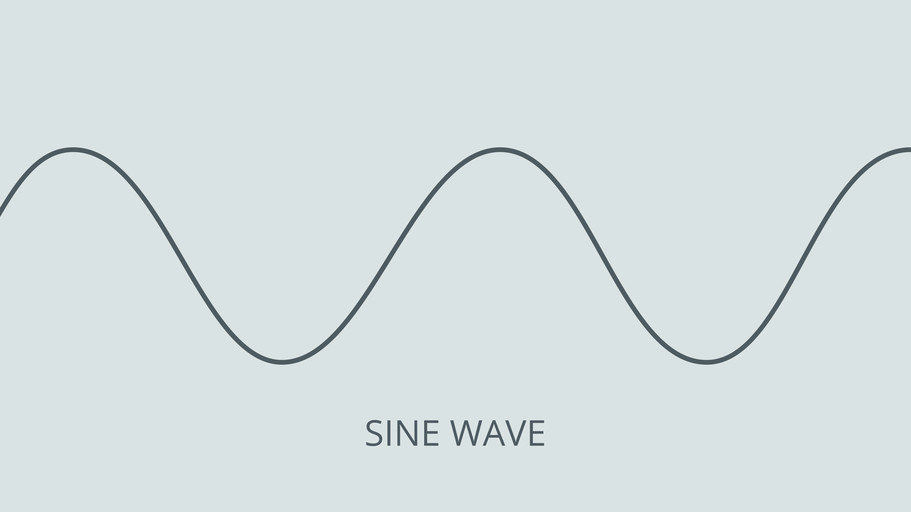
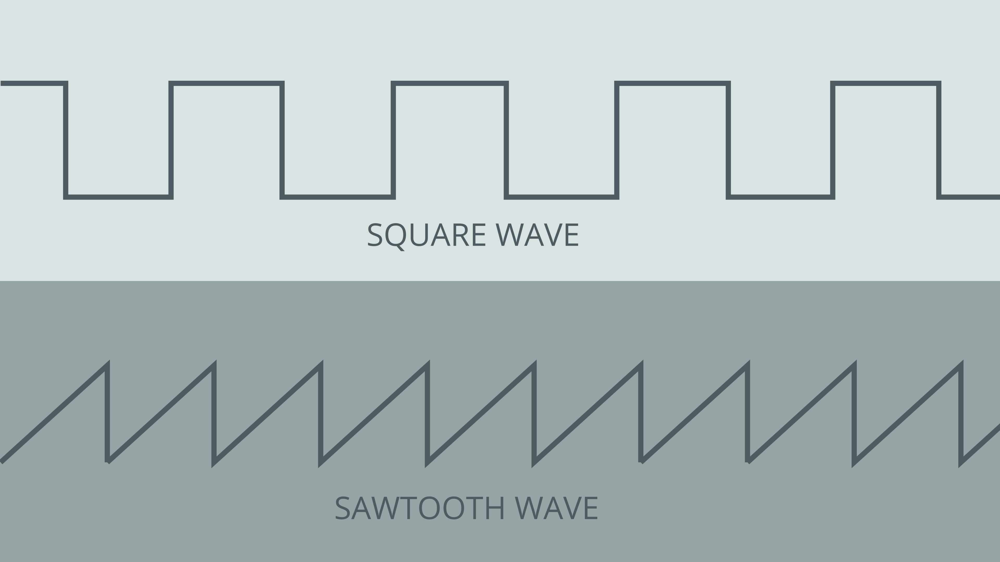

The Arduino UNO R4 WiFi has a built in **DAC** (Digital-to-analog Converter) which is used to transform a digital signal to an analog one. This feature can be used to build a plethora of fun audio projects, but also work as professional lab equipment as a cheap function generator, for example.

## Goals

In this article, you will learn:
- About the DAC feature onboard the UNO R4 WiFi,
- differences between PWM and DAC techniques,
- how to generate a waveform (sine),
- how to output this waveform on a piezo speaker.

## Hardware & Software Needed
  To follow along with this article, you will need the following hardware: 
  
  - [Arduino UNO R4 WiFi](https://store.arduino.cc/uno-r4-wifi)
  - Piezo buzzer 
  - Potentiometer
  - Jumper wires

## Circuit
The circuit required for this tutorial can be found in the diagram below:


## Analog Output vs PWM
For many use cases when analog output is required, using PWM (Pulse Width Modulation) instead of genuine analog output will yield essentially the same results. A digital output pin can only either be fully on (HIGH) or fully off (LOW), but by turning on and off very quickly with precise timings, the average voltage can be controlled and emulate an analog output. This method is called [PWM](/learn/microcontrollers/analog-output). 

For example when dimming an LED, you can freely use a PWM enabled digital pin as an analog output pin and the LED would dim just the same as if you'd be using a DAC output. 

However this will not always be the case, and for many uses you will need to use a genuine analog output to get your desired results. One such case is in audio purposes, where a PWM output simply will not give the same quality of sound as a genuine analog output, and requires some fiddling to work in the first place.

## Code
The code for this tutorial is split in two parts, one main sketch and a header file containing a pre-generated sawtooth-waveform.

With this sketch, we have pre-generated a sine waveform. You could also dynamically generate it either at the beginning of your sketch or during, but doing so would be less efficient without gaining any performance. So going this route is the best practice. 

The waveform is being stored as samples in an array, and with every loop of the sketch we'll update the DACs output value to the next value in the array.  

Open a new sketch and paste the following code into your window.

<CodeBlock url="https://github.com/arduino/ArduinoCore-renesas/blob/main/libraries/AnalogWave/examples/SineWave/SineWave.ino" className="arduino"/>

## Testing It Out
Once you have uploaded the code to the board, it should start generating a sine wave oscillation on the DAC, that depending on the frequency could be used to produce sound on a piezo buzzer or speaker. If you have an oscilloscope at hand, connecting its probe to the DAC output might be an interesting exercise so see what the wave looks like. 

Now try twisting the potentiometer, and listen to how the sound changes.

### Analog Wave Types

The sketch above generates what is known as a sine wave. It is called a sine wave because if you were to plot the voltage against time, you'd notice that the line looks just like a sine function.



There are other types of analog waves that will produce a distinctly different type of sound compared to a sine wave. The library we're using in this sketch also allows you to create sawtooth and square waves. These types of wave also gets their names from how they look when the voltages are plotted against time.



Try changing the wave type and listen how it changes the feel of the sound. 

Change the wave by replacing **Line 18 in the sketch** "`wave.sine(freq);`" with either

 ```arduino
 wave.square(freq);
 ```
or 
```arduino
wave.saw(freq);
```

Now that you know your setup is working, you can experiment further with different examples and see how you can use the DAC of the UNO R4 to generate sounds and even melodies.

***Note: In this setup, we're just using a piezo buzzer, you may notice that the sounds it's making are pretty faint. If you want to fix this you'll need a 4 or 8 Ohm speaker, and an amplifier. You can find many breakout amplifier modules that are easy to use online.***

### Frere Jacques

This one for example plays the melody of Frere Jacques:
<CodeBlock url="https://github.com/arduino/ArduinoCore-renesas/blob/main/libraries/AnalogWave/examples/DACJacques/DACJacques.ino" className="arduino"/>

### MIDI Piano Notes
This sketch will break down the potentiometer input into steps, that are translated to the 88 MIDI notes that represent the keys on a piano.

<CodeBlock url="https://github.com/arduino/ArduinoCore-renesas/blob/main/libraries/AnalogWave/examples/DACEqualTemperedScale/DACEqualTemperedScale.ino" className="arduino"/>

## Conclusion
By following this tutorials you've experimented with the DAC on the Arduino UNO R4 boards and used it to first generate a sine wave, and then to explore the possibilities of analog output by testing out various examples.
