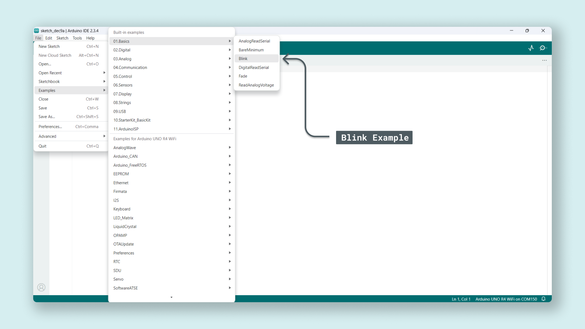
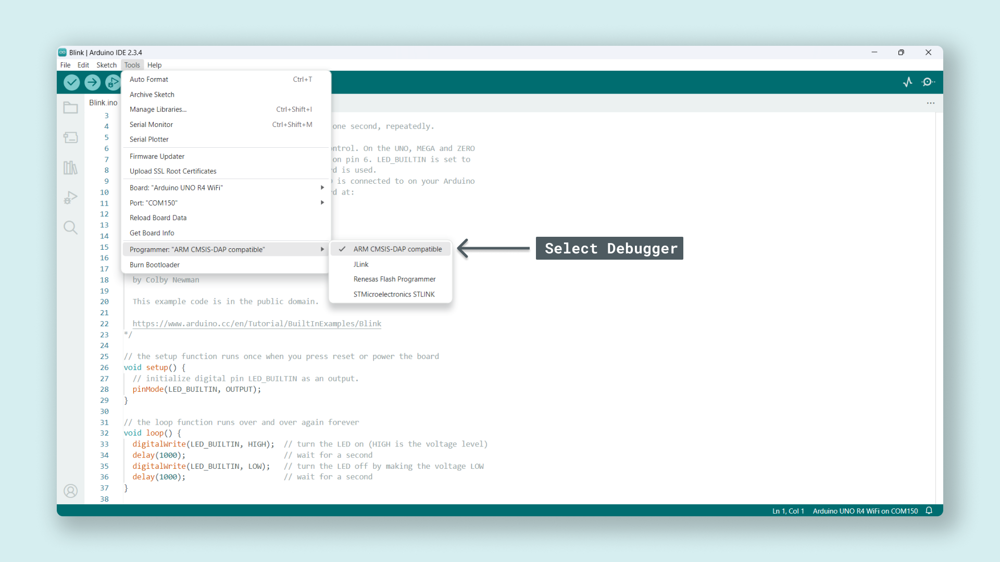
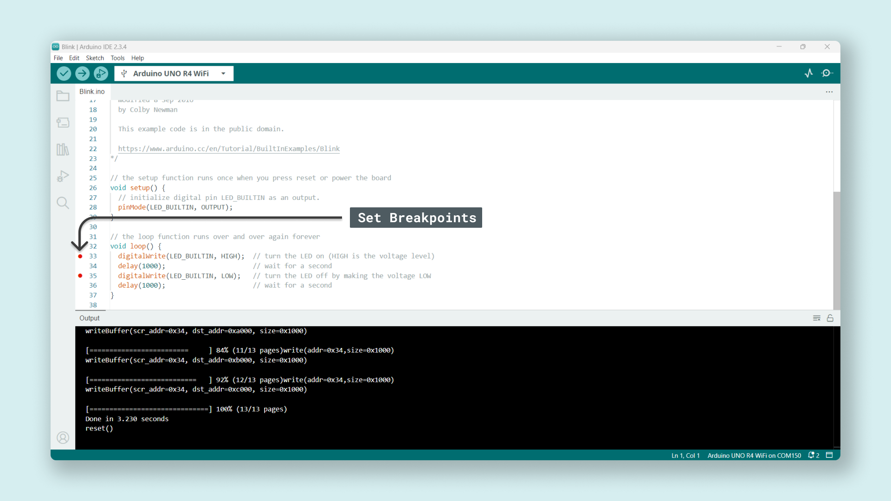
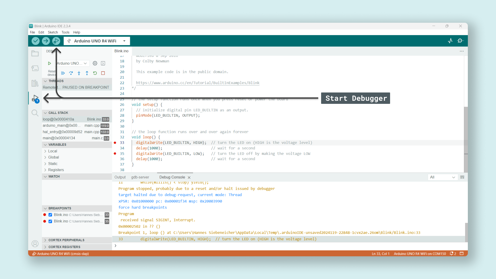
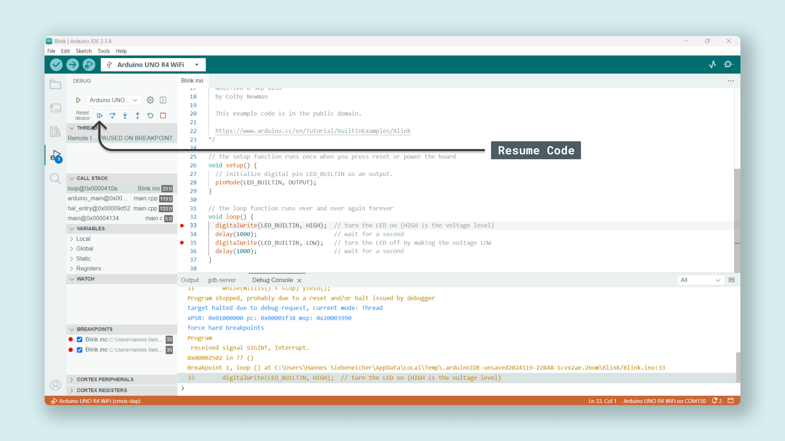

Debugging is the process of identifying and fixing errors in your code. It’s a vital skill for anyone writing code especially when dealing with microcontrollers like those on your Arduino. As with everything, debugging can be done at different levels, you can read up on the topic [here](/learn/microcontrollers/debugging). 

In this context, debugging is a term used to describe the process of inspecting the code at different points in time.

An analogy that is often used is to think of it as "stepping into" the code, grabbing full control of the clock and walking through it line by line, checking the value of variables as you go, and reading specific memory addresses to make sure information is being passed on as intended. 

This is especially helpful when creating complex projects, but even as a beginner, it can be helpful to know the basics of debugging, consequently saving you time and energy when trying to find the little annoying error causing your program to break down.

This article covers the basic steps for debugging the UNO R4 WiFi using the IDE, such as setting breakpoints. A breakpoint is an intentional stopping or pausing place at a specific point in the code, allowing you to read values at that exact point. In this case, we will be using the Arduino IDE which we can use to set breakpoints, read out memory addresses, and read the value of any variable at a specific point in time.

## Goals

The goals of this tutorial are:

- learn about the basics of debugging.
- learn how to set up the Arduino IDE to debug an Arduino sketch.

## Hardware & Software Needed

- [Arduino IDE](https://www.arduino.cc/en/main/software)
- [Arduino UNO R4 WiFi](https://store.arduino.cc/uno-r4-wifi)
- [UNO R4 Board Package](/tutorials/uno-r4-minima/minima-getting-started)

## Debugging

Debugging your Arduino project allows you to dive deep into your code and troubleshoot as well as analyze the code execution. Yu can gain full access to the microcontroller's internal registers, memory, and variables. This is especially helpful when working on more complex projects where understanding the code execution flow is crucial. With the Arduino IDE you can step through the code line by line, allowing you to analyze why your code might break at a specific point.

## Connection

The only thing you need to do is to connect your UNO R4 WiFi to your computer using a USB-Cable.

## Software 

### Setting up the Arduino IDE

First, if you haven't done it yet, install the [Arduino IDE](https://www.arduino.cc/en/software). It's a good ieda to verify that everything is working as it should by uploading the Blink example.

## Set correct Programmer

To access and debug the mcu it's important that we set the correct programmer. Select **Tools** > **Programmer** > **ARM CMSIS-DAP compatible**.

## Setting Breakpoints

As mentioned above a breakpoint is an intentional stopping or pausing place at a specific point in the code. You can add them by clicking the sidebar next to your sketch, and you should see a red dot appear. You have now set a breakpoint.

## Start Debugging

Now you are ready to start debugging. Press "**Start Debugging**" next to the "Upload button" or click the icon in the left sidebar.

You will see how your code is executed and **stopped** at the line you set the breakpoint. You can set as many breakpoints as you want, depending on where you want to stop your code.

To resume the code press the "**Continue**" in the top left corner and you will see how the code runs until the it reaches the next breakpoint.

