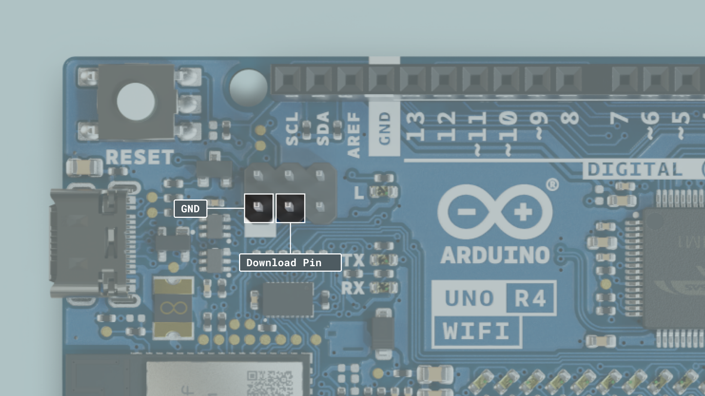

The [Arduino UNO R4 WiFi](/hardware/uno-r4-wifi) has two different microcontrollers onboard, the Renesas RA4M1 and the ESP32-S3.

By default, the ESP32-S3 module acts as a serial bridge, handling the connection to your computer. It also handles the rebooting of the main MCU, the Renesas RA4M1 when it is needed, for example when receiving a new sketch and resetting.

On the UNO R3, the ATMEGA16U2 serves the same purpose, but the onboard ESP32 module is a more advanced SoC, adding Wi-Fi® & Bluetooth® connectivity to the board.

The UNO R4 WiFi also exposes the ESP32's data lines, so that you can program the ESP32 directly. These data lines are exposed by a 3x2 header at the top of the board, or through pads on the bottom side.

***Please note that the ESP32 has a default firmware installed, which is set to communicate with the RA4M1 chip. Any direct programming of the ESP32 will override that firmware and the communication between the chips may be disrupted until the default firmware is restored.***

## Hardware & Software Needed

- [Arduino UNO R4 WiFi](/hardware/uno-r4-wifi)
- [Python®](https://www.python.org/downloads/)
- esptool

## Step 1: ESP32 Download Mode

In order to flash custom firmware to the ESP32-S3 we need to put the chip in download mode by shorting the **download pin** and **GND**. The download pin can be found on the 3x2 header at the top of the board or on the downside using the exposed pads.



The easiest way is to use a female-to-female cable and short the pins at the top of the board. At this point, the board has to be powered off. Once the pins are shorted you can connect the board to your PC and remove the jumper wire. If you check the device name inside the device manager it should have changed to: **USB JTAG/serial debug unit**.

## Step 2: Flash Firmware

Once the chip is set to the right mode we use esptool to flash custom firmware to the board. For this to work you will need to download and install Python, which you can then use to install esptool using a simple command. Verify that python is installed by opening your terminal and write ``pip3``. Once you have confirmed that it's installed properly install esptool by typing:

```
pip3 install esptool
```

Next, `esptool.py` should be added to your path so you can run it from anywhere, instead of navigating to the installation folder each time. Once everything is working it's just a matter of running the following two commands:

To erase the flash memory run:
```
esptool.py --chip esp32s3 --port <yourPort> erase_flash
```

To upload firmware run:
```
esptool.py --chip esp32s3 --port <your port> write_flash -z 0 <yourCustomFirmware.bin>
```

***Please note that we don't provide any custom firmware in this tutorial. If you flash a firmware that doesn't enable a serial-usb-bridge between two microcontrollers you will lose most of the board's functionality!***

## Restore Default Software

If you want to return to the default firmware simply download the zip file found [here](https://github.com/arduino/uno-r4-wifi-usb-bridge/releases/download/0.2.0/unor4wifi-update-windows.zip). It contains two folders and one `.bat` file, that when executed flashes the default firmware to your board. It's configured in a way so that it takes care of everything and you **don't** need to short the **download** pin and **GND**. If for some reason the script doesn't execute properly or is unable to set your board into download mode you can instead repeat the manual steps of shorting the download pin and GND, and then flash the firmware manually using the `.bin` found in the firmware folder and the esptool.

## Conclusion

These are the steps for uploading firmware to your ESP32-S3. This process is **not suitable for beginners** as it easily breaks your board especially when the serial bridge is not properly implemented. But for those who know what they are doing, it opens up many new possibilities as you can rewrite the firmware on the ESP32 to fit your custom needs.