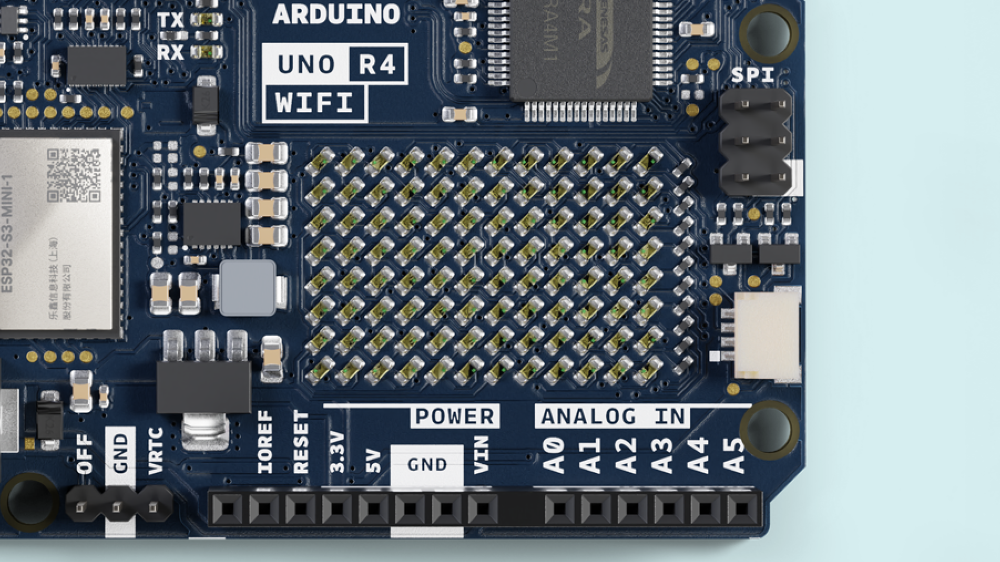
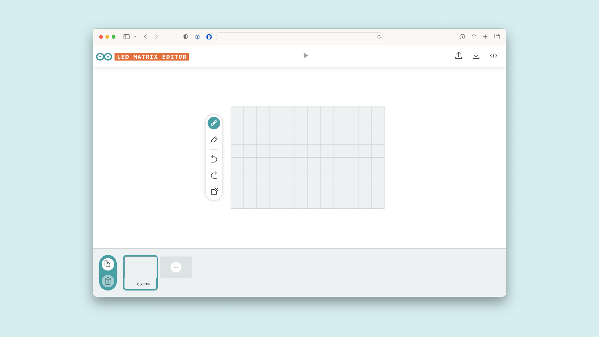

The **Arduino UNO R4 WiFi** comes with a built in 12x8 LED Matrix, that is available to be programmed to display graphics, animations, act as an interface, or even play games on. 
## Goals

The matrix and its API are developed to be programmed in a few different ways, each suited for different applications. This guide will walk you through the basic concepts for programming the LED matrix, and get you started with creating your own animations, while highlighting two different ways of handling the LEDs to create animations and images. This makes it easier for you to decide what method fits your needs best!



## Hardware & Software Needed

- [Arduino UNO R4 WiFi](https://store.arduino.cc/uno-r4-wifi)
- [UNO R4 Core](https://github.com/arduino/ArduinoCore-renesas) (latest version)
- [Arduino IDE](https://www.arduino.cc/en/software)

## Initializing Matrix
To use the LED Matrix library, there are a few things that need to be added to your sketch to get off the ground. 

First, include the library at the top of your sketch, like this:

```arduino
#include "Arduino_LED_Matrix.h"
```

Then, you'll need to create a LED Matrix object in your sketch, by adding the following line directly underneath the first one:

```arduino
ArduinoLEDMatrix matrix;
```

And then lastly, start the LED Matrix by adding this line in `void setup()`:
```arduino
matrix.begin();
```

The entire thing should look like this;

```arduino
#include "Arduino_LED_Matrix.h"

ArduinoLEDMatrix matrix;

void setup() {
  Serial.begin(115200);
  matrix.begin();
}
```


## How to Write a Frame
The LED Matrix library for the UNO R4 WiFi works on the principle of creating a frame, and then loading it into a buffer which displays the frame.

A frame is what we call the "image" that is displayed at any given moment on the matrix. If an animation is a series of images, a frame is one of those images in the series.

In order to control the 12x8 LED matrix on the UNO R4 WiFi, you need a space in memory that's at least 96 bits in size. The library provides two ways to do this. 

The first is simply to make a two-dimensional array of bytes like so:
```arduino
byte frame[8][12] = {
  { 0, 0, 1, 1, 0, 0, 0, 1, 1, 0, 0, 0 },
  { 0, 1, 0, 0, 1, 0, 1, 0, 0, 1, 0, 0 },
  { 0, 1, 0, 0, 0, 1, 0, 0, 0, 1, 0, 0 },
  { 0, 0, 1, 0, 0, 0, 0, 0, 1, 0, 0, 0 },
  { 0, 0, 0, 1, 0, 0, 0, 1, 0, 0, 0, 0 },
  { 0, 0, 0, 0, 1, 0, 1, 0, 0, 0, 0, 0 },
  { 0, 0, 0, 0, 0, 1, 0, 0, 0, 0, 0, 0 },
  { 0, 0, 0, 0, 0, 0, 0, 0, 0, 0, 0, 0 }
};
```

This option is simple to understand, because you can see the image in the pattern of the array, and it is easy to edit in runtime. The ones in the array above form a heart, and that's the image you'd see on the screen.

To target an individual pixel you select its address and change the value, remember that you'll need to start counting at 0. So, the following line will target the third pixel from the left and the second from the top, then turn it on:

```arduino
frame[2][1] = 1;

matrix.renderBitmap(frame, 8, 12);
```

This method takes more memory than is needed, however. Even though each LED needs only a single bit to store its state, you're using eight bits (a byte). The more memory-efficient method to store a frame is to use an array of 32-bit integers.

In this section we'll walk through the process and the concept of how you may create one of these frames yourself. Though we have developed a tool that can do this for you, so you can [click here](#animation-generation) if you want to skip this exercise.

Here's the same heart in that form:

```arduino
unsigned long frame[] = {
  0x3184a444,
  0x42081100,
  0xa0040000
};
```
An unsigned long variable holds 32 bits, and 96/32 is 3, so an unsigned long array is an efficient way to hold all the bits you need for the LED matrix. 

But how do those hexadecimal values relate to the positions of the pixels? To find out, convert the hexadecimal values to binary values. Here's a code snippet that will do this:

```arduino
for (int b = 0; b < 3; b++) {
    Serial.println(frame[b], BIN);
  }
```

This will print out all the bit values of the array. The output will look like this:

```arduino
110001100001001010010001000100
1000010000010000001000100000000
10100000000001000000000000000000
```

This method doesn't show you all the bits, though. Each array element should have 32 bits. If you add zeros to show all 32 bits of each element, you get:

```arduino
00110001100001001010010001000100
01000010000010000001000100000000
10100000000001000000000000000000
```
Now divide it into groups of 12 bits and you've got the heart back:
```arduino
001100011000
010010100100
010001000100
001000001000
000100010000
000010100000
000001000000
000000000000
```

***Hint: You can see the heart easier if you highlight all "1"s on the page by pressing CTRL/command + F and search for "1".***

If you've got several different frames, you can load and display them like this:
```arduino
const uint32_t happy[] = {
	0x19819,
	0x80000001,
	0x81f8000
};

const uint32_t heart[] = {
	0x3184a444,
	0x44042081,
	0x100a0040
};

  matrix.loadFrame(happy);
  delay(500);

  matrix.loadFrame(heart);
  delay(500);
```

## Testing It Out

Let's apply these concepts, with two basic sketches that display different frames on your board. First, let's create 3x32-bit integer frames and load them one by one.

Here's a sketch that will first load a smiley face on your matrix, and then change it to a heart.

```arduino
#include "Arduino_LED_Matrix.h"

ArduinoLEDMatrix matrix;

void setup() {
  Serial.begin(115200);
  matrix.begin();
}

const uint32_t happy[] = {
	0x19819,
	0x80000001,
	0x81f8000
};
const uint32_t heart[] = {
	0x3184a444,
	0x44042081,
	0x100a0040
};
  
void loop(){
  matrix.loadFrame(happy);
  delay(500);

  matrix.loadFrame(heart);
  delay(500);
}
```

The sketch is pretty simple, and yet the outcome is very expressive and can help you easily indicate states of your projects.

Now let's change approach and create a bitmap that we change in runtime. This sketch includes several functions that each draw part of a face, and then winks the left eye by turning off certain pixels. 

```arduino
#include "Arduino_LED_Matrix.h"

ArduinoLEDMatrix matrix;

void setup() {
  Serial.begin(115200);
  matrix.begin();
}

uint8_t frame[8][12] = {
  { 0, 0, 0, 0, 0, 0, 0, 0, 0, 0, 0, 0 },
  { 0, 0, 0, 0, 0, 0, 0, 0, 0, 0, 0, 0 },
  { 0, 0, 0, 0, 0, 0, 0, 0, 0, 0, 0, 0 },
  { 0, 0, 0, 0, 0, 0, 0, 0, 0, 0, 0, 0 },
  { 0, 0, 0, 0, 0, 0, 0, 0, 0, 0, 0, 0 },
  { 0, 0, 0, 0, 0, 0, 0, 0, 0, 0, 0, 0 },
  { 0, 0, 0, 0, 0, 0, 0, 0, 0, 0, 0, 0 },
  { 0, 0, 0, 0, 0, 0, 0, 0, 0, 0, 0, 0 }
};

void leftEye(){
  //Left eye
  frame[1][3] = 1;
  frame[1][4] = 1;
  frame[2][3] = 1;
  frame[2][4] = 1;
}

void wink(){
  //Wink with the left eye
  frame[1][3] = 0;
  frame[1][4] = 0;
  frame[2][3] = 1;
  frame[2][4] = 1;
}

void rightEye(){
  //Right eye
  frame[1][8] = 1;
  frame[1][9] = 1;
  frame[2][8] = 1;
  frame[2][9] = 1;
}

void mouth(){
  //Mouth
  frame[5][3] = 1;
  frame[5][9] = 1;
  frame[6][3] = 1;
  frame[6][4] = 1;
  frame[6][5] = 1;
  frame[6][6] = 1;
  frame[6][7] = 1;
  frame[6][8] = 1;
  frame[6][9] = 1;
}

void loop(){
leftEye();
rightEye();
mouth();

matrix.renderBitmap(frame, 8, 12);

delay(1000);
wink();

matrix.renderBitmap(frame, 8, 12);
delay(1000);
}
```

## Scrolling Text Example

The LED Matrix now supports printing characters via the [ArduinoGraphics](https://github.com/arduino-libraries/ArduinoGraphics) library. With it, you are able to:
- Set a start location for the text via `matrix.beginText(x,y, 0xFFFFFF)`. The "0xFFFFFF" represents the default color (red). As the **ArduinoGraphics** library supports other hardware with multiple colors, we need to specify it.
- Print the text via `matrix.printText("This message is printed")`
- End the print and (optionally) specify scroll direction with `matrix.endText(direction)`
- `SCROLL_LEFT`, `SCROLL_RIGHT` are supported. Leave blank if no scroll is desired.

The example below simply prints out **"Hello World!"** on the matrix.

```arduino
// To use ArduinoGraphics APIs, please include BEFORE Arduino_LED_Matrix
#include "ArduinoGraphics.h"
#include "Arduino_LED_Matrix.h"

ArduinoLEDMatrix matrix;

void setup() {
  Serial.begin(115200);
  matrix.begin();

  matrix.beginDraw();
  matrix.stroke(0xFFFFFFFF);
  // add some static text
  // will only show "UNO" (not enough space on the display)
  const char text[] = "UNO r4";
  matrix.textFont(Font_4x6);
  matrix.beginText(0, 1, 0xFFFFFF);
  matrix.println(text);
  matrix.endText();

  matrix.endDraw();

  delay(2000);
}

void loop() {

  // Make it scroll!
  matrix.beginDraw();

  matrix.stroke(0xFFFFFFFF);
  matrix.textScrollSpeed(50);

  // add the text
  const char text[] = "    Hello World!    ";
  matrix.textFont(Font_5x7);
  matrix.beginText(0, 1, 0xFFFFFF);
  matrix.println(text);
  matrix.endText(SCROLL_LEFT);

  matrix.endDraw();
}
```

## Animation Generation
We have developed a tool that is used to generate frames and animations to be rendered on the LED Matrix in your browser. This tool is part of [Arduino labs](https://labs.arduino.cc), and is therefore considered experimental software. 

To use the tool you need to upload the following sketch, allowing the board to read serial inputs send by the browser. 

You can also find the sketch in **File > Examples > LED_Matrix > LivePreview**

```arduino
#include "Arduino_LED_Matrix.h"

ArduinoLEDMatrix matrix;

void setup() {
  Serial.begin(115200);
  matrix.begin();
}

uint32_t frame[] = {
  0, 0, 0, 0xFFFF
};

void loop() {
  if(Serial.available() >= 12){
    frame[0] = Serial.read() | Serial.read() << 8 | Serial.read() << 16 | Serial.read() << 24;
    frame[1] = Serial.read() | Serial.read() << 8 | Serial.read() << 16 | Serial.read() << 24;
    frame[2] = Serial.read() | Serial.read() << 8 | Serial.read() << 16 | Serial.read() << 24;
    matrix.loadFrame(frame);
  }
}
```

[Click here](https://ledmatrix-editor.arduino.cc) to go to the LED Matrix tool. 




Once you've made your animations, you can export them from the tool in the format that lets you use them like [previously discussed](#how-to-write-a-frame).

You can find more tips on how to use this tool on [its site](https://ledmatrix-editor.arduino.cc).

## Conclusion
In this article we've gone over the basics of using the LED Matrix built in on the Arduino UNO R4 WiFi, we've gone over the different practices for building frames and animations, as well as how to load them onto your board. 

Have fun creating interactive interfaces or animation on your UNO R4 WiFi!

## API 

To write more advanced sketches on your own, you may use the full API of the library as found below.

 Members                                                       | Descriptions                                
---------------------------------------------------------------|---------------------------------------------
`public ` [`ArduinoLEDMatrix`](#)`()`                          | The main class for controlling the LED matrix.
`public void` [`autoscroll`](#)`(int32_t interval_ms)`         | Sets the time in ms for each frame to be displayed.
`public void` [`begin`](#)`()`                                 | Start the LED matrix.
`public void` [`next`](#)`()`                                  | Manually move to the next frame in the sequence.
`public void` [`loadFrame`](#)`(const uint32_t buffer[3])`     | Load a new single frame that is not in any sequence.
`public void` [`renderFrame`](#)`(uint8:t frameNumber)`        | Render the loaded frame.
`public void` [`loadSequence`](#)`(const uint32_t frames[][4])`| Loads an animation sequence into the buffer but does not display it.
`public void` [`play`](#)`(bool loop = false)`                 | Start playing the sequence of frames, with the option to loop indefinitely or play once.
`public bool` [`sequenceDone`](#)`()`                          | checks if the sequence has finished playing.
`public void` [`loadPixels`](#)`(uint8_t *arr, size_t size)`   | Loads the pixels into the buffer but does not display them.

## Members

**public  ArduinoLEDMatrix()**

Construct a new `LEDMatrix` object.

**public void autoscroll(int32_t interval_ms)**

Enable autoscrolling through the frames in a sequence. 

**Parameters**
* `interval_ms` Sets the time in milliseconds that should be spent on a frame before switching to the next frame in the sequence.

**public void begin()**

Starts the LED matrix.

**public void next()**

Manually moves to the next frame in the sequence.

**public void loadFrame(const uint32_t buffer[3])**

loads a single frame that is not part of a sequence.
 
**Parameters**
* `buffer[3]` an array of three 32bit integers, where each bit represents an LED.  

**public void renderFrame(uint8_t frameNumber)** 

Render a specific frame from a sequence

**public void loadSequence(const uint32_t frames[][4])**

 Loads an animation sequence into the buffer but does not display it.

**Parameters**
* `frameNumber` Specifies which frame of the sequence should be rendered. 

**public void play(bool loop)** 

Starts playing the loaded sequence. 

**Parameters**
* `loop` true to enable looping the sequence, false to play once.

**public bool sequenceDone()**

Check for if the sequence is finished playing or if the frame should be advanced another step.

**Returns**
false if the sequence is not finished, true if it is.

**public void loadPixels(uint8_t arr, size_t size)**

Loads the pixels into the frame but does not load them.

**Parameters**
* `arr` Pointer to an array that holds the frame

* `size` the amount of pixels in your frame. 