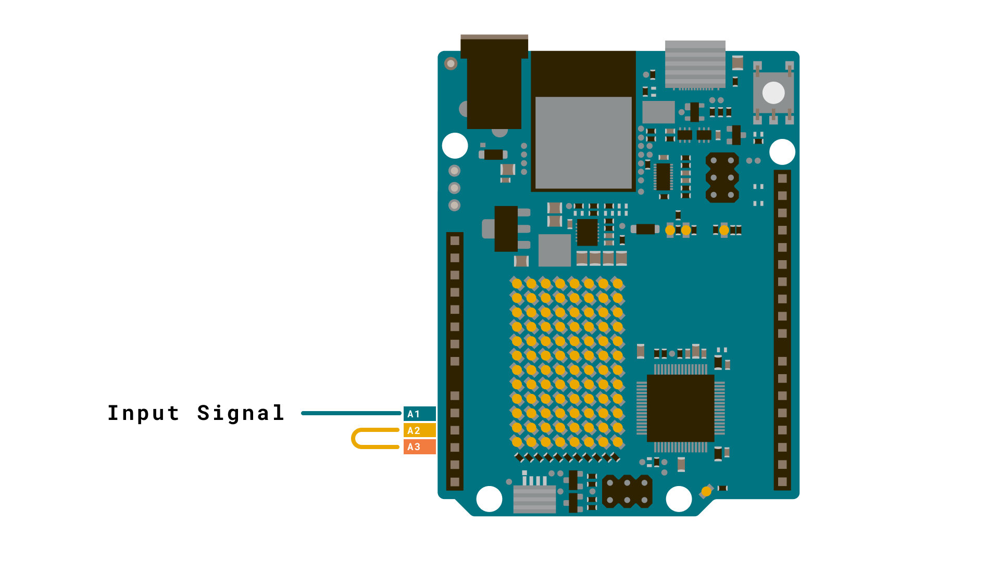
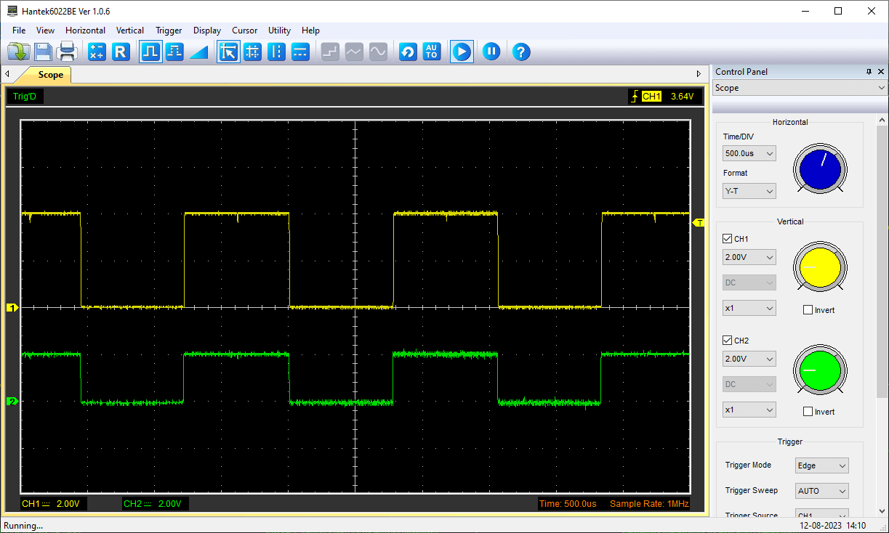
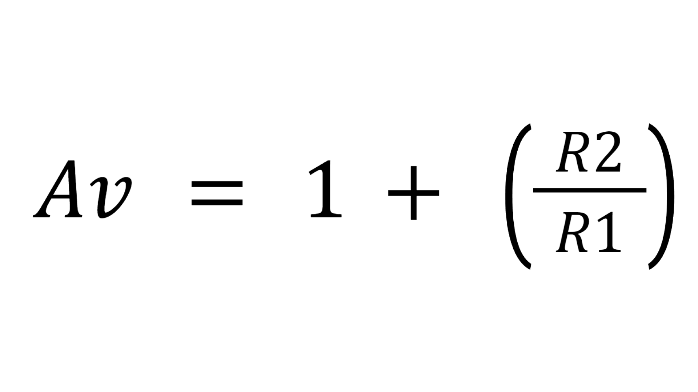
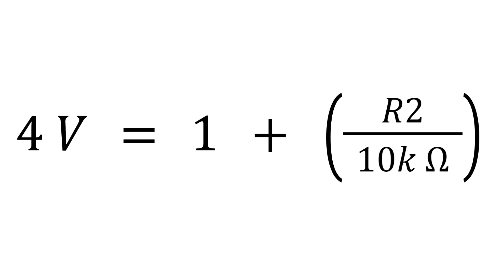
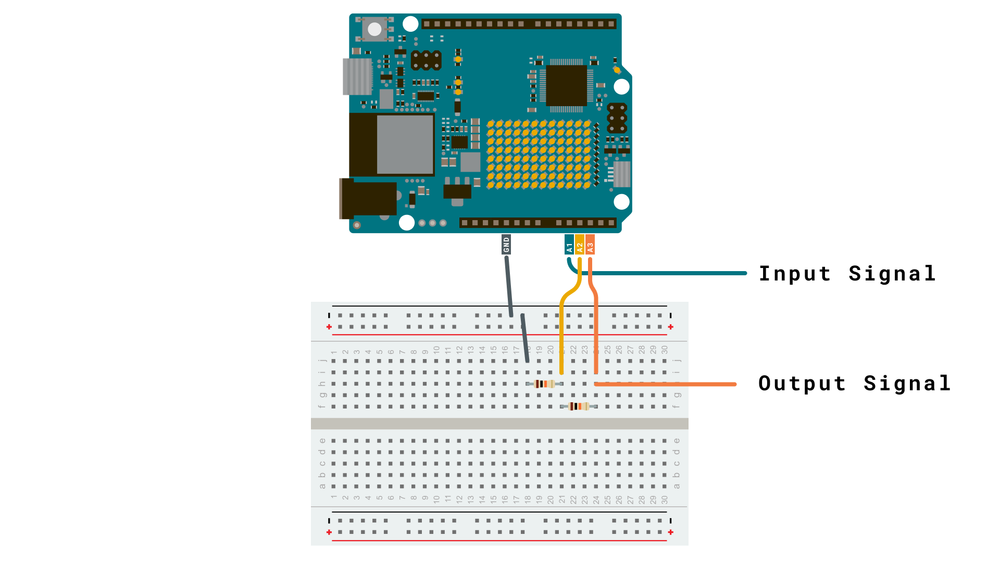

In this tutorial, you will learn how to use the built-in operational amplifier (OPAMP) featured on the [Arduino UNO R4 WiFi](https://store.arduino.cc/products/uno-r4-wifi). Operational amplifiers are very versatile and can be used to e.g. mirror an electrical signal or amplify it. 

## Goals

In this article, you will learn:
- about the OPAMP feature onboard the UNO R4 WiFi,
- about the basics of the OPAMP library, 
- how to mirror a voltage signal,
- how to amplify a voltage signal.

## Hardware & Software Needed
  To follow along with this article, you will need the following hardware: 
  
  - [Arduino UNO R4 WiFi](https://store.arduino.cc/uno-r4-wifi)
  - resistors
  - Jumper wires
  
  
## Operational Amplifier (OPAMP)

An OPAMP is a versatile and widely used electronic component that belongs to the class of analog integrated circuits. Its primary function is to amplify voltage signals but they are very versatile and can be used to:

- mirror an input voltage to its output,
- amplify a small analog voltage to its output pin, the UNO R4's output voltage range is 0 to ~4.7 V,
- compare two input voltages and give a binary "higher" or "lower" output,
- integrate and differentiate signals.

## Voltage Follower

The simplest way to test the OPAMP is to configure it as a voltage follower by connecting A2 to A3. In this setup, the voltage at A3 should mimic the voltage applied to A1. For instance, if you connect A1 to the ground (GND), the OPAMP output at A3 should also be at the ground potential. Similarly, if you connect A1 to 3.3 V, the output at A3 should be approximately 3.3 V.

## Circuit



## Voltage Amplifier

***Caution: When amplifying the voltage of a battery using an operational amplifier, you should be aware of potential risks. The amplification process can lead to a high current draw, essentially placing a significant load on the battery, which may result in overheating, damage, or even pose a security risk. To mitigate this risk, you may for example add a resistor in series with the battery.***

A voltage amplifier, as the name suggests, amplifies the voltage. A simple 2x amplifier can be built using e.g. two `10k` resistors. Connect one resistor between "minus" and GND. Then use the second resistor to connect the output and "minus" together. A circuit diagram [can be seen below](#circuit). Any signal input at "plus" will now appear with double the amplitude at the output pin. Of course, the input signal and the Arduino board should share the same `GND`. 

***The amplified output signal should not go above ~4.7 V, otherwise clipping will appear and you can damage the board***

Below is a capture of an oscilloscope in which an approx. 2 V square wave (green, channel 2) is amplified to a 4 V square wave (yellow, channel 1) with the circuit shown below. The input signal was generated by a function generation (and shared GND was connected).



But let's say you want to amplify the voltage signal 4x instead of 2x. The amplification of an OPAMP mainly depends on the chosen resistor values. Take a look at the formula below:



**Av** = Amplified Voltage (V)

**R1** = Resistor connected to Ground (Ω)

**R2** = Feedback resistor (Ω)

We know we want to amplify the voltage times four so:

**Av** = 4 V

Now, we need to figure out what resistors to choose. Because we only can solve for one unknown value we choose a predefined value for one of the resistors, e.g. 10k Ω for R1.

**R1** = 10k Ω

Your formula should now look like this:



 That leaves R2 as the only unknown variable. Now, Subtract one from both sides and multiply by ten, which leaves us with:

**R2 = 30k Ω**

## Circuit



***Read more about an amplifier circuit [here](https://www.electronics-tutorials.ws/opamp/opamp_3.html).***

## Code

To start up the opamp, simply include the library and call `OPAMP.begin(speed)`. As the optional `speed` argument to this function, can choose either `OPAMP_SPEED_LOWSPEED` as the low-speed (lower power) mode or `OPAMP_SPEED_HIGHSPEED` as the high-speed, high-power mode.

```arduino
#include <OPAMP.h>

void setup () {
  OPAMP.begin(OPAMP_SPEED_HIGHSPEED);
}

void loop() {}

```