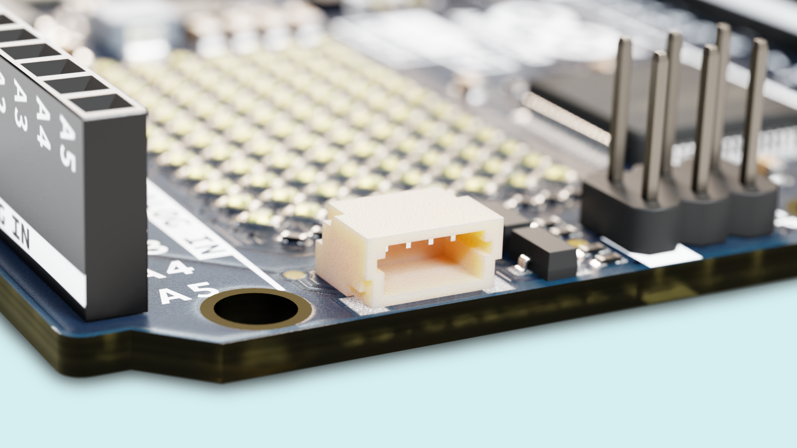

In this tutorial you will learn how to use the Qwiic connector on the Arduino UNO R4 WiFi.

## Goals

We will walk through the concept of I2C, and how it relates to the Qwiic ecosystem.

You'll learn what Qwiic is, as well as how to set it up and get started making your own Qwiic system with the Arduino UNO R4 WiFi.



## Hardware & Software Needed

- Arduino IDE ([online](https://create.arduino.cc/) or [offline](https://www.arduino.cc/en/main/software))
- [Arduino UNO R4 WiFi](https://store.arduino.cc/uno-r4-wifi)
- Qwiic module
- Qwiic cable

## I2C

We'll go over the conceptual level of how I2C works, if you want to skip ahead you can [click here](#qwiic) to jump directly to the Qwiic section 

I2C is a communication protocol that lets you connect multiple I2C compatible devices in a line, using only two pins that are referred to as SCL and SDA. 

Each device in the I2C line is functionally independent from the controller, but will respond with information when prompted by the controller. 

All devices on the line have an address that is represented by 7 bits. With 7 bits you can create 128 unique combinations, and that means that the theoretical limit of the amount of I2C devices a single line can support is 128. 

An I2C message on a lower bit-level looks something like this:


- The controller sends out instructions through the I2C bus on the data pin (SDA), and the instructions are prefaced with the address, so that only the correct device listens. 
- Then there is a bit signifying whether the controller wants to read or write.
- Every message needs to be acknowledged, to combat unexpected results, once the receiver has acknowledged the previous information it lets the controller know, so it can move on to the next set of bits.
- 8 bits of data
- Another acknowledgement bit
- 8 bits of data
- Another acknowledgement bit

But how does the controller and peripherals know where the address, messages, and so on starts and ends? That's what the SCL wire is for. It synchronises the clock of the controller with the devices, ensuring that they all move to the next instruction at the same time.

However, you are nearly never going to *actually* need to consider any of this, in the Arduino ecosystem we have the [Wire library](https://www.arduino.cc/reference/en/language/functions/communication/wire/) that handles everything for you.

But what does all of this have to do with Qwiic? 

## Qwiic
Qwiic is an ecosystem of breakout-modules and development boards with a so called Qwiic connector. The Arduino UNO R4 WiFi has one, for example. The Qwiic ecosystem combines the flexibility of I2C with the ease of use of pre-bundled cables making it incredibly easy to create lines of I2C devices, by collecting all the pins to get up and running with a large network of I2C devices in a single cable. 

Effectively this means that the wiring of your Qwiic devices is as simple as plugging them in in a series, and you're done.


## Arduino UNO R4 WiFi Implementation

The Arduino UNO R4 WiFi has two I2C buses, and the Qwiic connector is connected to the secondary one. 

Practically, this means that if you intend to use the Qwiic connector, when you're writing the code for your sketches, you cannot use the primary `Wire` object for I2C that you normally would, but you instead need to use the secondary one, `Wire1`. 

This *can* get problematic in some instances depending on the library developed for the breakout module you are using, as if there is no adequate solution for selecting the `Wire1` object when initialising the library you may need to alter the library code slightly, or write your own. 

In most cases, however, you will be able to select the `Wire1` object when initialising the library in a fashion similar to this:

```arduino
Wire1.begin();
libraryName.begin( Wire1 );
```

For example, when using SparkFuns AHT20 library, your setup function could look something like this:
```arduino
#include <Wire.h>

#include <SparkFun_Qwiic_Humidity_AHT20.h> 


void setup(){
  Serial.begin(115200);

  Wire1.begin(); //Join I2C bus

  //Check if the AHT20 will acknowledge
  if (humiditySensor.begin( Wire1 ) == false)
  {
    Serial.println("AHT20 not detected. Please check wiring. Freezing.");
    while (1);
  }
  Serial.println("AHT20 acknowledged.");
}
```

## Summary
In this tutorial, we have gone over the Qwiic connector on the Arduino UNO R4 WiFi. We've learned about how I2C works, and how that relates to Qwiic. We've also learned how the Arduino UNO R4 WiFis Qwiic connector is configured and how to make use of it to conveniently build large I2C networks of nodes for your interactive projects with minimal wiring. 