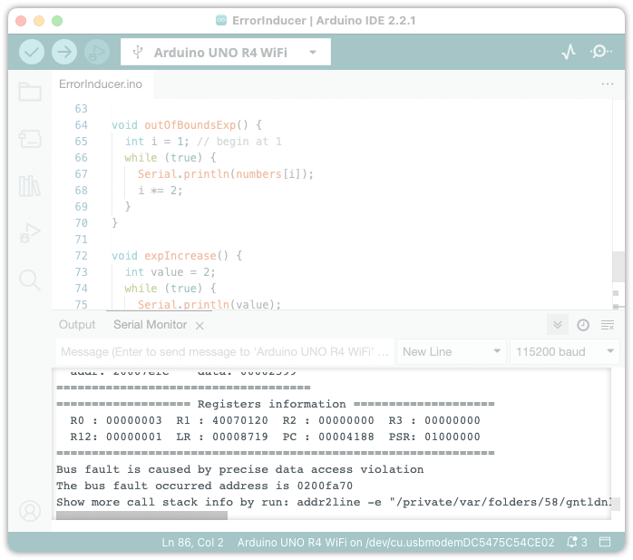
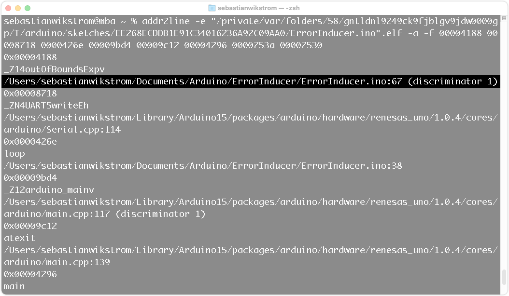
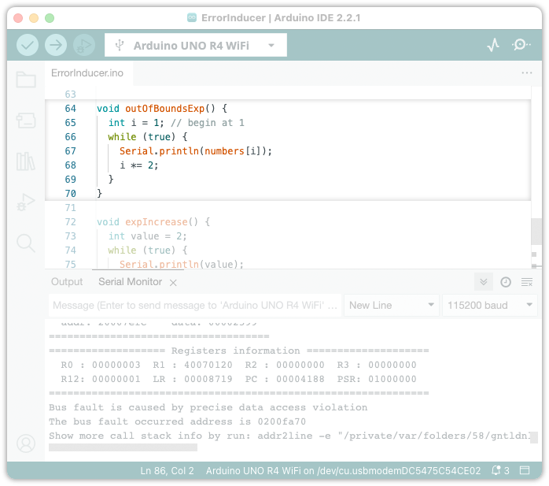

The Arduino UNO R4 WiFi uses [CmBacktrace](https://github.com/armink/CmBacktrace) to print useful information from the **Arm Cortex-M4** processor as serial output when a runtime error occurs. The output includes an `addr2line` command that can used to produce a **stack trace** (also **stack backtrace**, or **stack traceback**), which can be used to find the source of the error.

In this tutorial, we will show to enable this feature.

## Hardware & Software Needed

- [Arduino IDE](https://www.arduino.cc/en/software)
- [Arduino UNO R4 WiFi](https://store.arduino.cc/products/uno-r4-wifi)

## Get Runtime Error

To get the runtime error information in the Serial Monitor, follow the steps below:

1. Ensure that a serial connection must be initiated before the error occurs, by calling [Serial.begin()](https://www.arduino.cc/reference/en/language/functions/communication/serial/begin/) in your sketch. You can include this code inside the beginning of the `setup()` function:

   ```
   Serial.begin(115200);
   while (!Serial);
   ```

2. Connect your UNO R4 WiFi board to your computer.
3. Open the Serial Monitor. Click the  **Serial Monitor** button in the top-right corner or select  **Tools > Serial Monitor** in the menu bar.
4. If you made any changes to your sketch, click the  **Upload** button. Otherwise, you can simply press the **RESET** button on the board.
5. If an exception occurs on the board, information will be displayed in the Serial Monitor.

   

6. Following the "Registers information" table, the type of fault will be specified. You can read more about the types [here](https://wiki.segger.com/Cortex-M_Fault#Cortex-M_Fault_Exceptions).
7. The last line includes a command for the `addr2line` utility. See [Running addr2line for more information](#running-addr2line).


## Generate a Stack Trace

You can use the `addr2line` tool to generate a stack trace. See the instructions below:

> **Note:** `addr2line` is not available as a native Windows application, but can be run with [Windows Subsystem for Linux (WSL)](https://learn.microsoft.com/en-us/windows/wsl/install).

The `addr2line` utility is included in the **Arduino UNO R4 Boards** boards package. However, running it in this way requires modifying the command included in the output. For convenience, you may want to install `addr2line` on your system.

To install `addr2line` (optional), use the OS specific instructions below:

* **Windows (WSL):** `addr2line` is not available as a native Windows application, but can be run with [Windows Subsystem for Linux (WSL)](https://learn.microsoft.com/en-us/windows/wsl/install). The Ubuntu distribution of Linux is installed by default and should come with `addr2line`.
* **macOS:** `addr2line` can be installed with [Homebrew](https://brew.sh/) by running `brew install binutils` in Terminal.
* **Linux:** `addr2line` may already be installed on your system. Otherwise, run `apt-get install binutils` in Terminal (Ubuntu, Debian), or see [command-not-found.com/addr2line](https://command-not-found.com/addr2line) for other distributions.

### 1. Copy `addr2line` Command 

**Windows (WSL):**

1. Copy the command from the serial output.
2. Paste the command into a text editor.
3. Replace `C:` with `/mnt/c` and replace all backslashes (`\`) with forward slashes (`/`).

**macOS:** 

Copy the command from the serial output (no modification required).

**Linux:**

Copy the command from the serial output (no modification required).

***If you don't want to install `addr2line`, you can use the `addr2line` from the board package. See the instructions [here](#copy-addr2line-command-board-package)***

### 2. Running the `addr2line` Command

> **Note:** The sketch needs to have been compiled on the same computer you are running `addr2line` on.

**Windows (WSL):**

1. Open [Windows Powershell](https://learn.microsoft.com/en-us/powershell/scripting/windows-powershell/starting-windows-powershell?view=powershell-7.3).
2. Type `Ubuntu` into Windows Powershell and press <kbd>Enter</kbd>.
3. Paste the modified command into Windows Powershell by right-clicking on the window.
4. Press <kbd>Enter</kbd> to run the command.

**macOS:**

1. Open Terminal.
2. Press <kbd>⌘</kbd> + <kbd>V</kbd> to paste the command.
3. Press <kbd>Enter</kbd> to run the command.

**Linux:**

1. Open Terminal.
2. Press <kbd>Ctrl</kbd> + <kbd>⇧Shift</kbd> + <kbd>V</kbd> to paste the command.
3. Press <kbd>Enter</kbd> to run the command.

Optionally, you can add the `-p` flag to your command for a more readable format.

### 3. Reading the `addr2line` Output

By default, the command outputs the following for each function call:

* **address:** "`0x00004188`", "`0x0000426e`", ... (remove the `-a` flag if you don't want to include these)
* **function name:** "`_ZN4UART5writeEh`", "`loop`", ...
* **line number** "`/Users/sebastianwikstrom/Documents/Arduino/ErrorInducer/ErrorInducer.ino:67`, ...

Follow these steps:

1. Look for the topmost line in the output that's inside your sketch. The number following the path is the line number where the error occurred. For example, `/Users/username/Documents/Arduino/ErrorInducer/ErrorInducer.ino:67` indicates that the error occurred on line 67. By reading further down the output, you can step backward through the function calls that were made.

   

2. Open the sketch in Arduino IDE and find the line number from the previous step (the number is displayed to the left of each line).
3. Analyze the row where the error occurred and try to understand what may be triggering the error.

* If you're not sure, use the [Serial.println()](https://www.arduino.cc/reference/en/language/functions/communication/serial/println/) function to output the values of any variables being used. Then upload the sketch again, and use the serial output to see what the states of those variables were before the error occurred.
* To see from where the function was called, look at the preceding function call in the `addr2line` output.

In this example, an out-of-bounds access of the `numbers` array occurs after a few iterations of the `while(true)` loop:



## Additional Instructions

### Copy `addr2line` Command (Board Package)

***These instructions replace the instructions in [1. Copy `addr2line` Command](#1-copy-addr2line-command)***

If you want to use the `addr2line` directly from the board package, follow the instructions below

**Windows (WSL):**

1. Copy the command from the serial output.
2. Paste the command into a text editor.
3. Replace the word `addr2line` with `/mnt/c/Users/User/Appdata/Local/Arduino15/packages/arduino/tools/arm-none-eabi-gcc/7-2017q4/bin/arm-none-eabi-addr2line`
4. For the file path after the `-e` flag, replace `C:` with `/mnt/c` and replace all backslashes (`\`) with forward slashes (`/`).

**macOS:**

1. Copy the command from the serial output.
2. Paste the command into a text editor.
3. Replace the word `addr2line` with `~/Library/Arduino15/packages/arduino/tools/arm-none-eabi-gcc/7-2017q4/bin/arm-none-eabi-addr2line`.

**Linux:**

1. Copy the command from the serial output.
2. Paste the command into a text editor.
3. Replace the word `addr2line` with `.arduino15/packages/arduino/tools/arm-none-eabi-gcc/7-2017q4/bin/arm-none-eabi-addr2line`.