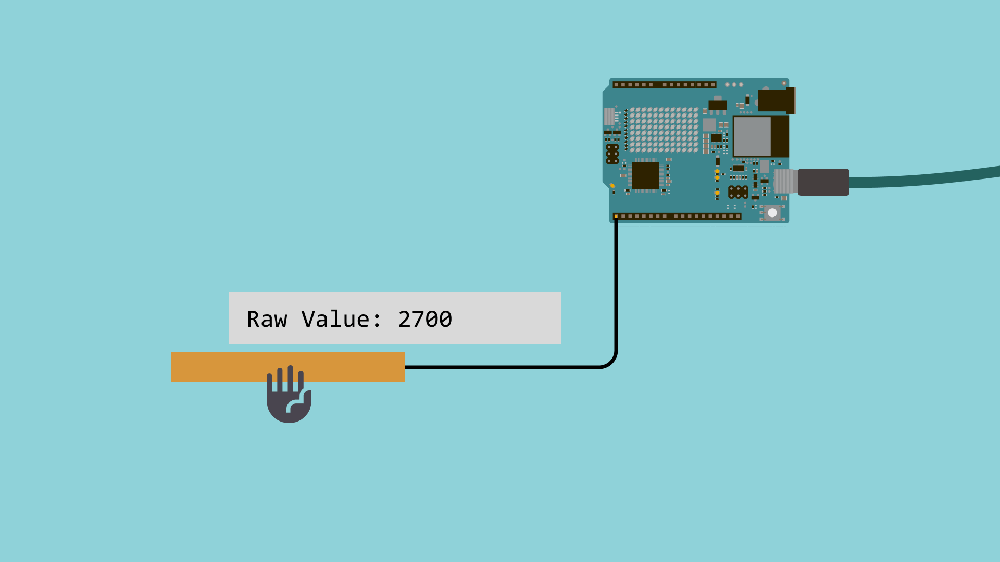
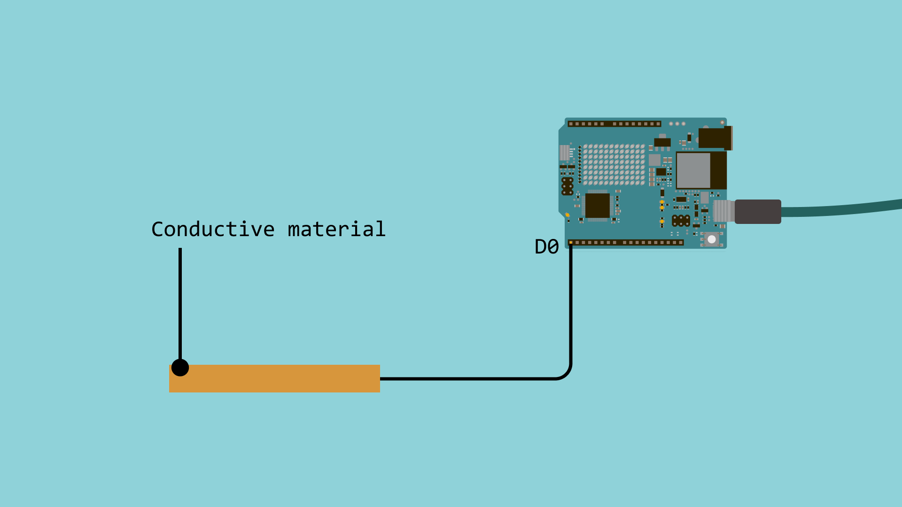

Capacitive sensing is a technology that detects changes in capacitance to determine the presence or absence of a conductive object, such as a human finger. This principle is widely used in touch-sensitive devices. The Arduino® UNO R4, both the [WiFi](https://store.arduino.cc/products/arduino-uno-r4-wifi) and [Minima](https://store.arduino.cc/products/arduino-uno-r4-minima) versions, come equipped with built-in capacitive sensing capabilities, making it easier to integrate touch inputs into your projects.



## Required Hardware
To use the library, you will need one of the compatible boards:
- [Arduino UNO R4 WiFi](https://store.arduino.cc/products/uno-r4-wifi)
- [Arduino UNO R4 Minima](https://store.arduino.cc/products/uno-r4-minima)

You will also need:
- Wire
- Something that can affect the electric field to touch (metal objects, materials with moisture, even bananas! Experimentation is key!)

## How Capacitive Sensing Works

Imagine the sensor as creating an invisible electric field around itself. When a conductive object (like your finger) approaches, it's like dropping a stone into a calm pond - the field gets disturbed. The sensor detects this disturbance as a change in capacitance, which is essentially how much electrical charge the system can store.
Here's the process:

1. The sensor electrode creates an electric field by applying a small voltage
2. When you approach or touch the sensor, your body becomes part of the capacitive circuit
3. This increases the capacitance between the sensor electrode and ground
4. The microcontroller detects this capacitance change (often by measuring timing differences) and determines if it's significant enough to register as a "touch"

## Using Capacitive Sensing on the UNO R4

The UNO R4 features a Capacitive Touch Sensing Unit (CTSU) that allows you to use certain pins as capacitive touch inputs. To utilize these capabilities, you can use the [Arduino_CapacitiveTouch library](https://github.com/arduino-libraries/Arduino_CapacitiveTouch).

### Compatible Pins

For both the UNO R4 WiFi and Minima boards, the compatible pins for capacitive touch are listed in the [Arduino_CapacitiveTouch library documentation](https://github.com/arduino-libraries/Arduino_CapacitiveTouch?tab=readme-ov-file#compatible-pins).

**Arduino UNO R4 Minima:**

| Arduino Pin  | Touch Sensor Channel (TS#) | Channel Control Index (CHAC idx) | Channel Control Bit Mask (CHAC val) |
|--------------|----------------------------|----------------------------------|-------------------------------------|
| D0           | 9                          | 1                                | (1 << 1)                           |
| D1           | 8                          | 1                                | (1 << 0)                           |
| D2           | 34                         | 4                                | (1 << 2)                           |
| D3           | 13                         | 1                                | (1 << 5)                           |
| D8           | 11                         | 1                                | (1 << 3)                           |
| D9           | 2                          | 0                                | (1 << 2)                           |
| D11          | 10                         | 1                                | (1 << 2)                           |
| D13          | 12                         | 1                                | (1 << 4)                           |
| A1 (D15)     | 21                         | 2                                | (1 << 5)                           |
| A2 (D16)     | 22                         | 2                                | (1 << 6)                           |
| LOVE_BUTTON  | 0                          | 0                                | (1 << 0)                           |

**Arduino UNO R4 WiFi:**

| Arduino Pin  | Touch Sensor Channel (TS#) | Channel Control Index (CHAC idx) | Channel Control Bit Mask (CHAC val) |
|--------------|----------------------------|----------------------------------|-------------------------------------|
| D0           | 9                          | 1                                | (1 << 1)                           |
| D1           | 8                          | 1                                | (1 << 0)                           |
| D2           | 13                         | 1                                | (1 << 5)                           |
| D3           | 34                         | 4                                | (1 << 2)                           |
| D6           | 12                         | 1                                | (1 << 4)                           |
| D8           | 11                         | 1                                | (1 << 3)                           |
| D9           | 2                          | 0                                | (1 << 2)                           |
| D11          | 7                          | 0                                | (1 << 7)                           |
| D12          | 6                          | 0                                | (1 << 6)                           |
| A1 (D15)     | 21                         | 2                                | (1 << 5)                           |
| A2 (D16)     | 22                         | 2                                | (1 << 6)                           |
| LOVE_BUTTON  | 27                         | 3                                | (1 << 3)                           |


### Library Functions

The **Arduino_CapacitiveTouch** library provides several functions to work with capacitive touch inputs:

- **`CapacitiveTouch(uint8_t pin)`** Constructs a capacitive touch sensor for the given pin.
- **`bool begin()`** Initializes the sensor and configures the pin and hardware.
- **`int read()`** Reads the raw sensor value and returns it.
- **`bool isTouched()`** Checks if the sensor is touched based on the threshold.
- **`void setThreshold(int threshold)`** Sets the detection threshold for touch sensitivity.
- **`int getThreshold()`** Retrieves the current detection threshold.

For more detailed usage and examples, refer to the [CapacitiveSensor library documentation](https://github.com/arduino-libraries/Arduino_CapacitiveTouch/blob/main/docs/api.md).

## Detecting Touch Example

### Circuit

Here's a simple example to get you started with capacitive sensing on the UNO R4. For this example, we are connecting a single piece of any conductive material to the pin `D0` on the Board.




### Code

**Note:** To install the `Arduino_CapacitiveTouch` library, open the Arduino IDE Library Manager, search for "Arduino_CapacitiveTouch" within the Manage Libraries option, and click Install.

```arduino
#include "Arduino_CapacitiveTouch.h"

CapacitiveTouch touchButton = CapacitiveTouch(D0);

void setup() {
  Serial.begin(9600);
  
  if(touchButton.begin()){
    Serial.println("Capacitive touch sensor initialized.");
  } else {
    Serial.println("Failed to initialize capacitive touch sensor. Please use a supported pin.");
    while(true);
  }

  touchButton.setThreshold(2000);
}

void loop() {
  int sensorValue = touchButton.read();
  Serial.print("Raw value: ");
  Serial.println(sensorValue);

  if (touchButton.isTouched()) {
    Serial.println("Button touched!");
  }
  
  delay(100);
}
```


## Creative Project Ideas

Now that you have learned the basics, here are some fun and interesting project ideas:

- **Touch-Controlled Night Light -** Create a lamp that turns on/off with a touch
- **Capacitive Touch Piano -** Use multiple pins to create touch-sensitive keys
- **Smart Home Controller -** Touch different areas to control various devices
- **Interactive Art Installation -** Create touch-responsive visual or audio effects

## Conclusion

Capacitive sensing on the Arduino UNO R4 lets you add intuitive touch controls with minimal hardware. Simply pair the board with the `Arduino_CapacitiveTouch` library. Tune the detection threshold for your environment (such as humidity and nearby electronics), and you can quickly scale from a single-touch button to richer, multi-point interfaces.
