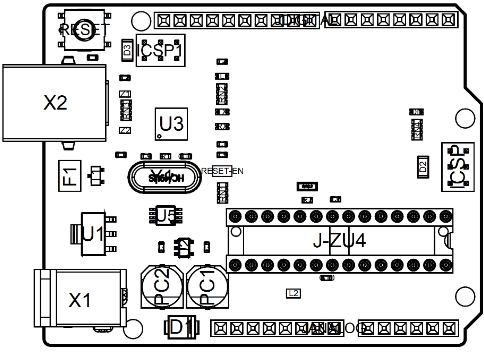

# Description 
The Arduino® UNO R3 is the perfect board to get familiar with electronics and coding. This versatile development board is equipped with the well-known ATmega328P and the ATMega 16U2 Processor.  

This board will give you a great first experience within the world of Arduino. 

# Target areas:
Maker, introduction, industries

# Features
* **ATMega328P** Processor
    * **Memory**
        * AVR CPU at up to 16 MHz
        * 32 kB Flash
        * 2 kB SRAM
        * 1 kB EEPROM 

    * **Security**
        * Power On Reset (POR) 
        * Brown Out Detection (BOD) 

    * **Peripherals**
        * 2x 8-bit Timer/Counter with a dedicated period register and compare channels
        * 1x 16-bit Timer/Counter with a dedicated period register, input capture and compare channels
        * 1x USART with fractional baud rate generator and start-of-frame detection
        * 1x controller/peripheral Serial Peripheral Interface (SPI)
        * 1x Dual mode controller/peripheral I2C
        * 1x Analog Comparator (AC) with a scalable reference input
        * Watchdog Timer with separate on-chip oscillator
        * Six PWM channels
        * Interrupt and wake-up on pin change

    * **ATMega16U2 Processor**
        *  8-bit AVR® RISC-based microcontroller 

    * **Memory**
        * 16 kB ISP Flash
        * 512B EEPROM
        * 512B SRAM
        * debugWIRE interface for on-chip debugging and programming 

    * **Power**
        * 2.7-5.5 volts 

# CONTENTS
## The Board
### Application Examples
The UNO board is the flagship product of Arduino. Regardless if you are new to the world of electronics or will use the UNO R3 as a tool for education purposes or industry-related tasks, the UNO R3 is likely to meet your needs.  

**First entry to electronics:** If this is your first project within coding and electronics, get started with our most used and documented board; UNO. It is equipped with the well-known ATmega328P processor, 14 digital input/output pins, 6 analog inputs, USB connections, ICSP header and reset button. This board includes everything you will need for a great first experience with Arduino. 

**Industry-standard development board:** Using the UNO R3 board in industries, there are a range of companies using the UNO R3 board as the brain for their PLC’s.

**Education purposes:** Although the UNO R3 board has been with us for about ten years, it is still widely used for various education purposes and scientific projects. The board's high standard and top quality performance makes it a great resource to capture real time from sensors and to trigger complex laboratory equipment to mention a few examples.  

### Related Products
* Arduino Starter Kit
* Arduino UNO R4 Minima
* Arduino UNO R4 WiFi
* Tinkerkit Braccio Robot

## Ratings

### Recommended Operating Conditions

| Symbol | Description                                      | Min            | Max            |
| ------ | ------------------------------------------------ | -------------- | -------------- |
|        | Conservative thermal limits for the whole board: | -40 °C (-40 °F) | 85 °C ( 185 °F) |

>**NOTE:** In extreme temperatures, EEPROM, voltage regulator, and the crystal oscillator, might not work as expected.

### Power Consumption

| Symbol  | Description                              | Min  | Typ  | Max  | Unit |
| ------- | ---------------------------------------- | ---- | ---- | ---- | ---- |
| VINMax  | Maximum input voltage from VIN pad       | 6    | -    | 20   | V    |
| VUSBMax | Maximum input voltage from USB connector |      | -    | 5.5  | V    |
| PMax    | Maximum Power Consumption                | -    | -    | xx   | mA   |

## Functional Overview

### Board Topology 
Top view

| **Ref.** | **Description**                | **Ref.** | **Description**                       |
| -------- | ------------------------------ | -------- | ------------------------------------- |
| X1       | Power jack 2.1x5.5mm           | U1       | SPX1117M3-L-5 Regulator               |
| X2       | USB B Connector                | U3       | ATMEGA16U2 Module                     |
| PC1      | EEE-1EA470WP 25V SMD Capacitor | U5       | LMV358LIST-A.9 IC                     |
| PC2      | EEE-1EA470WP 25V SMD Capacitor | F1       | Chip Capacitor, High Density          |
| D1       | CGRA4007-G Rectifier           | ICSP     | Pin header connector (through hole 6) |
| J-ZU4    | ATMEGA328P Module              | ICSP1    | Pin header connector (through hole 6) |
| Y1       | ECS-160-20-4X-DU Oscillator    |          |                                       |

### Processor
The Main Processor is a ATmega328P running at up to 20 MHz. Most of its pins are connected to the external headers, however some are reserved for internal communication with the USB Bridge coprocessor.

### Power Tree

## Board Operation

### Getting Started - IDE 
If you want to program your UNO R3 while offline you need to install the Arduino Desktop IDE [1] To connect the UNO R3 to your computer, you’ll need a USB-B cable. This also provides power to the board, as indicated by the LED.

### Getting Started - Arduino Cloud Editor 
All Arduino boards, including this one, work out-of-the-box on the Arduino Cloud Editor [2], by just installing a simple plugin.

The Arduino Cloud Editor is hosted online, therefore it will always be up-to-date with the latest features and support for all boards. Follow **[3]** to start coding on the browser and upload your sketches onto your board.

### Sample Sketches 
Sample sketches for the UNO R3 can be found either in the “Examples” menu in the Arduino IDE or in the “Documentation” section of the [Arduino website](https://www.arduino.cc/) [4].

### Online Resources
Now that you have gone through the basics of what you can do with the board you can explore the endless possibilities it provides by checking exciting projects on Arduino Project Hub [5], the Arduino Library Reference [6] and the online Arduino store [7] where you will be able to complement your board with sensors, actuators and more.

## Connector Pinouts

### JANALOG
| Pin  | **Function** | **Type**         | **Description**                                 |
| ---- | ------------ | ---------------- | ----------------------------------------------- |
| 1    | NC           | NC               | Not connected                                   |
| 2    | IOREF        | IOREF            | Reference for digital logic V - connected to 5V |
| 3    | Reset        | Reset            | Reset                                           |
| 4    | +3V3         | Power            | +3V3 Power Rail                                 |
| 5    | +5V          | Power            | +5V Power Rail                                  |
| 6    | GND          | Power            | Ground                                          |
| 7    | GND          | Power            | Ground                                          |
| 8    | VIN          | Power            | Voltage Input                                   |
| 9    | A0           | Analog/GPIO      | Analog input 0 /GPIO                            |
| 10   | A1           | Analog/GPIO      | Analog input 1 /GPIO                            |
| 11   | A2           | Analog/GPIO      | Analog input 2 /GPIO                            |
| 12   | A3           | Analog/GPIO      | Analog input 3 /GPIO                            |
| 13   | A4/SDA       | Analog input/I2C | Analog input 4/I2C Data line                    |
| 14   | A5/SCL       | Analog input/I2C | Analog input 5/I2C Clock line                   |

### JDIGITAL

| Pin  | **Function** | **Type**     | **Description**                            |
| ---- | ------------ | ------------ | ------------------------------------------ |
| 1    | D0           | Digital/GPIO | Digital pin 0/GPIO                         |
| 2    | D1           | Digital/GPIO | Digital pin 1/GPIO                         |
| 3    | D2           | Digital/GPIO | Digital pin 2/GPIO                         |
| 4    | D3           | Digital/GPIO | Digital pin 3/GPIO                         |
| 5    | D4           | Digital/GPIO | Digital pin 4/GPIO                         |
| 6    | D5           | Digital/GPIO | Digital pin 5/GPIO                         |
| 7    | D6           | Digital/GPIO | Digital pin 6/GPIO                         |
| 8    | D7           | Digital/GPIO | Digital pin 7/GPIO                         |
| 9    | D8           | Digital/GPIO | Digital pin 8/GPIO                         |
| 10   | D9           | Digital/GPIO | Digital pin 9/GPIO                         |
| 11   | SS           | Digital      | SPI Chip Select                            |
| 12   | MOSI         | Digital      | SPI1 Main Out Secondary In                 |
| 13   | MISO         | Digital      | SPI Main In Secondary Out                  |
| 14   | SCK          | Digital      | SPI serial clock output                    |
| 15   | GND          | Power        | Ground                                     |
| 16   | AREF         | Digital      | Analog reference voltage                   |
| 17   | A4/SD4       | Digital      | Analog input 4/I2C Data line (duplicated)  |
| 18   | A5/SD5       | Digital      | Analog input 5/I2C Clock line (duplicated) |

### Mechanical Information

### Board Outline & Mounting Holes

## Certifications

### Declaration of Conformity CE DoC (EU)

We declare under our sole responsibility that the products above are in conformity with the essential requirements of the following EU Directives and therefore qualify for free movement within markets comprising the European Union (EU) and European Economic Area (EEA). 

|                                                         |                                                   |
| ------------------------------------------------------- | ------------------------------------------------- |
| **ROHS 2 Directive 2011/65/EU**                         |                                                   |
| Conforms to:                                            | EN50581:2012                                      |
| **Directive 2014/35/EU. (LVD)**                         |                                                   |
| Conforms to:                                            | EN 60950-1:2006/A11:2009/A1:2010/A12:2011/AC:2011 |
| **Directive 2004/40/EC & 2008/46/EC & 2013/35/EU, EMF** |                                                   |
| Conforms to:                                            | EN 62311:2008                                     |

 

### Declaration of Conformity to EU RoHS & REACH 211 01/19/2021

Arduino boards are in compliance with RoHS 2 Directive 2011/65/EU of the European Parliament and RoHS 3 Directive 2015/863/EU of the Council of 4 June 2015 on the restriction of the use of certain hazardous substances in electrical and electronic equipment. 

| Substance                              | **Maximum limit (ppm)** |
| -------------------------------------- | ----------------------- |
| Lead (Pb)                              | 1000                    |
| Cadmium (Cd)                           | 100                     |
| Mercury (Hg)                           | 1000                    |
| Hexavalent Chromium (Cr6+)             | 1000                    |
| Poly Brominated Biphenyls (PBB)        | 1000                    |
| Poly Brominated Diphenyl ethers (PBDE) | 1000                    |
| Bis(2-Ethylhexyl} phthalate (DEHP)     | 1000                    |
| Benzyl butyl phthalate (BBP)           | 1000                    |
| Dibutyl phthalate (DBP)                | 1000                    |
| Diisobutyl phthalate (DIBP)            | 1000                    |

Exemptions: No exemptions are claimed. 

Arduino Boards are fully compliant with the related requirements of European Union Regulation (EC) 1907 /2006 concerning the Registration, Evaluation, Authorization and Restriction of Chemicals (REACH). We declare none of the SVHCs (https://echa.europa.eu/web/guest/candidate-list-table), the Candidate List of Substances of Very High Concern for authorization currently released by ECHA, is present in all products (and also package) in quantities totaling in a concentration equal or above 0.1%. To the best of our knowledge, we also declare that our products do not contain any of the substances listed on the "Authorization List" (Annex XIV of the REACH regulations) and Substances of Very High Concern (SVHC) in any significant amounts as specified by the Annex XVII of Candidate list published by ECHA (European Chemical Agency) 1907 /2006/EC.

### Conflict Minerals Declaration 

As a global supplier of electronic and electrical components, Arduino is aware of our obligations with regards to laws and regulations regarding Conflict Minerals, specifically the Dodd-Frank Wall Street Reform and Consumer Protection Act, Section 1502. Arduino does not directly source or process conflict minerals such as Tin, Tantalum, Tungsten, or Gold. Conflict minerals are contained in our products in the form of solder, or as a component in metal alloys. As part of our reasonable due diligence Arduino has contacted component suppliers within our supply chain to verify their continued compliance with the regulations. Based on the information received thus far we declare that our products contain Conflict Minerals sourced from conflict-free areas. 

## FCC Caution

Any Changes or modifications not expressly approved by the party responsible for compliance could void the user’s authority to operate the equipment.

This device complies with part 15 of the FCC Rules. Operation is subject to the following two conditions: 

(1) This device may not cause harmful interference

 (2) this device must accept any interference received, including interference that may cause undesired operation.

**FCC RF Radiation Exposure Statement:**

1. This Transmitter must not be co-located or operating in conjunction with any other antenna or transmitter.

2. This equipment complies with RF radiation exposure limits set forth for an uncontrolled environment.

3. This equipment should be installed and operated with minimum distance 20cm between the radiator & your body.

English: 
User manuals for license-exempt radio apparatus shall contain the following or equivalent notice in a conspicuous location in the user manual or alternatively on the device or both. This device complies with Industry Canada license-exempt RSS standard(s). Operation is subject to the following two conditions:

(1) this device may not cause interference

 (2) this device must accept any interference, including interference that may cause undesired operation of the device.

French: 
Le présent appareil est conforme aux CNR d’Industrie Canada applicables aux appareils radio exempts de licence. L’exploitation est autorisée aux deux conditions suivantes :

(1) l’ appareil nedoit pas produire de brouillage

(2) l’utilisateur de l’appareil doit accepter tout brouillage radioélectrique subi, même si le brouillage est susceptible d’en compromettre le fonctionnement.

**IC SAR Warning:**

English 
This equipment should be installed and operated with minimum distance 20 cm between the radiator and your body.  

French: 
Lors de l’ installation et de l’ exploitation de ce dispositif, la distance entre le radiateur et le corps est d ’au moins 20 cm.

**Important:** The operating temperature of the EUT can’t exceed 85℃ and shouldn’t be lower than -40℃.

Hereby, Arduino S.r.l. declares that this product is in compliance with essential requirements and other relevant provisions of Directive 2014/53/EU. This product is allowed to be used in all EU member states. 
 
## Company Information

| Company name    | Arduino S.r.l                           |
| --------------- | --------------------------------------- |
| Company Address | Via Andrea Appiani 25 20900 MONZA Italy |

## Reference Documentation

| Reference                              | **Link**                                                                 |
| -------------------------------------- | ------------------------------------------------------------------------ |
| Arduino IDE (Desktop)                  | https://www.arduino.cc/en/Main/Software                                  |
| Arduino Cloud Editor                   | https://create.arduino.cc/editor                                         |
| Arduino Cloud Editor - Getting Started | https://docs.arduino.cc/arduino-cloud/guides/editor/                     |
| Arduino Website                        | https://www.arduino.cc/                                                  |
| Arduino Project Hub                    | https://create.arduino.cc/projecthub?by=part&part_id=11332&sort=trending |
| Library Reference                      | https://www.arduino.cc/reference/en/                                     |
| Arduino Store                          | https://store.arduino.cc/                                                |

## Revision History

| Date       | **Revision** | **Changes**                      |
| ---------- | ------------ | -------------------------------- |
| 25/04/2024 | 3            | Updated link to new Cloud Editor |
| 26/07/2023 | 2            | General Update                   |
| 06/2021    | 1            | Datasheet release                |

# 中文 (ZH)

# 描述
Arduino UNO R3 是熟悉电子技术和编码的完美开发板。这款多功能开发板配备了著名的 ATmega328P 和 ATMega 16U2 处理器。该开发板将为您带来 Arduino 世界绝佳的初次体验。

# 目标领域：
创客、介绍、工业领域

# 特点
* **ATMega328P** 处理器
    * **内存**
        * AVR CPU 频率高达 16 MHz
        * 32KB 闪存
        * 2KB SRAM
        * 1KB EEPROM 

    * **安全性**
        * 上电复位 (POR)
        * 欠压检测 (BOD)

    * **外设**
        * 2x 8 位定时器/计数器，带专用周期寄存器和比较通道
        * 1x 16 位定时器/计数器，带专用周期寄存器、输入捕获和比较通道
        * 1x USART，带分数波特率发生器和起始帧信号检测功能
        * 1x 控制器/外设串行外设接口 (SPI)
        * 1x 双模控制器/外设 I2C
        * 1 个模拟比较器 (AC)，带可扩展参考输入
        * 看门狗定时器，带独立的片上振荡器
        * 6 通道 PWM
        * 引脚变化时的中断和唤醒

    * **ATMega16U2 处理器**
        *  基于 AVR® RISC 的 8 位微控制器

    * **内存**
        * 16 KB ISP 闪存
        * 512B EEPROM
        * 512B SRAM
        * 用于片上调试和编程的 debugWIRE 接口

    * **电源**
        * 2.7-5.5 伏特

# 目录
## 电路板简介
### 应用示例
UNO 电路板是 Arduino 的旗舰产品。无论您是初次接触电路板产品，还是将 UNO 用作教育或工业相关任务的工具，UNO 都能满足您的需求。 

**初次接触电子技术:** 如果这是您第一次参与编码和电子技术项目，那么就从我们最常用、记录最多的电路板 Arduino UNO 开始吧。它配备了著名的 ATmega328P 处理器、14 个数字输入/输出引脚、6 个模拟输入、USB 连接、ICSP 接头和复位按钮。该电路板包含了您获得良好的 Arduino 初次体验所需的一切。

** 行业标准开发板:** 在工业领域使用 Arduino UNO R3 开发板，有许多公司使用 UNO 开发板作为其 PLC 的大脑。

**教育用途:** 尽管我们推出 UNO R3 电路板已有大约十年之久，但它仍被广泛用于各种教育用途和科学项目。该电路板的高标准和一流性能使其成为从传感器采集实时数据和触发复杂实验室设备等各种应用场合的绝佳资源。 

### 相关产品
* Starter Kit
* Arduino UNO R4 Minima
* Arduino UNO R4 WiFi
* Tinkerkit Braccio Robot

## 额定值

### 建议运行条件

| 符号 | 描述                                      | 最小值            | 最大值            |
| ------ | ------------------------------------------------ | -------------- | -------------- |
|        | 整个电路板的保守温度极限值： | -40 °C (-40°F) | 85 °C ( 185°F) |

>**注意：** 在极端温度下，EEPROM、电压调节器和晶体振荡器可能无法正常工作。

### 功耗

| 符号  | 描述                              | 最小值  | 典型值  | 最大值  | 单位 |
| ------- | ---------------------------------------- | ---- | ---- | ---- | ---- |
| VINMax  | 来自 VIN 焊盘的最大输入电压       | 6    | -    | 20   | V    |
| VUSBMax | 来自 USB 连接器的最大输入电压 |      | -    | 5.5  | V    |
| PMax    | 最大功耗                | -    | -    | xx   | mA   |

## 功能概述

### 电路板拓扑结构
俯视图

| **编号** | **描述**                | **编号** | **描述**                       |
| -------- | ------------------------------ | -------- | ------------------------------------- |
| X1       | 电源插孔 2.1x5.5 毫米           | U1       | SPX1117M3-L-5 调节器               |
| X2       | USB B 连接器                | U3       | ATMEGA16U2 模块                     |
| PC1      | EEE-1EA470WP 25V SMD 电容器 | U5       | LMV358LIST-A.9 IC                     |
| PC2      | EEE-1EA470WP 25V SMD 电容器 | F1       | 片式电容器，高密度          |
| D1       | CGRA4007-G 整流器           | ICSP     | 引脚接头连接器（通过 6 号孔） |
| J-ZU4    | ATMEGA328P 模块              | ICSP1    | 引脚接头连接器（通过 6 号孔） |
| Y1       | ECS-160-20-4X-DU 振荡器    |          |                                       |

### 处理器
主处理器是 ATmega328P，运行频率高达 20 MHz。它的大部分引脚都与外部接头相连，但也有一些引脚用于与 USB 桥协处理器进行内部通信。

### 电源树

## 电路板操作

### 入门指南 - IDE
如需在离线状态下对 Arduino UNO R3 进行编程，则需要安装 [Arduino Desktop IDE](https://www.arduino.cc/en/Main/Software) [1] 若要将 Arduino UNO 连接到计算机，需要使用 USB-B 电缆。如 LED 指示灯所示，该电缆还可以为电路板供电。

### 入门指南 - Arduino Cloud Editor
包括本电路板在内的所有 Arduino 电路板，都可以在 [Arduino Cloud Editor](https://create.arduino.cc/editor) [2] 上开箱即用，只需安装一个简单的插件即可。

Arduino Cloud Editor 是在线托管的，因此它将始终提供最新功能并支持所有电路板。接下来**[3]**开始在浏览器上编码并将程序上传到您的电路板上。

### 示例程序
Arduino UNO R3 的示例程序可以在 Arduino IDE 的“示例”菜单或 [Arduino 网站](https://www.arduino.cc/) [4] 的“文档”部分找到

### 在线资源
现在，您已经了解该电路板的基本功能，就可以通过查看 Arduino [Project Hub](https://create.arduino.cc/projecthub?by=part&part_id=11332&sort=trending) **[5]**、[Arduino Library Reference](https://www.arduino.cc/reference/en/) **[6]** 以及在线 [Arduino 商店](https://store.arduino.cc/) **[7]**上的精彩项目来探索它所提供的无限可能性；在这些项目中，您可以为电路板配备传感器、执行器等。

## 连接器引脚布局

### JANALOG
| 引脚  | **功能** | **类型**         | **描述**                                 |
| ---- | ------------ | ---------------- | ----------------------------------------------- |
| 1    | NC           | NC               | 未连接                                   |
| 2    | IOREF        | IOREF            | 数字逻辑参考电压 V - 连接至 5V |
| 3    | 复位        | 复位            | 复位                                           |
| 4    | +3V3         | 电源            | +3V3 电源轨                                 |
| 5    | +5V          | 电源            | +5V 电源轨                                  |
| 6    | GND          | 电源            | 接地                                          |
| 7    | GND          | 电源            | 接地                                          |
| 8    | VIN          | 电源            | 电压输入                                   |
| 9    | A0           | 模拟/GPIO      | 模拟输入0 / GPIO                            |
| 10   | A1           | 模拟/GPIO      | 模拟输入1 / GPIO                            |
| 11   | A2           | 模拟/GPIO      | 模拟输入2 / GPIO                            |
| 12   | A3           | 模拟/GPIO      | 模拟输入3 / GPIO                            |
| 13   | A4/SDA       | 模拟输入/I2C | 模拟输入 4/I2C 数据线                    |
| 14   | A5/SCL       | 模拟输入/I2C | 模拟输入 5/I2C 时钟线                   |

### JDIGITAL

| 引脚  | **功能** | **类型**     | **描述**                            |
| ---- | ------------ | ------------ | ------------------------------------------ |
| 1    | D0           | 数字引脚/GPIO | 数字引脚 0/GPIO                         |
| 2    | D1           | 数字引脚/GPIO | 数字引脚 1/GPIO                         |
| 3    | D2           | 数字引脚/GPIO | 数字引脚 2/GPIO                         |
| 4    | D3           | 数字引脚/GPIO | 数字引脚 3/GPIO                         |
| 5    | D4           | 数字引脚/GPIO | 数字引脚 4/GPIO                         |
| 6    | D5           | 数字引脚/GPIO | 数字引脚 5/GPIO                         |
| 7    | D6           | 数字引脚/GPIO | 数字引脚 6/GPIO                         |
| 8    | D7           | 数字引脚/GPIO | 数字引脚 7/GPIO                         |
| 9    | D8           | 数字引脚/GPIO | 数字引脚 8/GPIO                         |
| 10   | D9           | 数字引脚/GPIO | 数字引脚 9/GPIO                         |
| 11   | SS           | 数字      | SPI 芯片选择                            |
| 12   | MOSI         | 数字      | SPI1 主输出副输入                 |
| 13   | MISO         | 数字      | SPI 主输入副输出                  |
| 14   | SCK          | 数字      | SPI 串行时钟输出                    |
| 15   | GND          | 电源        | 接地                                     |
| 16   | AREF         | 数字      | 模拟参考电压                   |
| 17   | A4/SD4       | 数字      | 模拟输入 4/I2C 数据线（重复）  |
| 18   | A5/SD5       | 数字      | 模拟输入 5/I2C 时钟线（重复） |

### 机械层信息

### 电路板外形图和安装孔

## 认证

### 符合性声明 CE DoC（欧盟）

我们在此郑重声明，上述产品符合以下欧盟指令的基本要求，因此有资格在包括欧盟（EU）和欧洲经济区（EEA）在内的市场内自由流通。

|                                                         |                                                   |
| ------------------------------------------------------- | ------------------------------------------------- |
| **RoHS 2 指令 2011/65/EU**                         |                                                   |
| 符合：                                            | EN50581:2012                                      |
| **指令 2014/35/EU。 (LVD)**                         |                                                   |
| 符合：                                            | EN 60950-1:2006/A11:2009/A1:2010/A12:2011/AC:2011 |
| **指令 2004/40/EC & 2008/46/EC & 2013/35/EU, EMF** |                                                   |
| 符合：                                            | EN 62311:2008                                     |

### 声明符合欧盟 RoHS 和 REACH 211 01/19/2021

Arduino 电路板符合欧洲议会关于限制在电子电气设备中使用某些有害物质的 RoHS 2 指令 2011/65/EU 和欧盟理事会于 2015 年 6 月 4 日颁布的关于限制在电子电气设备中使用某些有害物质的 RoHS 3 指令 2015/863/EU。

| 物质                              | **最大限值 (ppm)** |
| -------------------------------------- | ----------------------- |
| 铅 (Pb)                              | 1000                    |
| 镉 (Cd)                           | 100                     |
| 汞 (Hg)                           | 1000                    |
| 六价铬（Cr6+）             | 1000                    |
| 多溴联苯（PBB）        | 1000                    |
| 多溴联苯醚（PBDE） | 1000                    |
| 邻苯二甲酸二(2-乙基己)酯 (DEHP)     | 1000                    |
| 邻苯二甲酸丁苄酯 (BBP)           | 1000                    |
| 邻苯二甲酸二丁酯（DBP）                | 1000                    |
| 邻苯二甲酸二异丁酯（DIBP）            | 1000                    |

豁免：未申请任何豁免。

Arduino 电路板完全符合欧盟法规 (EC) 1907/2006 中关于化学品注册、评估、许可和限制 (REACH) 的相关要求。我们声明，所有产品（包括包装）中的 SVHC (https://echa.europa.eu/web/guest/candidate-list-table), （欧洲化学品管理局目前发布的《高度关注物质候选授权清单》）含量总浓度均未超过 0.1%。据我们所知，我们还声明，我们的产品不含 ECHA（欧洲化学品管理局）1907/2006/EC 公布的候选清单附件 XVII 中规定的“授权清单”（REACH 法规附件 XIV）和高度关注物质 (SVHC) 所列的任何物质。

### 冲突矿产声明

作为电子和电气元件的全球供应商，Arduino 意识到我们有义务遵守有关冲突矿产的法律法规，特别是《多德-弗兰克华尔街改革与消费者保护法案》第 1502 条。Arduino 不直接采购或加工锡、钽、钨或金等冲突矿物。冲突矿物以焊料的形式或作为金属合金的组成部分存在于我们的产品中。作为我们合理尽职调查的一部分，Arduino 已联系供应链中的元件供应商，以核实他们是否始终遵守法规的相关规定。根据迄今收到的信息，我们声明我们的产品中含有来自非冲突地区的冲突矿物。

## FCC 警告

任何未经合规性负责方明确批准的更改或修改都可能导致用户无权操作设备。

本设备符合 FCC 规则第 15 部分的规定。操作须满足以下两个条件：

(1) 此设备不会造成有害干扰

(2) 此设备必须接受接收到的任何干扰，包括可能导致不良操作的干扰。

**FCC 射频辐射暴露声明:**

1. 此发射器不得与任何其他天线或发射器放置在同一位置或同时运行。

2. 此设备符合为非受控环境规定的射频辐射暴露限值。

3. 安装和操作本设备时，辐射源与您的身体之间至少应保持 20 厘米的距离。

English: 
User manuals for license-exempt radio apparatus shall contain the following or equivalent notice in a conspicuous location in the user manual or alternatively on the device or both. This device complies with Industry Canada license-exempt RSS standard(s). Operation is subject to the following two conditions:

(1) this device may not cause interference

 (2) this device must accept any interference, including interference that may cause undesired operation of the device.

French:
Le présent appareil est conforme aux CNR d’Industrie Canada applicables aux appareils radio exempts de licence. L’exploitation est autorisée aux deux conditions suivantes :

(1) l’ appareil nedoit pas produire de brouillage

(2) l’utilisateur de l’appareil doit accepter tout brouillage radioélectrique subi, même si le brouillage est susceptible d’en compromettre le fonctionnement.

**IC SAR警告:**

English
This equipment should be installed and operated with a minimum distance of 20 cm between the radiator and your body.

French:
Lors de l’ installation et de l’ exploitation de ce dispositif, la distance entre le radiateur et le corps est d ’au moins 20 cm.

**重要提示：** EUT 的工作温度不能超过 85°C，也不能低于 -40°C。

Arduino S.r.l. 特此声明，本产品符合 2014/53/EU 指令的基本要求和其他相关规定。本产品允许在所有欧盟成员国使用。

## 公司信息

| 公司名称    | Arduino S.r.l                           |
| --------------- | --------------------------------------- |
| 公司地址 | Via Andrea Appiani 25 20900 MONZA Italy |

## 参考资料

| 参考资料             | 链接                                                                                            |
| ------------------------- | --------------------------------------------------------------------------------------------------- |
| Arduino IDE (Desktop)     | https://www.arduino.cc/en/Main/Software                                                             |
| Arduino IDE (Cloud)       | https://create.arduino.cc/editor                                                                    |
| Cloud IDE 入门指南 | https://create.arduino.cc/projecthub/Arduino_Genuino/getting-started-with-arduino-web-editor-4b3e4a |
| Arduino 网站          | https://www.arduino.cc/                                                                             |
| Arduino Project Hub      | https://create.arduino.cc/projecthub?by=part&part_id=11332&sort=trending                            |
| 库参考         | https://www.arduino.cc/reference/en/                                                                |
| 在线商店              | https://store.arduino.cc/                                                                           |

## 修订记录

| 日期       | **版次** | **变更**       |
| ---------- | ------------ | ----------------- |
| 2023/07/26 | 2            | 一般更新    |
| 2021/06    | 1            | 数据表发布 |

