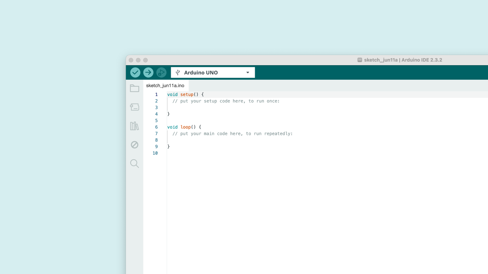
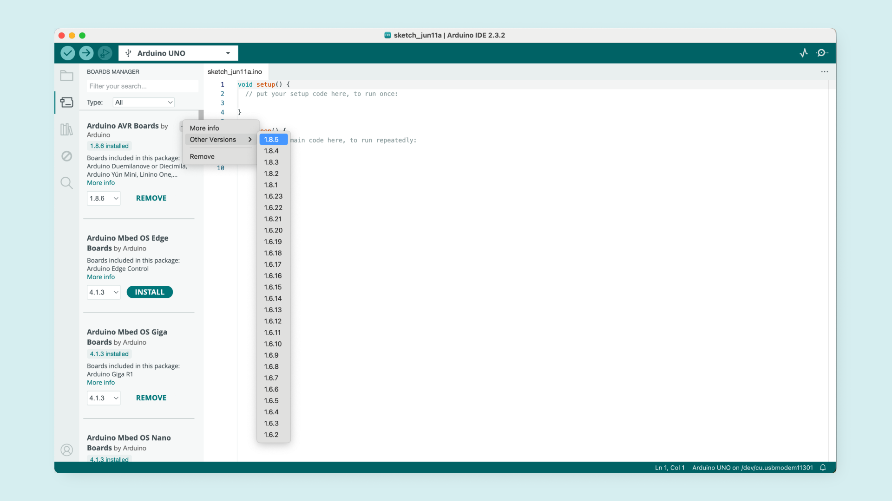
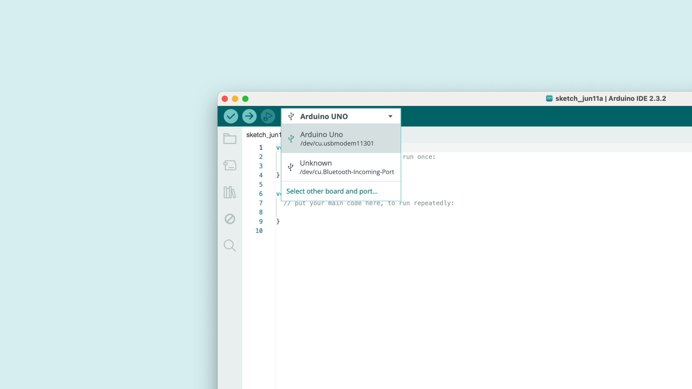
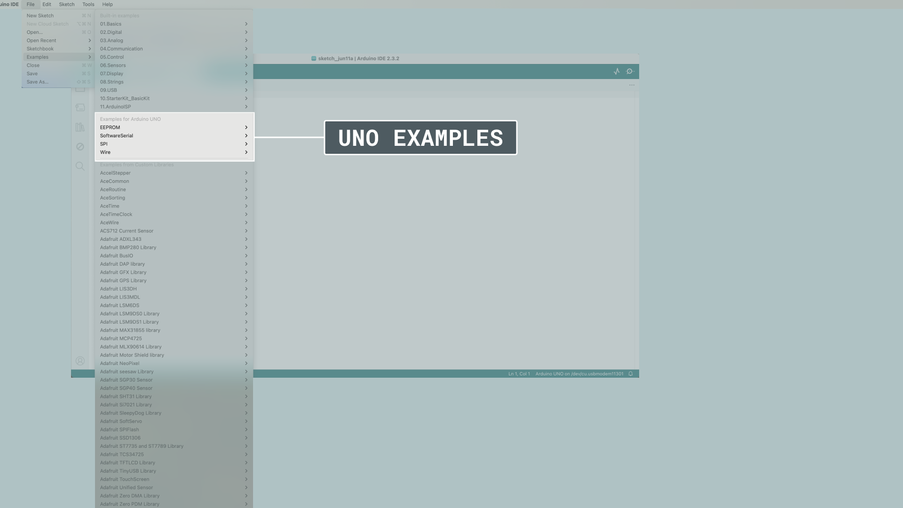

To use the [Arduino UNO R3](/hardware/uno-rev3/) board, you will need the Arduino AVR Board Package, which comes pre-installed with the IDE.

You will need a version of the Arduino IDE, which you can download from the [Arduino Software page](https://www.arduino.cc/en/software). In this guide, we will use the latest version of the IDE 2.

## Software & Hardware Needed

- [Arduino UNO R3](https://store.arduino.cc/products/arduino-uno-rev3)
- [Arduino IDE](/software/ide-v2)

***You can also use the [Cloud Editor](https://create.arduino.cc/editor) which comes with all Arduino boards pre-installed.*** 

## Download & Install IDE

1. First, we need to download the Arduino IDE, which can be done from the [Arduino Software page](https://www.arduino.cc/en/software/).
2. Install the Arduino IDE on your local machine.
3. Open the Arduino IDE.

## Board Package

The [Arduino Core for AVR devices](https://github.com/arduino/ArduinoCore-avr) comes pre-installed with the IDE, so no additional installation is necessary to get started. To use a different version than the latest, open the "Board Manager" from the left-hand menu. Search for AVR and install the version you want to use.

You should now be able to select your board in the board selector. You will need to have your board connected to your computer via the USB-B connector at this point.

Congratulations, your board is now ready to be used via the Arduino IDE.

## Compile & Upload Sketches

To compile and upload sketches, you can use the:
- **Checkmark** for compiling code.
- **Right arrow** to upload code.

There are several examples available for the UNO R3 board, which can be accessed directly in the IDE, through **File > Examples**. These examples can be used directly without external libraries.

## Summary

In this tutorial we prepared the Arduino UNO R3 to be used with the Arduino IDE.

For any issues regarding the Arduino AVR board package, please refer to the [Arduino Core for AVR devices](https://github.com/arduino/ArduinoCore-avr).