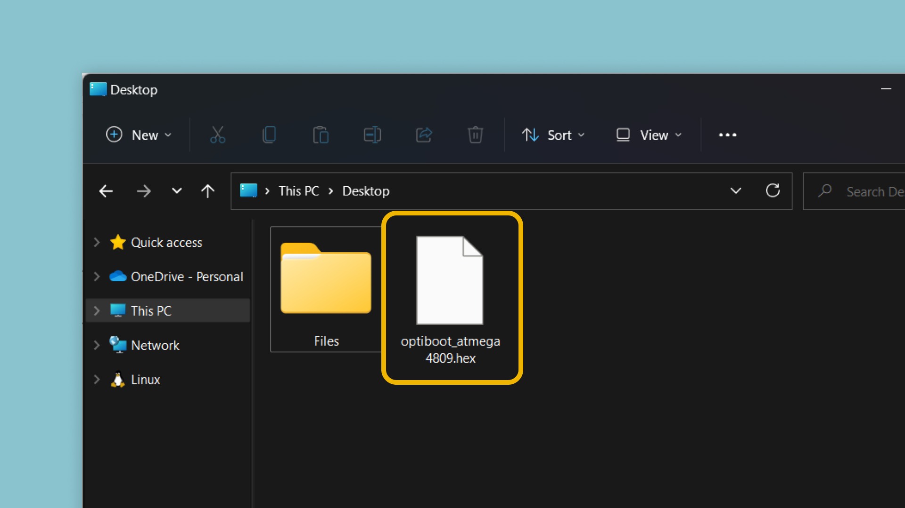
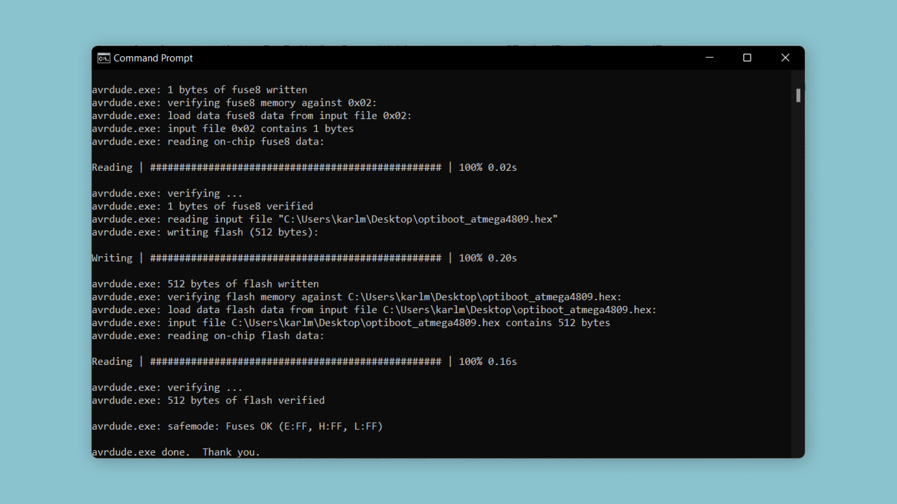
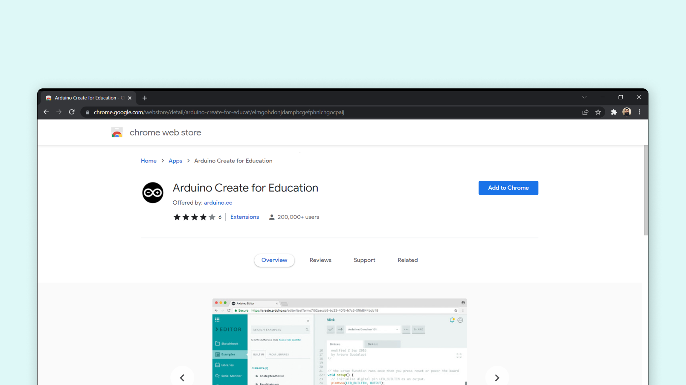
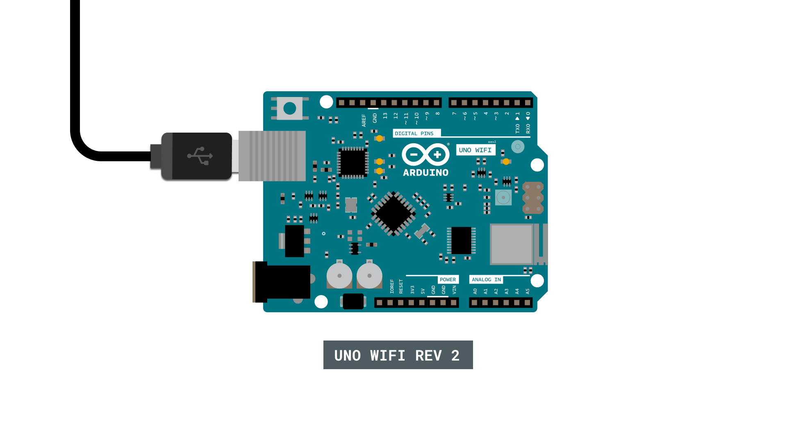

## Introduction 

> This tutorial is only relevant for Chromebook users that uses an Arduino UNO WiFi Rev 2 board.  

The [UNO WiFi Rev 2](https://store.arduino.cc/arduino-uno-wifi-rev2) is the connected version of the classic UNO board. If you are using a **Chromebook**, setting up your board is a bit different for this particular board:

- You will need to upgrade the firmware using either a **Windows/Mac/Linux** computer, prior to programming it via a Chromebook. Detailed instructions are provided in this tutorial, and the process only takes a few minutes!
- It is only possible to use the [Cloud Editor](https://create.arduino.cc/editor), an online IDE that is part of the [Arduino Cloud](https://cloud.arduino.cc/).

## Goals

The goals of this project are:

- Learn how to upgrade the firmware on your UNO WiFi Rev 2, so it can be used with a Chromebook.
- Learn how to install the [Arduino Create for Education](https://chrome.google.com/webstore/detail/arduino-create-for-educat/elmgohdonjdampbcgefphnlchgocpaij) app from Chrome Web Store.
- Learn how to upload a sketch to your board using a Chromebook and the Cloud Editor.

## Hardware & Software Needed

- AVRDUDE (instructions provided in the next section for each OS).
- [Arduino Cloud Editor](https://create.arduino.cc/).
- [Arduino Create for Education](https://chrome.google.com/webstore/detail/arduino-create-for-educat/elmgohdonjdampbcgefphnlchgocpaij) (Chrome Web Store)
- [Arduino UNO WiFi Rev 2](https://store.arduino.cc/arduino-uno-wifi-rev2).

## Upgrading Firmware

Since Chromebooks cannot run executables, the firmware upgrade for the UNO WiFi Rev 2 needs to be done through a Windows/Mac/Linux computer. 

First download the [optiboot_atmega4.hex](/resources/firmware/optiboot_atmega4809.hex) file, and move it to your **Desktop folder**. 



Connect your UNO WiFi Rev2 board to your computer and follow the instructions for each operative system below.

***It is important that you move the `optiboot_atmega4.hex` file to your desktop folder, otherwise the following commands won't work.***

### Mac

**1.** Download the [AVRDUDE tool for Mac (.zip file)](https://downloads.arduino.cc/tools/avrdude-6.3.0-arduino17-x86_64-apple-darwin12.tar.bz2) and unzip it to your Desktop folder. 

**2.** Open a terminal, and run the following command:

```
/Users/$(whoami)/Desktop/avrdude/bin/avrdude -C/Users/$(whoami)/Desktop/avrdude/etc/avrdude.conf -v -patmega4809 -cxplainedmini_updi -Pusb -b115200 -e -D -Ufuse2:w:0x01:m -Ufuse5:w:0xC9:m -Ufuse8:w:0x02:m -Uflash:w:/Users/$(whoami)/Desktop/optiboot_atmega4809.hex:i
```

### Windows

**1.** Download the [AVRDUDE tool for Windows (.zip file)](https://downloads.arduino.cc/tools/avrdude-6.3.0-arduino17-i686-w64-mingw32.zip) and unzip it to your Desktop folder. 

**2.** Open a command prompt (CMD), and run the following command:

```
"%userprofile%/Desktop/avrdude/bin/avrdude.exe" -C "%userprofile%/Desktop/avrdude/etc/avrdude.conf" -v -patmega4809 -cxplainedmini_updi -Pusb -b115200 -e -D -Ufuse2:w:0x01:m -Ufuse5:w:0xC9:m -Ufuse8:w:0x02:m -Uflash:w:%userprofile%\Desktop\optiboot_atmega4809.hex:i
```

### Linux

**1.** Download the [AVRDUDE tool for Linux (.zip file)](https://downloads.arduino.cc/tools/avrdude-6.3.0-arduino17-x86_64-pc-linux-gnu.tar.bz2) and unzip it to your Desktop folder. 

**2.** Open a terminal, navigate to your root directory.

```
cd /
```

**3.** Run the following command:

```
/Users/$(whoami)/Desktop/avrdude/bin/avrdude -C/Users/$(whoami)/Desktop/avrdude/etc/avrdude.conf -v -patmega4809 -cxplainedmini_updi -Pusb -b115200 -e -D -Ufuse2:w:0x01:m -Ufuse5:w:0xC9:m -Ufuse8:w:0x02:m -Uflash:w:/Users/$(whoami)/Desktop/optiboot_atmega4809.hex:i
```

### Expected Outcome

This will start a process of uploading the `.hex` file to your board. This will not take long, but make sure you do not disconnect the board from your computer. When finished, you should see the following output in the terminal (screen capture from Windows): 



Now that your firmware is upgraded, you should see your board blinking (1 second off, followed by a quick blink). This is another proof that it was successful. You can now disconnect your board, and **plug it into your Chromebook.** 

### Check AVRDUDE Installation

The above commands utilizes a tool called **AVRDUDE**, which is included in each version of the IDE. To check whether it is accessible on your computer, you can run the following commands. 

**Windows:**

```
"%userprofile%/Desktop/avrdude/bin/avrdude.exe"
```

**Mac:**

```
/Users/$(whoami)/Desktop/avrdude/bin/avrdude
```

**Linux:**

```
/Users/$(whoami)/Desktop/avrdude/bin/avrdude
```

### Troubleshoot

If the command fails to upgrade the firmware, please make sure that:

- AVRDUDE is accessible (see above instructions). The commands are designed to look for the tool in the `Desktop` folder, so it will need to be unzipped there.
- That you are using a Windows/Mac/Linux computer (remember, this cannot be performed on a Chromebook).
- That you have the `.hex` file in the Desktop folder. The command is written to look for it in that specific folder, so if it is not present, it will not work.

## Install Arduino App (Chrome Store)

To program your Arduino via a Chromebook, you will need the [Arduino Create for Education app](https://chrome.google.com/webstore/detail/arduino-create-for-educat/elmgohdonjdampbcgefphnlchgocpaij). This is downloaded and installed via the Chrome Web Store.



***If you have previously installed the app, make sure your version is up to date.***

## Cloud Editor

***To use the [Cloud Editor](https://create.arduino.cc/editor), you will need to be logged into your Arduino account. If you don't have an account, you will need to register one.***

**1.** Head over to the [Cloud Editor](https://create.arduino.cc/editor).

**2.** Create a new sketch, and write your program.

**3.** When you want to upload, connect your board to your computer via USB.



**4.** After connecting, the board's **name** and **port** is visible at the top of the editor (next to upload button). In this case, it is `COM32`.


**5.** Click the upload button. This will start the **compilation process**, and then upload the sketch to your board. 

Congratulations, you have now uploaded a sketch to your UNO WiFi Rev 2 using the Cloud Editor on a Chromebook.

***For more details on using the Cloud Editor, visit the [Getting Started with Cloud Editor guide](/cloud/web-editor/tutorials/getting-started/getting-started-web-editor).***

### Troubleshoot

If things are not working as expected:

- Make sure you have the latest version of the [Arduino Create for Education App](https://chrome.google.com/webstore/detail/arduino-create-for-educat/elmgohdonjdampbcgefphnlchgocpaij) installed.
- Make sure your board is connected to your computer properly.

## Conclusion

In this tutorial, we learned how to prepare the UNO WiFi Rev 2 board, to be used on a Chromebook. This was done by loading a specific hardware to the board, using the **AVRDUDE** tool and some custom commands.

For more tutorials on the UNO WiFi Rev 2 board, visit the [official documentation](/hardware/uno-wifi-rev2).
