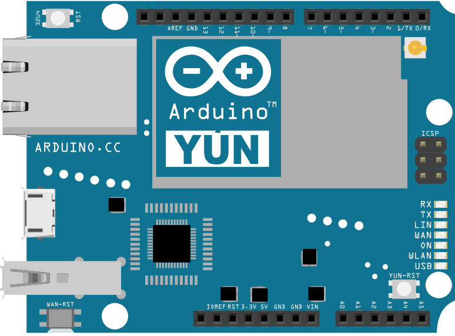

This example allows you to use the Yún's 32U4 processor or the microcontroller of the board attached to the shield as a serial terminal for the Linux processor.

Upload this to a Yún device via USB (not over WiFi) then open the serial monitor at 115200bps to see the boot process of the Linux processor. You can also use the serial monitor as a basic command line interface for Linux using  this sketch.

From the serial monitor the following commands can be issued:

- '~' followed by '0' -> Set the UART speed to 57600 baud

- '~' followed by '1' -> Set the UART speed to 115200 baud

- '~' followed by '2' -> Set the UART speed to 250000 baud

- '~' followed by '3' -> Set the UART speed to 500000 baud

- '~' followed by '~' -> Sends the bridge's shutdown command to obtain the console.

## Hardware Required

- Yún board or shield

## Circuit

There is no circuit for this example.



image developed using [Fritzing](http://www.fritzing.org). For more circuit examples, see the [Fritzing project page](http://fritzing.org/projects/)

## Code

Create a variable to hold the baud rate at which the processors will communicate and a variable to determine if entering command mode or not.

```arduino
long linuxBaud = 250000;
boolean commandMode = false;
```

Open the serial connection to the computer and Linux in `setup()`

```arduino
void setup() {

  Serial.begin(115200);

  Serial1.begin(linuxBaud);
}
```

In the `loop()` copy data from one serial connection to the other. If the "~" character is passed, enter command mode.

```arduino
void loop() {

  // copy from virtual serial line to uart and vice versa

  if (Serial.available()) {           // got anything from USB-Serial?

    char c = (char)Serial.read();     // read from USB-serial

    if (commandMode == false) {       // if we aren't in command mode...

      if (c == '~') {                 //    Tilde '~' key pressed?

        commandMode = true;           //       enter in command mode

      } else {

        Serial1.write(c);             //    otherwise write char to Linux

      }

    } else {                          // if we are in command mode...

      if (c == '0') {                 //     '0' key pressed?

        Serial1.begin(57600);         //        set speed to 57600

        Serial.println("Speed set to 57600");

      } else if (c == '1') {          //     '1' key pressed?

        Serial1.begin(115200);        //        set speed to 115200

        Serial.println("Speed set to 115200");

      } else if (c == '2') {          //     '2' key pressed?

        Serial1.begin(250000);        //        set speed to 250000

        Serial.println("Speed set to 250000");

      } else if (c == '3') {          //     '3' key pressed?

        Serial1.begin(500000);        //        set speed to 500000

        Serial.println("Speed set to 500000");

      } else if (c == '~') {

        Serial1.write((uint8_t *)"\xff\0\0\x05XXXXX\x0d\xaf", 11);

        Serial.println("Sending bridge's shutdown command");

      } else {                        //     any other key pressed?

        Serial1.write('~');           //        write '~' to Linux

        Serial1.write(c);             //        write char to Linux

      }

      commandMode = false;            //     in all cases exit from command mode

    }

  }

  if (Serial1.available()) {          // got anything from Linux?

    char c = (char)Serial1.read();    // read from Linux

    Serial.write(c);                  // write to USB-serial

  }
}
```

Below is the complete code:

<iframe src='https://create.arduino.cc/example/library/bridge_1_7_0/bridge_1_7_0%5Cexamples%5CYunSerialTerminal/YunSerialTerminal/preview?embed' style='height:510px;width:100%;margin:10px 0' frameborder='0'></iframe>


**Last revision 2016/05/25 by SM**
