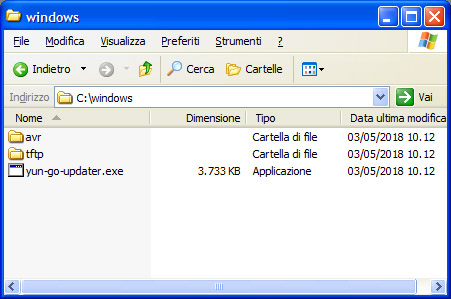

This procedure tries to bring your Yún board to the latest firmware, no matter how old it is. To achieve that, it goes through a series of passages and procedures that try to avoid at 99.999% the chance of bricking the board. It has been designed with our best effort to avoid you any trouble, nevertheless there is a remote chance of making the board unusable and therefore we can't assume the responsibility for that. The bootloader will be reflashed and this CAN BRICK your board if something unpredictable happens.
This should be considered an advanced procedure, pay attention to the warnings throughout. You should read and understand this document before trying anything mentioned below.

If you are in doubt about any of these steps, **DO NOT** follow this guide

***WARNING: Following this procedure will VOID the WARRANTY of your Yún***

## Download the Update Pagkage

We have created a package that contains everything needed for the procedure and it is specific for every supported operating system.

- [Windows](https://downloads.arduino.cc/openwrtyun/17.11/yun-go-updater-windows.zip)
- [OSX](https://downloads.arduino.cc/openwrtyun/17.11/yun-go-updater-osx.tar.gz)
- [Linux64](https://downloads.arduino.cc/openwrtyun/17.11/yun-go-updater-linux64.tar.gz)
- [Linux32](https://downloads.arduino.cc/openwrtyun/17.11/yun-go-updater-linux32.tar.gz)
- [LinuxARM](https://downloads.arduino.cc/openwrtyun/17.11/yun-go-updater-linuxarm.tar.gz)

## Extract the Package

According to your operating system and package downloaded, after you extract it on you r hard drive, you should end up with a folder named as your OS which contains two other folders and an executable. The executable should be launched with administrative rights.

## Launch the Updater as Admin

This step initiates the procedure and should open a CLI window. In our example we are using Windows OS. The script tries to find your IP addresses of the pc and of the board, but the USB connection will be used for the various upgrade operations. Answering Y to the first question will allow you to proceed with the preparation phase.

Reset your Yún board (YUN RST button) as instructed by the procedure and wait for the bootloader flashing and image uploading.

At the end of the whole process the CLI window will close or become inactive.

## Back to First Configuration

Your Yún board should be now with the latest OpenWRT (17.11 or newer) and you may go back to the [Getting Started Guide](https://www.arduino.cc//en/Guide/ArduinoYunRev2) and follow the instructions to configure for the first time the new image.

The text of the Arduino getting started guide is licensed under a
[Creative Commons Attribution-ShareAlike 3.0 License](http://creativecommons.org/licenses/by-sa/3.0/). Code samples in the guide are released into the public domain.
