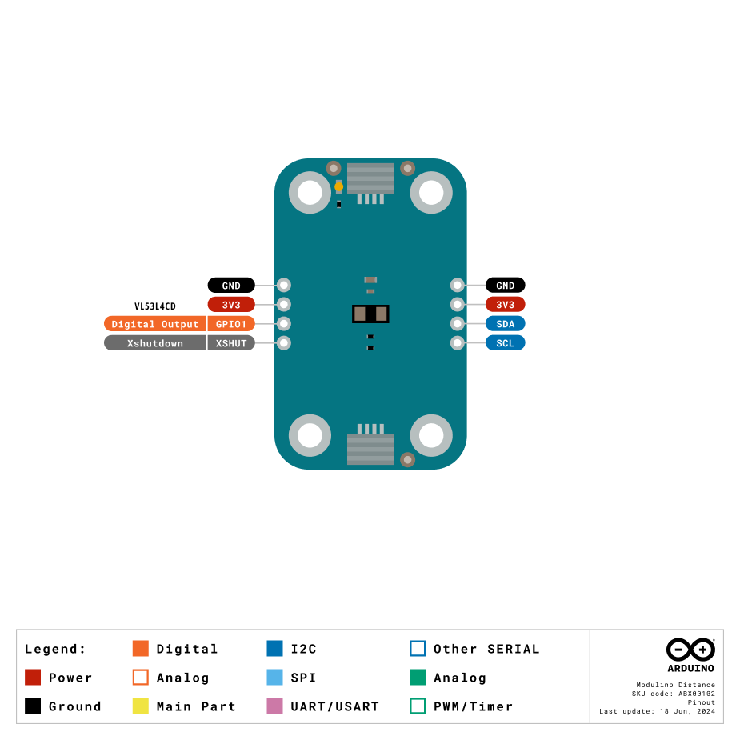
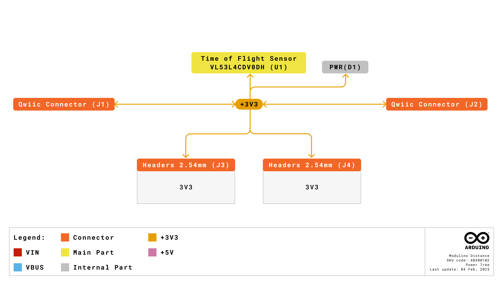
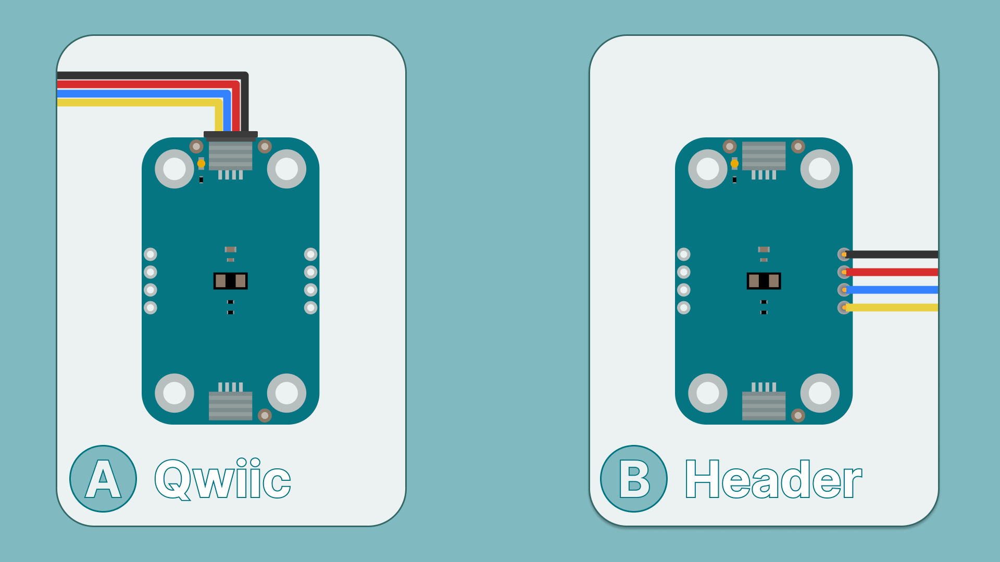
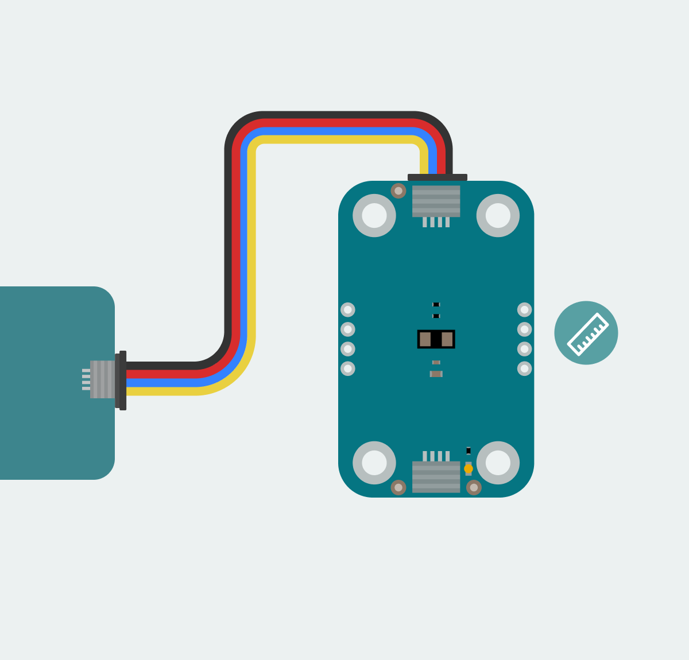
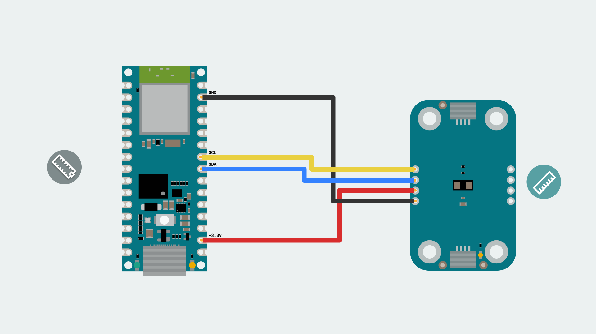
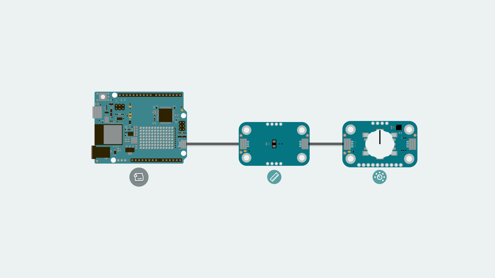
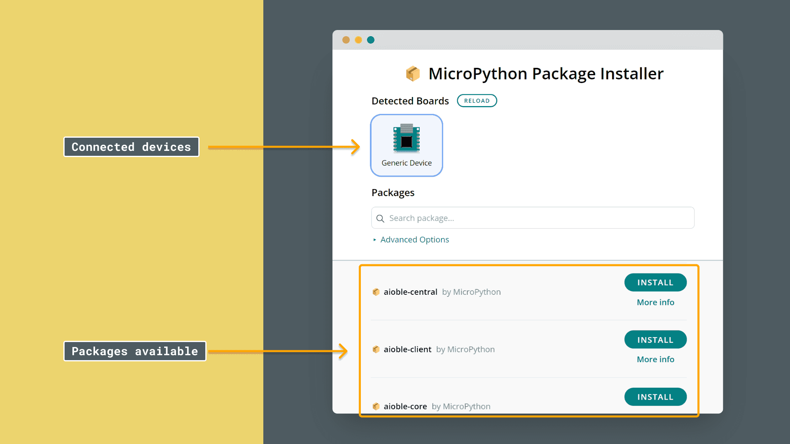

The Modulino Distance is a modular sensor that measures distance using Time-of-Flight (ToF) technology, making it perfect to add precise distance sensing and depth mapping to your projects!
The Modulino form factor is shaped with two QWIIC connectors and the I²C protocol integration, allowing the connection and programming of multiple modulinos in a very simple way. In addition to the QWIIC's connectors, the Modulinos also expose solderable pins that can be used in multiple ways and make them compatible with boards that are not QWIIC compatible.

# General Characteristics

The Modulino Distance is capable of measuring distances using Time-of-Flight technology. Take a look at the following table to know more about its measuring ranges:

| Parameter             | Condition            | Minimum | Typical | Maximum | Unit |
|-----------------------|----------------------|---------|---------|---------|------|
| Range                 | Distance Measurement | 1       | -       | 1300    | mm   |
| Resolution            | -                    | -       | 1       | -       | mm   |
| Operating Temperature | -                    | -30     | -       | 85      | °C   |


## Sensor Details

The VL53L5CX sensor from STMicroelectronics is the core component of this module. This ToF sensor natively supports digital communication (I²C), meaning it connects directly to the I²C bus on the module without requiring additional conversion circuitry.

| Parameter     | Condition     | Minimum | Typical | Maximum | Unit |
|---------------|---------------|---------|---------|---------|------|
| Field of View | -             | -       | 18      | -       | °    |
| Sampling Rate | -             | -       | 100     | -       | Hz   |
| Wavelength    | Laser Emitter | -       | 940     | -       | nm   |

The default address for the Module is:

| Modulino I²C Address | Hardware I²C Address |
|----------------------|----------------------|
| 0x52                 | 0x52                 |

***Note: Since the address cannot be changed on this Modulino specifically, using two or more identical modules on the same I²C bus will result in address conflicts and cause communication issues.***

## Pinout

The pinout for the Modulino Distance is shown below. Please note that the exposed solderable pins are directly connected to the QWIIC connectors using the same I²C interface.



Depending on the board connected to the modulino, the I²C pin names to program it may differ. Please check the [board tutorials](https://docs.arduino.cc/hardware/) on your modulino's compatible board or the [Modulino library](https://github.com/arduino-libraries/Modulino/tree/main/docs) to learn more.

## Power Specifications

The board is typically powered by +3.3 VDC when using the QWIIC interface as per the I²C standard.

| Parameter             | Condition               | Minimum | Typical     | Maximum | Unit |
|-----------------------|-------------------------|---------|-------------|---------|------|
| Supply Voltage        | -                       | 2.6     | 3.3 (QWIIC) | 3.5     | V    |
| Current Consumption   | Active measurement mode | -       | 18          | 21      | mA   |
| Current Consumption   | Standby mode            | -       | 2           | 5       | µA   |
| Current Consumption   | Power-down mode         | -       | 0.5         | 1       | µA   |
| Operating Temperature | -                       | -30     | -           | 85      | °C   |

The module includes a power LED that draws 1 mA and turns on as soon as it is powered. J1 (Qwiic connector), J2 (Qwiic connector), and the headers all share the same power branch. The power distribution of the module is therefore as follows:



## Schematic

The Modulino Distance uses a simple circuit, as shown in the schematic below:


The main component is the **VL53L5CX** sensor (U1), which handles distance measurements using Time-of-Flight technology, as well as I²C communication.

You can connect to the I²C pins (SDA and SCL) using either the **QWIIC connectors** (J1 and J2, this is the recommended method) or the **solderable pins** (J4). The board runs on **3.3V**, which comes from the QWIIC cable or the **3V3 pin** on J4.

There's also a small power indicator LED that lights up when the board is on.

You can grab the full schematic and PCB files from the [Modulino Distance](https://docs.arduino.cc/hardware/modulinos/modulino-distance) product page.

## How To Connect Your Modulino

The easiest and most reliable way to connect your Modulino is through the QWIIC Connect System. It’s plug-and-play, uses standard I²C, and makes it easy to join multiple modules. If your board supports QWIIC, this is the recommended way to go. 
Note that the dedicated I²C pins will differ from board to board meaning it is always a good idea to check your specific model.



## QWIIC Connector

Whenever available, the **QWIIC Connect System** is the preferred method. Connecting to the Modulino is extremely simple, just use a standard QWIIC cable to connect your board to either of the QWIIC connectors on the Modulino. Because the cable and connectors are polarized, there is no need to worry about accidentally swapping connections.

QWIIC is a plug-and-play I²C Connect System that uses standardized 4-pin connectors:
- GND
- 3.3V
- SDA (Data)
- SCL (Clock)



The Modulino features two QWIIC connectors, which are internally connected in parallel. This means you can daisy-chain multiple modules easily by connecting additional QWIIC cables between them.

## Solderable Header

When QWIIC is not available, you can use the exposed solderable pins on the module. You can solder pins to the unpopulated pads; just remember the pinout provided in this guide to connect to the right pins of your board.



## Daisy-Chaining Multiple Modulinos

Regardless of whether you connect the first Modulino via QWIIC or through the solderable pins, you can still take advantage of the extra QWIIC connector to daisy-chain additional modules. Each Modulino includes two QWIIC connectors wired in parallel, allowing you to connect one module to the next in a chain. As long as each module is configured with a unique I²C address, they can all communicate on the same bus. This approach keeps your setup clean, modular, and expandable without adding extra wiring complexity.



***The number of modules you can connect will depend on what modules you are chaining together, as this system allows for multiple sensors from different manufacturers to be added. Also, the cables you use for these connections will play a significant role in the setup's performance. Ensure your cables are correctly connected and capable of handling the required data transfer.

Each module should have a unique address on a chain if you plan to address them individually. Multiple modules with the same address will cause conflicts on the I²C bus.***
# How To Program Your Modulino

## Installing The Modulino Library
To program your Modulino it is recommended you use the official ```Modulino``` micropython library available [here](https://github.com/arduino/arduino-modulino-mpy). The library is fully compatible with the no **Arduino Lab for MicroPython**.
For information on installing the **Arduino Lab for MicroPython** please visit our [page](https://docs.arduino.cc/micropython/first-steps/install-guide/).

The ```Modulino``` library is not available by default on MicroPython devices hence installation is needed.
To simplify the process the [MicroPython Package Installer](https://github.com/arduino/lab-micropython-package-installer/releases) is recommended as it will provide a graphical interface to guide installation.
After installation, you should now be able to:

1. Open the tool.
2. Plug in your board to the computer.


If the board does not appear in the Detected Boards section, click Reload. If the board is still undetected, ensure no other programs (e.g., a code editor) are using the board's COM port.

4. Search for the ```Modulino``` package by filling in the text box on the search feature.
5. Click Install and wait for the installation confirmation.
6. Disconnect the board from the tool before returning to your code editor to avoid conflicts due to a busy COM port.



The module should now be includable in your program using:
```from modulino import ModulinoDistance```

# Getting Distance Data

Getting data from the sensor is straightforward using the ```Modulino``` library.
For the **Modulino Distance**, there is one crucial function:
- ```.distance``` - Provides the distance measurement from the sensor. (Default in cm)
- By default the Modulino library uses ```Wire1``` if your board model has a different pinout for the dedicated I²C pins you might have to edit it as instructed [here](https://github.com/arduino/arduino-modulino-mpy/tree/main/docs#%E2%84%B9%EF%B8%8F-using-3rd-party-boards). More information on **Wire** can be found [here](https://docs.arduino.cc/language-reference/en/functions/communication/wire/).
Here is an example of how to implement this function to acquire data:

```python
from modulino import ModulinoDistance
from time import sleep_ms

distance = ModulinoDistance()

while True:
    print(f"📏 Distance: {distance.distance} cm")
    sleep_ms(50)
```

This simple code creates an instance of the ModulinoDistance class and continuously reads the distance values, displaying them in centimeters with a 50ms delay between readings.

## Troubleshooting

### Sensor Not Reachable
If your Modulino's power LED isn't on or the sensor isn't responsive, first check that the board is properly connected:
- Ensure both the board and the Modulino are connected to your computer, and that the power LEDs on both are lit.
- If the issue persists, make sure the Qwiic cable is properly clicked into place.

### Library Not Installed Properly
If you encounter an issue with the `import ModulinoDistance` command, verify that the Modulino library is correctly installed:
- Check the package installer to ensure the library is installed and up-to-date.
- Re-install the library through the Library Manager.

### Inaccurate Values
If the sensor values are not accurate, make sure:
- The sensor lens is clean and free from dust or obstructions.
- All exposed electronics are not touching any conductive surfaces, as this could interfere with readings.
- The object being measured is within the sensor's detection range.

# What Is Next?

Now that you've learned how to use your Modulino Distance, you're all set to integrate it into your projects!
- Create a parking assistance system that provides audio feedback as objects get closer, similar to car parking sensors.
- Build a theremin-like musical instrument that changes pitch or volume based on hand movements in front of the sensor.
- Design an automatic dispenser that activates when hands are detected beneath it (for soap, sanitizer, etc.).

# Conclusion

The **Modulino Distance** is a digital Time-of-Flight distance sensor that communicates over I²C and follows the Modulino form factor. It includes standard Qwiic connectors for quick, solderless connections and easy daisy-chaining with other modules. Paired with the Modulino library, it makes accessing distance data straightforward, allowing you to focus on experimenting or building your system logic. It's a small, reliable module suited for both quick tests and longer-term setups.