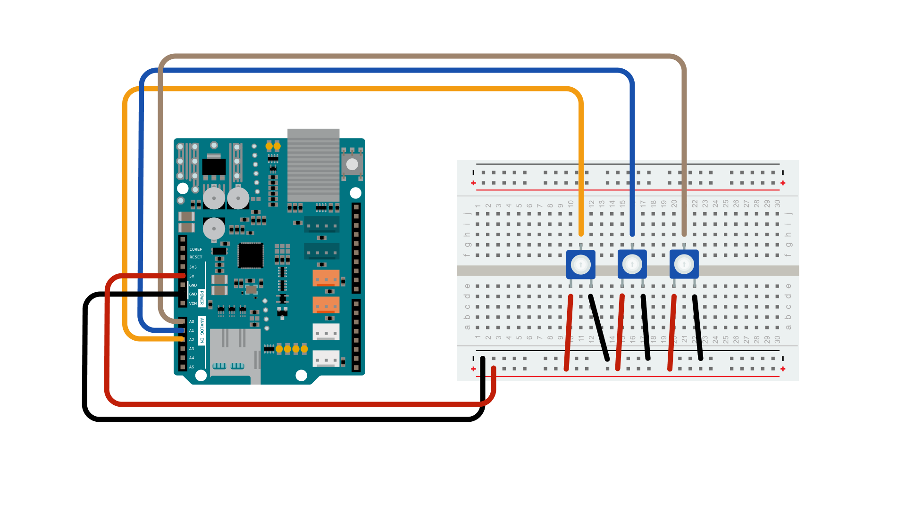

This example shows how to use the SD card Library to log data from three analog sensors to a SD card. Please [click here](https://www.arduino.cc/en/Reference/SD) for more information on the SD library.

## Hardware Required

- Arduino board
- Ethernet Shield
- 3 10k ohm potentiometers
- hook-up wires
- breadboard
- Formatted SD card


## Circuit



The Arduino board has to be connected to  the Ethernet Shield. The three potentiometers may be substituted with other analog sensors, to be wired according to their interfacing techniques.

## Schematics


## Code

The code below is configured for use with an Ethernet shield, which has an onboard SD slot.  In the `setup()`, call `SD.begin()`, naming pin 4 as the CS pin. This pin varies depending on the make of shield or board.

In the `loop()`, a String is created to hold the information from three analog sensors. The code iterates through the sensors, adding their data to the string.

Next, the file on the SD card is opened by calling `SD.open()`. Once available, the data is written to the card when `dataFile.println()` is used. The file must be closed with `dataFile.close()` to save the information.

```arduino

/*

  SD card datalogger

  This example shows how to log data from three analog sensors

  to an SD card using the SD library. Pin numbers reflect the default

  SPI pins for Uno and Nano models

  The circuit:

   analog sensors on analog ins 0, 1, and 2

   SD card attached to SPI bus as follows:

 ** SDO - pin 11

 ** SDI - pin 12

 ** CLK - pin 13

 ** CS - depends on your SD card shield or module.

        Pin 10 used here for consistency with other Arduino examples

    (for MKRZero SD: SDCARD_SS_PIN)

  created  24 Nov 2010

  modified  24 July 2020

  by Tom Igoe

  This example code is in the public domain.

*/

#include <SPI.h>
#include <SD.h>

const int chipSelect = 10;

void setup() {

  // Open serial communications and wait for port to open:

  Serial.begin(9600);

  // wait for Serial Monitor to connect. Needed for native USB port boards only:

  while (!Serial);

  Serial.print("Initializing SD card...");

  if (!SD.begin(chipSelect)) {

    Serial.println("initialization failed. Things to check:");

    Serial.println("1. is a card inserted?");

    Serial.println("2. is your wiring correct?");

    Serial.println("3. did you change the chipSelect pin to match your shield or module?");

    Serial.println("Note: press reset or reopen this serial monitor after fixing your issue!");

    while (true);

  }

  Serial.println("initialization done.");
}

void loop() {

  // make a string for assembling the data to log:

  String dataString = "";

  // read three sensors and append to the string:

  for (int analogPin = 0; analogPin < 3; analogPin++) {

    int sensor = analogRead(analogPin);

    dataString += String(sensor);

    if (analogPin < 2) {

      dataString += ",";

    }

  }

  // open the file. note that only one file can be open at a time,

  // so you have to close this one before opening another.

  File dataFile = SD.open("datalog.txt", FILE_WRITE);

  // if the file is available, write to it:

  if (dataFile) {

    dataFile.println(dataString);

    dataFile.close();

    // print to the serial port too:

    Serial.println(dataString);

  }

  // if the file isn't open, pop up an error:

  else {

    Serial.println("error opening datalog.txt");

  }
}
```


**Last revision 2015/08/17 by SM**