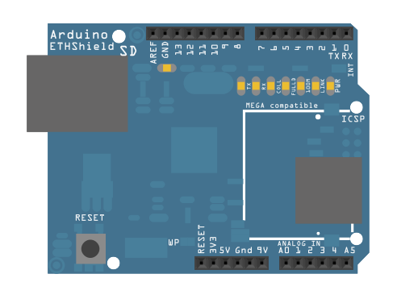

This sketch uses the DHCP extensions to the Ethernet library to get an IP address via DHCP and print the address obtained using an Arduino Ethernet shield.

DHCP is used to assign an IP address when Ethernet.begin(mac) is called. Using DHCP significantly increases the size of a sketch. Using the localIP() function, the assigned IP address is sent out via the Serial Monitor.

## Hardware Required

- Arduino Board

- [Arduino Ethernet Shield](/hardware/ethernet-shield-rev2)

## Circuit

The Ethernet shield allows you to connect a WIZNet Ethernet controller to the Arduino boards via the SPI bus. It uses the ICSP header pins and pin 10 as chip select for the SPI connection to the Ethernet controller chip. Later models of the Ethernet shield also have an SD Card on board. Digital pin 4 is used to control the chip select pin on the SD card.

The shield should be connected to a network with an Ethernet cable.  You will need to change the network settings in the program to correspond to your network.



Image developed using [Fritzing](http://www.fritzing.org). For more circuit examples, see the [Fritzing project page](http://fritzing.org/projects/)

***In the above  image, the Arduino board would be stacked below the Ethernet shield.***

## Code

```arduino

/*

  DHCP-based IP printer

  This sketch uses the DHCP extensions to the Ethernet library

  to get an IP address via DHCP and print the address obtained.

  using an Arduino Wiznet Ethernet shield.

  Circuit:

   Ethernet shield attached to pins 10, 11, 12, 13

  created 12 April 2011

  modified 9 Apr 2012

  by Tom Igoe

  modified 02 Sept 2015

  by Arturo Guadalupi

 */

#include <SPI.h>
#include <Ethernet.h>

// Enter a MAC address for your controller below.
// Newer Ethernet shields have a MAC address printed on a sticker on the shield
byte mac[] = {

  0x00, 0xAA, 0xBB, 0xCC, 0xDE, 0x02
};

void setup() {

  // You can use Ethernet.init(pin) to configure the CS pin

  //Ethernet.init(10);  // Most Arduino shields

  //Ethernet.init(5);   // MKR ETH shield

  //Ethernet.init(0);   // Teensy 2.0

  //Ethernet.init(20);  // Teensy++ 2.0

  //Ethernet.init(15);  // ESP8266 with Adafruit® Featherwing Ethernet

  //Ethernet.init(33);  // ESP32 with Adafruit® Featherwing Ethernet

  // Open serial communications and wait for port to open:

  Serial.begin(9600);

  while (!Serial) {

    ; // wait for serial port to connect. Needed for native USB port only

  }

  // start the Ethernet connection:

  Serial.println("Initialize Ethernet with DHCP:");

  if (Ethernet.begin(mac) == 0) {

    Serial.println("Failed to configure Ethernet using DHCP");

    if (Ethernet.hardwareStatus() == EthernetNoHardware) {

      Serial.println("Ethernet shield was not found.  Sorry, can't run without hardware. :(");

    } else if (Ethernet.linkStatus() == LinkOFF) {

      Serial.println("Ethernet cable is not connected.");

    }

    // no point in carrying on, so do nothing forevermore:

    while (true) {

      delay(1);

    }

  }

  // print your local IP address:

  Serial.print("My IP address: ");

  Serial.println(Ethernet.localIP());
}

void loop() {

  switch (Ethernet.maintain()) {

    case 1:

      //renewed fail

      Serial.println("Error: renewed fail");

      break;

    case 2:

      //renewed success

      Serial.println("Renewed success");

      //print your local IP address:

      Serial.print("My IP address: ");

      Serial.println(Ethernet.localIP());

      break;

    case 3:

      //rebind fail

      Serial.println("Error: rebind fail");

      break;

    case 4:

      //rebind success

      Serial.println("Rebind success");

      //print your local IP address:

      Serial.print("My IP address: ");

      Serial.println(Ethernet.localIP());

      break;

    default:

      //nothing happened

      break;

  }
}
```

**Last revision 2018/09/07 by SM**
