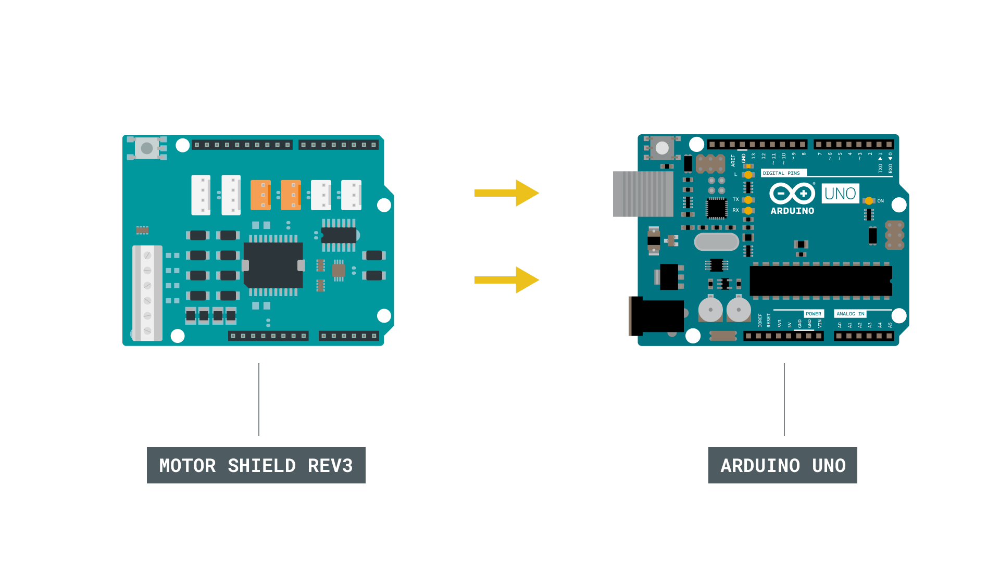

## Introduction 

In this tutorial, we will learn how to control a DC motor, using the [Motor Shield Rev3](https://store.arduino.cc/arduino-motor-shield-rev3), a shield compatible with the [Arduino UNO](https://store.arduino.cc/arduino-uno-rev3). We will take a look at three different pins: **brake, pwm & direction**, where we will create a simple sketch that uses all three of them. In addition we will also take a look at how we can power our project, using an external power source.


## Goals

The goals of this project are:

- Set up your Motor Shield Rev3 to control a DC motor.
- Control the brake, pwm and direction of the motor. 
- How to connect an external power source to the shield.

## Hardware & Software Needed

- Arduino IDE ([online](https://create.arduino.cc/) or [offline](https://www.arduino.cc/en/main/software)).
- Arduino Motor Shield Rev3([link to store](https://store.arduino.cc/arduino-motor-shield-rev3))
- Arduino UNO ([link to store](https://store.arduino.cc/arduino-uno-rev3))
- DC motor (6-12V)
- Power source (this tutorial uses 2x 3.7V Li-Ion 18650 batteries).

## Controlling a DC Motor

There are several ways we can control a DC motor, perhaps the easiest one is just by applying power to it. Very early inventions using the DC motor simply worked like that: add a power source and the motor will start rotating, switch the polarity and you switch the direction.

But if we want to do a bit more than just making a motor spin full speed in two directions, we need a **motor control circuit.** More specifically, the dual full-bridge driver [L298P](https://www.st.com/resource/en/datasheet/l298.pdf), which we can find on the Motor Shield Rev3. 

With this IC, we can set the work duty (0-255), enable brakes (HIGH, or LOW), and set the direction (HIGH or LOW). Each of these features can be controlled using a different set of pins. As we are going to control a DC motor in this tutorial, let's take a look at the pins that are used:

Channel A:
- **D12** - Direction
- **D3** - PWM (work duty)
- **D9** - Brake 
- **A0** - current sensing.

Channel B:
- **D13** - Direction
- **D11** - PWM (work duty)
- **D8** - Brake 
- **A1** - current sensing.

Now if we were to use just the bare chip, it would involve a bit more complex circuitry. Fortunately, all we have to worry about is connecting the DC motor to one of the channels, connect an external power source, and we are good to go!

### Circuit

Let's begin by mounting our Arduino Motor Shield Rev3 on top of an Arduino UNO.



Now, let's connect the motor to the A channel, following the image below. The channels are marked next to the screw terminals on the shield.


Finally, we can connect the USB cable to the computer.

## Programming the Board

We will now get to the programming part of this tutorial. 

First, let's take a look at some key commands in the code. We are actually not using a library, as the operation is very basic.

- `int directionPin = 12;` - assign direction pin.
- `int pwmPin = 3;` - assign PWM (work duty) pin.
- `int brakePin = 9;` - assign brake pin.
- `digitalWrite(directionPin, state)` - sets the direction of the pin by using HIGH or LOW states. 
- `digitalWrite(brakePin, state)` - release or activate brakes, using HIGH or LOW states.
- `analogWrite(pwmPin, 30)` - write a value between 0-255 to set the work duty.
- `directionState = !directionState` - a boolean that switches every time the loop is run.

The sketch can be found in the snippet below. Upload the sketch to the board.

```arduino
int directionPin = 12;
int pwmPin = 3;
int brakePin = 9;

//uncomment if using channel B, and remove above definitions
//int directionPin = 13;
//int pwmPin = 11;
//int brakePin = 8;

//boolean to switch direction
bool directionState;

void setup() {
  
//define pins
pinMode(directionPin, OUTPUT);
pinMode(pwmPin, OUTPUT);
pinMode(brakePin, OUTPUT);

}

void loop() {

//change direction every loop()
directionState = !directionState;

//write a low state to the direction pin (13)
if(directionState == false){
  digitalWrite(directionPin, LOW);
}

//write a high state to the direction pin (13)
else{
  digitalWrite(directionPin, HIGH);
}

//release breaks
digitalWrite(brakePin, LOW);

//set work duty for the motor
analogWrite(pwmPin, 30);

delay(2000);

//activate breaks
digitalWrite(brakePin, HIGH);

//set work duty for the motor to 0 (off)
analogWrite(pwmPin, 0);

delay(2000);
}
```

## Testing It Out

After we have uploaded the code, the program will start running immediately. If everything is working correctly, the motor should start spinning as soon as the program finishes uploading. 

The expected outcome is that the motor spins in one direction for 2 seconds, with the work duty set to `30` (quite low), and brakes disengaged.


When 2 seconds have passed, the brakes are activated and work duty is set to 0. This means the motor comes to a full stop.


### Troubleshoot

If the code is not working, there are some common issues we can troubleshoot:

- We have not connected the circuit properly. We can double check this by going back to the circuit at the top of this page.
- We have connected the motor to the wrong channel. Remember that the pin definitions in the code need to match the channel you connect it to.
- The external power source is not working: double check that your batteries are working, and re-charge them if needed.

## Conclusion

In this tutorial, we have learned how to control a DC motor using the Motor Shield Rev3. With the **brake, pwm and direction**, you now have a lot more options when it comes to motor control. Having this type of control allows you to create many different cool projects, without having to create complicated programs or advanced circuits!

