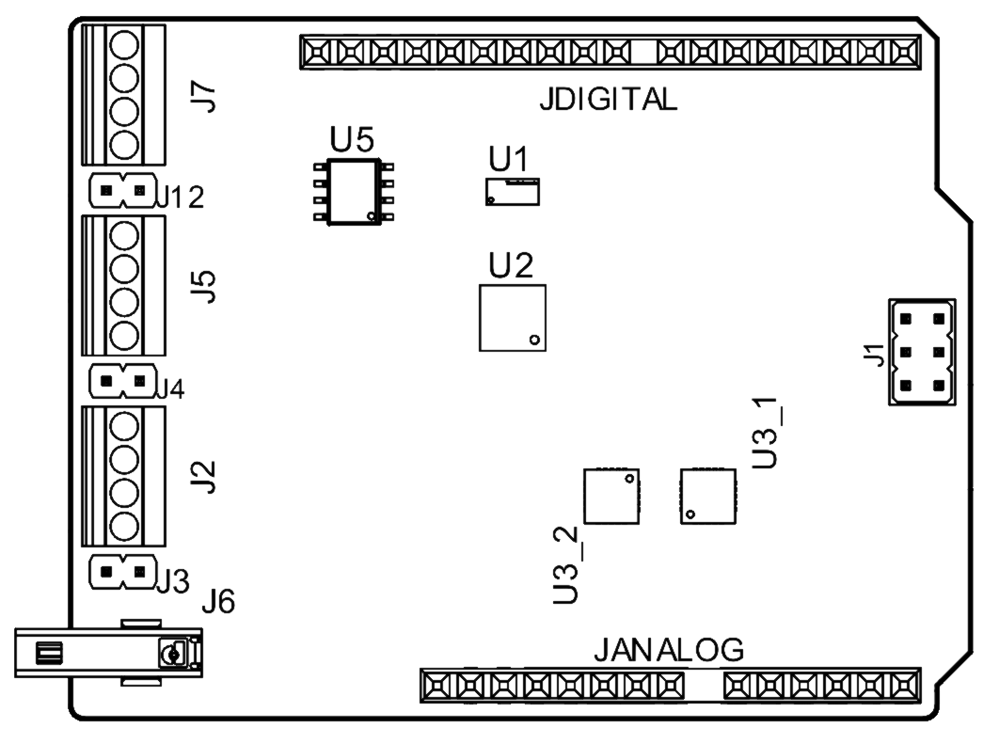
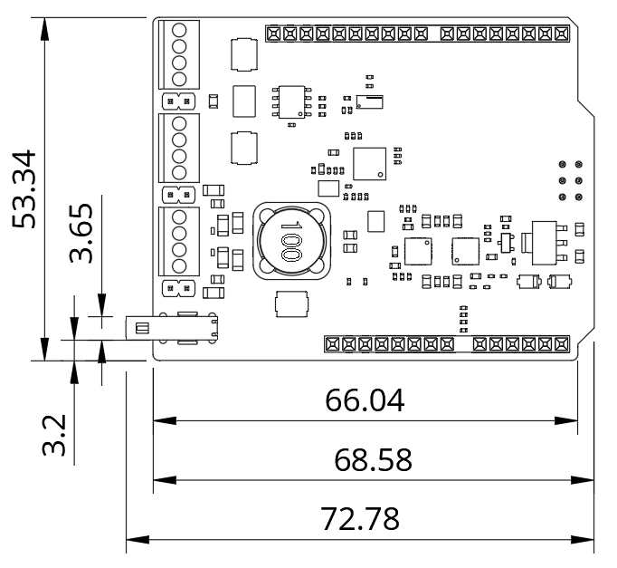

# Description

The Arduino SPE Shield is a versatile solution for industrial communication, IoT, and automation, combining Single Pair Ethernet (10BASE-T1S) and RS485. It enables integration into low-power Ethernet networks and robust serial communication systems, ensuring efficient connectivity in embedded environments. Compatible with the Arduino Uno, it supports SPI, UART, and I2C, facilitating interoperability with various devices. Additionally, it features screw terminals for additional connections. Its open-source design and advanced protection make it ideal for applications in industrial networks, remote monitoring, and automated control.

# Target Areas:

Industrial automation, building automation, factory automation, automotive networks

# CONTENTS

## Application Examples

The Arduino SPE Shield expands industrial and IoT communication capabilities, offering a seamless interface for Single Pair Ethernet (10BASE-T1S) and RS485 networks. Its versatility makes it ideal for applications requiring low-power Ethernet, robust serial communication, and industrial automation.  Below are some examples demonstrating its potential across various applications: 

**Industrial Automation & Networking:** Enable reliable communication and data exchange for:
- **Industrial IoT Gateways:** Bridge RS485 devices with modern Ethernet (10BASE-T1S) networks to enable real-time data collection, remote monitoring, and Cloud integration for predictive analytics.
- **Factory Automation & Control Systems:** Integrate RS485-based PLCs and sensors into a unified Ethernet infrastructure, allowing for centralized control and efficient machine-to-machine communication.
- **Energy & Smart Grid Monitoring:** Use RS485 metering devices and Ethernet communication to collect, transmit, and analyze energy data, contributing to smart grid management and optimized energy use.

**Building Automation & Smart Infrastructure:** Connect industrial controllers, smart sensors, and Ethernet-based networks for enhanced automation and monitoring, such as:
- **HVAC & Environmental Monitoring:** Integrate temperature, humidity, and air quality sensors via RS485 and transmit data via Ethernet (10BASE-T1S) for effective climate control in buildings.
- **Access Control & Security Systems:** Link RS485 door controllers and biometric scanners to networked security systems for real-time authentication and access logging.
- **Industrial Asset Tracking:** Combine RS485-connected RFID readers with Ethernet-based asset management systems to monitor equipment and inventory in large facilities.
- **Remote Monitoring & Edge Computing:** With multiple communication protocol support, the SPE Shield provides powerful remote monitoring and edge processing for Remote Equipment Diagnostics, Real-time Data Logging, Smart Agriculture Solutions.

The Arduino SPE Shield offers a scalable, open-source platform for developers, enabling rapid prototyping and seamless integration with industrial and IoT networks. Its support for SPI, UART, and I2C, alongside RS485 and Ethernet capabilities, makes it a versatile solution for building resilient and connected systems across industrial, smart infrastructure, and automation applications.

## Features
### General Specifications Overview

The main features of the Arduino SPE shield are detailed in the table shown below.

| **Feature**                       | **Description**                                                                                                                                                                               |
| --------------------------------- | --------------------------------------------------------------------------------------------------------------------------------------------------------------------------------------------- |
| Connectors                        | 1x T1S SPE screws terminal  1x RS485 terminal screws  1x T1S SPE dedicated connector                                                                                            |
| Arduino UNO R4 Headers Interfaces | UART  SPI  I2C                                                                                                                                                               |
| Power                             | +5 VDC from the USB-C® connector of the connected UNO board  +6-24VDC from T1SP on screw terminal block, enabling PoDL functionality  +6-24VDC from VIN on screw terminal block |
| Operating Temperatures            | To confirm                                                                                                                                                                                    |
| Dimensions                        | 68.85 mm x 53.34 mm                                                                                                                                                                           |

### Communication Interfaces
| Interfaces   | Connector                                                  |
| ------------ | ---------------------------------------------------------- |
| T1S SPE (x2) | - Screws terminal   - Dedicated connector           |
| RS485 (x1)   | - Screws terminal                                          |
| UART (x1)    | - UNO header connector (pin D0, D1)                        |
| SPI (x2)     | - UNO header connector (pin D10-D13)  - ICSP header |
| I2C (x1)     | - UNO header connector (pin A4, A5, SDA, SCL)       |

### Related Accessories
- T1S SPE dedicated connector
### Related Products
- UNO R4 WiFi (SKU: ABX00087)
## Ratings

### Operating Conditions

#### Electrical Characteristics
The Arduino SPE Shield is designed for reliable operation across diverse environments, integrating advanced protection mechanisms and flexible power options.

| **Parameter**         | **Value**                           | **Description**                                                                                                             |
| --------------------- | ----------------------------------- | --------------------------------------------------------------------------------------------------------------------------- |
| Input Voltage         | +5VDC (via USB-C®)  +6-24VDC | -- Supports power input from USB-C   - PoDL (Power over Data Line)   - External DC via screw terminal blocks. |
| Operating Current     | Up to 2A                            | Ensures stable operation, protected by overcurrent limits based on circuit design.                                          |
| Communication Voltage | TTL levels (3.3V or 5V)             | Compatible with Arduino Uno R4 for digital signals (UART, SPI, I2C).                                                        |
| ESD Protection        | ±24V surge protection               | TVS diodes safeguard the shield against electrostatic discharge and electrical surges.                                      |

#### Environmental Conditions (To check)

| **Parameter** | **Value** | **Description** |
| ------------- | --------- | --------------- |
|               |           |                 |
|               |           |                 |

#### Communication Protocols
For detailed information about the supported protocols **RS485** and **Single Pair Ethernet (SPE)**, including speeds, distances, and jumper configurations, please refer to the **Protocols** section.

## Functional Overview

### Shield Topology

| Ref.        | Description                                                                                              |
| ----------- | -------------------------------------------------------------------------------------------------------- |
| U1          | Level Shifter IC (P/N: TXB0108DQSR)                                                                      |
| U2          | 10BASE-T1S MAC-PHY Ethernet Controller (P/N: LAN8651B1-E/LMX )                                           |
| U3_1, U3_2  | High-Side Power Switch (P/N: MAX17613AATP+T )                                                            |
| J1          | Header Connector 2.54mm, 2x3 positions, female height 8.5mm, male height 11.4mm (P/N: RSE2-1-06-SG-3)    |
| J2, J5, J7  | Screw Terminal Connector, 4 positions, pitch 2.54mm, height 8.6mm, black (P/N: DG308-2.54-04P-13-00Z(H)) |
| J3, J4, J12 | Male Vertical Pin Header, 2 positions, pitch 2.54mm, THT, single row (P/N: 61300211121)                  |
| J6          | Connector 10BASE-T1S, Category B, Single Pair Ethernet (P/N: 1163797)                                    |
| JANALOG     | ANALOG UNO SHIELDS Header, 2.54mm, 8+6 pins, custom 5.08mm pitch, 14.95mm pin length (P/N: 20TW-988)     |
| JDIGITAL    | DIGITAL UNO SHIELDS Header, 2.54mm, 8+10 pins, custom 4.06mm pitch, 14.95mm pin length (P/N: 20TW-987)   |

### Pinout

### Block Diagram

### Power Supply
The **Arduino SPE Shield** is designed with a robust and efficient power management system to ensure reliable operation in industrial and IoT environments. It supports multiple power input sources and incorporates advanced protection mechanisms.

#### Power Sources
The shield can be powered in the following ways:

- **+5VDC** from the **USB-C®** connector of the connected Arduino UNO R4.
- **+6-24VDC** from **T1SP** screw terminal block, enabling **Power over Data Line (PoDL)** functionality.
- **+6-24VDC** from **VIN** screw terminal block, allowing external DC power input.

#### Power Management & Protection Features
To ensure a stable and secure power system, the shield includes several protection mechanisms:

- **Under-Voltage Lockout (UVLO):** Prevents operation below **4.2V**, avoiding instability.
- **Over-Voltage Lockout (OVLO):** Limits voltage to **29.9V**, protecting against excessive input.
- **Over-Current Protection:** Restricts power draw to **2A**, preventing circuit damage.
- **Transient Voltage Suppression (TVS):** Absorbs sudden voltage spikes (24V rated diodes).
- **Electrostatic Discharge (ESD) Protection:** Shields critical components from electrical surges.

#### Switching System
The shield includes an intelligent **switching system** to control power distribution efficiently:

| **Switch**    | **Function**                                                         |
| ------------- | -------------------------------------------------------------------- |
| LOCAL_ENABLE  | Activates internal power for shield operation.                       |
| T1S_DISABLE   | Disables Single Pair Ethernet (10BASE-T1S) power when unused.        |
| INPUT SWITCH  | Ensures RS485/UART circuits receive power when the shield is active. |
| OUTPUT SWITCH | Controls external device power usage, defaulting to an off state.    |

#### Startup & Recovery Mechanisms
To ensure safe operation, the system includes:
- Startup Delay (TSTART): Default 100ms delay before power activation.
- Automatic Retry Mode: Enables recovery after transient faults for continuous stability.

### Protocols

#### RS485

RS485 is a robust communication protocol designed for industrial settings, featuring differential signaling that ensures noise immunity and reliability over long distances. 

**Key Features**  
- **Speed:** Up to **10 Mbps** for short distances (<15m), and typically up to 115.2 kbps for longer distances.  
- **Maximum Distance:** Supports up to 1,200 meters with reduced speeds.  
- **Topology:** Works in a bus topology, supporting up to 32 nodes per segment (expandable with repeaters).  
- **Applications:** Commonly used in industrial automation (PLCs, HVAC systems, motor controllers).  

**RS485 Implementation in the Arduino SPE Shield**  
- **RS485 Driver IC:** The shield uses an XR33058IDTR-F transceiver, which manages signal transmission and reception with high noise tolerance.
  - Includes support for fail-safe biasing (ensuring stable idle-state signals).
- **Connection Points:** RS485 screw terminals allow direct wiring of RS485 devices.  
- **Jumper Configuration:** Includes a 120Ω termination jumper to match the bus impedance.  
  - Proper termination minimizes signal reflections, critical for long-distance communication stability.

#### Single Pair Ethernet (SPE)
  
Single Pair Ethernet (SPE) enables Ethernet communication over a single twisted pair of wires, reducing cabling complexity without sacrificing performance in IoT and industrial applications.

**Key Features**  
- **Speed:** Operates at **10 Mbps** under the 10BASE-T1S standard.  
- **Maximum Distance:** Supports up to **15 meters** in multidrop topology (multiple nodes on a single segment).  
- **Topology:** Allows up to 8 nodes in a multidrop network.  
- **Applications:** IoT devices, sensors, and controllers for industrial automation.  

**SPE Implementation in the Arduino SPE Shield**  
- **Ethernet PHY IC:** The shield uses a 10BASE-T1S PHY, which supports multidrop communication and noise suppression.
  - Includes onboard common-mode chokes to filter high-frequency interference.
- **Connection Points:**
  - **Screw Terminals** for single pair wiring.
  - **Dedicated SPE Connector** for robust direct connections to compatible devices.  
- **Jumper Configuration:** Termination resistors are configurable:
  - *Point-to-Point Setup:* Use jumpers to enable the termination at endpoints for proper signal integrity.
  - *Multidrop Setup:* Terminations are disabled internally; only the furthest nodes in the network should be terminated.  
  - *Detailed Setup:* For nodes at the **start or end of the network**, activate the onboard termination jumper by soldering, ensuring proper impedance matching. Intermediate nodes should leave the jumper unconnected.
- **PoDL (Power over Data Line):** Capable of transmitting power (6-24VDC) along with data on the same pair of wires.

<strong>Stability and Distance Note:</strong> In multidrop configurations, stabilization capacitors should be located within 10 cm of the device's power input to reduce voltage fluctuations caused by communication bursts.

#### Interoperability Between RS485 and SPE
The shield supports simultaneous operation of RS485 and SPE protocols.  
- **Electrical Isolation:** Both systems are decoupled via onboard filters and protection circuits, preventing interference.  
- **Practical Design Considerations:** To maximize performance, use short, high-quality cables for both protocols, adhering to recommended lengths and shielding practices.

## Device Operation

### Getting Started - IDE

To program your Arduino SPE Shield with an Arduino UNO R4 WiFi board, install the Arduino Desktop IDE **[1]**. You will need a compatible USB cable to connect the board to your computer.

### Getting Started - Arduino Web Editor

All Arduino devices work out of the box on the Arduino Cloud Editor **[2]** by installing a simple plugin. The Arduino Cloud Editor is hosted online. Therefore, it will always be up-to-date with all the latest features and support for all boards and devices. Follow **[3]** to start coding on the browser and upload your sketches onto your device.

### Getting Started - Arduino Cloud

All Arduino IoT-enabled products are supported on Arduino Cloud, which allows you to log, graph, and analyze sensor data, trigger events, and automate your home or business. Refer to the official documentation for more details.

### Online Resources

Now that you have gone through the basics of what you can do with the device, you can explore the endless possibilities it provides by checking exciting projects on Arduino Project Hub **[4]**, the Arduino Library Reference **[5]**, and the online store **[6]** where you will be able to complement your Arduino SPE Shield board with additional extensions, sensors, and actuators.

## Mechanical Information

### Shield Dimensions

The outline of the Arduino UNO SPE Shield is shown in the figure below, with all dimensions provided in millimeters (mm).

## Product Compliance

### Product Compliance Summary

| **Product Compliance** |
| :--------------------: |
|  CE (European Union)   |
|       FCC (USA)        |
|      IC (Canada)       |
|       UKCA (UK)        |
|          RoHS          |
|         REACH          |
|          WEEE          |

### Declaration of Conformity CE DoC (EU)

We declare under our sole responsibility that the products above are in conformity with the essential requirements of the following EU Directives and therefore qualify for free movement within markets comprising the European Union (EU) and European Economic Area (EEA).

### Declaration of Conformity to EU RoHS & REACH 211 01/19/2021

Arduino boards are in compliance with RoHS 2 Directive 2011/65/EU of the European Parliament and RoHS 3 Directive 2015/863/EU of the Council of 4 June 2015 on the restriction of the use of certain hazardous substances in electrical and electronic equipment.

| **Substance**                          | **Maximum Limit (ppm)** |
| -------------------------------------- | ----------------------- |
| Lead (Pb)                              | 1000                    |
| Cadmium (Cd)                           | 100                     |
| Mercury (Hg)                           | 1000                    |
| Hexavalent Chromium (Cr6+)             | 1000                    |
| Poly Brominated Biphenyls (PBB)        | 1000                    |
| Poly Brominated Diphenyl ethers (PBDE) | 1000                    |
| Bis(2-Ethylhexyl) phthalate (DEHP)     | 1000                    |
| Benzyl butyl phthalate (BBP)           | 1000                    |
| Dibutyl phthalate (DBP)                | 1000                    |
| Diisobutyl phthalate (DIBP)            | 1000                    |

Exemptions: No exemptions are claimed.

Arduino Boards are fully compliant with the related requirements of European Union Regulation (EC) 1907 /2006 concerning the Registration, Evaluation, Authorization and Restriction of Chemicals (REACH). We declare none of the SVHCs (https://echa.europa.eu/web/guest/candidate-list-table), the Candidate List of Substances of Very High Concern for authorization currently released by ECHA, is present in all products (and also package) in quantities totaling in a concentration equal or above 0.1%. To the best of our knowledge, we also declare that our products do not contain any of the substances listed on the "Authorization List" (Annex XIV of the REACH regulations) and Substances of Very High Concern (SVHC) in any significant amounts as specified by the Annex XVII of Candidate list published by ECHA (European Chemical Agency) 1907 /2006/EC.

### Conflict Minerals Declaration

As a global supplier of electronic and electrical components, Arduino is aware of our obligations concerning laws and regulations regarding Conflict Minerals, specifically the Dodd-Frank Wall Street Reform and Consumer Protection Act, Section 1502. Arduino does not directly source or process conflict minerals such as Tin, Tantalum, Tungsten, or Gold. Conflict minerals are contained in our products in the form of solder, or as a component in metal alloys. As part of our reasonable due diligence, Arduino has contacted component suppliers within our supply chain to verify their continued compliance with the regulations. Based on the information received thus far we declare that our products contain Conflict Minerals sourced from conflict-free areas.

## Company Information

| **Company Information** | **Details**                                |
| ----------------------- | ------------------------------------------ |
| **Company Name**        | Arduino S.r.l.                             |
| **Company Address**     | Via Andrea Appiani, 25-20900 Monza (Italy) |

## Reference Documentation

| **No.** | **Reference**                   | **Link**                                               |
| :-----: | ------------------------------- | ------------------------------------------------------ |
|    1    | Arduino IDE (Desktop)           | https://www.arduino.cc/en/Main/Software                |
|    2    | Arduino IDE (Cloud)             | https://create.arduino.cc/editor                       |
|    3    | Arduino Cloud - Getting Started | https://docs.arduino.cc/arduino-cloud/guides/overview/ |
|    4    | Project Hub                     | https://create.arduino.cc/projecthub                   |
|    5    | Library Reference               | https://www.arduino.cc/reference/en/                   |
|    6    | Online Store                    | https://store.arduino.cc/                              |

## Document Revision History

| **Date** | **Revision** |  **Changes**  |
| :------: | :----------: | :-----------: |
|          |      1       | First release |